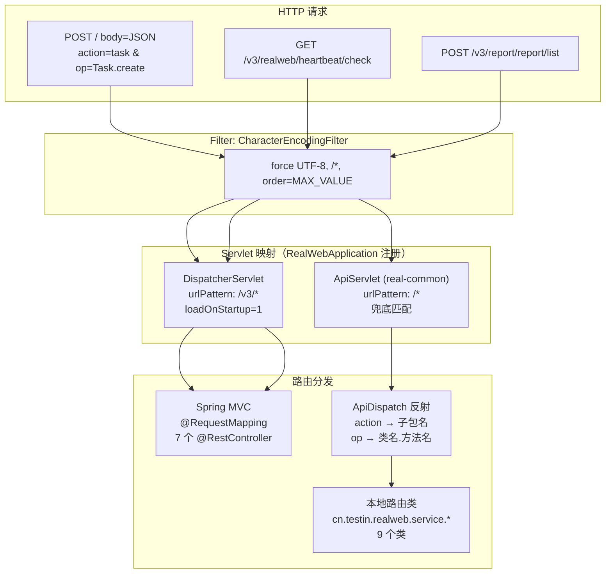
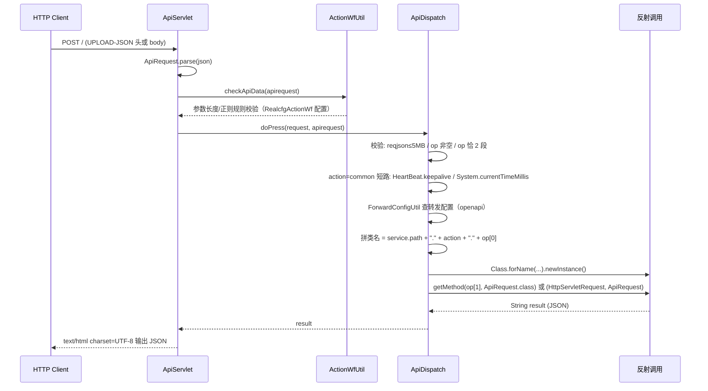

# 横切-双入口路由机制

> web/pc处理服务 与 平台基础功能服务 一样同时暴露两套 HTTP 入口：传统 `ApiServlet` action/op 反射路由（`/*`，V1 协议）与标准 Spring MVC `DispatcherServlet`（`/v3/*`）。
>
> **关键类**：`cn.testin.realweb.RealWebApplication`（双 Servlet 注册）、`cn.testin.common.service.ApiServlet`（real-common 公共包）、`cn.testin.common.service.ApiDispatch`（反射分发）、`cn.testin.common.pojo.api.ApiRequest`（V1 协议报文）
>
> **涉及配置**：`src/main/resources/real.common.properties` → `service.path=cn.testin.realweb.service`（反射路由根包）

## 总览



## 入口注册（RealWebApplication）

**文件**：`src/main/java/cn/testin/realweb/RealWebApplication.java`

```java
@Bean
public ServletRegistrationBean<DispatcherServlet> dispatcherMvcServlet(DispatcherServlet dispatcherServlet) {
    ServletRegistrationBean<DispatcherServlet> servletRegistrationBean =
        new ServletRegistrationBean<>(dispatcherServlet, "/v3/*");
    servletRegistrationBean.setLoadOnStartup(1);
    return servletRegistrationBean;
}

@Bean
public ServletRegistrationBean servletRegistrationBean() {
    return new ServletRegistrationBean(new ApiServlet(), "/*");
}
```

启动类注解：`@SpringBootApplication` + `@ComponentScan("cn.testin")` + `@EnableAspectJAutoProxy` + `@EnableWebMvc` + `@ServletComponentScan` + `@MapperScan({"cn.testin.realweb.dao.mapper", "cn.testin.realweb.business"})`。`main()` 中先执行 `DbConfigUtil.loadConfig()` 加载 DB 配置，失败则直接退出不启动。

Servlet 容器按**路径最精确匹配优先**：`/v3/*` 命中 DispatcherServlet，其余全部落入 `/*` 的 ApiServlet。

## 入口一：ApiServlet（/* V1 反射路由）

### 请求协议（ApiRequest）

`ApiServlet` 只接受 POST（GET 直接返回 `httpMethodNotSupport`）。报文来源两处：优先取请求头 `UPLOAD-JSON`（URLDecode 后），否则读 body 流。JSON 结构：

| 字段 | 含义 | 示例 |
|------|------|------|
| `action` | 业务子包名（映射到 `service.path` 下的包） | `task`、`quartz`、`report`、`dataSource` |
| `op` | `类名.方法名`（按 `[.,]` 切分，必须恰好 2 段） | `Task.create`、`TestResult.list` |
| `data` | 业务参数 JSON（解析为 `reqjson`） | `{"eid","projectid",...}` |
| `apikey` / `mkey` / `sig` / `timestamp` | openapi 调用方标识与签名 | openapi 场景使用 |
| `sid` | 会话 token | 透传 |
| `data.onlineUserInfo` | 在线用户信息（userid/userName/eid/projectid 等） | 由上游注入 |

### 分发流程（ApiServlet → ApiDispatch）



**反射类路径规则**（`ApiDispatch.java`）：

```
SERVICE_PATH(默认 cn.testin.service，被 real.common.properties 的
service.path=cn.testin.realweb.service 覆盖)
  + "." + action + "." + op首段(类名)
例：action=task & op=Task.create
  → cn.testin.realweb.service.task.Task#create(ApiRequest)
```

目标方法签名只支持两种：`(ApiRequest)` 或 `(HttpServletRequest, ApiRequest)`（后者用于文件上传等需要原始 request 的场景，由 `service.has.origin.request` 配置或 UPLOAD-JSON 头触发）。每次请求 `newInstance()` 新建路由类实例，路由类本身不是 Spring Bean，内部通过 `GenericBaseService` / `SpringUtil` 获取业务 Bean。

### 拦截与鉴权机制（V1 入口）

1. **协议级校验**：报文 >5MB → `protocolSizeInvalid`；`op` 缺失或格式错误 → `paraOpInvalid`；`data` 缺失 → `paraDataInvalid`
2. **ActionWfUtil.checkApiData**：按 action/op 从 RealCfg 拉取 `RealcfgActionWf` 规则，对 reqjson 指定 key 做最小/最大长度、正/反向正则校验（类 WAF 参数检测），不通过抛 `paraInvalid`
3. **openapi 转发**：`ForwardConfigUtil.getForwardApi(action, op)` 命中时，重签 sig 后 HTTP 转发到外部 openapi，或改写 action/op 转内部其他路由
4. **@ServiceInterceptor**：路由方法可标注该注解指定 `ApiInterceptor` 前置/后置处理（web/pc处理服务 未使用，`real.common.properties` 未配置 `service.interceptor.*`）
5. **审计**：环境变量 `TESTINPRO_AUDIT_USEABLE=true` 时，向审计服务上报请求/响应/耗时

### 本地路由类清单（9 个，cn.testin.realweb.service.\*）

| 类 | action | 承担业务 |
|----|--------|---------|
| `task.Task` | `task` | Web/PC 任务创建、取消、暂停/恢复、执行、重测、运行信息、报告邮件发送等（18+ 方法，如 `Task.create/cancel/execute/pause/resume/repeatTest`） |
| `task.TestProcess` | `task` | 任务执行过程数据（`TestProcess.*`） |
| `task.TestResult` | `task` | 任务结果数据（`TestResult.*`） |
| `quartz.Quartz` | `quartz` | 定时任务/任务模板 CRUD（`Quartz.add/update/delete/list` 等，分派 WebQuartz/McPcQuartz/AppQuartz） |
| `quartz.Report` | `quartz` | 定时报告（`Report.url` 等） |
| `report.Report` | `report` | 报告汇总/详情数据 |
| `report.Excel` | `report` | Excel 报告导出 |
| `report.Pdf` | `report` | PDF 报告生成（异步 PDFThread） |
| `dataSource.ParamDataSource` | `dataSource` | 参数化数据源分发 |

> 各路由类的逐方法说明见 [本地ApiServlet-索引](工程模块清单/web-pc处理服务/07-开放接口文档/本地ApiServlet/本地ApiServlet-索引.md)。

### 代理类（cn.testin.realweb.api.\*，40+ 个）

与路由类同进程但方向相反：`*Api` 是 web/pc处理服务 **出站**调用其他微服务的代理封装，约 40 个 `*Api.java`（含 `AbstractApi` 基类与 `ServiceRemoteV1Api`/`ServiceRemoteV3Api` 两个统一封装），按目标服务分包：`user/`、`notice/`、`file/script/`、`realcfg/`、`plan/`、`portal/`、`scheduling/`、`controlcenter/`、`cross/`、`cicc/` 等。详见 [横切-模块间通信](横切-模块间通信.md)。

## 入口二：DispatcherServlet（/v3/* Spring MVC）

标准 Spring MVC 路由，`@RestController` 全部位于 `cn.testin.realweb.mvc.controller`，共 7 个。实际访问路径 = `/v3` + 类上 `@RequestMapping` + 方法映射（DispatcherServlet 剥离 `/v3` 前缀）。

| Controller | 路径前缀 | 主要端点 | 承担业务 |
|-----------|---------|---------|---------|
| `HeartBeatController` | `/realweb` | `GET /heartbeat/check` | 健康检查 |
| `TestPlanController` | `/realweb` | `GET /plan/excel`、`POST /tasks/script_reset`、`POST /tasks/sub_sub_task_info` | 计划 Excel 导出、脚本重置、子子任务信息 |
| `TestTemplateController` | `/realweb/template` | `POST templates`、`DELETE batch_delete`、`POST save_json`、`GET /copy`、`POST /update_template_content`、`GET /list_template_id` | 测试模板 CRUD |
| `ProblemAnalysisReportController` | `/realweb` | `POST /report/script_list`、`GET /report/error_step_report_detail_list`、`GET /report/device_list/{task_id}`、`POST report/refresh_report_input_param` | 问题分析报告 |
| `TaskController` | `/task` | `GET /task_detail/{task_id}`、`GET /tasks/send_plan/{task_id}` | 任务详情、发送计划 |
| `ReportController` | `report` | `GET report/{task_id}`、`POST report/list`、`POST report/summary`、`POST report/modify_error_cause_type` | 报告查询/汇总/错误原因维护 |
| `QuartzLogController` | `schedule_log` | `DELETE /schedule_log/remove_by_task_id` | 调度日志清理 |

**特征**：
- 参数绑定用 DTO + `@RequestBody`/`@PathVariable`（见 `cn.testin.realweb.mvc.dto.*`），返回统一 `BaseResponseDTO`/`BaseResultStrResponseDTO`
- web/pc处理服务 **没有**注册 `@ControllerAdvice` 全局异常处理器，也**没有**自定义 `HandlerInterceptor`，异常直接由 Spring 默认机制处理
- 新业务接口优先走该入口（模板管理、问题分析报告等均为 V3）

## 两套入口对比

| 维度 | ApiServlet (/*) | DispatcherServlet (/v3/*) |
|------|----------------|--------------------------|
| **技术栈** | 原始 Servlet + 反射（real-common） | Spring MVC |
| **路由方式** | 报文 `action`+`op` → 包.类.方法 | `@RequestMapping` 注解 |
| **报文格式** | V1 协议 JSON（apikey/action/op/data/sig） | REST + DTO |
| **HTTP 方法** | 仅 POST（GET 拒绝） | GET/POST/DELETE 等 |
| **参数校验** | ActionWfUtil 规则（长度/正则） | 代码内手动校验 |
| **拦截机制** | @ServiceInterceptor（web/pc处理服务 未用）、openapi 转发 | 无自定义拦截器 |
| **目标类** | 9 个本地路由类（非 Spring Bean，每次 newInstance） | 7 个 @RestController（Spring 托管） |
| **典型场景** | 任务/报告/定时任务等老接口、服务间 V1 调用 | 模板管理、问题分析等新接口 |

## Filter 层

两个入口共享同一个 `CharacterEncodingFilter`（`RealWebApplication.java`）：强制 UTF-8、`/*`、`order=Integer.MAX_VALUE`。除 AOP 的 `OperateLogAspect` 外，web/pc处理服务 无其他 Filter/Interceptor。

## 相关文件索引

| 文件 | 说明 |
|------|------|
| `src/main/java/cn/testin/realweb/RealWebApplication.java` | 双 Servlet + Filter 注册入口 |
| `src/main/resources/real.common.properties` | `service.path=cn.testin.realweb.service` |
| `real-common: cn/testin/common/service/ApiServlet.java` | V1 入口 Servlet（报文读取/审计/响应） |
| `real-common: cn/testin/common/service/ApiDispatch.java` | 反射分发核心 |
| `real-common: cn/testin/common/pojo/api/ApiRequest.java` | V1 协议报文定义 |
| `src/main/java/cn/testin/realweb/service/task/Task.java` | 本地路由类示例（18+ 方法） |
| `src/main/java/cn/testin/realweb/mvc/controller/` | 7 个 V3 Controller |

## 相关文档

- [专题索引](专题-索引.md)
- [横切-模块间通信](横切-模块间通信.md) — 出站 *Api 代理类与外部服务清单
- [横切-AOP与横切关注点](横切-AOP与横切关注点.md) — @OperateLog 切面（作用于 Quartz 路由链路）
