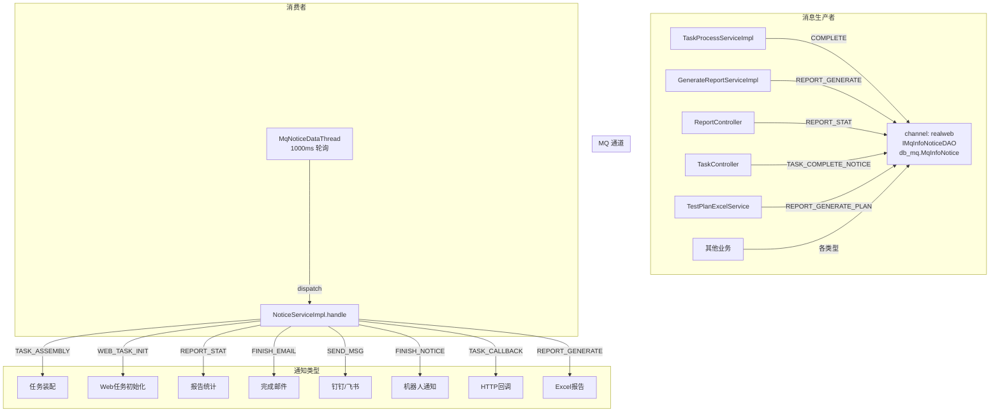

# 横切-通知系统

## 概述

web/pc处理服务 的通知系统基于 MQ 消息队列 + `NoticeServiceImpl` 实现，由 `MqNoticeDataThread`（每 1000ms `scheduleAtFixedRate`，见 `StartRunner.run`）驱动消费。

通知的落库与分发分两层：`StartRunner.run` 先启动 `NoticeDispatchThread`（`new Thread`，batch=100、pool=10、interval=100ms，从 channel `realweb` 的阻塞队列消费），再用 `ScheduledExecutorService` 以 1000ms 周期调度 `MqNoticeDataThread`，后者按 `StartRunner` 里硬编码的 **19 种** `InfoNoticeType` 类型轮询 `mq_info_notice` 并交给 `NoticeServiceImpl.handle` 分发。

## 架构

## 通知类型清单（19 种）

分发入口是 `NoticeServiceImpl.handle(MqInfoNotice)` 里的一段 if-else 链（`NoticeServiceImpl.java`），`StartRunner.run` 中 `testnoticetypes` 数组注册的正是下面 19 种。枚举值见 `NoticeConfig.InfoNoticeType`。

| 类型 | 常量（value） | Handler | 说明 |
|------|------|---------|------|
| 任务装配 | `TASK_ASSEMBLY`(1) | `handleTaskAssembly` | 脚本汇总树展开 + 数据源分配 + 发 `WEB_TASK_INIT` |
| Web任务初始化 | `WEB_TASK_INIT`(2) | `handleWebtaskInit` | 组装下发报文，调 `TaskApi.init` 下发任务调度服务 |
| 推送门户 | `PUSH_PORTAL`(3) | `handlePushPortal` | 门户进度更新（taskCreate 标记） |
| 脚本统计 | `SCRIPT_STAT`(10) | `handleScriptStat` | 脚本汇总树逐条统计 |
| 报告统计 | `REPORT_STAT`(11) | `handleReportStat` | 汇总脚本/浏览器/PC分类统计 → `TaskSummaryServiceImpl.reportStat` |
| 完成邮件 | `FINISH_EMAIL`(4) | `handleFinishEmail` | sendEmail → EmailTask.add（NoticeManager） |
| 批量补测 | `WEB_REPEAT_TEST`(12) | `handleRepeatTest` | 补测复用原任务，重封后重新下发 |
| 发送消息 | `SEND_MSG`(97) | `handleSendMsg` | 短信/钉钉/飞书消息 |
| 跨端取消 | `CROSS_CANCEL`(77) | `handleCrossCancel` | 跨端未初始化的取消 |
| 完成通知 | `FINISH_NOTICE`(94) | `sendFinishNewNotice` | 机器人通知 |
| 任务回调 | `TASK_CALLBACK`(110) | `handleCallback` | 用户 HTTP 回调（延迟 2 分钟） |
| 报告生成 | `REPORT_GENERATE`(15) | `handleGenerateReport` | Excel 报告生成 |
| 脚本失败通知（全部） | `SCRIPT_FAIL_SEND_ALL_NOTICE`(113) | `handleScriptFailNotice` | 脚本失败即通知（只要失败就发） |
| 脚本结果通知 | `SCRIPT_RESULT_NOTICE`(114) | `handleScriptResultNotice` | 单脚本完成通知测试计划 |
| 任务初始化通知 | `TASK_INIT_NOTICE`(115) | `handleTaskInitNotice` | 调度生成子任务完成通知测试计划 |
| 任务完成通知 | `TASK_COMPLETE_NOTICE`(116) | `handleTaskCompleteNotice` | 任务完成通知测试计划回收 |
| 任务匹配/恢复通知 | `TASK_MATCH_OR_RECOVER_NOTICE`(117) | `handleTaskMatchOrRecoverNotice` | 子任务下发/回收设备匹配状态通知测试计划 |
| 计划报告生成 | `REPORT_GENERATE_PLAN`(25) | `handleGeneratePlanReport` | Plan Excel 异步生成 |
| 脚本失败通知（单条） | `SCRIPT_FAIL_SEND_ONE_NOTICE`(118) | `handleScriptFailSendNotice` | 失败达预设次数仅通知一次 |

## 失败重试

`NoticeServiceImpl.handle` 结尾统一更新通知状态（`NoticeServiceImpl.java`）：

- 处理失败（`RESULT_FAILURE`）：`execNum+1`，并把 `publishtime` 推迟 10 秒。注意代码中 `if (mqInfoNotice.getExecNum() >= 3) ;` 末尾多写了一个分号，导致 10 秒延迟**对每次失败都无条件生效**（并非注释所写的「超过 3 次后才推迟」）。
- 置非法：`execNum > 10` 且创建时间超过 1 小时（`createtime < now - 1000*60*60`）时把通知置为 `STATUS_INVALID`，不再重试。
- 处理成功置 `STATUS_FINISH`；置非法返回 `RESULT_INVALID`。

## 通知防重

关键通知使用 Redis setNX 做速率限制：
- `{taskid}_handleNewNotice` — 任务完成邮件，60s 内不重复发送
- `{taskid}_handleScriptFailSendNotice_web` — 脚本失败通知，60s 内不重复发送

## 通知渠道配置

来自 `NoticeApi.channelList` → NoticeManager，支持：
- DingTalk（type=2）
- Feishu（type=3）
- Email（type=0-1）
- SMS
- HTTP Callback

## 相关代码

| 类 | 说明 |
|-----|------|
| `NoticeServiceImpl.handle` | 通知分发核心（if-else 链 + 失败重试/置非法） |
| `StartRunner.run` | 启动 `NoticeDispatchThread`/`MqNoticeDataThread`/`PDFThread`/`QuartzListenerThread`，注册 19 种通知类型 |
| `NoticeDispatchThread`（real-common） | MQ 分发线程（batch 100、pool 10、interval 100ms） |
| `MqNoticeDataThread`（real-common） | 1000ms 定时消费 |
| `AbstractNoticeServiceImpl`（real-common） | 公共通知基类 |

## 相关文档

- [专题索引](专题-索引.md)
- [横切-模块间通信](横切-模块间通信.md)
