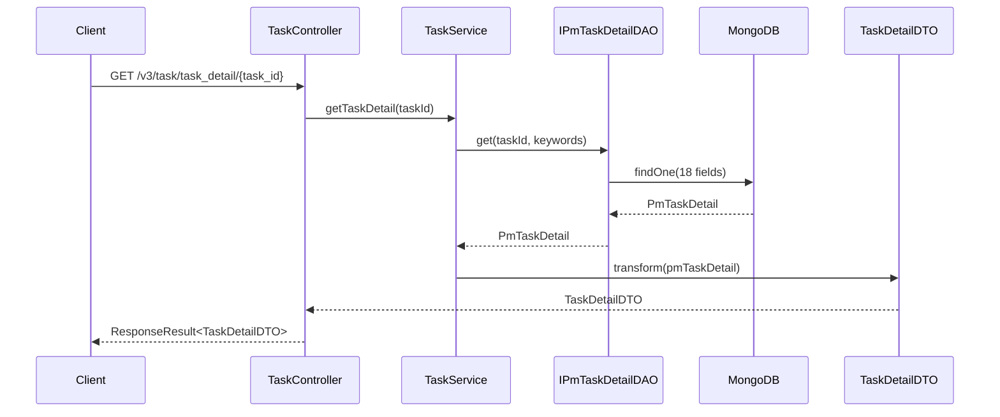
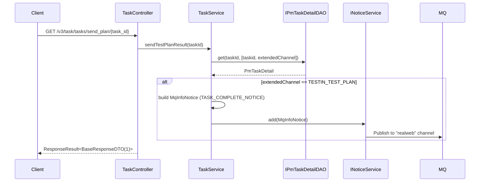

# TaskController — 任务详情与计划报告发送

> 分支：syy.release.z7.8.1.0
> 源文件：`src/main/java/cn/testin/realweb/mvc/controller/TaskController.java`
> 类级路由：`/task`
> Service 实现：`mvc/service/TaskService`（继承 `AbstractMongoDaoImpl`）

## 接口列表

| # | 方法 | 路径 | 方法名 | 说明 |
|---|---|---|---|---|
| 1 | GET | `/v3/task/task_detail/{task_id}` | getTaskDetail | 获取任务详情 |
| 2 | GET | `/v3/task/tasks/send_plan/{task_id}` | sendTestPlanResult | 发送测试计划结果通知 |

统一响应包装：`ResponseResult<T> { int code; String msg; T data }`（code=0 为成功，"成功"）。

---

## 1. GET /v3/task/task_detail/{task_id} — 获取任务详情

### 入口

`TaskController.getTaskDetail(@PathVariable("task_id") String taskId)`

### 请求参数

| 字段 | 类型 | 必填 | 说明 |
|------|------|------|------|
| task_id | String | 是 | 任务ID（路径变量） |

### 响应结构

`ResponseResult<TaskDetailDTO>`（`{ code, msg, data }`，code=0 成功）。返回参数：

| 字段 | 类型 | 说明 |
|------|------|------|
| code | Integer | 状态码，0 成功 |
| msg | String | 提示信息（成功为「成功」） |
| data | JSONObject | 任务详情（TaskDetailDTO） |
| data.projectId | Integer | 项目ID |
| data.taskId | String | 任务ID |
| data.userid | Integer | 创建者用户ID |
| data.userName | String | 用户名 |
| data.userEmail | String | 用户邮箱 |
| data.bizCode | Integer | 业务编码 |
| data.testType | Integer | 测试类型 |
| data.execStatus | Integer | 执行状态 |
| data.startExecTime | Long | 执行开始时间 |
| data.finishTime | Long | 执行结束时间 |
| data.testResult | Integer | 测试结果 |
| data.execStandard | String | 执行标准 |
| data.browsers | JSONArray | 浏览器列表（Web端） |
| data.pcs | JSONArray | PC客户端列表（PC端） |
| data.retryNum | Integer | 重试次数 |
| data.level | Integer | 优先级 |
| data.networks | String | 网络信息 |
| data.extendedChannel | String | 扩展渠道 |
| data.updateTime | Long | 更新时间 |

### 实现意图

从 MongoDB `PmTaskDetail` 读取任务详情（18 个字段），通过 `TaskDetailDTO.transform` 转换为 DTO。若任务不存在返回 null data。

### 调用链

```
TaskController.getTaskDetail
└─ TaskService.getTaskDetail(taskId) → IPmTaskDetailDAO.get(taskId, keywords)
   └─ MongoDB: pmwebTaskDetail_XX 或 PmpcTaskDetail_XX
```

### Flowchart



---

## 2. GET /v3/task/tasks/send_plan/{task_id} — 发送测试计划结果通知

### 入口

`TaskController.sendTestPlanResult(@PathVariable("task_id") String taskId)`

### 请求参数

| 字段 | 类型 | 必填 | 说明 |
|------|------|------|------|
| task_id | String | 是 | 任务ID（路径变量） |

### 响应结构

`ResponseResult<BaseResponseDTO>`，`data.result = 1`。返回参数：

| 字段 | 类型 | 说明 |
|------|------|------|
| code | Integer | 状态码，0 成功 |
| msg | String | 提示信息（成功为「成功」） |
| data | JSONObject | 业务数据 |
| data.result | Integer | 固定返回 1 |

### 实现意图

读取任务详情，若 `extendedChannel == "TESTIN_TEST_PLAN"`（任务关联测试计划），则构建 `MqInfoNotice`（type=`TASK_COMPLETE_NOTICE`，noticemark=taskId）发送 MQ，供测试计划服务消费回收任务完成状态。

### 调用链

```
TaskController.sendTestPlanResult
└─ TaskService.sendTestPlanResult(taskId)
   ├─ IPmTaskDetailDAO: 读取 taskid, extendedChannel
   └─ INoticeService.add(MqInfoNotice)  → MQ "realweb" channel
```

### Flowchart



### 涉及表

| 存储 | 集合/表 | 操作 |
|------|---------|------|
| MongoDB | PmTaskDetail (pmwebTaskDetail_XX / PmpcTaskDetail_XX) | 读 |
| MQ | MqInfoNotice (db_mq) | 写 |

---

## 备注

- 本 Controller 为轻量转发层，业务逻辑在 `TaskService`。
- `sendTestPlanResult` 仅在 `extendedChannel == "TESTIN_TEST_PLAN"` 时发送 MQ，其他情况直接返回。
- 不涉及 `@Valid`、`@OperateLog`、`@Transactional`。

相关文档：[00-分支索引](00-分支索引.md) · [TestPlanController](TestPlanController.md)
