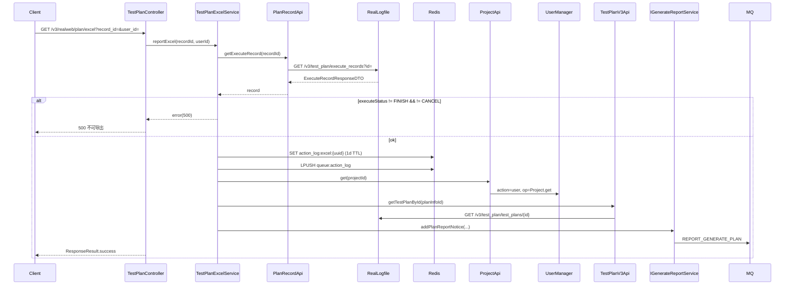
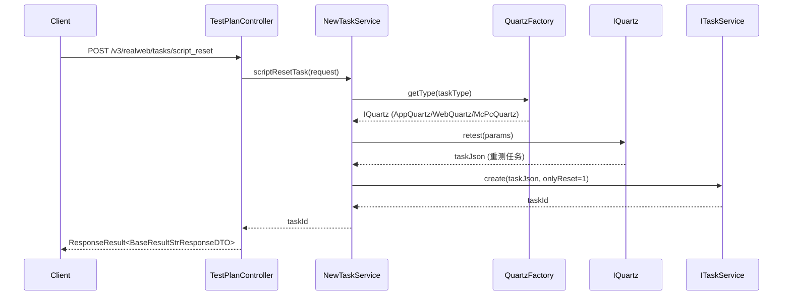

# TestPlanController — 测试计划报告导出与脚本重置

> 分支：syy.release.z7.8.1.0
> 源文件：`src/main/java/cn/testin/realweb/mvc/controller/TestPlanController.java`
> 类级路由：`/realweb`
> Service 实现：`TestPlanExcelService`、`NewTaskService`

## 接口列表

| # | 方法 | 路径 | 方法名 | 说明 |
|---|---|---|---|---|
| 1 | GET | `/v3/realweb/plan/excel` | excel | 测试计划报告 Excel 导出 |
| 2 | POST | `/v3/realweb/tasks/script_reset` | scriptResetTask | 脚本任务重置 |
| 3 | POST | `/v3/realweb/tasks/sub_sub_task_info` | getSubSubTaskInfoByCondition | 按条件查询子子任务信息 |

统一响应包装：`ResponseResult<T> { int code; String msg; T data }`。

---

## 1. GET /v3/realweb/plan/excel — 测试计划报告 Excel 导出

### 入口

`TestPlanController.excel(@RequestParam("record_id") Long recordId, @RequestParam("user_id") Integer userId)`

### 请求参数

| 字段 | 类型 | 必填 | 说明 |
|------|------|------|------|
| record_id | Long | 否 | 执行记录ID |
| user_id | Integer | 否 | 操作用户ID |

### 响应结构

`ResponseResult`（成功时 data=空字符串，不可导出时返回 error code=500）。返回参数：

| 字段 | 类型 | 说明 |
|------|------|------|
| code | Integer | 状态码，0 成功 / 500 不可导出 |
| msg | String | 提示信息 |
| data | String | 成功时为「」，不可导出时为 null |

### 实现意图

触发测试计划报告 Excel 的异步生成。流程：
1. 调用 [PlanRecordApi](../其他ApiServlet/service-PlanRecordApi.md) 获取执行记录（→RealLogfile）
2. 仅当 executeStatus 为 FINISH 或 CANCEL 时才允许导出，否则返回 500
3. 生成 UUID 作为 requestId，写入 Redis key `action_log:excel:{requestId}`（TTL 1天）
4. 推送 ActionLogDTO 到 Redis 队列 `queue:action_log`
5. 发送 MQ 通知 `REPORT_GENERATE_PLAN` 触发异步生成

### 调用链

```
TestPlanController.excel
└─ TestPlanExcelService.reportExcel(recordId, userId)
   ├─ PlanRecordApi.getExecuteRecord(recordId) → RealLogfile GET /v3/test_plan/execute_records
   ├─ Redis: set action_log:excel:{uuid} (TTL 1天)
   ├─ Redis: lPush queue:action_log → ActionLogDTO
   ├─ ProjectApi.get(projectId) → UserManager
   ├─ TestPlanV3Api.getTestPlanById(planInfoId) → RealLogfile GET /v3/test_plan/test_plans/{id}
   └─ IGenerateReportService.addPlanReportNotice(...) → MQ REPORT_GENERATE_PLAN
```

### Flowchart



### 涉及表

| 存储 | 表/集合 | 操作 |
|------|---------|------|
| Redis | action_log:excel:{uuid} | 写 |
| Redis | queue:action_log | 写 |
| Remote RealLogfile | execute_record | 读 |
| Remote RealLogfile | plan_info | 读 |
| Remote UserManager | project_info | 读 |
| MQ | MqInfoNotice (db_mq) | 写 |

---

## 2. POST /v3/realweb/tasks/script_reset — 脚本任务重置

### 入口

`TestPlanController.scriptResetTask(@RequestBody ScriptTaskResetRequestDTO request)`

### 请求参数（ScriptTaskResetRequestDTO，JSON Body）

| 字段 | 类型 | 必填 | 说明 |
|------|------|------|------|
| projectId | Integer | 否 | 项目ID |
| userId | Integer | 否 | 用户ID |
| userName | String | 否 | 用户名（代码未使用） |
| taskId | String | 否 | 任务ID（源任务，作为 oldTaskId） |
| taskType | Integer | 是 | 任务类型（1=App, 3=Web, 5=PC；null 抛 GeneralException） |
| executeRecordTaskId | Long | 否 | 执行记录任务ID |
| subSubTaskId | List&lt;String&gt; | 否 | 子子任务ID列表 |

### 响应结构

`ResponseResult<BaseResultStrResponseDTO>`，data.result = 新任务ID（字符串）。返回参数：

| 字段 | 类型 | 说明 |
|------|------|------|
| code | Integer | 状态码，0 成功 |
| msg | String | 提示信息（成功为「成功」） |
| data | JSONObject | 业务数据 |
| data.result | String | 新任务ID（taskId） |

### 实现意图

根据 taskType 选不同的 `IQuartz` 实现（`AppQuartz`/`WebQuartz`/`McPcQuartz`），通过 `QuartzFactory.getType(taskType)` 获取注册的 Quartz 实现，调用 `quartz.retest(...)` 构建重测请求，再调用 `ITaskService.create(taskJson)` 创建新任务（`onlyReset=1`）。

### 调用链

```
TestPlanController.scriptResetTask
└─ NewTaskService.scriptResetTask(request)
   ├─ QuartzFactory.getType(taskType) → IQuartz (AppQuartz/WebQuartz/McPcQuartz)
   ├─ IQuartz.retest(params) → 构建重测任务JSON
   └─ ITaskService.create(taskJson) → 创建新任务
```

### Flowchart



---

## 3. POST /v3/realweb/tasks/sub_sub_task_info — 按条件查询子子任务

### 入口

`TestPlanController.getSubSubTaskInfoByCondition(@RequestBody TaskInfoConditionDTO request)`

### 请求参数（TaskInfoConditionDTO，JSON Body）

| 字段 | 类型 | 必填 | 说明 |
|------|------|------|------|
| errorCauseMessage | String | 否 | 错误原因消息模糊匹配 |
| taskIds | List&lt;String&gt; | 否 | 任务ID列表（未显式校验，为空将抛 NPE） |
| deviceIp | String | 否 | 设备IP过滤 |

### 响应结构

`ResponseResult<ResultListResponseDTO<SubSubTaskInfoResponseDTO>>`。返回参数：

| 字段 | 类型 | 说明 |
|------|------|------|
| code | Integer | 状态码，0 成功 |
| msg | String | 提示信息（成功为「成功」） |
| data | JSONObject | 业务数据 |
| data.list | JSONArray | 子子任务信息列表 |
| data.list.taskId | String | 任务ID |
| data.list.subTaskId | String | 子任务ID |
| data.list.subSubTaskId | String | 子子任务ID |

### 实现意图

遍历 taskIds，对每个 taskId 查询 `PmScriptRunInfo`（MongoDB），按 errorMsg/deviceIp 条件过滤，返回子子任务ID列表。

### 调用链

```
TestPlanController.getSubSubTaskInfoByCondition
└─ NewTaskService.getSubSubTaskInfoByCondition(request)
   └─ IPmScriptRunInfoDAO.baseList(taskId, {errorMsg, deviceIp}, keywords=[taskid,subtaskid,subsubtaskid])
      └─ MongoDB: pmwebScriptRunInfo_XX / PmpcScriptRunInfo_XX
```

---

## 备注

- `TestPlanExcelService.reportExcel` 需要等待执行记录状态为 FINISH 或 CANCEL 才能导出。
- `scriptResetTask` 配合计划重测功能使用，允许仅重置指定子子任务。
- `getSubSubTaskInfoByCondition` 主要用于按错误原因匹配查找问题脚本。

相关文档：[00-分支索引](00-分支索引.md) · [TaskController](TaskController.md)
