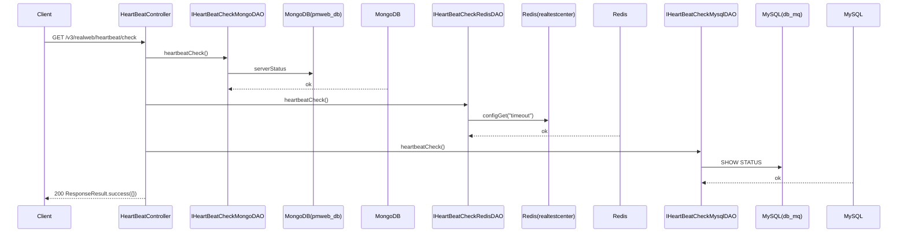

# HeartBeatController — 心跳检测

> 分支：syy.release.z7.8.1.0
> 源文件：`src/main/java/cn/testin/realweb/mvc/controller/HeartBeatController.java`
> 类级路由：`/realweb`

## 接口列表

| # | 方法 | 路径 | 方法名 | 说明 |
|---|---|---|---|---|
| 1 | GET | `/v3/realweb/heartbeat/check` | check | 三方存储心跳检测 |

统一响应包装：`ResponseResult { int code; String msg; T data }`。
异常处理：`@ExceptionHandler(HealthyCheckGenericException.class)` → `ResponseEntity(ResponseResult.error(errCode, errMsg), 500)`。

---

## 1. GET /v3/realweb/heartbeat/check — 三方存储心跳检测

### 入口

`HeartBeatController.check()`（无参数）

### 响应结构

成功：`ResponseResult.success(new HashMap<>())`（data=空 Map, code=0）。

失败：`HealthyCheckGenericException` → HTTP 500 + `ResponseResult.error(errCode, errMsg)`。

### 实现意图

依次检测每层存储是否可用：

| 检测项 | DAO （SpringHelper获取） | 操作 |
|--------|-------------------------|------|
| MongoDB | `IHeartBeatCheckMongoDAO` → `HeartBeatCheckMongoDAOImpl` | `getMongoTemplate("wt").executeCommand({serverStatus:1})` |
| Redis | `IHeartBeatCheckRedisDAO` → `HeartBeatCheckRedisDAOImpl` | `jedis.configGet("timeout")`（realtestcenter DB） |
| MySQL | `IHeartBeatCheckMysqlDAO` → `HeartBeatCheckMysqlDAOImpl` | `getMqdao().query("SHOW STATUS", null)`（db_mq 连接） |

任一检测失败抛 `HealthyCheckGenericException`，导致 HTTP 500 响应。

### 调用链

```
HeartBeatController.check
├─ SpringHelper.getBean("IHeartBeatCheckMongoDAO").heartbeatCheck()
│  └─ MongoTemplate.executeCommand({serverStatus: 1}) → pmweb_db
├─ SpringHelper.getBean("IHeartBeatCheckRedisDAO").heartbeatCheck()
│  └─ Jedis.configGet("timeout") → realtestcenter DB
└─ SpringHelper.getBean("IHeartBeatCheckMysqlDAO").heartbeatCheck()
   └─ GenericJdbcDAO.query("SHOW STATUS") → db_mq
```

### Flowchart



### 涉及表

| 存储 | 操作 |
|------|------|
| MongoDB | `serverStatus` 命令 |
| Redis | `CONFIG GET timeout` |
| MySQL | `SHOW STATUS` |

---

## 备注

- 唯一的 `@ExceptionHandler` 定义在此 Controller 中。
- 心跳检测不计入业务接口统计。
- 注意：MySQL 心跳检测用的是 `db_mq` 连接（legacy `mqdao`），而非 `db_common` 连接。

相关文档：[00-分支索引](00-分支索引.md) · [QuartzLogController](QuartzLogController.md)
