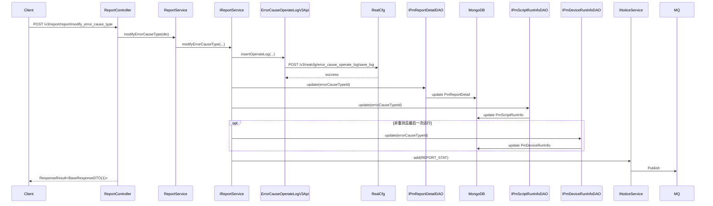

# ReportController — 报告查询与错误原因修改

> 分支：syy.release.z7.8.1.0
> 源文件：`src/main/java/cn/testin/realweb/mvc/controller/ReportController.java`
> 类级路由：`/report`
> Service 实现：`mvc/service/ReportService`（继承 `AbstractMongoDaoImpl`；委托 `IReportService` = `ReportServiceImpl`）

## 接口列表

| # | 方法 | 路径 | 方法名 | 说明 |
|---|---|---|---|---|
| 1 | GET | `/v3/report/report/{task_id}` | reTestInfo | 重测信息查询 |
| 2 | POST | `/v3/report/report/list` | list | 报告列表查询 |
| 3 | POST | `/v3/report/report/summary` | reportSummary | 报告汇总查询 |
| 4 | POST | `/v3/report/report/modify_error_cause_type` | modifyErrorCauseType | 修改错误原因类型 |

统一响应包装：`ResponseResult<T> { int code; String msg; T data }`。

---

## 1. GET /v3/report/report/{task_id} — 重测信息查询

### 入口

`ReportController.reTestInfo(@PathVariable("task_id") String taskId, @RequestParam(value="sub_sub_task_id", required=false) String subSubTaskId, @RequestParam(value="start_time", required=false) Long startTime, @RequestParam(value="end_time", required=false) Long endTime, @RequestParam(value="page", defaultValue="1") Integer page, @RequestParam(value="page_size", defaultValue="20") Integer pageSize)`

### 请求参数

| 字段 | 类型 | 必填 | 说明 |
|------|------|------|------|
| task_id | String | 是 | 任务ID（路径变量） |
| sub_sub_task_id | String | 否 | 子子任务ID |
| start_time | Long | 否 | 开始时间（时间戳） |
| end_time | Long | 否 | 结束时间（时间戳） |
| page | Integer | 否 | 页码（默认 1） |
| page_size | Integer | 否 | 每页大小（默认 20） |

### 响应结构

`ResponseResult<PageResponseDTO<ReTestInfoDTO>>`。返回参数：

| 字段 | 类型 | 说明 |
|------|------|------|
| code | Integer | 状态码，0 成功 |
| msg | String | 提示信息（成功为「成功」） |
| data | JSONObject | 业务数据 |
| data.page | Integer | 当前页 |
| data.pageSize | Integer | 每页大小 |
| data.totalPage | Integer | 总页数 |
| data.totalRow | Long | 总行数 |
| data.list | JSONArray | 补测记录列表 |
| data.list.scriptNo | Integer | 脚本编号 |
| data.list.scriptName | String | 脚本名称 |
| data.list.scriptTags | JSONArray | 脚本标签 |
| data.list.webReportDevice | JSONObject | 设备信息 |
| data.list.execStatus | Integer | 执行状态 |
| data.list.timeConsuming | Long | 耗时 |
| data.list.status | Integer | 状态 |
| data.list.errorMsg | String | 错误定位 |
| data.list.errorCode | Integer | 错误代码 |
| data.list.taskId | String | 任务ID |
| data.list.subTaskId | String | 子任务ID |
| data.list.subSubTaskId | String | 子子任务ID |
| data.list.resultCategory | Integer | 结果分类 |

### 实现意图

查询重测相关的报告详情：从 `PmReportDetail` 中筛选 `onlyReTest=1` 的记录，关联 `PmScriptRunInfo` 获取脚本运行信息，组装 `ReTestInfoDTO`。

### 调用链

```
ReportController.reTestInfo
└─ ReportService.reTestInfo(taskId, subSubTaskId, startTime, endTime, page, pageSize)
   ├─ IPmReportDetailDAO.get(taskId, subSubTaskId) → MongoDB PmReportDetail
   ├─ IPmReportDetailDAO.baseList(condition, page, pageSize) → MongoDB (onlyReTest=1)
   └─ IPmScriptRunInfoDAO.baseList(subSubTaskIds) → MongoDB PmScriptRunInfo
```

### 涉及表

| 存储 | 集合 | 操作 |
|------|------|------|
| MongoDB | PmReportDetail (pmwebReportDetail_XX / PmpcReportDetail_XX) | 读 |
| MongoDB | PmScriptRunInfo (pmwebScriptRunInfo_XX / PmpcScriptRunInfo_XX) | 读 |

---

## 2. POST /v3/report/report/list — 报告列表查询

### 入口

`ReportController.list(@RequestBody ReportListRequestDTO requestDTO)`

### 请求参数（ReportListRequestDTO，JSON Body）

| 字段 | 类型 | 必填 | 说明 |
|------|------|------|------|
| projectId | Integer | 否 | 项目ID |
| taskIds | List&lt;String&gt; | 是 | 任务ID列表（空抛 GeneralException） |
| subSubTaskIds | List&lt;String&gt; | 否 | 子子任务ID过滤 |

### 响应结构

`ResponseResult<ResultListResponseDTO<PmReportDetail>>`。返回参数：

| 字段 | 类型 | 说明 |
|------|------|------|
| code | Integer | 状态码，0 成功 |
| msg | String | 提示信息（成功为「成功」） |
| data | JSONObject | 业务数据 |
| data.list | JSONArray | PmReportDetail 列表 |

### 实现意图

按 taskIds 批量查询报告详情，每 taskId 最多返回 100 条（按 orderNum 排序，排除 testCases 字段以减小数据量）。

### 调用链

```
ReportController.list
└─ ReportService.reportList(requestDTO)
   └─ IReportService.baseList(condition, page=1, pageSize=100) → IPmReportDetailDAO.baseList
      └─ MongoDB: PmReportDetail
```

---

## 3. POST /v3/report/report/summary — 报告汇总查询

### 入口

与 `/report/list` 相同请求体 `ReportListRequestDTO`。

### 请求参数（ReportListRequestDTO，JSON Body）

| 字段 | 类型 | 必填 | 说明 |
|------|------|------|------|
| projectId | Integer | 否 | 项目ID |
| taskIds | List&lt;String&gt; | 是 | 任务ID列表（空抛 GeneralException） |
| subSubTaskIds | List&lt;String&gt; | 否 | 子子任务ID过滤 |

### 响应结构

`ResponseResult<ResultListResponseDTO<PmReportDetail>>`。返回参数：

| 字段 | 类型 | 说明 |
|------|------|------|
| code | Integer | 状态码，0 成功 |
| msg | String | 提示信息（成功为「成功」） |
| data | JSONObject | 业务数据 |
| data.list | JSONArray | PmReportDetail 列表 |

### 实现意图

与 list 逻辑类似，但通过 `baseNewList` 方法支持按 subSubTaskIds 子集精确筛选，排除 testCases 字段。

### 调用链

```
ReportController.reportSummary
└─ ReportService.reportSummary(requestDTO)
   └─ IReportService.baseNewList(condition, page=1, pageSize=100) → IPmReportDetailDAO.baseList
      └─ MongoDB: PmReportDetail
```

---

## 4. POST /v3/report/report/modify_error_cause_type — 修改错误原因类型

### 入口

`ReportController.modifyErrorCauseType(@RequestBody MaintainErrorCauseTypeDTO requestDTO)`

### 请求参数（MaintainErrorCauseTypeDTO，JSON Body）

| 字段 | 类型 | 必填 | 说明 |
|------|------|------|------|
| errorCauseTypeId | Integer | 是 | 错误原因类型ID（空返回 0） |
| taskId | String | 是 | 任务ID（空返回 0） |
| subTaskId | String | 是 | 子任务ID（空返回 0） |
| subSubTaskId | String | 是 | 子子任务ID（空返回 0） |
| userId | Integer | 否 | 操作用户ID |

### 响应结构

`ResponseResult<BaseResponseDTO>`，data.result = 1（成功）/ 0（参数无效）。返回参数：

| 字段 | 类型 | 说明 |
|------|------|------|
| code | Integer | 状态码，0 成功 |
| msg | String | 提示信息（成功为「成功」） |
| data | JSONObject | 业务数据 |
| data.result | Integer | 1 成功 / 0 参数无效 |

### 实现意图

修改报告报告中某条脚本运行的错误原因类型。流程：
1. 调用 [ErrorCauseOperateLogV3Api](../其他ApiServlet/service-ErrorCauseOperateLogV3Api.md) 记录操作日志（→RealCfg）
2. 更新 MongoDB `PmReportDetail.errorCauseTypeId` 和 `PmScriptRunInfo.errorCauseTypeId`
3. 若非重测记录且为最新一次运行，同步更新 `PmDeviceRunInfo.errorCauseTypeId`
4. 发送 MQ `REPORT_STAT` 重新触发报告统计汇总

### 调用链

```
ReportController.modifyErrorCauseType
└─ ReportService.modifyErrorCauseType(...)
   └─ IReportService.modifyErrorCauseType(taskId, subTaskId, subSubTaskId, errorCauseTypeId, userId)
      ├─ ErrorCauseOperateLogV3Api.insertOperateLog → RealCfg POST /v3/realcfg/error_cause_operate_log/save_log
      ├─ IPmReportDetailDAO.update → MongoDB PmReportDetail (errorCauseTypeId)
      ├─ IPmScriptRunInfoDAO.update → MongoDB PmScriptRunInfo (errorCauseTypeId)
      ├─ IPmDeviceRunInfoDAO.update → MongoDB PmDeviceRunInfo (errorCauseTypeId, 非重测时)
      └─ INoticeService.add → MQ REPORT_STAT
```

### Flowchart



### 涉及表

| 存储 | 集合/表 | 操作 |
|------|---------|------|
| MongoDB | PmReportDetail | 写 |
| MongoDB | PmScriptRunInfo | 写 |
| MongoDB | PmDeviceRunInfo | 写（条件） |
| Remote RealCfg | error_cause_operate_log | 写 |
| MQ | MqInfoNotice | 写 |

---

## 备注

- 所有接口均无 `@Valid`、`@OperateLog` 注解。
- report/list 和 report/summary 路径注意双重 `/report/report/` 段（类级 `/report` + 方法级 `/report`）。
- `modifyErrorCauseType` 涉及多集合更新，依赖各 DAO 的独立原子操作保证部分一致性。

相关文档：[00-分支索引](00-分支索引.md) · [ProblemAnalysisReportController](ProblemAnalysisReportController.md)
