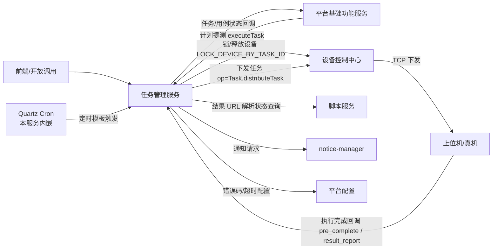

# 产品概述

> **Git 仓库**：`git@git.testin.cn:stock/backend/real-task.git`　**分支**：`syy.release.z7.8.1.0`

## 这是什么

任务管理服务（工程名 `real-task`，Spring Boot 3.2.12）是 Testin 云真机平台的**任务工厂**：把"一组脚本/用例 + 一组设备 + 执行标准 + 通知配置"固化为可复用的任务模板，并在每次触发时生成一份执行快照（执行记录），驱动其在真机上运行、回收结果、生成报告。

它解决四类问题：

1. **任务模板管理**：任务配置的复用与定时化（Cron），覆盖 APP / Web / 桌面（PC）/ 用例 四类任务。
2. **任务执行管道**：新链路的执行编排——建任务快照 → Redis 队列初始化 → 锁设备 → 下发设备控制中心 → 回收结果，**不经任务调度服务**。
3. **结果回收与报告**：预完成 / 结果上报两阶段回收，经结果解析、结果分析两级队列生成任务报告与用例报告。
4. **计划回调闭环**：任务来自测试计划时，把初始化 / 状态 / 结果异步回调给平台基础功能服务汇总。

## 新链路 vs 旧链路的边界

平台同时存在两代任务执行链路，读代码 / 排查问题前必须先分清：

| 维度 | 新链路（本服务） | 旧链路 |
|---|---|---|
| 承载服务 | **任务管理服务**（real-task） | app处理服务（real-test）/ web/pc处理服务（real-web） |
| 任务类型 | 用例（CASE）类任务 | APP 脚本任务、Web / 桌面任务 |
| 设备分配 | 本服务**主动扫描锁设备**（20s 轮询 + Redisson 锁），直推设备控制中心 | 经任务调度服务（real-scheduling），靠设备心跳触发 `Task.match` |
| 存储 | `db_task` 库 `task_execute_record` 族 | `db_real` 库 `task_info / task_sub_info` |
| 入口 | `POST /v3/real_task/task_execute_records/execute` | `RealTestV3Api.taskAdd` / V1 RPC `taskAdd`、`TASK_ACTION/taskCreate` |

分流点在平台基础功能服务侧（按计划类型 `planInfoType`），详见 [端到端-测试计划执行](../../跨模块链路/端到端-测试计划执行.md)。本服务只承接**用例类**这一条出口。

## 上下游

- **上游**：前端（`/v3/real_task/*`）、平台基础功能服务（测试计划触发）、本服务内嵌 Quartz（定时模板）。
- **下游**：设备控制中心（锁设备 + 任务下发 + 停止，V1 RPC / V3 REST 混用）、脚本服务（结果文件解析状态）、平台基础功能服务（计划回调）、notice-manager（通知）、平台配置（错误码、项目超时配置）、数据源（SQL 步骤）、文件管理服务（报告附件）。

## 核心概念

| 概念 | 一句话定义 | 载体 |
|---|---|---|
| **任务模板** | 可复用的任务配置：脚本/用例 + 设备 + 执行标准 + 通知 + Cron | `task_template` 族（7 表） |
| **执行记录** | 模板的一次执行实例（快照），状态机载体 | `task_execute_record` 族（11 表） |
| **执行中报告** | 任务内"待下发子任务"的排队凭证，20s 扫描的扫描对象 | `task_execute_record_executing_report` |
| **任务报告** | 一次执行聚合出的报告（脚本级/步骤级明细 + 性能/日志） | `task_execute_record_report` 族 |
| **用例报告** | 用例任务中按"用例 × 数据行"维度的执行结果 | `task_execute_record_report_case` 族 |
| **预完成（preComplete）** | 设备侧执行完一个步骤后的"先报状态、后传结果"第一阶段 | `TaskExecuteStatusEnum.PRE_COMPLETE` |
| **重测** | 基于历史执行记录重新生成任务（可选仅失败项），`parentId` 维系父子链 | `task_execute_record.parent_id` |

## 延伸阅读

- [功能总览](功能总览.md) — 功能清单与数据模型要点
- [任务执行管道实现](../03-实现逻辑/任务执行管道实现.md) — 全链路代码分析
- [00-首页](../00-首页.md) — 技术栈、包结构、Redis 队列全景
- [术语表](../06-开发指南/术语表.md) — 本服务术语速查
