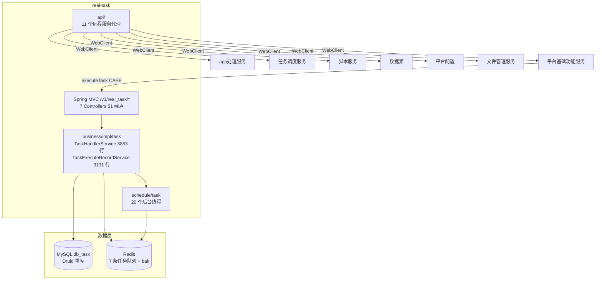

# 总体架构

## 平台定位

任务管理服务（real-task）是 Testin 平台的**新链路任务工厂**，负责用例级（CASE）测试任务的模板管理、执行调度、结果回收与报告生成。它是一条自闭环管道：从平台基础功能服务接收提测请求 → 自管 Redis 队列驱动初始化→执行→解析→分析→回传五阶段 → 最终把报告推回计划侧。

与旧链路（app处理服务 → 任务调度服务）的关键区别：任务管理服务**自主锁设备、自主扫描分发**，不依赖任务调度服务的设备心跳匹配。

## 系统上下文

## 核心架构决策

### 1. 纯 Spring MVC 单入口

任务管理服务**不提供 ApiServlet 反射入口**，所有接口统一以 `/v3/real_task/*` 发布。这是与其他 real-* 服务最显著的区别，原因：它是全新构建的服务（Spring Boot 3.2.12 + JDK 17），没有历史包袱。

### 2. Redis List 自管管道（7 队列 + bak 兜底）

用 Redis List 作为轻量级任务队列，`brPopLPush` 阻塞式可靠消费。五阶段各有专属队列：
`task_execute_record_init_queue` → `exec_queue` → `result_parse_queue` → `result_analysis_queue` → `send_plan_queue`

每条队列配一个 bak 队列，RestartThread 负责从 bak 重新投递。不引入独立 MQ 中间件，降低运维复杂度。详见 [横切-Redis队列架构](../04-复杂功能细节/横切-Redis队列架构.md)。

### 3. 7 种回调策略（策略模式）

`strategy/plan/` 包下 `InitCallBackStrategy` 注册 7 种回调策略：任务初始化、脚本执行、任务状态、子任务下发、脚本状态更新、错误原因更新、用例回调。策略模式解耦了执行管道中不同节点的差异化处理逻辑。

### 4. Quartz JDBC JobStore 集群支持

与平台基础功能服务的 RAMJobStore 不同，任务管理服务使用 JDBC JobStore，支持多节点集群部署。`TaskTemplateExecuteJob` 扫描 `task_template` 表中 `template_type=2` 的定时模板创建执行记录。

### 5. 11 个 AsyncConfig 线程池

`taskExecuteRecordExecuteExecutor` 的 corePoolSize=50（最大），用于执行分发——这是管道吞吐的关键线程池。其余线程池按业务域隔离（报告处理、结果解析、设备分发等）。

## 代码工程一览

| 工程 | 技术栈 | 产物 | 说明 |
|---|---|---|---|
| `real-task` | Java 17 / Spring Boot 3.2.12 / Tomcat / MyBatis Plus 3.5.9 / Redisson / Quartz JDBC | jar | 独立 Maven 工程，context-path `/v3` |

## 延伸阅读

- [存储总览](00-存储总览.md) — db_task 单库 + Redis 队列全景
- [专题索引](../04-复杂功能细节/专题-索引.md)
- [核心链路-任务提测](../04-复杂功能细节/核心链路-任务提测.md) / [任务执行](../04-复杂功能细节/核心链路-任务执行.md) / [结果回收](../04-复杂功能细节/核心链路-结果回收.md)
- [跨模块：测试计划执行](../../跨模块链路/端到端-测试计划执行.md)
