# 表关系总览 (db_task)

> 基线：syy.release.z7.8.1.0。db_task 共 29 张表，按 4 个域组织，域内以主表为中心的一对多关系为主，无外键约束（应用层维护）。

## 域关系图

```mermaid
erDiagram
    task_template ||--o{ task_template_detail : task_template_id
    task_template ||--o{ task_template_script : task_template_id
    task_template ||--o{ task_template_device : task_template_id
    task_template ||--o{ task_template_case : task_template_id
    task_template ||--o{ task_template_notice : task_template_id
    task_template ||--o{ task_template_standard_detail : task_template_id
    task_template ||--o{ task_template_case_status_sync : case_id

    task_execute_record ||--o{ task_execute_record_detail : task_execute_record_id
    task_execute_record ||--o{ task_execute_record_script : task_execute_record_id
    task_execute_record ||--o{ task_execute_record_device : task_execute_record_id
    task_execute_record ||--o{ task_execute_record_case : task_execute_record_id
    task_execute_record ||--o{ task_execute_record_notice : task_execute_record_id
    task_execute_record ||--o{ task_execute_record_time_period : task_execute_record_id
    task_execute_record ||--o{ task_execute_record_type : task_execute_record_id
    task_execute_record ||--o{ task_execute_record_cancel : task_execute_record_id
    task_execute_record ||--o{ task_execute_record_result_parse : task_execute_record_id
    task_execute_record ||--o{ task_execute_record_result_analysis : task_execute_record_id
    task_execute_record ||--o{ task_execute_record_send_task_plan : task_execute_record_id
    task_execute_record ||--o{ task_execute_record_device_execute_record : task_execute_record_id
    task_execute_record ||--o{ task_execute_record_executing_report : task_execute_record_id
    task_execute_record ||--o{ task_execute_record_standard_detail : task_execute_record_id
    task_execute_record ||--o{ task_execute_record_report : task_execute_record_id

    task_execute_record_report ||--o{ task_execute_record_report_case : task_execute_record_report_id
    task_execute_record_report ||--o{ task_execute_record_report_detail : task_execute_record_report_id
    task_execute_record_report_case ||--o{ task_execute_record_case_step : task_execute_record_report_case_id
    task_execute_record_case ||--o{ task_execute_record_case_tag : task_execute_record_case_id

    task_template ||--o{ task_execute_record : "template 快照生成"
```

## 任务模板域

主表 [task_template](../../数据库管理/db_task/task_template.md)，子表均通过 `task_template_id` 关联：

| 子表 | 说明 |
|------|------|
| [task_template_detail](../../数据库管理/db_task/task_template_detail.md) | 模板执行详细配置 |
| [task_template_script](../../数据库管理/db_task/task_template_script.md) | 模板-脚本关联 |
| [task_template_device](../../数据库管理/db_task/task_template_device.md) | 模板-设备关联 |
| [task_template_case](../../数据库管理/db_task/task_template_case.md) | 模板-用例关联 |
| [task_template_notice](../../数据库管理/db_task/task_template_notice.md) | 模板-通知配置关联 |
| [task_template_standard_detail](../../数据库管理/db_task/task_template_standard_detail.md) | 模板-执行标准关联 |
| [task_template_case_status_sync](../../数据库管理/db_task/task_template_case_status_sync.md) | 模板用例ID状态同步（按 `case_id`） |

## 执行记录域

主表 [task_execute_record](../../数据库管理/db_task/task_execute_record.md)（由模板快照生成，`parent_id` 维护重测父子链），子表均通过 `task_execute_record_id` 关联：

| 子表 | 说明 |
|------|------|
| [task_execute_record_detail](../../数据库管理/db_task/task_execute_record_detail.md) | 执行记录详细配置 |
| [task_execute_record_script](../../数据库管理/db_task/task_execute_record_script.md) | 执行记录-脚本快照 |
| [task_execute_record_device](../../数据库管理/db_task/task_execute_record_device.md) | 执行记录-设备快照 |
| [task_execute_record_case](../../数据库管理/db_task/task_execute_record_case.md) | 执行记录-用例关联 |
| [task_execute_record_notice](../../数据库管理/db_task/task_execute_record_notice.md) | 执行记录-通知配置 |
| [task_execute_record_time_period](../../数据库管理/db_task/task_execute_record_time_period.md) | 执行时间限制 |
| [task_execute_record_type](../../数据库管理/db_task/task_execute_record_type.md) | 执行记录类型 |
| [task_execute_record_cancel](../../数据库管理/db_task/task_execute_record_cancel.md) | 任务取消记录 |
| [task_execute_record_result_parse](../../数据库管理/db_task/task_execute_record_result_parse.md) | 结果解析记录（结果回收阶段 1） |
| [task_execute_record_result_analysis](../../数据库管理/db_task/task_execute_record_result_analysis.md) | 结果分析记录（结果回收阶段 2） |
| [task_execute_record_send_task_plan](../../数据库管理/db_task/task_execute_record_send_task_plan.md) | 计划回传记录（结果回收阶段 3） |
| [task_execute_record_device_execute_record](../../数据库管理/db_task/task_execute_record_device_execute_record.md) | 设备执行记录 |
| [task_execute_record_executing_report](../../数据库管理/db_task/task_execute_record_executing_report.md) | 执行中报告 |
| [task_execute_record_standard_detail](../../数据库管理/db_task/task_execute_record_standard_detail.md) | 执行标准详情 |

## 报告域

[task_execute_record_report](../../数据库管理/db_task/task_execute_record_report.md)（`task_execute_record_id` → 执行记录）→ [task_execute_record_report_case](../../数据库管理/db_task/task_execute_record_report_case.md)（`task_execute_record_report_id`）→ [task_execute_record_case_step](../../数据库管理/db_task/task_execute_record_case_step.md) / [task_execute_record_report_detail](../../数据库管理/db_task/task_execute_record_report_detail.md)。

[task_execute_record_case_tag](../../数据库管理/db_task/task_execute_record_case_tag.md) 通过 `task_execute_record_case_id` 关联执行记录用例。

## 通用表

- [notice_info](../../数据库管理/db_task/notice_info.md) — 通知信息通用结构（`NoticeInfo` 嵌入式对象，字段嵌入通知配置记录中）

## 相关专题

- [核心链路-结果回收](../04-复杂功能细节/核心链路-结果回收.md) — result_parse → result_analysis → send_task_plan 三阶段管道
- [横切-任务状态机](../04-复杂功能细节/横切-任务状态机.md) — task_execute_record 状态流转
