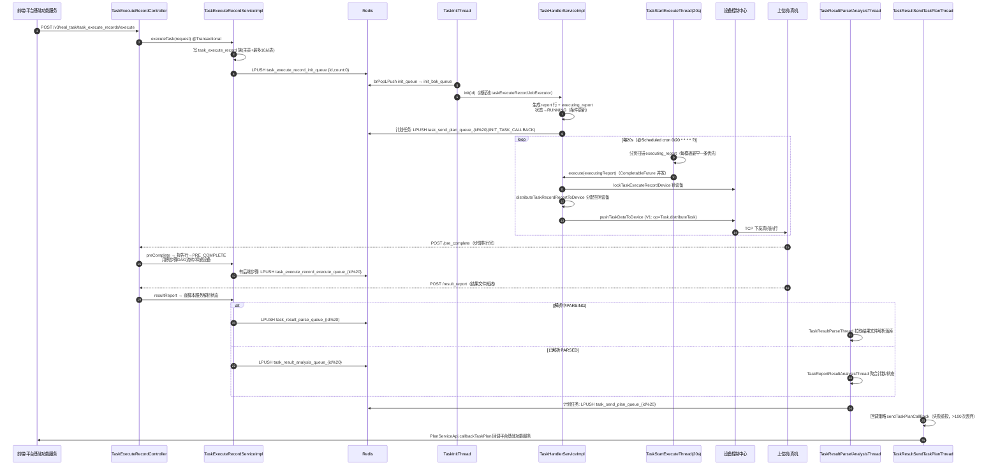

# 任务执行管道实现

## 概述

本文描述本服务最核心的一条链路：从 `executeTask` 建任务到结果回调平台基础功能服务的全过程。链路特征：**Redis List 当轻量 MQ（`brPopLPush` 可靠消费 + bak 队列）+ 20s 主动扫描锁设备 + 设备控制中心直推**，不经任务调度服务。

整条链路 6 步：

1. `executeTask` 一个事务建任务快照（最多 11 张表），`LPUSH task_execute_record_init_queue`；
2. `TaskInitThread` 消费 init 队列 → `TaskHandlerServiceImpl.init` 生成报告行（脚本×设备 / 用例×数据行），状态 `WAIT_RUNNING → RUNNING`；
3. `TaskStartExecuteThread` 每 20s 扫描 `task_execute_record_executing_report`，触发 `TaskHandlerServiceImpl.execute` 锁设备；
4. 锁到设备后组装 `TaskMatchResponseDTO`，`pushTaskDataToDevice` 直推设备控制中心（V1 RPC `op=Task.distributeTask`）下发真机；
5. 设备侧执行完先回调 `pre_complete`（预完成，驱动用例步骤 DAG 流转），再回调 `result_report`（结果上报，按解析状态分流到解析/分析队列）；
6. 结果落库聚合后，计划类任务经 `task_send_plan_queue_{n}` 由回调策略异步回调平台基础功能服务。

> 队列全景与 bak 恢复机制见 [横切-Redis队列架构](../04-复杂功能细节/横切-Redis队列架构.md)；线程清单见 [横切-后台线程全景](../04-复杂功能细节/横切-后台线程全景.md)。

## 全链路时序图

## 逻辑详解

### 1. 建任务：executeTask

入口 `POST /v3/real_task/task_execute_records/execute`（`src/main/java/cn/testin/controller/task/TaskExecuteRecordController.java`）→ `TaskExecuteRecordServiceImpl.executeTask`（`src/main/java/cn/testin/service/impl/task/TaskExecuteRecordServiceImpl.java`，`@Transactional`）：

- **两个分支**：带 `taskTemplateId` 走模板快照（先 `checkTaskTemplateDetails` 校验）；不带模板走"临时提测"（脚本/设备详情实时查询脚本服务与设备条件）。
- **重测**：`retestTaskExecuteId / retestTaskId` 命中时 `getOldTaskExecuteRecord` 取旧记录；`enableRetestSummary` 时先生成汇总父记录，子记录 `parentId` 指向它，父记录的脚本/设备总数按子记录去重重算。
- **写表**：主表 + detail + standard_detail 必写，再按条件写 type / case / case_step / case_tag / script / device / notice / time_period 共 8 张从表。
- **两个提前返回**：只有 `packageUrl` 没有 `appPackageId` 时直接返回，等 App 包解析后再走（状态停在 `WAIT_APP_DEAL`）；用例任务存在无效用例（`isHaveError`）时直接置 `FINISH` + 错误信息，并插一条计划回调待办。
- **入队**：`enableExecute` 开启时构造 `TaskInitRedisDTO{id, count:0}` `LPUSH task_execute_record_init_queue`。`executeTaskByExecuteTaskId`是"只补投队列"的轻量入口，供再触发用。

### 2. 初始化：TaskInitThread → TaskHandlerServiceImpl.init

`TaskInitThread`（`src/main/java/cn/testin/schedule/task/TaskInitThread.java`）是常驻 `while(true)` 消费线程：

- **背压**：执行线程池队列超过容量一半时先睡 1s 不取消息。
- **可靠消费**：`brPopLPush(init_queue, init_bak_queue)`，处理成功后才 `lRem` bak；任何异常 `count+1` 重新 `LPUSH` 回主队列。
- **重试上限**：`count > 10` 不再处理——把仍是 `WAIT_RUNNING` 的任务置为 `EXCEPTION(5)`（条件更新），计划任务补发 `INIT_TASK_CALLBACK`。

`init`（`src/main/java/cn/testin/service/impl/task/TaskHandlerServiceImpl.java`，`@Transactional`）：

- 只处理 `WAIT_RUNNING` 状态；先抢 Redisson 锁 `init_task_lock_{id}`，抢不到直接返回等下轮。
- 用例任务走 `initTaskByCase`：按"用例 × 数据行"生成 `task_execute_record_report_case` 与步骤 DAG（`preCaseStepIds`）；
- 脚本任务分页读 `task_execute_record_script`，按"脚本 × 设备"生成报告行（`generateTaskExecuteRecordReport`）；重测任务则从旧报告行按状态/报告 ID 过滤重算。
- 生成完毕把状态 `WAIT_RUNNING → RUNNING`（条件更新防并发），同时回填 `executeScriptTotal`；重测父记录同步改回 `RUNNING` 并扣减旧统计。
- 计划任务（`executeRecordTaskId > 0`）插 `task_execute_record_send_task_plan` 并 `LPUSH task_send_plan_queue_{id % taskSendPlanCount}` 发初始化回调。

### 3. 20s 扫描下发：TaskStartExecuteThread → execute

`TaskStartExecuteThread.executeTask`（`src/main/java/cn/testin/schedule/task/TaskStartExecuteThread.java`），`@Scheduled(cron = "0/20 * * * * ?")`。代码注释明确：**任务之间/用例之间切换会自动触发该逻辑，20s 只是设备没占用到的保底措施**——另一条触发路径是 `TaskExecuteThread` 常驻 pop `task_execute_record_exec_queue`，一弹到消息立即调用同一个 `executeTask()`（`src/main/java/cn/testin/schedule/task/TaskExecuteThread.java`）。

每轮扫描分两遍：先按模板分组取**每个模板最早一条** `executing_report` 触发（保证同模板多任务按序），再处理同模板被跳过的其余记录（防换设备任务饿死）；每条提交 `CompletableFuture` 到 `taskExecuteRecordExecuteExecutor` 并发执行；`PAUSE` 状态任务直接跳过。

`TaskHandlerServiceImpl.execute`（`src/main/java/cn/testin/service/impl/task/TaskHandlerServiceImpl.java`）：

- 任务级 Redisson 锁 `exec_task_report_lock_{taskId}` 防并发计算。
- `NO_DEVICE(10)` 状态先 `reOccupyDevice` 尝试重新占用；已锁设备数 < 需要数时 `occupyOtherDevice` 补占。锁/查设备都走 `DeviceServiceApi` → 设备控制中心：`lockTaskExecuteRecordDevice`（V3 `LOCK_DEVICE_BY_TASK_ID`，`src/main/java/cn/testin/api/device/DeviceServiceApi.java`）、`getLockDeviceByTaskExecuteRecordId`。
- Web/PC 设备按 `ucomId`（上位机）去重——同一上位机上的多个 Web/PC 设备算一个执行单位。
- 空步骤（`scriptNo == 0`）不下发，直接 `dealEmptyCaseStep` 本地调 `preComplete` 透传参数驱动步骤流转。

### 4. 分配与下发：distributeTaskRecordReportToDevice → 设备控制中心

`distributeTaskRecordReportToDevice`（`TaskHandlerServiceImpl.java`）：

- `distributeDeviceInCaseReport`抢 `exec_report_distribute_device{taskId}` 锁，从空闲设备池（`task_execute_record_device_execute_record` 中未绑用例的记录）按脚本类型分配设备，占用状态写回。
- 组装下发报文 `getTaskMatchBaseInfoByRecordInfo`：`subTaskId = {taskId}_{deviceRecordId}_{reportId}`（任务+设备+报告唯一定位），附执行标准（全局超时、加速、安装/清理策略、性能/日志采集）与全局参数（计划名、设备信息、App 信息等）。
- **下发**：`deviceServiceApi.pushTaskDataToDevice`（`DeviceServiceApi.java`）——V1 RPC 风格 POST 到设备控制中心 `/`，`op=Task.distributeTask, action=control`；"not free" 冲突跳过等下轮，其他异常 `finalTaskDistributeFail`。
- 成功后 `afterTaskDistributeSuccess`：报告行 → `ING(0)`、`matchCount+1`、绑定设备记录。

### 5. 结果回收：preComplete / resultReport

设备侧两阶段回调，入口都在 `TaskExecuteRecordController`（`/pre_complete` 、`/result_report`），返回值约定：**1=已处理（对端不再重试），0=未就绪（对端稍后重试）**。

`preComplete`（`TaskExecuteRecordServiceImpl.java`，`@Transactional`）：

- 按 `taskId/subTaskId/subSubTaskId` 定位执行中报告行；找不到且已终态返回 1，未终态返回 0 让对端重试。
- 未匹配到设备的行直接置 `SKIP`；正常置 `PRE_COMPLETE(1)`；`resultCode` 经 `systemServiceApi.getErrorCode` 映射 `resultCategory`。
- 入参/出参写入 `task_execute_record_report_detail.pre_param / post_param`（步骤间参数传递）。
- 用例任务步骤流转：步骤失败 → 用例/任务直接置 FAIL 并 `preCompleteReleaseDevice` 释放设备；`aftCaseStepIds == "[]"`（最后一步）→ 置 SUCCESS 释放设备；否则遍历后继步骤，`preCaseStepIds` 移除当前步骤，**前置清零即 `haveNext=true`，LPUSH `task_execute_record_execute_queue_{id%20}` 触发下一轮下发**——这就是"用例之间切换自动触发"的那条快路径。

`resultReport`（`TaskExecuteRecordServiceImpl.java`）：

- `resultType=EXCEPTION` 走 `resultExceptionDealResult`：整设备/整任务按 `ENV_FAILED` 兜底归因。
- 只接受 `PRE_COMPLETE` 状态的报告行；没有 `resultUrl` 直接按 `NO_RESULT_INFO` 归因。
- 调脚本服务 `getTaskUrlParseResult` 查结果文件解析状态：`PARSING` → 插 `task_execute_record_result_parse` + LPUSH `task_result_parse_queue_{id%20}`；`PARSED` → 插 `task_execute_record_result_analysis` + LPUSH `task_result_analysis_queue_{id%20}`；`PARSE_ERROR` → 归因落库。

### 6. 回调平台基础功能服务

- `TaskResultSendTaskPlanThread`（`src/main/java/cn/testin/schedule/task/TaskResultSendTaskPlanThread.java`）`brPopLPush task_send_plan_queue_{i} → task_send_plan_queue_bak`，调 `taskHandlerService.taskResultSendTaskPlan` 后按 `CallbackTypeStrategyEnum` 分发到 7 种回调策略（`TaskHandlerServiceImpl.java`）。
- 策略基类 `RecordTaskCallbackStrategy.sendTaskPlan`（`src/main/java/cn/testin/strategy/plan/RecordTaskCallbackStrategy.java`）：`taskPlanService.callbackTaskPlan` → `PlanServiceApi.callbackTaskPlan`（`src/main/java/cn/testin/api/plan/PlanServiceApi.java`，POST 平台基础功能服务 `TASK_PLAN_EXECUTE_RECORD_TASK_CALL_BACK`）；成功删待办记录，失败 `sendCount+1` 重投队列。
- **丢弃上限**：`sendCount > 100`（`CommonConstants.MAX_TIME = 100`，`src/main/java/cn/testin/common/constant/CommonConstants.java`）直接删除待办、打 error 日志，不再重试（`RecordTaskCallbackStrategy.java`）。网络异常（`WebClientResponseException`）睡 10s 再重投（`TaskResultSendTaskPlanThread.java`）。

## 涉及表 / Redis key 速查

| 环节 | 表 | Redis key |
|---|---|---|
| 建任务 | `task_execute_record` 族 11 表 | `task_execute_record_init_queue` / `..._init_bak_queue` |
| 初始化 | `task_execute_record_report`(+case/detail)、`task_execute_record_executing_report` | 锁 `init_task_lock_{id}`；`task_send_plan_queue_{0..19}` |
| 扫描下发 | `task_execute_record_device_execute_record`、`task_execute_record_report` | `task_execute_record_exec_queue`；锁 `exec_task_report_lock_{id}`、`exec_task_report_lock_detail_{reportId}`、`exec_report_distribute_device{id}` |
| 步骤流转 | `task_execute_record_report`、`..._report_case`、`..._report_detail`、`..._device_execute_record` | `task_execute_record_execute_queue_{0..19}` / bak |
| 结果解析/分析 | `task_execute_record_result_parse`、`task_execute_record_result_analysis` | `task_result_parse_queue_{0..19}`、`task_result_analysis_queue_{0..19}`（各有 bak） |
| 计划回调 | `task_execute_record_send_task_plan` | `task_send_plan_queue_{0..19}` / `task_send_plan_queue_bak` |
| 取消 | `task_execute_record_cancel` | `task_cancel_queue_{0..19}` / bak |

队列名常量集中在 `src/main/java/cn/testin/common/constant/RedisQueueConstants.java`；分片数（默认各 20）由 `task.*.count` 配置控制，按 `taskExecuteRecordId % count` 取模分片。

## 线程启动装配

所有消费线程在 `TaskExecuteRecordConsumerRestartInit.afterPropertiesSet`（`src/main/java/cn/testin/schedule/task/TaskExecuteRecordConsumerRestartInit.java`）统一启动：init 队列 × `task.init.consumer.count`、exec 队列 1 条 `TaskExecuteThread`、parse/analysis/execute/cancel/sendPlan 各按配置分片数起线程，分别挂在 6 个独立线程池上。

## 注意事项与坑

1. **`executeTask` 是大事务**：最多 11 张表 + 多次远程查询（脚本服务/设备）在一个 `@Transactional` 里，大任务会拉长事务持有时间；重测+汇总父记录场景还有一次全量子记录重算（`TaskExecuteRecordServiceImpl.java`）。
2. **20s 扫描是保底不是主路径**：正常流转靠 `preComplete` 里 LPUSH `task_execute_record_execute_queue_{n}` → `TaskExecuteStartThread` 立即直投单条 executing_report；`TaskExecuteThread` 消费 `task_execute_record_exec_queue` 单条信号触发全量扫描；设备一直锁不到时才体现 20s 轮询节奏（`TaskStartExecuteThread.java` 注释）。
3. **preComplete/resultReport 的返回码是对端重试协议**：返回 0 设备侧会重发，乱改返回逻辑会导致设备端刷请求或丢结果（`TaskExecuteRecordServiceImpl.java`）。
4. **任务锁颗粒度是任务级**：`exec_task_report_lock_{taskId}` 抢不到直接 `return true` 等下轮（`TaskHandlerServiceImpl.java`），高并发下同一任务的下发是串行的。
5. **Web/PC 按上位机去重**：`ucomId` 相同的多台 Web/PC 设备只占一个执行位（`TaskHandlerServiceImpl.java`），排查"设备数够但不下发"先看这里。

## 延伸阅读

- [任务状态与异常处理实现](任务状态与异常处理实现.md)
- [核心链路-任务执行](../04-复杂功能细节/核心链路-任务执行.md) / [核心链路-结果回收](../04-复杂功能细节/核心链路-结果回收.md) / [核心链路-回调处理](../04-复杂功能细节/核心链路-回调处理.md)
- [端到端-测试计划执行](../../跨模块链路/端到端-测试计划执行.md)
