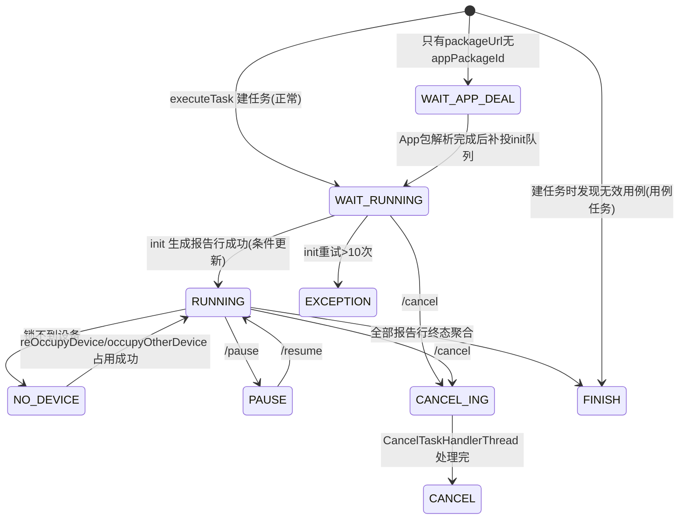

# 任务状态与异常处理实现

## 概述

本文对齐代码（分支 syy.release.z7.8.1.0）讲清三件事：任务级状态机（`TaskStatusEnum`）与报告行级状态机（`TaskExecuteStatusEnum`）的真实取值、锁设备失败与 NO_DEVICE 重试、init 重试与回调重试的上限处理。

> 状态枚举取值（任务级 `TaskStatusEnum`、报告行级 `TaskExecuteStatusEnum`）已与代码对齐，详见 [横切-任务状态机](../04-复杂功能细节/横切-任务状态机.md)。

## 任务级状态机（TaskStatusEnum）

枚举定义见 `src/main/java/cn/testin/common/enums/task/TaskStatusEnum.java`，字段为 `task_execute_record.task_status`：

| 值 | 枚举 | 含义 | 备注 |
|---|---|---|---|
| 0 | WAIT_APP_DEAL | 等待 appUrl 解析 | 只有 packageUrl 没有 appPackageId 时停在这里（`TaskExecuteRecordServiceImpl.executeTask` 提前返回） |
| 1 | WAIT_RUNNING | 等待执行 | 建任务后的初始状态（正常场景） |
| 2 | RUNNING | 执行中 | init 完成后条件更新进入（`TaskHandlerServiceImpl.java`） |
| 3 | FINISH | 执行完成 | 终态；无效用例的用例任务建任务时直接置此态 |
| 4 | CANCEL | 已取消 | 终态 |
| 5 | EXCEPTION | 异常 | 终态；init 重试 >10 次进入（`TaskInitThread.java`） |
| 6 | CANCEL_ING | 取消中 | 取消队列异步处理期间 |
| 8 | PAUSE | 暂停中 | 20s 扫描跳过（`TaskStartExecuteThread.java`）；注意**没有 7** |
| 10 | NO_DEVICE | 等待执行，没匹配到设备 | execute 时锁不到设备进入，后续每轮扫描重试占用 |

三组状态集合（`TaskStatusEnum.java`）在条件更新里反复使用，务必记牢：

- `FINISH_EXECUTE_STATUS = {FINISH, CANCEL, EXCEPTION}` — 终态集合；
- `EXECUTING_STATUS = {WAIT_RUNNING, NO_DEVICE, RUNNING}` — 执行中集合；
- `EXECUTING_STATUS_WITH_CANCELING` 再加 `CANCEL_ING`。

## 报告行级状态机（TaskExecuteStatusEnum）

枚举定义见 `src/main/java/cn/testin/common/enums/task/TaskExecuteStatusEnum.java`，字段为 `task_execute_record_report.execute_status`（及 report_case）：

`IDLE(-1) 待执行 → ING(0) 执行中 → PRE_COMPLETE(1) 预完成 → SUCCESS(2)/FAIL(3)/TIME_OUT(4)/CANCEL(5)/SKIP(6)`，另有 `CANCEL_ING(7)`。

关键流转点：

- 下发成功 `ING`：`afterTaskDistributeSuccess`（`TaskHandlerServiceImpl.java`）；
- 设备回调 preComplete → `PRE_COMPLETE`；未匹配设备的行直接 `SKIP`（`TaskExecuteRecordServiceImpl.java`）；
- `resultReport` 只接受 `PRE_COMPLETE` 的行继续走解析/分析；
- 状态集合同样有 5 组（`EXECUTING_STATUS_WITHOUT_CANCEL_ING` 等），是"这条报告还能不能被下发/更新"的判断依据。

## 锁设备失败与 NO_DEVICE 重试

锁设备不是一次性动作，而是"每轮扫描都尝试"的循环：

1. `TaskHandlerServiceImpl.execute` 发现任务处于 `NO_DEVICE(10)` 时先 `reOccupyDevice`（`TaskHandlerServiceImpl.java`）；占用失败直接返回，等下一轮（20s 保底扫描或队列触发）。
2. 已锁设备数 < 需要数时 `occupyOtherDevice` 补占两轮：第一轮带"已锁用例行数是否已够"校验，第二轮无条件补。
3. 占用结果为空时按 `deviceOfflineConfig`（设备离线策略）决定是否检查全部设备（`DeviceOfflineConfigEnum.SKIP_DEAL`）。
4. 设备真正不可用时（`DeviceStatusEnum.isValid`  false）且策略为跳过处理，会把占用让给其他设备继续等。

> init 阶段的"锁设备失败重试 >10 次 → EXCEPTION"实际发生在 `TaskInitThread` 消费层：任何 `init` 抛出的异常都会让 `count+1` 重投 init 队列（`TaskInitThread.java`），`count > 10`（`CommonConstants.TEN_INDEX`）时把仍是 `WAIT_RUNNING` 的任务置为 `EXCEPTION` 并给计划补发 `INIT_TASK_CALLBACK`。 EXCEPTION 是终态，不再自动恢复，需要人工再触发（`POST .../execute/{id}` 补投队列）。

## 回调重试：>100 丢弃

计划回调走"DB 待办 + Redis 队列"双写，重试上限硬编码：

- `RecordTaskCallbackStrategy.preSendTaskPlanCallBackDetail`（`src/main/java/cn/testin/strategy/plan/RecordTaskCallbackStrategy.java`）：`sendCount > CommonConstants.MAX_TIME`（=100，`CommonConstants.java`）→ 删除 `task_execute_record_send_task_plan` 记录、打 error 日志，**静默丢弃不再补偿**。
- 失败重投路径有两条：策略内 HTTP 返回失败 → `sendCount+1` 更新 DB 后 LPUSH 回队列；消费线程抛异常（如网络错误）→ `WebClientResponseException` 先睡 10s，再 `sendCount+1` 重投（`TaskResultSendTaskPlanThread.java`）。
- 同样的"重试上限"模式在 init 队列是 10 次（→ EXCEPTION），在回调队列是 100 次（→ 丢弃）。差异原因：init 失败阻塞整个任务，必须快速显式失败；回调失败不影响本地数据，容忍长时间重试但最终允许丢。

## 其他异常处理点

| 场景 | 行为 | 代码位置 |
|---|---|---|
| init 期间任务被删/状态被改 | 条件更新影响行数为 0 → 抛 `GeneralException`，事务回滚，消息重投 | `TaskHandlerServiceImpl.java` |
| 队列消费线程池将满 | 背压：睡 1s 暂不取消息 | `TaskInitThread.java` |
| 下发时设备 "not free" | 跳过该设备等下轮，不算失败 | `TaskHandlerServiceImpl.java` |
| 结果文件缺失/解析失败 | `dealReportResultWithErrorByNoSwjReport` 按 `NO_RESULT_INFO`/`PARSE_ERROR` 归因落库，不阻塞任务 | `TaskExecuteRecordServiceImpl.java` |
| 设备执行环境异常 | `resultType=EXCEPTION` 整设备/整任务按 `ENV_FAILED` 归因 | `TaskExecuteRecordServiceImpl.java` |
| Redis 权限异常 | `InvalidDataAccessApiUsageException` 直接 break 退出消费线程 | `TaskInitThread.java` |
| 超时检查线程 | **整个方法体被注释**，当前无周期性的 RUNNING 状态巡检，仅靠启动时（也已注释）与各队列驱动 | `TaskExecuteCheckThread.java`（死代码） |

## 取消与暂停

- **取消**：`/cancel` 写 `task_cancel_queue_{n}`，`CancelTaskHandlerThread` 消费后调设备控制中心 `stopTask`（V1 RPC，`DeviceServiceApi.java`；返回码 10210"设备离线"视为成功）再落终态；取消中任务处于 `CANCEL_ING(6)`，仍在 `EXECUTING_STATUS_WITH_CANCELING` 集合内，不会被当作可下发。
- **暂停/恢复**：`/pause` → `PAUSE(8)`，20s 扫描与队列触发都先查暂停标记跳过（`TaskStartExecuteThread.isTaskPaused`）；`/resume` 回到执行中集合。

## 注意事项与坑

1. **状态枚举有两个同名词表**：`TaskStatusEnum`（任务级，值 0-10 不连续）与 `TaskExecuteStatusEnum`（报告行级，值 -1 到 7），查库/对日志时先确认是哪张表的字段。
2. **状态流转基本靠"条件更新"**（`updateSelectiveByCondition` 带原状态过滤），影响行数 0 即视为并发冲突或状态被改，上层据此抛异常或跳过——不要改成无条件 update。
3. **EXCEPTION 不可逆**：>10 次后没有自动恢复路径，只有人工再触发；监控上建议对 `task_status=5` 告警。
4. **回调丢弃是静默的**：>100 次只删记录打日志，计划侧会永远停在中间态；排障时先查 `task_execute_record_send_task_plan` 表是否还有待办。
5. **`TaskExecuteCheckThread` 是死代码**：不要指望它做超时兜底；超时归因目前主要依赖设备侧回调与结果回收管道的兜底归因。

## 延伸阅读

- [任务执行管道实现](任务执行管道实现.md)
- [横切-任务状态机](../04-复杂功能细节/横切-任务状态机.md)
- [跨模块-超时与异常点分析](../../跨模块链路/横切-超时与异常点分析.md)
