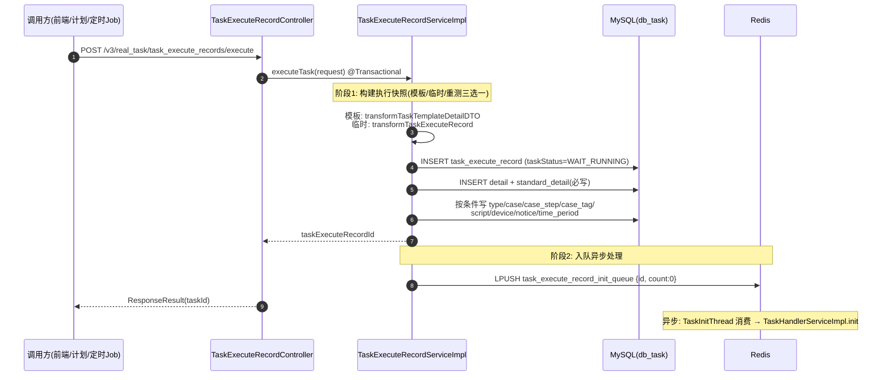

# 核心链路-任务提测

> 入口：`POST /v3/real_task/task_execute_records/execute`
> Controller：`TaskExecuteRecordController.executeTask`
> 核心 Service：`TaskExecuteRecordServiceImpl.executeTask`（`@Transactional`，一个事务完成建快照 + 入队）

## 概述

任务提测是任务管理服务最核心的入口，将用户/计划/定时提交的测试任务转化为执行记录快照，随后 LPUSH `task_execute_record_init_queue` 进入异步初始化管道。**提测本身同步只建快照，不锁设备、不匹配设备**——设备匹配在下游 20s 扫描下发阶段才发生。

## 数据流

## 核心代码路径

| 步骤 | 类/方法 | 说明 |
|------|---------|------|
| 1. 参数校验 | `BaseController.checkProjectId` | 项目 ID 校验 |
| 2. 构建执行记录 | `TaskExecuteRecord.transformTaskExecuteRecord` / `transformTaskTemplateDetailDTO` | DTO→Entity 转换，确定 taskSource、taskStatus |
| 3. 事务写入 | `TaskExecuteRecordServiceImpl.executeTask` (@Transactional) | 主表 + detail + standard_detail 必写，再按条件写 8 张从表 |
| 4. 入队初始化 | `RedisServiceImpl.rPush(initQueue, taskId)` | 推入 Redis List 异步处理 |

## 两个分支（快照来源）

- **模板提测**：带 `taskTemplateId`，先 `checkTaskTemplateDetails` 校验模板，再 `transformTaskTemplateDetailDTO` 从模板族表（detail/script/device/case）加载配置快照。
- **临时提测**：不带模板，脚本/设备详情实时查询脚本服务与设备条件，走 `transformTaskExecuteRecord`。
- **重测**：`retestTaskExecuteId / retestTaskId` 命中时 `getOldTaskExecuteRecord` 取旧记录复制配置；`enableRetestSummary` 时先 `generateTaskExecuteRecordParentAndUpdateOldInfo` 生成汇总父记录（`taskSource=REST_SUMMARY`），子记录 `parentId` 指向它（详见 [核心链路-任务重测](核心链路-任务重测.md)）。

## 任务来源判断

`TaskExecuteRecord.getTaskExecuteRecordWithDetail` 中的 taskSource 判断逻辑：

| 条件 | taskSource |
|------|-----------|
| `executeRecordTaskId != null` | 3 (TASK_PLAN) — 来自测试计划 |
| `taskSource == 2` | 2 (TIMER_TASK) — 来自定时任务 |
| 其他（含重测） | 1 (MANUAL) — 手动提测 |

## 初始状态判断

| 条件 | taskStatus |
|------|-----------|
| 只有 `packageUrl` 无 `appPackageId` | WAIT_APP_DEAL（等 App 包解析后补投 init 队列） |
| App 任务有 packageId，或其他类型任务 | WAIT_RUNNING（等待执行） |
| 用例任务存在无效用例（`isHaveError`） | 直接置 FINISH + 错误信息，插一条计划回调待办 |

## 涉及表（写入）

| 表 | 写入内容 |
|----|---------|
| `task_execute_record` | 执行记录主信息（状态机 + 统计字段） |
| `task_execute_record_detail` | 提测参数快照（必写） |
| `task_execute_record_standard_detail` | 执行标准快照（必写） |
| `task_execute_record_type` / `_case` / `_case_step` / `_case_tag` | 用例任务专有（按条件） |
| `task_execute_record_script` | 脚本关联（按条件） |
| `task_execute_record_device` | 设备关联（按条件） |
| `task_execute_record_notice` | 通知配置（按条件） |
| `task_execute_record_time_period` | 执行时间段限制（按条件） |

## 关键决策点

1. **重测链路**：`retestTaskId != null` 时从父任务复制配置（脚本/设备/用例），设 `parentId`。
2. **模板关联**：`taskTemplateId` 非空时从模板加载配置。
3. **定时任务**：Quartz Job 触发时带 `taskSource=TIMER_TASK(2)`。
4. **计划任务**：平台基础功能服务触发时带 `executeRecordTaskId`，来源判定为 TASK_PLAN。
5. **提前返回**：只有 `packageUrl` 无 `appPackageId` 时直接返回（停在 WAIT_APP_DEAL）；`enableExecute=false` 时只建快照不入队。
