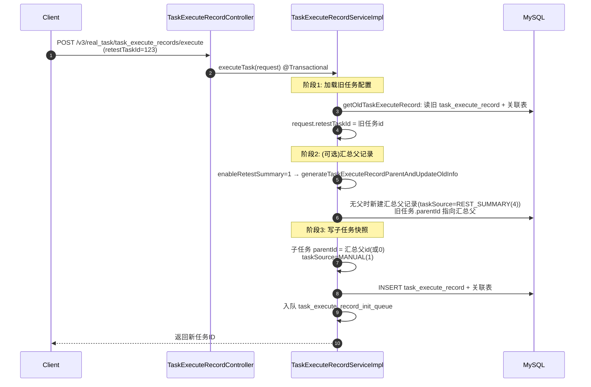

# 核心链路-任务重测

> 入口：`POST /v3/real_task/task_execute_records/execute`
> 参数：`retestTaskExecuteId`（字符串）/ `retestTaskId`（整型）
> 核心逻辑：`TaskExecuteRecordServiceImpl.executeTask` 内的重测分支（`getOldTaskExecuteRecord` + `generateTaskExecuteRecordParentAndUpdateOldInfo`）

## 概述

任务重测允许基于已有执行记录（旧任务）创建新的执行实例。重测子任务继承旧任务的脚本/设备/用例配置，其 `taskSource` 归为 `MANUAL(1)`。可选开启「重测汇总」，用一张 `REST_SUMMARY(4)` 父记录聚合多次重测子任务，形成**「汇总父 + 多个子任务」的星形链**（而非线性父子链）。

## 触发条件

`TaskExecuteRecordServiceImpl.executeTask` 中：

```java
if (StringUtils.hasLength(request.getRetestTaskExecuteId()) || request.getRetestTaskId() != null) {
    oldTaskExecuteRecord = getOldTaskExecuteRecord(request);   // 加载旧任务
    request.setRetestTaskId(oldTaskExecuteRecord.getId());
    if (EnableStatusEnum.isEnable(request.getEnableRetestSummary())) {
        taskExecuteRecordParent = generateTaskExecuteRecordParentAndUpdateOldInfo(request, oldTaskExecuteRecord);
    }
}
```

## 数据流



## 父子链结构（汇总父 + 子任务）

```
task_execute_record (id=S, taskSource=4 REST_SUMMARY, parentId=0)   ← 汇总父记录
    ├─ task_execute_record (id=100, parentId=S)   ← 原始任务（被重测，重挂到汇总父下）
    ├─ task_execute_record (id=123, parentId=S)   ← 第一次重测
    └─ task_execute_record (id=456, parentId=S)   ← 第二次重测
```

## 关键代码逻辑

1. **重测触发**：`retestTaskExecuteId` 或 `retestTaskId` 命中即进入重测模式；`getOldTaskExecuteRecord` 从旧任务加载配置。
2. **汇总父记录**：`enableRetestSummary` 开启时，`generateTaskExecuteRecordParentAndUpdateOldInfo` 判断旧任务是否已有子任务/父记录——没有则新建 `REST_SUMMARY(4)` 父记录（复制旧任务主信息、用例类型、用例报告），并把旧任务 `parentId` 改挂到该父记录下；已有则复用并清零父记录的用例统计。
3. **子任务归属**：子任务 `parentId` 指向汇总父记录（无汇总则为 0），`taskSource` 归为 `MANUAL(1)`。
4. **仅重测失败项**：`onlyRetest` 开启时 `dealScriptByOnlyRetest` 过滤掉非失败脚本；用例侧可通过 `retestTaskReportCaseIds` 指定要重测的用例报告。
5. **允许覆盖任务名**：`request.taskName` 优先。

## 注意

- **重测不走模板快照的分支选择**：重测是 `executeTask` 的一个前置分支，模板/临时提测仍按 `taskTemplateId` 是否为空走各自转换，重测只影响「从旧任务取配置」与「父记录聚合」。
- **状态独立**：重测子任务的状态独立于旧任务。
- **通知独立**：重测任务的通知配置可不同于旧任务。
