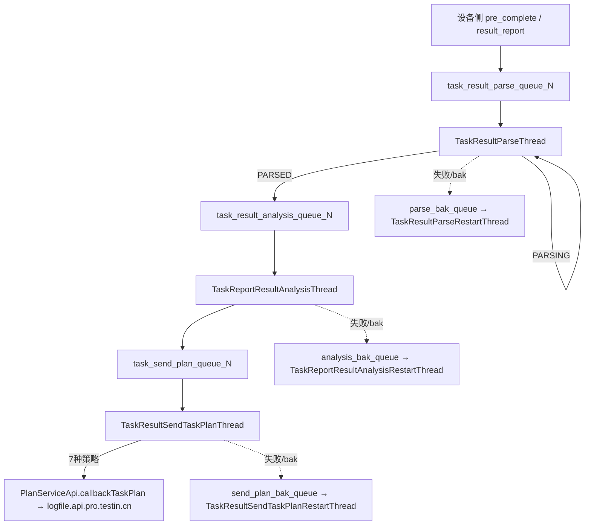

# 核心链路-结果回收

> 管道：预完成（pre_complete）→ 结果上报（result_report）→ 解析（Parse）→ 分析（Analysis）→ 回传计划（SendTaskPlan）
> 线程：`TaskResultParseThread` → `TaskReportResultAnalysisThread` → `TaskResultSendTaskPlanThread`

## 概述

设备侧（设备控制中心下发到上位机/真机）执行完成后，通过 **入站回调** `/pre_complete`、`/result_report` 把原始结果回传。本服务把「先报状态、后传结果」两阶段 + 解析/分析两级队列，转化为结构化报告并回传计划侧。

## 两阶段回调

1. **pre_complete**（`TaskExecuteRecordServiceImpl.preComplete`）：设备侧每执行完一个步骤先报状态。报告行 → `PRE_COMPLETE`；未匹配设备的行置 `SKIP`；用例任务驱动步骤 DAG 流转（`preCaseStepIds` 削减前置计数，前置清零 LPUSH `task_execute_record_execute_queue_{n}` 触发下一轮下发），最后一步/失败时释放设备。
2. **result_report**（`TaskExecuteRecordServiceImpl.resultReport`）：结果文件就绪后回调。只接受 `PRE_COMPLETE` 的行；无 `resultUrl` 按 `NO_RESULT_INFO` 归因；否则调脚本服务 `getTaskUrlParseResult` 查解析状态。

返回值约定：**1=已处理（对端不再重试），0=未就绪（对端稍后重试）**。

## 三阶段管道

### 阶段1: 结果解析（TaskResultParseThread）

消费队列：`task_result_parse_queue_{n}`（× `task.result.parse.count`，默认 20）

- `TaskResultHandlerServiceImpl.taskResultParse`（@Transactional）抢 `task_result_parse_{resultUrl}` 锁；
- 调脚本服务 `getTaskUrlParseResult` 查结果文件解析状态：
  - `PARSE_ERROR`（或 parseCount > 50 且超时）→ `dealReportResultWithErrorByNoSwjReport` 按 `PARSE_ERROR` 归因落库；
  - `PARSING` → `parseCount+1` 重投 `task_result_parse_queue_{n}` 继续等；
  - `PARSED` → 插 `task_execute_record_result_analysis`，删解析待办，LPUSH `task_result_analysis_queue_{n}`。

### 阶段2: 结果分析（TaskReportResultAnalysisThread）

消费队列：`task_result_analysis_queue_{n}`（× `task.result.analysis.count`，默认 20）

- `TaskResultHandlerServiceImpl.taskResultAnalysis` 抢 `result_analysis_{resultUrl}` 锁，`analysisCount > 50` 时按 `PARSE_ERROR` 兜底；
- 从脚本服务拿 summary/logRes/testCase 等结果文件 URL，落地解析 `TaskReportSummaryInfoDTO`（XML）、`TaskReportLogSummaryDTO`、`TaskReportTestCaseDTO`（含步骤 OCR），并把解析后的 summary/log/testCase 重新上传文件服务（`FileUploadServiceApi.uploadFile`）生成新 URL；
- 按 `systemServiceApi.getErrorCode` 把 errorCode 映射为 `resultCategory`，再 `getErrorCauseMathRule` 做错误原因规则匹配（错误文案/OCR 匹配 → 自动标注 errorCauseTypeId）；
- 按 `reportRunInfo.testProcesses` 各阶段（INIT/PREPARATION/EXECUTE/CLEANUP）累加 `initCostTime/preparationCostTime/stepCostTime/executeCostTime`，回填报告行时间字段；
- `resultCategory == SUCCESS` → 报告行 `SUCCESS`，否则 `FAIL`；再抢 `result_analysis_{taskId}` 锁调 `dealReportResultByReport` 聚合任务统计。

### 阶段3: 结果回传（TaskResultSendTaskPlanThread）

消费队列：`task_send_plan_queue_{n}`（× `task.send.plan.count`，默认 20）

- `TaskHandlerServiceImpl.taskResultSendTaskPlan` 按 `CallbackTypeStrategyEnum` 分 7 种策略（见 [核心链路-回调处理](核心链路-回调处理.md)），最终 `PlanServiceApi.callbackTaskPlan` POST 到 `logfile.api.pro.testin.cn`；
- 成功删待办；失败 `sendCount+1` 重投；`sendCount > 100` 静默丢弃。

## 错误处理与补偿

各阶段消费线程用 `brPopLPush` 先备份到 bak 队列，处理成功才从 bak 删除；异常时 `count+1` 重投主队列。启动时对应的 `*RestartThread`（`InitializingBean`）扫描 bak 队列补偿：

1. `TaskResultParseRestartThread` → `task_result_parse_queue_bak`；
2. `TaskReportResultAnalysisRestartThread` → `task_result_analysis_queue_bak`；
3. `TaskResultSendTaskPlanRestartThread` → `task_send_plan_queue_bak`；
4. `CancelTaskHandlerRestartJob` → `task_cancel_queue_bak`（取消补偿）。

> 备注：分析线程数在 `TaskExecuteRecordConsumerRestartInit` 里误用了 `task.result.parse.count`（而非 analysis.count）作为循环上界，实际起线程数可能比配置预期少/多，读代码时注意。

## 涉及表

| 表 | 用途 |
|----|------|
| `task_execute_record_report` / `_detail` | 报告主记录 + 步骤详情（含 resultDetail、videoUrl） |
| `task_execute_record_report_case` | 用例维度结果 |
| `task_execute_record_result_parse` | 解析待办/历史 |
| `task_execute_record_result_analysis` | 分析待办/历史 |
| `task_execute_record_send_task_plan` | 计划回传待办 |
