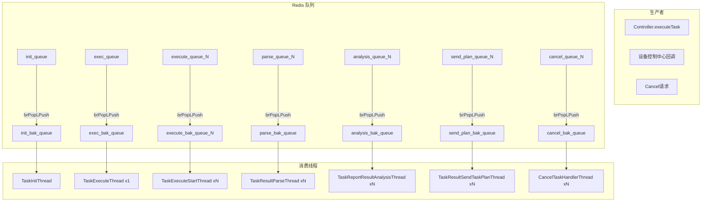

# 横切-Redis队列架构

任务管理服务 使用 Redis List 作为轻量级消息队列，实现任务调度管道的异步解耦。

## 设计动机

- **无外部 MQ 依赖**：不依赖 RabbitMQ/Kafka，降低运维复杂度
- **阻塞式可靠消费**：`brPopLPush` 原子操作保证消息不丢失
- **多分片并行**：队列名后缀 `_{n}` 支持多线程并行消费
- **bak 备份机制**：每条消息在消费前备份，消费成功后删除，RestartThread 负责启动补偿

## 消费者接口

`cn.testin.service.redis.RedisConsumer` 接口：

```java
public interface RedisConsumer {
    void consume(String message);  // 消费消息
}
```

实现类 `TaskExecuteRecordRedisConsumer` 实现具体消费逻辑。

## 队列拓扑



## 队列详细定义

`cn.testin.common.constant.RedisQueueConstants`：

| 常量 | 队列名 | 分片数（默认） | 消费线程 |
|------|--------|---------------|---------|
| `TASK_EXECUTE_RECORD_INIT_QUEUE` | `task_execute_record_init_queue` | 1（× `task.init.consumer.count`） | `TaskInitThread` xN |
| `TASK_EXECUTE_RECORD_EXEC_QUEUE` | `task_execute_record_exec_queue` | 1 | `TaskExecuteThread` x1 |
| `TASK_EXECUTE_RECORD_EXECUTE_QUEUE` | `task_execute_record_execute_queue_` | 多分片 | `TaskExecuteStartThread` xN |
| `TASK_RESULT_PARSE_QUEUE` | `task_result_parse_queue_` | 多分片 | `TaskResultParseThread` xN |
| `TASK_RESULT_ANALYSIS_QUEUE` | `task_result_analysis_queue_` | 多分片 | `TaskReportResultAnalysisThread` xN |
| `TASK_SEND_PLAN_QUEUE` | `task_send_plan_queue_` | 多分片 | `TaskResultSendTaskPlanThread` xN |
| `TASK_CANCEL_QUEUE` | `task_cancel_queue_` | 多分片 | `CancelTaskHandlerThread` xN |

> 注意两条「exec/execute」队列方向不同：`task_execute_record_exec_queue` 是**单条信号队列**（`TaskExecuteThread` 消费，弹到即触发一次全量扫描）；`task_execute_record_execute_queue_{n}` 是**分片下发队列**（`TaskExecuteStartThread` 消费，直投单条 executing_report）。

## 消费模式

### brPopLPush 可靠消费

```java
// RedisServiceImpl 核心消费方法
while (running) {
    String message = redisTemplate.opsForList()
        .rightPopAndLeftPush(mainQueue, bakQueue, timeout, TimeUnit.SECONDS);
    if (message != null) {
        try {
            consumer.consume(message);
            redisTemplate.opsForList().remove(bakQueue, 1, message); // 成功后从 bak 删除
        } catch (Exception e) {
            // 消息保留在 bak 队列；重试由消费线程自身 count+1 重投主队列
            log.error("消费失败: {}", e.getMessage());
        }
    }
}
```

### 分片策略

对于并行消费的队列（如 execute/parse/analysis/send_plan/cancel），通过后缀 `_0`, `_1`, ..., `_{N-1}` 实现分片。生产者按 `taskExecuteRecordId % count` 取模路由到具体分片。

### RestartThread 补偿

RestartThread / RestartJob 均为 `InitializingBean`，只在**服务启动时**执行一次：扫描对应 bak 队列，把上一次进程退出时遗留的消息重新投递回主队列（超出重试上限的丢弃并记日志）。运行期内的失败重试由消费线程自身 `count+1` 重投主队列完成，不依赖 RestartThread。

对应关系：

| Restart 类 | 扫描的 bak 队列 |
|-----------|----------------|
| `TaskInitRestartThread` | `task_execute_record_init_bak_queue` |
| `TaskResultParseRestartThread` | `task_result_parse_queue_bak` |
| `TaskReportResultAnalysisRestartThread` | `task_result_analysis_queue_bak` |
| `TaskResultSendTaskPlanRestartThread` | `task_send_plan_queue_bak` |
| `CancelTaskHandlerRestartJob` | `task_cancel_queue_bak` |

## Redisson 分布式锁

`cn.testin.config.RedissonConfig` 配置单节点 Redisson 客户端。

用途：
- 防止同一任务被多个分片线程重复执行
- 任务状态更新时的并发控制

锁 Key 格式（按用途）：

| 锁 Key | 用途 |
|--------|------|
| `init_task_lock_{id}` | 任务初始化（`TaskHandlerServiceImpl.init`） |
| `exec_task_report_lock_{taskId}` | 任务级下发（`TaskHandlerServiceImpl.execute`） |
| `exec_task_report_lock_detail_{reportId}` | 报告行下发 |
| `exec_report_distribute_device{taskId}` | 设备分配 |
| `task_result_parse_{resultUrl}` | 结果解析（`TaskResultHandlerServiceImpl.taskResultParse`） |
| `result_analysis_{resultUrl}` / `result_analysis_{taskId}` | 结果分析 / 任务统计聚合 |
