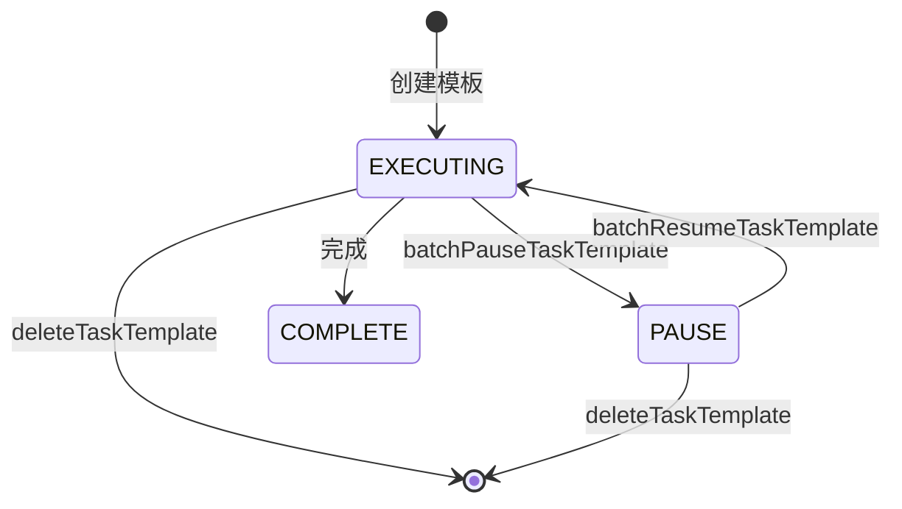
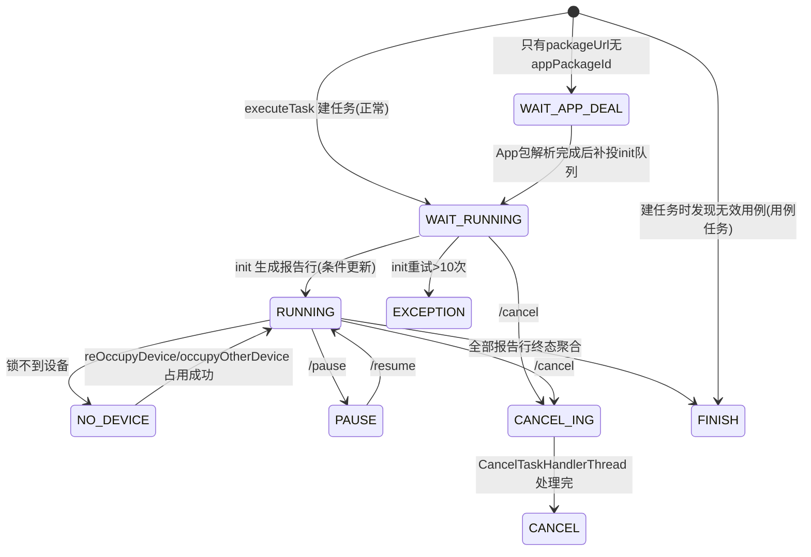

# 横切-任务状态机

> 本文为代码级状态机权威口径（分支 syy.release.z7.8.1.0）。任务级与报告行级是**两套枚举**，字段不同，切勿混用。

## 任务模板状态（TaskTemplateStatusEnum）

模板自身的管理状态，字段 `task_template.task_template_status`：

| 状态值 | 枚举 | 说明 |
|--------|------|------|
| 1 | PAUSE | 暂停中 |
| 2 | EXECUTING | 进行中（正常参与定时调度） |
| 3 | COMPLETE | 已完成 |

> 注意：与直觉相反，**1=暂停、2=进行中**。定时模板注册的 Quartz Job 只对 `EXECUTING(2)` 生效，暂停会 `pauseScheduledJob`，恢复会 `resumeScheduledJob`（若 Job 已不存在则重建）。见 `TaskTemplateQuartzServiceImpl.pauseTaskTemplate/resumeTaskTemplate`。

## 任务模板类型（TaskTemplateTypeEnum）

| 类型值 | 枚举 | 说明 |
|--------|------|------|
| 1 | TEMPLATE | 普通模板（仅手动执行） |
| 2 | CRON | 定时任务模板（挂独立 Quartz Cron Job） |

## 任务级状态机（TaskStatusEnum）

执行记录的运行时状态，字段 `task_execute_record.task_status`（值不连续，无 7、9）：

| 值 | 枚举 | 含义 | 进入/退出 |
|---|---|---|---|
| 0 | WAIT_APP_DEAL | 等待 appUrl 解析 | 只有 packageUrl 无 appPackageId 时建任务即停；App 包解析完成后补投 init 队列转 WAIT_RUNNING |
| 1 | WAIT_RUNNING | 等待执行 | 正常建任务的初始状态 |
| 2 | RUNNING | 执行中 | init 生成报告行成功后条件更新进入 |
| 3 | FINISH | 执行完成 | 终态；全部报告行终态聚合，或建任务时发现无效用例直接置此态 |
| 4 | CANCEL | 已取消 | 终态 |
| 5 | EXCEPTION | 异常 | 终态；init 重试 >10 次进入 |
| 6 | CANCEL_ING | 取消中 | 取消队列异步处理期间 |
| 8 | PAUSE | 暂停中 | 20s 扫描与队列触发均跳过；resume 回 RUNNING |
| 10 | NO_DEVICE | 等待执行，没匹配到设备 | execute 时锁不到设备进入；后续每轮扫描 reOccupyDevice 重试 |

三组状态集合（`TaskStatusEnum.java` 静态块）在条件更新里反复使用：

- `FINISH_EXECUTE_STATUS = {FINISH, CANCEL, EXCEPTION}` — 终态集合；
- `EXECUTING_STATUS = {WAIT_RUNNING, NO_DEVICE, RUNNING}` — 执行中集合；
- `EXECUTING_STATUS_WITH_CANCELING` = 上述三者 + `CANCEL_ING`；
- `getExecutingStatusWithPause()` = `EXECUTING_STATUS` + `PAUSE`。

## 报告行级状态机（TaskExecuteStatusEnum）

单条执行对象（脚本×设备 或 用例×数据行）的状态，字段 `task_execute_record_report.execute_status`（及 `task_execute_record_report_case.execute_status`）：

| 值 | 枚举 | 含义 |
|---|---|---|
| -1 | IDLE | 待执行 |
| 0 | ING | 执行中（下发成功） |
| 1 | PRE_COMPLETE | 预完成（设备侧先报状态、后传结果的第一阶段） |
| 2 | SUCCESS | 执行成功 |
| 3 | FAIL | 执行失败 |
| 4 | TIME_OUT | 超时 |
| 5 | CANCEL | 取消测试 |
| 6 | SKIP | 跳过执行 |
| 7 | CANCEL_ING | 取消中 |

关键流转点：

- 下发成功 → `ING`：`TaskHandlerServiceImpl.afterTaskDistributeSuccess`；
- 设备回调 preComplete → `PRE_COMPLETE`；未匹配设备的行直接 `SKIP`（`TaskExecuteRecordServiceImpl.preComplete`）；
- `resultReport` 只接受 `PRE_COMPLETE` 的行继续走解析/分析；
- 结果分析后按 `resultCategory` 置 `SUCCESS`/`FAIL`（`TaskResultHandlerServiceImpl.taskResultAnalysis`）。

五组状态集合（`TaskExecuteStatusEnum.java`）：

- `FINISH_EXECUTE_STATUS = {SUCCESS, FAIL, CANCEL, SKIP, TIME_OUT}`；
- `EXECUTING_STATUS = {IDLE, ING, CANCEL_ING}`；
- `EXECUTING_STATUS_WITHOUT_CANCEL_ING = {IDLE, ING}`；
- `EXECUTING_STATUS_WITH_PRE_COMPLETE = {IDLE, ING, PRE_COMPLETE, CANCEL_ING}`；
- `EXECUTING_STATUS_WITH_PRE_COMPLETE_NO_CANCEL_ING = {IDLE, ING, PRE_COMPLETE}`。

## 任务来源（TaskSourceTypeEnum）

| 来源值 | 枚举 | 说明 |
|--------|------|------|
| 1 | MANUAL | 手动创建或手动点模板执行（**重测子任务也归为手动**） |
| 2 | TIMER_TASK | 定时任务（手动执行的定时任务也算） |
| 3 | TASK_PLAN | 测试计划来源 |
| 4 | REST_SUMMARY | 重测汇总生成的父记录 |

> 判断逻辑在 `TaskExecuteRecord.getTaskExecuteRecordWithDetail`：`executeRecordTaskId != null` → TASK_PLAN；否则 `taskSource == TIMER_TASK` → TIMER_TASK；其余（含重测）→ MANUAL。`REST_SUMMARY(4)` 仅在 `TaskExecuteRecordServiceImpl.generateTaskExecuteRecordParentAndUpdateOldInfo` 生成重测汇总父记录时写入。

## 用例/脚本结果统计口径

`task_execute_record` 上脚本（`*ScriptTotal`）与用例（`*CaseTotal`）两维度各 6 个计数：

| 统计 | 含义 |
|------|------|
| execute_* | 实际分配到设备执行的（init 时回填 `executeScriptTotal`，用例侧回填 `executeCaseTotal`） |
| success_* | 执行通过 |
| fail_* | 执行失败 |
| skip_* | 条件不满足跳过 |
| cancel_* | 用户取消 |
| timeout_* | 超时 |

计数更新入口：`TaskExecuteRecordReportServiceImpl.dealReportResultByReport` 内通过 `TaskExecuteRecordMapper.addCostTimeAndScriptInfoByCondition` 原子累加；用例侧 `TaskExecuteRecordReportCaseServiceImpl.completeCaseTask` 完成用例维度聚合。有效执行时长由 `TaskExecuteRecordReportServiceImpl.calculateExecuteValidTime`（脚本）与 `calculateExecuteValidTimebyCase`（用例）计算。
