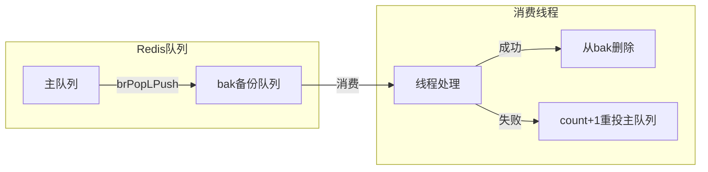
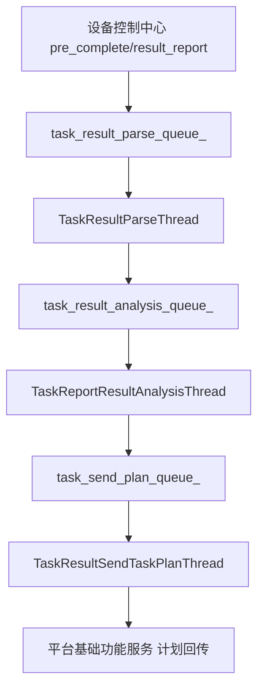

# 横切-后台线程全景

任务管理服务 的后台任务体系由三部分组成：Quartz Job、Redis Consumer 线程、Spring `@Async` 线程池。

## 一、Quartz Job（定时调度）

由 `TaskTemplateSchedulerConfig` 配置，使用**内存 JobStore（RAMJobStore）**——未指定数据库，因此 Quartz 非分布式、容器无法横向扩容。线程池 `org.quartz.threadPool.threadCount` 默认 20。

| Job 类 | 触发方式 | 用途 |
|--------|---------|------|
| `TaskTemplateExecuteJob` | Cron（**每个定时模板独立注册一个 Job**，非扫表） | 到点读 JobDataMap 的 `taskTemplateId`，组装 `TaskExecuteRecordRequestDTO`（`taskSource=TIMER_TASK`）调 `executeTask` 建任务入队 |
| `TaskTemplateExecuteRestartJob` | `InitializingBean`（启动执行一次） | 抢 Redis 锁后分页扫描 `template_type=2 && status=EXECUTING` 模板，逐个 `addTaskTemplateQuartz` 重建 Quartz Job，防重启丢 Job |

### Quartz Listener

| Listener | 用途 |
|----------|------|
| `TaskTemplateJobListener` | Job 执行前后的日志与异常记录 |
| `TaskTemplateSchedulerListener` | 调度器级别事件（Job 添加/删除/暂停） |
| `TaskTemplateTriggerListener` | 触发器触发/错失事件 |

## 二、Redis Consumer 线程（常驻阻塞消费）

所有 Consumer 线程通过 `RedisServiceImpl.brPopLPush` 阻塞式消费 Redis List。消费前先将消息备份到 bak 队列，消费成功后再从 bak 队列删除；异常时 `count+1` 重投主队列。

### 初始化管道

| 线程 | 消费队列 | 职责 |
|------|---------|------|
| `TaskInitThread` | `task_execute_record_init_queue` | 新任务初始化：`TaskHandlerServiceImpl.init` 生成报告行（脚本×设备 / 用例×数据行）与步骤 DAG，状态 `WAIT_RUNNING → RUNNING`；不锁设备 |
| `TaskInitRestartThread` | `task_execute_record_init_bak_queue` | 启动补偿：把遗留消息重投主队列 |

### 执行管道

| 线程 | 消费队列 | 职责 |
|------|---------|------|
| `TaskExecuteThread` | `task_execute_record_exec_queue`（单条信号） | 弹到消息即调 `TaskStartExecuteThread.executeTask()` 触发一次全量扫描（用例任务完成后由 `completeCaseTask` LPUSH 触发立即扫描） |
| `TaskExecuteStartThread` | `task_execute_record_execute_queue_{n}`（分片） | 直投单条 executing_report → `TaskHandlerServiceImpl.execute`；是 preComplete 步骤流转后触发下一轮下发的**主路径** |
| `TaskStartExecuteThread` | 无队列（`@Scheduled(cron="0/20 * * * * ?")`） | 20s **保底扫描** `task_execute_record_executing_report`，锁设备并直推设备控制中心 |

> `TaskExecuteCheckThread` 整个方法体被注释，是**死代码**：当前无周期性 RUNNING 状态巡检，超时/兜底归因依赖设备侧回调与结果回收管道。

### 结果回收管道

| 线程 | 消费队列 | 职责 |
|------|---------|------|
| `TaskResultParseThread` | `task_result_parse_queue_{n}` | 查脚本服务解析状态，`PARSED` 后插分析待办（`TaskResultHandlerServiceImpl.taskResultParse`） |
| `TaskResultParseRestartThread` | `task_result_parse_queue_bak` | 启动补偿 |
| `TaskReportResultAnalysisThread` | `task_result_analysis_queue_{n}` | 解析 summary/log/testCase，映射错误原因，聚合统计（`TaskResultHandlerServiceImpl.taskResultAnalysis`） |
| `TaskReportResultAnalysisRestartThread` | `task_result_analysis_queue_bak` | 启动补偿 |
| `TaskResultSendTaskPlanThread` | `task_send_plan_queue_{n}` | 按 `CallbackTypeStrategyEnum` 7 种策略回传计划（平台基础功能服务） |
| `TaskResultSendTaskPlanRestartThread` | `task_send_plan_queue_bak` | 启动补偿 |

### 取消管道

| 线程 | 消费队列 | 职责 |
|------|---------|------|
| `CancelTaskHandlerThread` | `task_cancel_queue_{n}` | 向设备控制中心发取消指令，更新本地状态 |
| `CancelTaskHandlerRestartJob` | `task_cancel_queue_bak` | 启动补偿（`InitializingBean`） |

### 其他定时/检查线程

| 线程 | 触发方式 | 职责 |
|------|---------|------|
| `TaskExecuteRecordConsumerRestartInit` | `InitializingBean`（启动执行） | 统一启动所有 Consumer 线程；扫描 bak 队列恢复遗留消息 |
| `TaskExecuteRecordReportCaseCheckThread` | `@Scheduled(initialDelay=60s, fixedDelay=300s)` | 检查 `task_execute_record_report_case` 中状态不一致的用例 |
| `TaskTemplateCaseIdStatusThread` | `@Scheduled(cron="10 0/2 * * * ?")` | 每 2 分钟同步模板用例 ID 状态 |

## 三、AsyncConfig 线程池（13 个）

| 线程池 Bean | corePoolSize（max） | 队列 | 用途 |
|------------|-------------|------|------|
| `taskTemplateExecuteJobExecutor` | cpu×2（cpu×2+1） | 100 | Quartz Job 异步执行 |
| `taskExecuteRecordJobExecutor` | cpu×2（cpu×2+1） | 5000 | 执行记录初始化 |
| `cancelTaskExecutor` | taskCancelCount（+1） | ×2 | 取消任务处理（daemon） |
| `reportResultHandlerExecutor` | cpu×2（cpu×2+1） | 10000 | 报告结果处理 |
| `reportResultParseExecutor` | taskResultParseCount（+1） | ×2 | 结果解析（daemon） |
| `taskExecuteRecordExecuteExecutor` | 50（51） | 200 | 执行下发（固定 50 线程，daemon） |
| `taskExecuteRecordTriggerExecuteExecutor` | cpu×2（cpu×2+1） | 200 | 触发执行（daemon） |
| `reportResultAnalysisExecutor` | taskResultAnalysisCount（+1） | 500 | 结果分析（daemon） |
| `reportResultSendTaskPlanExecutor` | taskSendPlanCount（+1） | 200 | 结果回传计划（daemon） |
| `deviceDistributeExecutor` | cpu×2（cpu×2+1） | 10000 | 设备分发（daemon） |
| `taskTemplateCaseStatusCheckExecutor` | 19（20） | 40 | 模板用例状态检查（daemon） |
| `reportExportExecutor` | 4（8） | 50 | 报告导出 |
| `reportEmailExecutor` | 2（4） | 20 | 报告邮件 |

线程数量由 `application.yaml` 中的 `task.*.count` 配置项控制，默认 20。

## 四、启动流程

服务启动时：
1. `RealTaskApplication` 启动 Spring 容器
2. Quartz Scheduler 启动（RAMJobStore）
3. `TaskExecuteRecordConsumerRestartInit.afterPropertiesSet` 执行：启动所有 Consumer 线程
4. 各 RestartThread / RestartJob 的 `afterPropertiesSet` 执行：扫描 bak 队列恢复遗留消息
5. `TaskTemplateExecuteRestartJob.afterPropertiesSet` 执行：重建定时模板的 Quartz Job
6. Consumer 线程进入 `brPopLPush` 阻塞等待
