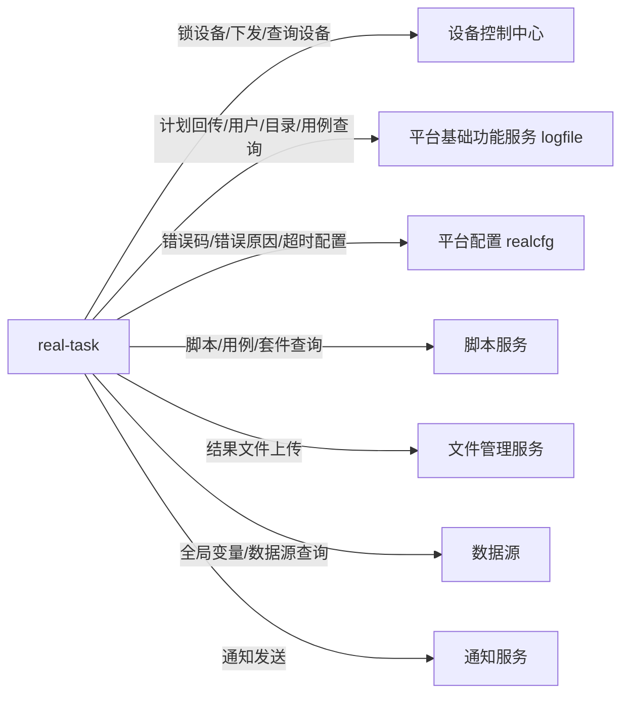

# 横切-模块间通信

任务管理服务 作为用例（CASE）类任务执行中枢，通过 HTTP（WebClient）与多个外部服务通信。设备分配/下发**直推设备控制中心**，不经任务调度服务（real-scheduling），也不经 app/web 处理服务。

## 通信全景图

> `service.api.properties` 中仍配置了 `RealScheduling`、`RealTest` 两个 URL，但 `ApiUrlConfig` 里对应的 `realSchedulingUrl` / `realTestUrl` 字段**在代码中无任何调用点**（死配置）。本服务新链路不依赖任务调度服务与 app 处理服务。

## HTTP 客户端实现

`cn.testin.util.ServiceRemoteApiUtil` — 封装 WebClient + OkHttp：

- **GET/POST/PUT** 同步调用（`.block()`）
- **Multipart** 文件上传/下载
- **V1 协议**：`RemoteV1RequestDTO { op, action, data }` 老接口（`syncPostV1`）
- **V3 协议**：类型化 DTO + `/v3/` 路径（`syncPostV3` / `syncGetV3`）

## 各服务 API 封装

| API 类 | 目标服务 | 调用 URL（`ApiUrlConfig`） |
|--------|---------|------|
| `DeviceServiceApi` | 设备控制中心（real-controlcenter） | `realControlCenterUrl` |
| `ScriptServiceApi` | 脚本服务（script） | `scriptUrl`（脚本/分组/步骤）；**用例查询走 `realLogFileUrl`** |
| `SuiteAppServiceApi` | 脚本服务（suite/app） | `scriptUrl` |
| `PlanServiceApi` | 平台基础功能服务 | `realLogFileUrl` |
| `UserServiceApi` | 平台基础功能服务 | `realLogFileUrl` |
| `DirQuartzApi` | 平台基础功能服务 | `realLogFileUrl` |
| `SystemServiceApi` | 平台配置（real-cfg） | `realCfgUrl`（错误码/错误原因规则）；`getSystemParam` 走 `realLogFileUrl` |
| `ErrorCauseTypeServiceApi` | 平台配置（real-cfg） | `realCfgUrl` |
| `DbCfgApi` / `ProjectStepTimeoutApi` | 平台配置（real-cfg） | `realCfgUrl` |
| `DataSourceApi` | 数据源 | `dataSourceUrl` |
| `FileUploadServiceApi` | 文件管理服务 | `fileUrl` |
| `NoticeManagerApi` | 通知服务 | `noticeManagerUrl` |

## 服务 URL 配置

`src/main/resources/service.api.properties`：

| 属性Key | URL | 对应服务 |
|---------|-----|---------|
| RealCfg | `http://realcfg.api.pro.testin.cn` | 平台配置（real-cfg） |
| ControlCenter | `http://controlcenter.api.pro.testin.cn` | 设备控制中心 |
| Script | `http://script.api.pro.testin.cn` | 脚本服务 |
| File | `http://fileupload.pro.testin.cn/openapi` | 文件管理服务 |
| RealLogfile | `http://logfile.api.pro.testin.cn` | 平台基础功能服务 |
| DataSource | `http://datasource.api.pro.testin.cn/openapi` | 数据源 |
| NoticeManager | `http://notice.api.pro.testin.cn` | 通知服务 |
| RealTest | `http://realtest.api.pro.testin.cn` | app处理服务（**死配置，未使用**） |
| RealScheduling | `http://scheduling.api.pro.testin.cn` | 任务调度服务（**死配置，未使用**） |

## 关键调用方向（以代码为准）

- **设备操作**（锁设备/释放/查已锁设备/下发/停测/查设备）全部走 `DeviceServiceApi` → `realControlCenterUrl`（设备控制中心）：
  - `lockTaskExecuteRecordDevice`（V3 `LOCK_DEVICE_BY_TASK_ID`）、`releaseTaskExecuteRecordDevice`（V3 `UNLOCK_DEVICE_BY_TASK_ID`）、`getLockDeviceByTaskExecuteRecordId`（V3 `GET_LOCK_DEVICE_BY_TASK_ID`）
  - `pushTaskDataToDevice`（V1 `op=Task.distributeTask, action=control`）、`stopTask`（V1，code 10210 = 设备离线视为成功）
- **计划回传**走 `PlanServiceApi.callbackTaskPlan` → `realLogFileUrl`（平台基础功能服务），POST `TASK_PLAN_EXECUTE_RECORD_TASK_CALL_BACK`。

## 调用模式总结

| 模式 | 使用场景 |
|------|---------|
| 同步阻塞 HTTP | 所有跨服务调用（设备匹配/下发、脚本查询、计划回传等） |
| Redis 队列异步 | 任务状态变更后通知其他服务（计划回传经 `task_send_plan_queue_{n}`） |
| 回调被动接收 | 设备控制中心通过 URL 回调通知本服务（`/pre_complete`、`/result_report`） |
