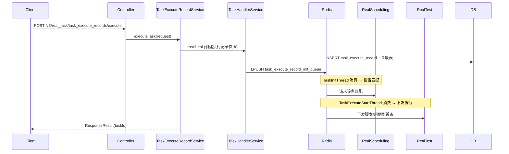

# TaskExecuteRecordController — 执行记录管理与任务调度

> 分支：syy.release.z7.8.1.0
> 源文件：`src/main/java/cn/testin/controller/task/TaskExecuteRecordController.java`
> 类级路由：`/real_task`
> Service 实现：`cn.testin.service.impl.task.TaskExecuteRecordServiceImpl`（3131 行）
> 业务：任务执行记录的核心管理——查询、执行、匹配、取消、恢复、过程报告、结果报告、用例统计。
> 关联后台线程：`TaskInitThread`、`TaskExecuteStartThread`、`TaskExecuteThread`、`CancelTaskHandlerThread`

## 接口列表总表

| # | 方法 | 路径 | 方法名 | 说明 |
|---|------|------|--------|------|
| 1 | POST | `/v3/real_task/task_execute_records` | taskExecuteRecords | 分页查询执行记录列表 |
| 2 | POST | `/v3/real_task/task_execute_records/execute` | executeTask | 执行任务（手动提测） |
| 3 | POST | `/v3/real_task/task_execute_records/execute/{task_execute_record_id}` | executeTaskByExecuteTaskId | 按执行记录ID重新执行 |
| 4 | POST | `/v3/real_task/match` | taskMatch | 任务匹配（设备匹配校验） |
| 5 | POST | `/v3/real_task/recover` | taskRecover | 任务恢复（暂停后恢复） |
| 6 | POST | `/v3/real_task/cancel` | taskCancel | 任务取消 |
| 7 | POST | `/v3/real_task/process_report` | processReport | 任务过程报告上报 |
| 8 | POST | `/v3/real_task/pre_complete` | preComplete | 任务预完成通知 |
| 9 | POST | `/v3/real_task/result_report` | resultReport | 任务结果报告上报 |
| 10 | GET | `/v3/real_task/task_execute_records` | getTaskExecuteRecordDetailById | 查询执行记录详情 |
| 11 | POST | `/v3/real_task/task_execute_record_base` | getTaskExecuteRecordBaseInfos | 批量查询执行记录基础信息 |
| 12 | GET | `/v3/real_task/task_execute_records/case_statistic` | getCaseStatisticView | 用例新增/更新/执行统计 |

---

## 1. POST /v3/real_task/task_execute_records — 查询执行记录

### 入口

`TaskExecuteRecordController.taskExecuteRecords(@RequestBody TaskExecuteRecordConditionRequestDTO request)`

### 请求参数（TaskExecuteRecordConditionRequestDTO，JSON Body）

| 字段 | 类型 | 必填 | 说明 |
|---|---|---|---|
| projectId | Integer | 是 | 项目ID（checkProjectId） |
| eid | Integer | 否 | 企业ID |
| userId | Integer | 否 | 用户ID |
| taskType | Integer | 否 | 任务类型 |
| id | Integer | 否 | 执行记录ID |
| ids | JSONArray | 否 | 执行记录ID列表（Integer） |
| taskTemplateId | Integer | 否 | 关联模板ID |
| taskExecuteId | String | 否 | 任务执行ID（uuid） |
| taskName | String | 否 | 任务名称（模糊搜索） |
| suiteId | Integer | 否 | 应用ID |
| parentId | Integer | 否 | 父节点ID |
| taskStatus | JSONArray | 否 | 任务状态列表（Integer） |
| taskStatuses | JSONArray | 否 | 任务状态列表（Integer） |
| createUserName | String | 否 | 创建人名称 |
| taskSource | Integer | 否 | 任务来源：1=手动，2=定时，3=计划，4=重测 |
| createUserIds | JSONArray | 否 | 创建人ID列表（Integer） |
| taskProcessResult | Integer | 否 | 任务过程结果 |
| startCreateTime | Long | 否 | 创建开始时间 |
| endCreateTime | Long | 否 | 创建结束时间 |
| isLazy | Integer | 否 | 是否懒加载 |
| createStartTime | Date | 否 | 创建开始时间（Date） |
| page | Integer | 否 | 当前页（默认1） |
| pageSize | Integer | 否 | 每页大小（默认10） |

### 响应结构

`ResponseResult<BasePageListResponseDTO<TaskExecuteRecordResponseDTO>>`

**返回参数**

| 字段 | 类型 | 说明 |
|---|---|---|
| code | Integer | 状态码，0 为成功 |
| msg | String | 提示信息 |
| data | Object | 业务数据 |
| data.page | Integer | 当前页 |
| data.pageSize | Integer | 每页大小 |
| data.totalPage | Integer | 总页数 |
| data.totalRow | Long | 总行数 |
| data.list | JSONArray | 执行记录列表（TaskExecuteRecordResponseDTO） |
| data.list[].id | Integer | 执行记录ID |
| data.list[].projectId | Integer | 项目ID |
| data.list[].taskType | Integer | 任务类型 |
| data.list[].suiteId | Integer | 应用ID |
| data.list[].taskName | String | 任务名称 |
| data.list[].taskStatus | Integer | 任务状态 |
| data.list[].taskSource | Integer | 任务来源 |
| data.list[].taskTemplateId | Integer | 关联模板ID（无模板时默认为0） |
| data.list[].createUserId | Integer | 创建用户ID |
| data.list[].updateUserId | Integer | 更新用户ID |
| data.list[].createTime | Long | 创建时间 |
| data.list[].updateTime | Long | 更新时间 |
| data.list[].taskExecuteId | String | 任务执行ID（uuid） |
| data.list[].parentId | Integer | 父节点ID（无父节点时为0） |
| data.list[].next | JSONArray | 重测子节点列表（TaskExecuteRecordResponseDTO） |
| data.list[].scriptTotal | Integer | 脚本总数 |
| data.list[].executeScriptTotal | Integer | 执行脚本总数 |
| data.list[].successScriptTotal | Integer | 成功脚本数 |
| data.list[].failScriptTotal | Integer | 失败脚本数 |
| data.list[].skipScriptTotal | Integer | 跳过脚本数 |
| data.list[].cancelScriptTotal | Integer | 取消脚本数 |
| data.list[].deviceTotal | Integer | 设备总数 |
| data.list[].effectiveExecuteTime | Long | 有效执行时间 |

---

## 2. POST /v3/real_task/task_execute_records/execute — 手动提测

### 入口

`TaskExecuteRecordController.executeTask(@RequestBody @Valid TaskExecuteRecordRequestDTO request)`

### 请求参数（TaskExecuteRecordRequestDTO，JSON Body，@Valid）

| 字段 | 类型 | 必填 | 说明 |
|---|---|---|---|
| projectId | Integer | 是 | 项目ID（@NotNull） |
| userId | Integer | 是 | 创建人（@NotNull） |
| userName | String | 否 | 用户名 |
| eid | Integer | 否 | 企业ID |
| taskName | String | 否 | 任务名称 |
| taskDesc | String | 否 | 任务描述 |
| taskType | Integer | 否 | 任务类型：1=App，3=Web，5=PC，100*=用例驱动 |
| taskTemplateId | Integer | 否 | 关联模板ID（从模板执行时传入） |
| scripts | JSONArray | 否 | 脚本列表（TaskScriptInfoDTO） |
| cases | JSONArray | 否 | 用例列表（CaseInfoDTO） |
| devices | JSONArray | 否 | 设备列表（TaskDeviceInfoDTO） |
| taskDeviceCondition | JSONObject | 否 | 设备筛选条件（TaskDeviceCondition） |
| suiteInfo | JSONObject | 否 | 应用信息（TaskSuiteInfoDTO） |
| dataSource | JSONObject | 否 | 数据源（TaskDataSourceInfoDTO） |
| networks | Integer | 否 | 网络类型 |
| taskNotice | JSONObject | 否 | 通知配置（TaskNoticeDTO） |
| quartzInfo | JSONObject | 否 | 定时任务信息（CronQuartzDTO） |
| execStandard | JSONObject | 否 | 执行标准（TaskExecStandardDTO） |
| executeMethod | Integer | 否 | 执行方式：1=分布式，2=顺序执行 |
| dataDistributeType | Integer | 否 | 数据分发类型 |
| envId | Integer | 否 | 环境ID |
| level | Integer | 否 | 优先级 |
| callbackUrl | String | 否 | 回调地址 |
| additionalInfo | String | 否 | 附加信息 |
| timePeriods | JSONArray | 否 | 执行时间段（TaskReleaseTimePeriodsDTO） |
| timePeriods[].startTime | Long | 否 | 开始时间 |
| timePeriods[].endTime | Long | 否 | 结束时间 |
| timePeriods[].type | Short | 否 | 类型（TaskReleaseTimePeriodsEnum） |
| executeRecordId | Long | 否 | 关联计划执行记录ID |
| executeRecordTaskId | Long | 否 | 关联计划任务ID |
| executeRecordTaskName | String | 否 | 计划任务名称 |
| taskSource | Integer | 否 | 任务来源 |
| retestTaskId | Integer | 否 | 重测原任务ID |
| retestTaskExecuteId | String | 否 | 重测原任务执行ID |
| enableRetestSummary | Integer | 否 | 开启重测生成父节点 |
| retestTaskReportCaseIds | JSONArray | 否 | 重测用例子任务ID列表（Long） |
| condition | JSONObject | 否 | 用例重测条件（TaskExecuteRecordReportCaseRequest） |
| retestReportIds | JSONArray | 否 | 单个执行记录脚本重测报告ID（Long） |
| retestScripts | JSONArray | 否 | 父节点下多个脚本重测数据（TaskExecuteRecordRetestDTO） |
| retestScripts[].taskExecuteRecordId | Integer | 否 | 执行记录ID |
| retestScripts[].retestReportIds | JSONArray | 否 | 重测报告ID列表（Long） |
| retestDevices | JSONObject | 否 | 用例重测设备信息（Map<Integer,TaskDeviceCaseInfoDTO>） |
| onlyRetest | Integer | 否 | 仅重测 |
| retestStatuses | JSONArray | 否 | 脚本重测的重测状态（Integer） |
| enableExecute | Integer | 否 | 是否开启立即执行 |
| checkDevice | Integer | 否 | 检查设备状态：0=不检查，1=检查 |
| sourceTestPlan | Integer | 否 | 来源于测试计划 |
| checkScript | Integer | 否 | 是否检查脚本 |
| updateDeviceType | Integer | 否 | 设备更新类型 |
| updateByDeviceType | Integer | 否 | 用例模板按设备端更新设备标识 |
| dirId | Integer | 否 | 目录ID |

> 其余字段同 `TaskTemplateRequestDTO`（见 TaskTemplateController 新增模板）。

### 响应结构

`ResponseResult<BaseResultResponseDTO>`，`data.result` = 新任务执行记录ID。

**返回参数**

| 字段 | 类型 | 说明 |
|---|---|---|
| code | Integer | 状态码，0 为成功 |
| msg | String | 提示信息 |
| data | Object | 业务数据 |
| data.result | Integer | 新任务执行记录ID |

### 实现意图（核心链路）

手动提测是 任务管理服务 最核心的接口之一。流程如下：



### 调用链

```
TaskExecuteRecordController.executeTask
└─ TaskExecuteRecordServiceImpl.executeTask (@Transactional)
   └─ TaskHandlerServiceImpl.taskDeal
      ├─ transformTaskExecuteRecord (DTO → Entity 快照)
      ├─ taskExecuteRecordMapper.insert
      ├─ taskExecuteRecordDetailMapper.insert
      ├─ taskExecuteRecordScriptMapper.insertBatch
      ├─ taskExecuteRecordDeviceMapper.insertBatch
      ├─ taskExecuteRecordCaseMapper.insertBatch
      └─ RedisServiceImpl.rPush(initQueue, taskExecuteRecordId)
```

### 涉及表

`task_execute_record`, `task_execute_record_detail`, `task_execute_record_script`, `task_execute_record_device`, `task_execute_record_case`, `task_execute_record_notice`, `task_execute_record_time_period`

---

## 3. POST /v3/real_task/task_execute_records/execute/{task_execute_record_id} — 按执行记录ID重新执行

### 入口

`TaskExecuteRecordController.executeTaskByExecuteTaskId(@PathVariable taskExecuteRecordId)`

### 请求参数

| 字段 | 类型 | 必填 | 说明 |
|---|---|---|---|
| task_execute_record_id | Integer | 是 | 执行记录ID（路径变量） |

### 响应结构

`ResponseResult<BaseResultResponseDTO>`，`data.result` = 执行记录ID。

**返回参数**

| 字段 | 类型 | 说明 |
|---|---|---|
| code | Integer | 状态码，0 为成功 |
| msg | String | 提示信息 |
| data | Object | 业务数据 |
| data.result | Integer | 执行记录ID |

基于已有执行记录重新执行（重测场景），重测逻辑由 Service 层处理 `parentId` 关联。

---

## 4. POST /v3/real_task/match — 任务匹配

### 入口

`TaskExecuteRecordController.taskMatch(@RequestBody TaskMatchRequestDTO request)`

### 请求参数（TaskMatchRequestDTO，JSON Body）

| 字段 | 类型 | 必填 | 说明 |
|---|---|---|---|
| ucomId | String | 否 | 上位机ID |
| deviceId | String | 否 | 设备ID |
| deviceType | Integer | 否 | 设备类型（1=App，3=Web，5=PC） |

### 响应结构

`ResponseResult<TaskMatchResponseDTO>`

**返回参数**

| 字段 | 类型 | 说明 |
|---|---|---|
| code | Integer | 状态码，0 为成功 |
| msg | String | 提示信息 |
| data | Object | 业务数据 |
| data.deviceid | String | 设备ID |
| data.userid | Integer | 用户ID |
| data.taskid | String | 任务ID |
| data.testType | Integer | 测试类型 |
| data.subtaskid | String | 子任务ID |
| data.appid | Integer | 应用ID |
| data.appUrl | String | 应用URL |
| data.packageName | String | 包名 |
| data.startPath | String | 启动路径 |
| data.appMd5 | String | 应用MD5 |
| data.appDesc | String | 版本备注 |
| data.eid | Integer | 企业ID |
| data.projectid | Integer | 项目ID |
| data.taskDescr | String | 任务名称 |
| data.createtime | Long | 创建时间 |
| data.taskType | Integer | 任务类型 |
| data.params | JSONObject | 参数（TaskMatchParamDTO） |
| data.params.param | JSONArray | 参数列表（TaskMatchParamDetailDTO） |
| data.params.param[].scriptId | String | 脚本id |
| data.params.param[].key | String | 参数key（JSON字段名 k） |
| data.params.param[].value | String | 参数值（JSON字段名 v） |
| data.params.param[].sourceType | Integer | 来源类型（JSON字段名 st） |
| data.params.param[].isGlobal | Integer | 是否全局 |
| data.params.param[].varSecret | Integer | 变量是否加密 |
| data.params.param[].varParamType | Integer | 变量参数类型 |
| data.params.param[].useDefaultValue | Integer | 是否使用默认值 |
| data.params.param[].type | String | 类型 |
| data.standard | JSONObject | 任务标准（TaskMatchTaskStandardDTO） |
| data.standard.coverInstall | Integer | 执行前卸载安装 |
| data.standard.overwriteInstall | Integer | 执行前覆盖安装 |
| data.standard.safetyInspection | Integer | 安全巡检 |
| data.standard.keepApp | Integer | 执行后是否关闭应用 |
| data.standard.video | Integer | 是否录制视频 |
| data.standard.projectGlobalTimeOut | Long | 项目全局超时 |
| data.standard.androidGlobalControlAccelerated | Integer | 全局智能加速 |
| data.standard.harmonyGlobalControlAccelerated | Integer | 鸿蒙智能加速 |
| data.standard.iOSGlobalControlAccelerated | Integer | iOS智能加速 |
| data.standard.failStepTexts | Integer | 是否返回失败截图文本 |
| data.standard.cleanData | Integer | 执行后清理数据 |
| data.standard.network | String | 网络配置 |
| data.standard.performanceDataCollection | Integer | 是否记录性能数据 |
| data.standard.uninstall | Integer | 执行后不卸载app |
| data.standard.install | Integer | 安装应用 |
| data.standard.startup | Integer | 启动应用 |
| data.standard.logCollection | Integer | 是否记录日志 |
| data.standard.resign | Integer | iOS重签配置 |
| data.standard.unbindApp | Integer | 是否解绑应用 |
| data.dependScripts | JSONObject | 依赖脚本（Map<String,Map<String,TaskMatchScriptDetailDTO>>） |
| data.dependScripts.*.*.scriptUrl | String | 脚本Url |
| data.dependScripts.*.*.scriptId | Integer | 脚本id（JSON字段名 scriptid） |
| data.dependScripts.*.*.scriptMd5 | String | 脚本Md5 |
| data.dependScripts.*.*.scriptType | Integer | 脚本类型 |
| data.dependScripts.*.*.scriptNo | Integer | 脚本No |
| data.dependScripts.*.*.scriptName | String | 脚本名称 |
| data.dependScripts.*.*.params | JSONObject | 参数（TaskMatchParamDTO，结构同 data.params） |
| data.subSubtasks | JSONArray | 子子任务列表（TaskMatchSubSubTaskDTO） |
| data.subSubtasks[].standard | JSONObject | 脚本执行标准（TaskMatchScriptStandardDTO） |
| data.subSubtasks[].standard.terminationOnError | Integer | 脚本出错是否终止后续 |
| data.subSubtasks[].standard.overwriteInstall | Integer | 执行前覆盖安装 |
| data.subSubtasks[].standard.coverInstall | Integer | 执行前卸载安装 |
| data.subSubtasks[].standard.keepApp | Integer | 执行后是否关闭应用 |
| data.subSubtasks[].standard.cleanData | Integer | 执行后清理数据 |
| data.subSubtasks[].scriptUrl | String | 脚本Url |
| data.subSubtasks[].scriptId | Integer | 脚本id（JSON字段名 scriptid） |
| data.subSubtasks[].scriptMd5 | String | 脚本Md5 |
| data.subSubtasks[].scriptType | Integer | 脚本类型 |
| data.subSubtasks[].scriptNo | Integer | 脚本No |
| data.subSubtasks[].orderNum | Integer | 执行顺序 |
| data.subSubtasks[].reportStatus | Integer | 报告状态 |
| data.subSubtasks[].subSubTaskId | String | 子子任务id（JSON字段名 subSubtaskid） |
| data.subSubtasks[].originalOrderNum | Integer | 原始执行顺序 |
| data.subSubtasks[].execStatus | Integer | 执行状态 |
| data.subSubtasks[].params | JSONObject | 参数（TaskMatchParamDTO，结构同 data.params） |
| data.networkConfig | JSONObject | 网络配置（TaskMatchNetworkDTO） |
| data.networkConfig.name | String | 网络名称 |
| data.networkConfig.upLink | JSONObject | 上行链路配置（JSON字段名 uplink，TaskMatchNetworkConfigDTO） |
| data.networkConfig.upLink.loss | Integer | 丢包率 |
| data.networkConfig.upLink.delay | Integer | 延迟 |
| data.networkConfig.upLink.rate | Integer | 带宽 |
| data.networkConfig.upLink.reorder | Integer | 乱序 |
| data.networkConfig.upLink.corruption | Integer | 损坏 |
| data.networkConfig.downLink | JSONObject | 下行链路配置（JSON字段名 downlink，TaskMatchNetworkConfigDTO） |
| data.networkConfig.downLink.loss | Integer | 丢包率 |
| data.networkConfig.downLink.delay | Integer | 延迟 |
| data.networkConfig.downLink.rate | Integer | 带宽 |
| data.networkConfig.downLink.reorder | Integer | 乱序 |
| data.networkConfig.downLink.corruption | Integer | 损坏 |
| data.type | String | 类型 |
| data.version | String | 版本 |
| data.ucomid | String | 上位机ID |
| data.bizCode | Integer | 业务码 |
| data.isBrowser | Integer | 是否浏览器 |
| data.sources | String | 来源 |
| data.osName | String | 系统名称 |
| data.suiteId | Integer | 应用ID |
| data.env | JSONObject | 环境（TaskMatchEnvDTO） |
| data.env.envId | Integer | 环境id |
| data.env.envName | String | 环境名 |
| data.env.hosts | String | hosts 配置 |
| data.env.dbConfig | JSONObject | 数据库配置（Map<String, Integer>） |
| data.resourceType | String | 资源类型 |
| data.recoverScriptInfos | JSONObject | 恢复脚本信息（Map<Integer,ScriptRecoverInfo>） |
| data.recoverScriptInfos.*.associatScriptNo | Integer | 关联的脚本编号 |
| data.recoverScriptInfos.*.scriptNo | Integer | 脚本编号 |
| data.recoverScriptInfos.*.retryNum | Integer | 重试次数 |
| data.recoverScriptInfos.*.scriptUrl | String | 脚本地址 |
| data.recoverScriptInfos.*.scriptMd5 | String | 脚本md5 |
| data.recoverScriptInfos.*.taskExecuteRecordId | Integer | 关联的任务执行记录id |

### 实现意图

执行任务前的预匹配检查，向 [任务调度服务](../../../任务调度服务（real-scheduling）/07-开放接口文档/00-模块索引.md) 查询设备是否可用，返回匹配结果。

---

## 5. POST /v3/real_task/recover — 任务恢复

### 入口

`TaskExecuteRecordController.taskRecover(@RequestBody TaskRecoverRequestDTO request)`

### 请求参数（TaskRecoverRequestDTO，JSON Body）

| 字段 | 类型 | 必填 | 说明 |
|---|---|---|---|
| ucomId | String | 否 | 上位机ID |
| deviceId | String | 否 | 设备ID |
| subTaskId | String | 否 | 子任务ID |
| deviceType | Integer | 否 | 设备类型 |

### 响应结构

`ResponseResult<BaseResultResponseDTO>`，`data.result` = 恢复结果。

**返回参数**

| 字段 | 类型 | 说明 |
|---|---|---|
| code | Integer | 状态码，0 为成功 |
| msg | String | 提示信息 |
| data | Object | 业务数据 |
| data.result | Integer | 恢复结果 |

### 实现意图

暂停的任务恢复执行。更新任务状态并将任务重新入队到执行队列。

---

## 6. POST /v3/real_task/cancel — 任务取消

### 入口

`TaskExecuteRecordController.taskCancel(@RequestBody TaskCancelRequestDTO request)`

### 请求参数（TaskCancelRequestDTO，JSON Body）

| 字段 | 类型 | 必填 | 说明 |
|---|---|---|---|
| userId | Integer | 否 | 用户ID |
| taskIds | JSONArray | 否 | 任务ID列表（Integer） |
| executeTaskIds | JSONArray | 否 | 执行任务ID列表（String） |
| taskExecuteRecordDeviceIds | JSONArray | 否 | 执行记录设备ID列表（Long） |
| taskExecuteRecordReportIds | JSONArray | 否 | 执行记录报告ID列表（Long） |
| deviceId | String | 否 | 设备ID |
| ucomId | String | 否 | 上位机ID |
| deviceType | Integer | 否 | 设备类型 |

### 响应结构

`ResponseResult<BaseResultResponseDTO>`，`data.result` = 取消成功的任务数。

**返回参数**

| 字段 | 类型 | 说明 |
|---|---|---|
| code | Integer | 状态码，0 为成功 |
| msg | String | 提示信息 |
| data | Object | 业务数据 |
| data.result | Integer | 取消成功的任务数 |

### 实现意图

将任务加入 `task_cancel_queue_` Redis 队列，由 `CancelTaskHandlerThread` 异步处理取消逻辑。取消操作会通知 [app处理服务](../../../app处理服务（real-test）/07-开放接口文档/00-模块索引.md) 停止执行。

---

## 7. POST /v3/real_task/process_report — 过程报告

### 入口

`TaskExecuteRecordController.processReport(@RequestBody TaskProcessReportRequestDTO request)`

### 请求参数（TaskProcessReportRequestDTO，JSON Body）

| 字段 | 类型 | 必填 | 说明 |
|---|---|---|---|
| taskId | String | 否 | 任务ID |
| subTaskId | String | 否 | 子任务ID |
| subSubTaskId | String | 否 | 子子任务ID |

### 响应结构

`ResponseResult<BaseResultResponseDTO>`，`data.result` = 处理结果。

**返回参数**

| 字段 | 类型 | 说明 |
|---|---|---|
| code | Integer | 状态码，0 为成功 |
| msg | String | 提示信息 |
| data | Object | 业务数据 |
| data.result | Integer | 处理结果 |

### 实现意图

接收执行过程中的中间报告（如脚本执行到某阶段的中间结果），更新 `task_execute_record_report` 中的过程数据。

---

## 8. POST /v3/real_task/pre_complete — 预完成

### 入口

`TaskExecuteRecordController.preComplete(@RequestBody TaskPreCompleteRequestDTO request)`

### 请求参数（TaskPreCompleteRequestDTO，JSON Body）

| 字段 | 类型 | 必填 | 说明 |
|---|---|---|---|
| taskId | String | 否 | 任务ID |
| subTaskId | String | 否 | 子任务ID |
| subSubTaskId | String | 否 | 子子任务ID |
| inputParams | JSONArray | 否 | 输入参数列表（TaskMatchParamDetailDTO） |
| outputParams | JSONArray | 否 | 输出参数列表（TaskMatchParamDetailDTO） |
| resultCode | Integer | 否 | 结果码 |
| resultMsg | String | 否 | 结果信息 |

### 响应结构

`ResponseResult<BaseResultResponseDTO>`，`data.result` = 处理结果。

**返回参数**

| 字段 | 类型 | 说明 |
|---|---|---|
| code | Integer | 状态码，0 为成功 |
| msg | String | 提示信息 |
| data | Object | 业务数据 |
| data.result | Integer | 处理结果 |

### 实现意图

外部服务通知任务即将完成，任务管理服务 提前进入结果收集准备状态。

---

## 9. POST /v3/real_task/result_report — 结果报告

### 入口

`TaskExecuteRecordController.resultReport(@RequestBody TaskResultReportRequestDTO request)`

### 请求参数（TaskResultReportRequestDTO，JSON Body）

| 字段 | 类型 | 必填 | 说明 |
|---|---|---|---|
| taskId | String | 否 | 任务ID |
| subTaskId | String | 否 | 子任务ID |
| subSubTaskId | String | 否 | 子子任务ID |
| resultType | Integer | 否 | 结果类型：空/1=正常解析，0=存在异常 |
| errorMessage | String | 否 | resultType 为 0 时的错误信息 |
| resultUrl | String | 否 | 结果URL |
| retryNum | Integer | 否 | 重试次数 |

### 响应结构

`ResponseResult<BaseResultResponseDTO>`，`data.result` = 处理结果。

**返回参数**

| 字段 | 类型 | 说明 |
|---|---|---|
| code | Integer | 状态码，0 为成功 |
| msg | String | 提示信息 |
| data | Object | 业务数据 |
| data.result | Integer | 处理结果 |

### 实现意图

接收 [app处理服务](../../../app处理服务（real-test）/07-开放接口文档/00-模块索引.md) 的执行结果回传。结果进入 `task_result_parse_queue_` → `TaskResultParseThread` 解析 → `task_result_analysis_queue_` → `TaskReportResultAnalysisThread` 分析。

---

## 10. GET /v3/real_task/task_execute_records — 执行记录详情

### 入口

`TaskExecuteRecordController.getTaskExecuteRecordDetailById(TaskExecuteRecordDetailRequestDTO request)` — `@UnderlineToCamel`

### 请求参数（Query）

| 字段 | 类型 | 必填 | 说明 |
|---|---|---|---|
| execute_task_id | String | 否 | 任务执行ID（uuid） |
| task_execute_record_id | Integer | 否 | 执行记录ID |
| task_execute_statuses | String | 否 | 任务执行状态 |

### 响应结构

`ResponseResult<TaskExecuteRecordDetailResponseDTO>`，含完整的脚本/设备/用例关联信息。

**返回参数**

| 字段 | 类型 | 说明 |
|---|---|---|
| code | Integer | 状态码，0 为成功 |
| msg | String | 提示信息 |
| data | Object | 业务数据 |
| data.id | Integer | 执行记录ID |
| data.projectId | Integer | 项目ID |
| data.taskName | String | 任务名称 |
| data.taskType | Integer | 任务类型 |
| data.taskSource | Integer | 任务来源：1手动/2定时/3计划/4重测 |
| data.executeRecordTaskId | Long | 测试计划任务ID（taskSource=3 时） |
| data.taskTemplateId | Integer | 关联模板ID（无模板时为0） |
| data.scripts | JSONArray | 脚本列表（TaskScriptDetailDTO） |
| data.scripts[].scriptId | Integer | 脚本ID |
| data.scripts[].name | String | 脚本名称 |
| data.scripts[].tags | JSONArray | 脚本标签（String） |
| data.scripts[].scriptNo | Integer | 脚本编号 |
| data.scripts[].count | Integer | 执行次数 |
| data.scripts[].scriptUrl | String | 脚本URL |
| data.scripts[].scriptMd5 | String | 脚本MD5 |
| data.scripts[].scriptExecuteType | Integer | 脚本执行类型 |
| data.scripts[].scriptExecStandard | JSONObject | 脚本执行标准（ScriptExecStandardDTO） |
| data.cases | JSONArray | 用例列表（CaseInfoDTO） |
| data.cases[].caseId | Integer | 用例ID |
| data.cases[].caseName | String | 用例名称 |
| data.devices | JSONArray | 设备列表（TaskDeviceDetailDTO） |
| data.devices[].deviceId | String | 设备ID |
| data.devices[].deviceName | String | 设备名称 |
| data.devices[].brandName | String | 品牌 |
| data.devices[].systemName | String | 系统名称 |
| data.devices[].deviceType | Integer | 设备类型 |
| data.dataDistributeType | Integer | 数据分发类型 |
| data.executeMethod | Integer | 执行方式 |
| data.execStandard | JSONObject | 执行标准（TaskExecStandardDTO） |
| data.dataSource | JSONObject | 数据源（TaskDataSourceInfoDTO） |
| data.networks | Integer | 网络类型 |
| data.simulateNetworkName | String | 模拟网络名称 |
| data.suiteInfo | JSONObject | 应用信息（TaskSuiteInfoDTO） |
| data.envId | Integer | 环境ID |
| data.taskNotice | JSONObject | 通知配置（TaskNoticeDTO） |
| data.callbackUrl | String | 回调地址 |
| data.additionalInfo | String | 附加信息 |
| data.createUserId | Integer | 创建人ID |
| data.updateUserId | Integer | 更新人ID |
| data.createTime | Long | 创建时间 |
| data.updateTime | Long | 更新时间 |
| data.taskHasSuiteType | JSONArray | 包含的端类型（Integer） |
| data.result | JSONObject | 通知结果（TaskNoticeDTO） |
| data.osNames | JSONArray | 系统类型列表（Integer） |

> 说明：`data.scripts[].scriptExecStandard`（ScriptExecStandardDTO）、`data.execStandard`（TaskExecStandardDTO）、`data.dataSource`（TaskDataSourceInfoDTO）、`data.suiteInfo`（TaskSuiteInfoDTO）、`data.taskNotice` / `data.result`（TaskNoticeDTO）为嵌套对象，字段含义与 TaskTemplateController「新增模板」请求参数中的同名嵌套对象一致。

---

## 11. POST /v3/real_task/task_execute_record_base — 批量基础信息

### 入口

`TaskExecuteRecordController.getTaskExecuteRecordBaseInfos(@RequestBody TaskExecuteRecordBaseRequestDTO request)`

### 请求参数（TaskExecuteRecordBaseRequestDTO，JSON Body）

| 字段 | 类型 | 必填 | 说明 |
|---|---|---|---|
| taskExecuteRecordId | Long | 否 | 执行记录ID |
| taskExecuteRecordIds | JSONArray | 否 | 执行记录ID列表（Long） |

### 响应结构

`ResponseResult<BasePageListResponseDTO<TaskExecuteRecord>>`（仅回填 `data.list`）

**返回参数**

| 字段 | 类型 | 说明 |
|---|---|---|
| code | Integer | 状态码，0 为成功 |
| msg | String | 提示信息 |
| data | Object | 业务数据 |
| data.list | JSONArray | 执行记录实体列表（TaskExecuteRecord） |
| data.list[].id | Integer | 执行记录ID |
| data.list[].projectId | Integer | 项目ID |
| data.list[].taskType | Integer | 任务类型 |
| data.list[].suiteId | Integer | 应用ID |
| data.list[].taskName | String | 任务名称 |
| data.list[].taskStatus | Integer | 任务状态 |
| data.list[].taskSource | Integer | 任务来源 |
| data.list[].executeRecordTaskId | Long | 测试计划任务ID |
| data.list[].executeRecordTaskName | String | 测试计划任务名称 |
| data.list[].executeRecordId | Long | 关联计划执行记录ID |
| data.list[].taskTemplateId | Integer | 关联模板ID |
| data.list[].createUserId | Integer | 创建人ID |
| data.list[].updateUserId | Integer | 更新人ID |
| data.list[].createTime | Date | 创建时间 |
| data.list[].updateTime | Date | 更新时间 |
| data.list[].taskExecuteId | String | 任务执行ID（uuid） |
| data.list[].parentId | Integer | 父节点ID |
| data.list[].scriptTotal | Integer | 脚本总数 |
| data.list[].executeScriptTotal | Integer | 执行脚本总数 |
| data.list[].successScriptTotal | Integer | 成功脚本数 |
| data.list[].failScriptTotal | Integer | 失败脚本数 |
| data.list[].skipScriptTotal | Integer | 跳过脚本数 |
| data.list[].cancelScriptTotal | Integer | 取消脚本数 |
| data.list[].timeoutScriptTotal | Integer | 超时脚本数 |
| data.list[].caseTotal | Integer | 用例总数 |
| data.list[].executeCaseTotal | Integer | 执行用例总数 |
| data.list[].successCaseTotal | Integer | 成功用例数 |
| data.list[].failCaseTotal | Integer | 失败用例数 |
| data.list[].skipCaseTotal | Integer | 跳过用例数 |
| data.list[].cancelCaseTotal | Integer | 取消用例数 |
| data.list[].timeoutCaseTotal | Integer | 超时用例数 |
| data.list[].deviceTotal | Integer | 设备总数 |
| data.list[].effectiveExecuteTime | Long | 有效执行时间 |
| data.list[].errorMessage | String | 错误信息 |
| data.list[].endTime | Date | 结束时间 |

---

## 12. GET /v3/real_task/task_execute_records/case_statistic — 用例统计

### 入口

`TaskExecuteRecordController.getCaseStatisticView(CaseStaticRequestDTO request)` — `@UnderlineToCamel`

### 请求参数（Query）

| 字段 | 类型 | 必填 | 说明 |
|---|---|---|---|
| project_id | Integer | 否 | 项目ID |
| eid | Integer | 否 | 企业ID |
| end_time_start | Long | 否 | 结束时间开始 |
| end_time_end | Long | 否 | 结束时间结束 |

### 响应结构

`ResponseResult<CaseStatisticViewResponse>`，含用例新增/更新/执行统计数据。

**返回参数**

| 字段 | 类型 | 说明 |
|---|---|---|
| code | Integer | 状态码，0 为成功 |
| msg | String | 提示信息 |
| data | Object | 业务数据 |
| data.createCaseTotal | Integer | 创建用例总数 |
| data.updateCaseTotal | Integer | 更新用例总数 |
| data.executeCaseTotal | Integer | 执行用例总数 |
| data.successCaseTotal | Integer | 成功用例总数 |
| data.failCaseTotal | Integer | 失败用例总数 |
| data.skipCaseTotal | Integer | 跳过用例总数 |
| data.cancelCaseTotal | Integer | 取消用例总数 |
| data.caseId | Integer | 用例ID |
| data.caseName | String | 用例名称 |
| data.passRate | Double | 通过率 |

## 涉及表汇总

| 表 | 说明 |
|----|------|
| `task_execute_record` | 执行记录主表 |
| `task_execute_record_detail` | 执行记录详细配置 |
| `task_execute_record_script` | 执行记录-脚本关联 |
| `task_execute_record_device` | 执行记录-设备关联 |
| `task_execute_record_case` | 执行记录-用例关联 |
| `task_execute_record_notice` | 执行记录-通知配置 |
| `task_execute_record_time_period` | 执行时间限制 |
| `task_execute_record_report` | 执行报告主表 |
| `task_execute_record_report_case` | 报告-用例结果 |
| `task_execute_record_report_detail` | 报告详情 |
| `task_execute_record_result_parse` | 结果解析记录 |
| `task_execute_record_result_analysis` | 结果分析记录 |
| `task_execute_record_cancel` | 取消记录 |
| `task_execute_record_send_task_plan` | 计划回传记录 |
| `task_execute_record_device_execute_record` | 设备执行记录 |
| `task_execute_record_executing_report` | 执行中报告 |
| `task_execute_record_standard_detail` | 执行标准详情 |
