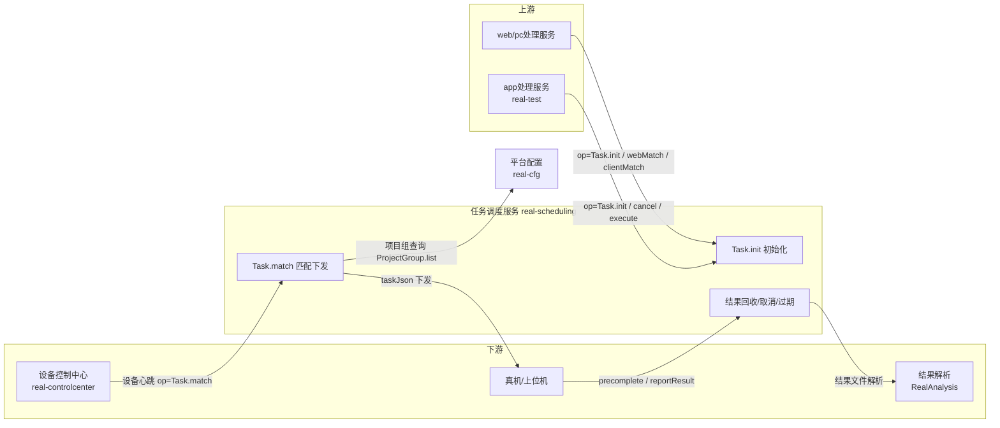

# 产品概述

> **Git 仓库**：`git@git.testin.cn:stock/backend/real.git`（子模块 `real-scheduling/`）　**分支**：`syy.release.z7.8.1.0`

## 这是什么

任务调度服务（real-scheduling）是 Testin 云真机平台**旧链路的调度中枢**：它维护任务的三级数据（任务 → 子任务 → 子子任务），并在设备空闲时把待执行任务匹配下发到具体真机。它解决三件事：

1. **任务初始化入库**：接收 app处理服务 / web/pc处理服务 的任务详情 JSON，按"设备 × 脚本"拆分成子任务（task_info）与子子任务（task_sub_info）批量入库。
2. **设备匹配与下发**：设备心跳触发匹配，把待执行任务与在线设备配对（预匹配 → 领取 → 下发），单任务最多匹配 10 次、超过过期时间自动终止。
3. **任务生命周期收尾**：取消、回收、撤销、过期/超限任务的异常结果生成，保证任务不会永远挂着。

## 与任务管理服务新链路的边界

平台当前存在两条任务调度体系，读代码/排查问题前必须先分清任务走的是哪一条：

| 维度 | 旧链路（本服务） | 新链路（任务管理服务 real-task） |
|---|---|---|
| 入口 | app处理服务 / web/pc处理服务 提测 → `ApiUtil.doPress(action=scheduling, op=Task.init)` | 平台基础功能服务 → `RealTaskV3Api.executeTask` |
| 调度方式 | **设备心跳拉取**：设备上报心跳时调 `Task.match`，由本服务把任务推给它 | **服务端主动扫描**：锁设备后直推 设备控制中心 |
| 核心表 | db_task：task_info / task_sub_info / task_result | task_execute_record 系列表 |
| 定时触发 | app处理服务 内嵌 Quartz（db_quartz），触发后仍走 `Task.init` 进本服务 | 任务管理服务 / 平台基础功能服务 自有 Cron，**不经本服务** |

边界结论：**新链路完全不经过本服务**；只有 app处理服务、web/pc处理服务 的旧入口任务才会进入 task_info 体系。跨模块对比见 [端到端-定时任务](../../跨模块链路/端到端-定时任务.md) 与 [端到端-测试计划执行](../../跨模块链路/端到端-测试计划执行.md)。

## 上下游



- **上游调用方**：app处理服务（APP 任务）、web/pc处理服务（Web/PC 任务）——通过 ApiServlet 的 `action=scheduling` 调用；设备控制中心在设备心跳时回调 `Task.match` / `webMatch` / `clientMatch`。
- **下游**：任务 JSON 由设备（上位机）拉走执行；执行结果经 `reportResult` 回本服务落 task_result 后交结果解析。
- **横向依赖**：平台配置（项目组查询 ProjectGroup.list）、脚本服务（脚本详情）、文件管理服务（结果文件）、app处理服务（账号分配/释放、任务取消状态检查、初始化完成上报）。

## 核心概念

| 概念 | 说明 |
|---|---|
| 任务（task） | 一次提测，taskid 前缀区分端：`tt`=APP、`wt`=Web、其余见代码；对应 task_info_extra 一行 |
| 子任务（task_info） | 按"设备（或设备组）"拆分出的调度单元，**匹配下发的最小单位**，带 exec_status 状态机与 exec_num 匹配计数 |
| 子子任务（task_sub_info） | 子任务下按脚本拆分的执行单元，设备实际逐条执行 |
| TMP 状态 | task_info.exec_status=-1，"任务入库临时数据"：init 入库后的初始状态，等初始化上报成功后才激活为 IDLE(0)；**TMP 残留是本服务最高危的数据故障**（无兜底扫描，见 [异常修复 runbook](../../跨模块链路/横切-服务异常影响与数据修复.md)） |
| exec_num | 子任务被匹配下发的次数，上限 10 次（`task.max.exec.num`），超限任务由扫描线程生成"任务过期/无法执行"结果收尾 |
| expiretime | 任务过期时间戳 = 发布时间 + 提测传入的过期时长（0 表示永不过期，业务上通常配置 7 天） |
| 预匹配（prematch） | 设备心跳来时先把"设备 ↔ 子任务"关系写进 task_exec_relation（2 分钟有效），设备下次心跳再真正领取 |
| vhost | 模块节点编号（`module.node.id`，如 1040001），多节点部署时按节点隔离任务扫描与队列 |
| 多端任务（cross） | 一次提测跨 APP/Web/PC 多端执行，crossTaskid 关联，op 走 `action=cross` |

## 功能地图

```
任务调度服务
├── 任务接入
│   ├── 任务初始化 Task.init        → 入库三链 + INIT 通知
│   ├── 立即执行 Task.execute       → 待调度(-2) → 待下发(0)
│   ├── 取消 Task.cancel / 回收 Task.recover / 撤销 Task.revoke
│   └── 多端任务 cross.Task         → 跨端继续执行
├── 匹配下发
│   ├── APP 匹配   Task.match       → receive 领取 / prematch 预匹配
│   ├── Web 匹配   Task.webMatch
│   ├── PC 匹配    Task.clientMatch
│   └── 指定匹配   Task.matchTask   → 恒生定制，跳过预匹配
├── 执行过程
│   ├── 执行许可 Task.applyForExecution
│   ├── 进度上报 Task.processReport
│   ├── 预完成   Task.precomplete
│   └── 结果上报 Task.reportResult
├── 查询管理
│   ├── Task.list / levelTaskList / modifyLevel / queueDetails
│   └── MVC: /v3/RealScheduling/task|deviceTask|heartBeat
└── 定时调度支撑（Quartz 在 app处理服务 侧，本服务承载触发产物）
    └── quartz_job_info / quartz_job_statement（db_quartz）
```

## 延伸阅读

- [功能总览](功能总览.md) — 功能清单与数据模型要点
- [任务匹配调度实现](../03-实现逻辑/任务匹配调度实现.md) — init/match/receive 代码级链路
- [定时调度实现](../03-实现逻辑/定时调度实现.md) — Quartz 注册/触发/暂停/恢复
- [接口文档索引](../07-开放接口文档/00-模块索引.md) — 全部 op 与 Controller
- [术语表](../06-开发指南/术语表.md)
