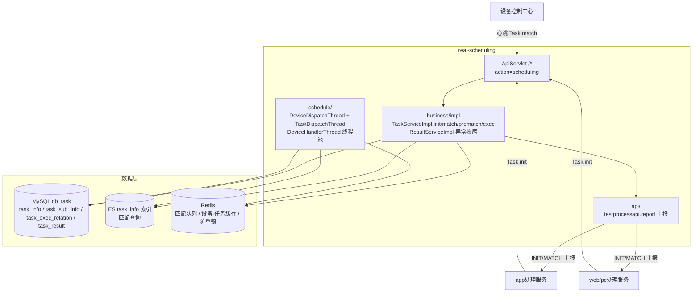

# 总体架构

## 平台定位

任务调度服务（real-scheduling）是 Testin 平台**旧链路的匹配调度引擎**，负责：接收上游（app处理服务/web/pc处理服务）的任务初始化请求 → 拆分子任务入库 → 设备心跳触发匹配 → ES 预匹配 + MySQL 执行关系 → 上位机执行 → 结果回收。它是 real 仓的四个子模块之一，属于旧链路（APP/Web/PC 脚本类任务）的核心调度层。

**关键区别**：新链路（任务管理服务）自主锁设备、主动扫描分发；旧链路（本服务）靠设备心跳触发匹配，匹配模式是"被动等待"。

## 系统上下文

## 核心架构决策

### 1. 两段式心跳匹配（receive → match）

同一次心跳要么领到任务（receive 命中预匹配关系），要么排队等异步匹配（match 进 Redis 队列），不会当场完成匹配。设备至少需要两次心跳才能拿到任务。预匹配关系有效期仅 2 分钟，设备心跳间隔拉长会导致"匹配了但领不到"。

### 2. ES 做匹配查询引擎

APP 任务走 ES 匹配：`TaskMatchFactory` 按匹配类型（DeviceID/Model/Os/All）构造 ES 查询，条件 `execNum < 10`。Web/PC 任务不走 ES，直接 MySQL 查询（`prewebmatch / preClientMatch`）。ES 索引由 `pushByEsQueue` 异步同步。

### 3. 匹配上限 10 次 + 推迟等死策略

`TASK_MAX_EXEC_NUM = 10`（可通过 `task.max.exec.num` 配置）。达到上限时不直接判死，而是 `execNum+1` 并推迟发布时间 10 分钟，交给 `TaskDispatchThread` 扫描收尾——生成 `result_code=EXECERROR` 的 task_result。

### 4. TMP 无兜底扫描

TaskDispatchThread 只扫 CANCEL/过期/超限，不扫 TMP(-1) 状态。init 入库后、INIT 通知发出前宕机会留下永久卡住的 TMP 任务——这是旧链路最脆弱的环节。

### 5. PENDING_SCHEDULING(-2) 待调度激活

需要延迟激活的任务初始状态为 -2，必须等上游调 `Task.execute` → MQ `scriptExecute` → `TaskServiceImpl.execute` 批量改为 IDLE(0)。这一机制用于测试计划中"等待前序任务完成再激活后续"的场景。

## 代码工程一览

| 工程 | 技术栈 | 产物 | 说明 |
|---|---|---|---|
| `real`（大仓） | Java 1.8 / Spring Boot 2.x / MyBatis / ES / Redis | jar（按模块分目录） | real-common 共享，与 app处理服务/设备控制中心/平台配置 同仓 |

## 延伸阅读

- [存储总览](00-存储总览.md)
- [任务匹配调度实现](../03-实现逻辑/任务匹配调度实现.md)
- [专题索引](../04-复杂功能细节/专题-索引.md)
- [跨模块：测试计划执行](../../跨模块链路/端到端-测试计划执行.md)
