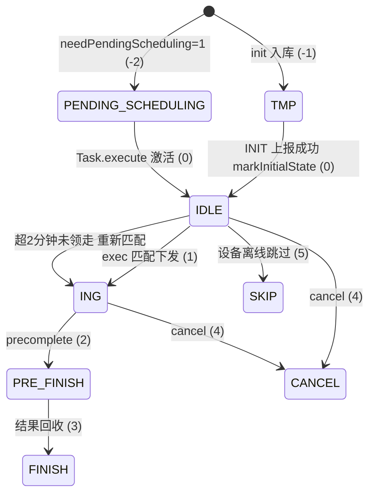
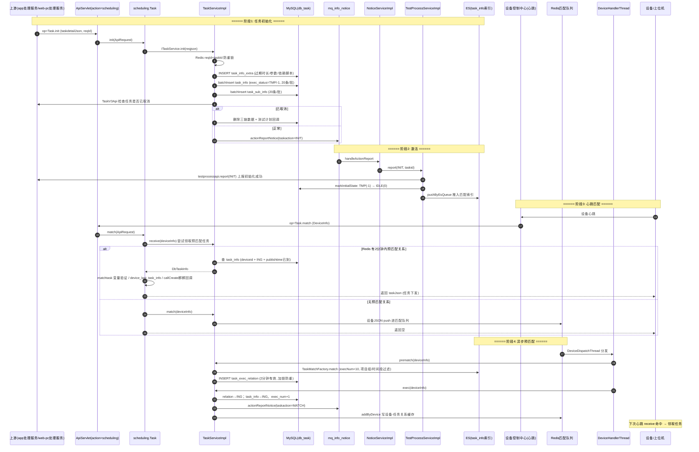

# 任务匹配调度实现

## 概述

本文描述任务调度服务最核心的链路：**Task.init 入库 → 设备心跳触发 match → 预匹配/领取 → 任务下发**，以及配套的匹配上限（10 次）、任务过期、异常任务扫描。整条链路可以概括为 6 步：

1. 上游（app处理服务 / web/pc处理服务）调 `action=scheduling, op=Task.init`，任务详情 JSON 拆分成子任务/子子任务入库，初始状态 **TMP(-1)**；
2. init 发 MQ `actionReport(INIT)` 通知，本服务消费后向 app处理服务 上报初始化成功，然后把 task_info 从 TMP 激活为 **IDLE(0)** 并推入 ES 匹配索引；
3. 设备心跳触发 `op=Task.match`：先走 `receive` 尝试领取已预匹配的任务；
4. 领取不到则 `match` 把设备推进 Redis 匹配队列，后台 `DeviceHandlerThread` 做 **prematch**（ES 查询 + 写 task_exec_relation）和 **exec**（关系转 ING、task_info 置执行中）；
5. 设备下一次心跳 `receive` 命中，拿到任务 JSON 开始执行；
6. `TaskDispatchThread` 持续扫描"取消 / 过期 / 超匹配次数"的子任务，生成异常结果收尾。

关键常量：**匹配次数上限 `TASK_MAX_EXEC_NUM = 10`**（`real-scheduling/src/main/java/cn/testin/util/Config.java`，可被 config.properties 的 `task.max.exec.num` 覆盖）；**预匹配关系 2 分钟有效**（`real-scheduling/src/main/java/cn/testin/business/impl/TaskServiceImpl.java`）；任务过期时间 = publishtime + 上游传入的过期时长（0 表示永不过期，业务通常配置 7 天，`TaskServiceImpl.java`）。

## 子任务状态机

枚举在 `real-scheduling/src/main/java/cn/testin/pojo/task/TaskConfigEnum.java`：



## 全链路时序图



## 逻辑详解

### 1. Task.init —— 任务初始化入库

入口 `cn.testin.service.scheduling.Task#init`（`real-scheduling/src/main/java/cn/testin/service/scheduling/Task.java`），一行转调 `ITaskService.init`（`real-scheduling/src/main/java/cn/testin/business/impl/TaskServiceImpl.java`）。init 内部流程：

1. **防重**：`checkReqIdTaskIdStatus`（`TaskServiceImpl.java`）用 Redis 记 reqId+taskId 状态（0 执行中 / 1 成功 / 2 失败）；执行中先 sleep 30s 再查一次，仍执行中抛 `execFailed`。
2. **解析 taskdetailJson**（`TaskServiceImpl.java`）：level、accountNum、**expiretime（过期时长，0=永不过期）**、standard、params、dependScripts、matchType、needPendingScheduling、content（devices + scripts）等。
3. **幂等检查**（`TaskServiceImpl.java`）：按 reqId 查已有 task_info，若第一条已是非 TMP/非待调度状态，说明初始化已完成，直接抛 success 返回。
4. **组装子任务**：`generateTaskInfo`（`TaskServiceImpl.java`）——**exec_status 一律先置 TMP(-1)**，needPendingScheduling=1 时置 PENDING_SCHEDULING(-2)；`publishtime = (轮次-1)×roundPeriod + now`，**`expiretime = publishtime + 过期时长`**；`uniqueKey = reqid_deviceid_子任务序号` 防重复初始化。
5. **入库**（`TaskServiceImpl.java`）：task_info_extra 不存在则插、非补测则删旧重插、补测合并 recoverScriptInfos；task_info / task_sub_info 按 **20 条/批** batchInsert；有 `taskReleaseTimePeriodsList` 时写下发时间段。
6. **取消检查**（`TaskServiceImpl.java`）：taskid 以 `tt` 开头查 app处理服务 `getTaskUserAdapt`（cancelled=1/2 视为已取消），否则查 `getTaskWebPcTaskDetail`（execStatus=5/7）；已取消则删掉刚入库的三链数据并按需发测试计划回调。
7. **发 INIT 通知**：`actionReportNotice(TaskAction.INIT, ...)`（`TaskServiceImpl.java`）写 mq_info_notice；**任一步失败则按 reqId 删除 task_info/task_sub_info 并抛异常**。

### 2. 激活：TMP(-1) → IDLE(0)

MQ 消费链：MqNoticeDataThread（200ms 轮询，`real-scheduling/src/main/java/cn/testin/config/StartRunner.java`）→ `NoticeServiceImpl.handleActionReport`（`real-scheduling/src/main/java/cn/testin/business/impl/NoticeServiceImpl.java`）→ `TestProcessServiceImpl.report` → `initReport`（`real-scheduling/src/main/java/cn/testin/business/impl/TestProcessServiceImpl.java`）：

- 先把子子任务清单缓存进 Redis（`{subtaskid}_report_info`，供设备执行时按序取脚本）；
- 按端调 `testprocessapi.report / webReport / clientReport(INIT)` 向 app处理服务（或 web/pc处理服务）上报初始化成功；
- 上报成功后 **`itaskinfodao.markInitialState(subtaskid)` 把 exec_status 改为 IDLE(0)**（`TestProcessServiceImpl.java`，SQL 见 `real-scheduling/src/main/java/cn/testin/dao/impl/task/TaskInfoDAOImpl.java`），并 `pushByEsQueue` 同步 ES 匹配索引。

**注意**：PENDING_SCHEDULING(-2) 的任务在 initReport 里只上报不激活（`TestProcessServiceImpl.java`），要等上游调 `Task.execute`（op）→ MQ `scriptExecute` → `NoticeServiceImpl.handleScriptExecute`（`NoticeServiceImpl.java`）→ `TaskServiceImpl.execute`（`TaskServiceImpl.java`）批量改 IDLE。

> TMP 状态没有任何兜底扫描线程：init 入库后、INIT 通知发出前宕机，会留下永久卡住的 TMP 任务。修复 runbook 见 [横切-服务异常影响与数据修复](../../跨模块链路/横切-服务异常影响与数据修复.md)。

### 3. Task.match —— 心跳入口的两段式

入口 `Task#match`（`real-scheduling/src/main/java/cn/testin/service/scheduling/Task.java`），逻辑很短但分叉关键：

```java
DbTaskInfo taskInfo = this.itaskservice.receive(deviceinfo);   // 先领取
if (taskInfo != null) {
    // 变量验证 matchtask；data策略记录 device_last_task_info；callCreate 梆梆回调
    datamap.put(ApiResponse.RES_OBJECT, taskJson);             // 任务随响应下发
} else {
    boolean matchresult = this.itaskservice.match(deviceinfo); // 否则进匹配队列
}
```

- **receive**（`TaskServiceImpl.java`）：查 Redis 设备-任务关系（`idevicetaskrelationdao.getByDevice`），**关系里 matchtime 超过 2 分钟就清掉返回空**；命中则按 `deviceid + exec_status=ING + publishtime 已到` 查 task_info返回任务。
- **match**（`TaskServiceImpl.java`）：把设备 JSON `push` 进 Redis 匹配队列（`schedulingcenter` 库，key 按 vhost 隔离）即返回——真正的匹配是异步的。

Web/PC 对称入口：`webMatch`（`Task.java`，PcInfo）、`clientMatch`（`Task.java`，ClientInfoPojo）。恒生定制 `matchTask`（`Task.java`）按 taskid+设备直接匹配，跳过预匹配。

### 4. 异步预匹配：prematch → exec

`DeviceDispatchThread`（Redis 队列消费，线程池 5/50/500）分发到 `DeviceHandlerThread.run`（`real-scheduling/src/main/java/cn/testin/schedule/device/DeviceHandlerThread.java`）：**先 prematch 再 exec**。

**prematch**（`TaskServiceImpl.java`）：
1. 查"脚本设备聚焦"排除列表（数据驱动下同脚本需分配同设备）；
2. `TaskMatchFactory.match(APP, deviceJson, TASK_MAX_EXEC_NUM, ...)`（`real-scheduling/src/main/java/cn/testin/business/util/TaskMatchFactory.java`）按匹配类型（DeviceID/Model/Os/All）路由到 `AppTaskMatchBy*ServiceImpl`，构造 ES 查询：**`execNum < 10`**（如 `real-scheduling/src/main/java/cn/testin/business/impl/AppTaskMatchByAllServiceImpl.java`）、企业/项目组过滤、下发时间段排除/包含（task_release_time_periods）、设备上一任务断点优先（device_last_task_info）；
3. ES 有结果但 DB 已删的任务顺手清掉（`TaskServiceImpl.java`）；
4. `checkMatchTaskInfos`（`TaskServiceImpl.java`）：按子任务加 LockUtil 锁（模拟网络任务按上位机/全局锁），确认 `task_exec_relation` 无该 subtaskid 记录后 **INSERT，expiretime = now + 2 分钟**——这就是"预匹配"：关系先占住，等设备来领。

**exec**（`TaskServiceImpl.java`）——把预匹配变成"执行中"：
1. 先查该设备 ING 且超 2 分钟未领走的任务，刷新 matchtime 重发 MATCH 通知；
2. 查设备 IDLE/ING 的 exec_relation（优先 ING），按 subtaskid 加锁；
3. 校验：publishtime 未到 → 删关系；**exec_num >= 10 → exec_num+1、发布时间推迟 10 分钟、删关系，等异常扫描收尾**；模拟网络超限 → 删关系；
4. relation 置 ING、expiretime 对齐任务过期时间；task_info 置 ING、写 deviceid/matchtime、**exec_num+1**，同步 ES；
5. 任务需要登录账号时 `AccountApi.match` 向 app处理服务 领账号；
6. 发 `actionReport(MATCH)` 通知 + 写 Redis 设备-任务缓存（`addByDevice`）——下一次心跳 receive 即命中。

### 5. 匹配上限 10 次与任务过期

- **上限常量**：`Config.TASK_MAX_EXEC_NUM = 10`（`real-scheduling/src/main/java/cn/testin/util/Config.java`），配置文件 `task.max.exec.num=10`（`real-scheduling/src/main/resources/config.properties`）。
- 上限在三处生效：ES 匹配查询 `execNum < 10`；exec 时 `execNum >= 10` 拒绝下发（`TaskServiceImpl.java`）；异常判定 `execNum > 10 或 (=10 且 IDLE)` 视为异常（`real-scheduling/src/main/java/cn/testin/business/impl/ResultServiceImpl.java`）。
- **过期**：task_info.expiretime 在 init 时定为 `publishtime + 过期时长`（`TaskServiceImpl.java`），过期时长来自上游 taskdetailJson（0=永不过期，业务通常配置 7 天）。过期判定在 `ResultServiceImpl.handleAbnormalTask`（`ResultServiceImpl.java`）：expiretime < now → 异常，子子任务补生成 `result_code=999999 任务过期` 的 task_result。

### 6. 异常任务扫描：TaskDispatchThread

`TaskDispatchThread.run`（`real-scheduling/src/main/java/cn/testin/schedule/task/TaskDispatchThread.java`）死循环（空闲 sleep 5s）调 `listByPending(vhost, 200)`，SQL 条件（`real-scheduling/src/main/java/cn/testin/dao/impl/task/TaskInfoDAOImpl.java`，按 `oem_cancel_task_report` 开关分两版）：

- exec_status = CANCEL 且 publishtime 已到；
- **expiretime <= now（过期）**；
- **exec_num > 10，或 exec_num = 10 且 IDLE 且 publishtime 已到（匹配耗尽）**；
- 按 vhost 过滤（多节点各扫各的）。

捞到的子任务交给 `TaskHandlerThread` → `ResultServiceImpl.handleAbnormalTask`：校验确属异常（取消/过期/超限）后，给未完成的子子任务逐条生成 task_result（取消 → result_code=CANCEL、过期 → EXPIRE=999999、超限 → EXECERROR），并 `taskinfoRunningNoticeUCom` 通知上位机停止（`ResultServiceImpl.java`）。

另有 `TaskDeviceCheckThread`（@Scheduled 每 5 分钟，`real-scheduling/src/main/java/cn/testin/schedule/task/TaskDeviceCheckThread.java`）：对 `deviceOfflineConfig=2` 的任务，可执行设备全部离线时把子子任务置 SKIP"设备离线"并补结果。

## 关键代码位置表

| 环节 | 类 / 方法 | 位置（相对 real 仓根） |
|---|---|---|
| init 入口 | scheduling.Task.init | real-scheduling/src/main/java/cn/testin/service/scheduling/Task.java |
| init 实现 | TaskServiceImpl.init | real-scheduling/src/main/java/cn/testin/business/impl/TaskServiceImpl.java |
| 过期/发布时间计算 | TaskServiceImpl.generateTaskInfo | real-scheduling/src/main/java/cn/testin/business/impl/TaskServiceImpl.java |
| TMP 初始状态 | 同上 | real-scheduling/src/main/java/cn/testin/business/impl/TaskServiceImpl.java |
| 防重锁 | TaskServiceImpl.checkReqIdTaskIdStatus | real-scheduling/src/main/java/cn/testin/business/impl/TaskServiceImpl.java |
| INIT 通知消费 | NoticeServiceImpl.handleActionReport | real-scheduling/src/main/java/cn/testin/business/impl/NoticeServiceImpl.java |
| 激活 TMP→IDLE | TestProcessServiceImpl.initReport / TaskInfoDAOImpl.markInitialState | real-scheduling/src/main/java/cn/testin/business/impl/TestProcessServiceImpl.java / real-scheduling/src/main/java/cn/testin/dao/impl/task/TaskInfoDAOImpl.java |
| match 入口 | scheduling.Task.match / webMatch / clientMatch | real-scheduling/src/main/java/cn/testin/service/scheduling/Task.java |
| 领取 | TaskServiceImpl.receive | real-scheduling/src/main/java/cn/testin/business/impl/TaskServiceImpl.java |
| 进匹配队列 | TaskServiceImpl.match | real-scheduling/src/main/java/cn/testin/business/impl/TaskServiceImpl.java |
| 预匹配 | TaskServiceImpl.prematch / checkMatchTaskInfos | real-scheduling/src/main/java/cn/testin/business/impl/TaskServiceImpl.java |
| ES 匹配查询 | TaskMatchFactory.match / AppTaskMatchServiceImpl | real-scheduling/src/main/java/cn/testin/business/util/TaskMatchFactory.java / real-scheduling/src/main/java/cn/testin/business/impl/AppTaskMatchServiceImpl.java |
| 预匹配转执行 | TaskServiceImpl.exec | real-scheduling/src/main/java/cn/testin/business/impl/TaskServiceImpl.java |
| 匹配上限常量 | Config.TASK_MAX_EXEC_NUM | real-scheduling/src/main/java/cn/testin/util/Config.java |
| 激活 -2→0 | TaskServiceImpl.execute | real-scheduling/src/main/java/cn/testin/business/impl/TaskServiceImpl.java |
| 异常扫描 | TaskDispatchThread.run / TaskInfoDAOImpl.listByPending | real-scheduling/src/main/java/cn/testin/schedule/task/TaskDispatchThread.java / real-scheduling/src/main/java/cn/testin/dao/impl/task/TaskInfoDAOImpl.java |
| 异常结果生成 | ResultServiceImpl.handleAbnormalTask | real-scheduling/src/main/java/cn/testin/business/impl/ResultServiceImpl.java |
| 设备离线跳过 | TaskDeviceCheckThread | real-scheduling/src/main/java/cn/testin/schedule/task/TaskDeviceCheckThread.java |

## 涉及表

| 表 | 本链路操作 |
|---|---|
| task_info_extra | init INSERT（非补测删旧重插） |
| task_info | init batchInsert；激活 UPDATE exec_status；exec UPDATE ING/exec_num+1；扫描 SELECT |
| task_sub_info | init batchInsert；exec UPDATE ING；异常 UPDATE 结果 |
| task_exec_relation | prematch INSERT（2 分钟有效）；exec UPDATE ING；校验失败 DELETE |
| task_release_time_periods | init INSERT；ES 匹配时按时间段过滤 |
| task_result | 异常任务/设备离线时补生成 |
| device_last_task_info | data 策略任务匹配成功时更新 |
| mq_info_notice | INIT / MATCH / scriptExecute 通知的载体 |

## 注意事项与坑

1. **receive 与 match 是"两段式"**：同一次心跳要么领到任务（receive 命中），要么排队等预匹配（match），不会当场完成匹配。设备至少两次心跳才能拿到任务。
2. **预匹配关系只有 2 分钟**：task_exec_relation.expiretime = now+2min（`TaskServiceImpl.java`），receive 侧超 2 分钟直接清关系。设备心跳间隔异常拉长会导致"匹配了但领不到"。
3. **exec_num 超限是"推迟等死"策略**：exec 时发现 execNum>=10 不直接判死，而是 execNum+1 并把 publishtime 推迟 10 分钟（`TaskServiceImpl.java`），交给 TaskDispatchThread 扫描收尾。
4. **TMP 无兜底扫描**：TaskDispatchThread 只扫 CANCEL/过期/超限，不扫 TMP——TMP 残留只能手工修（见 runbook）。
5. **init 注释与实现不一致**：`TaskServiceImpl.java` 的注释写"批量修改执行状态由临时状态-1改为等待执行1"，但实际激活发生在 MQ 消费端 `markInitialState`，注释是历史遗留。
6. **只有 APP 任务走 ES 匹配**：init 入库时 APP 的 syncMatchQueue 置 OFF（经队列同步 ES），其余资源类型不同步 ES（`TaskServiceImpl.java`）；Web/PC 走 `prewebmatch / preClientMatch` 直接查 MySQL。
7. **vhost 隔离**：匹配队列 key、扫描 SQL、通知都按 `module.node.id`（vhost）隔离，多节点部署时改配置必须保证每个节点 vhost 不同。

## 相关文档

- [定时调度实现](定时调度实现.md) — Quartz 定时触发后同样走 Task.init
- [跨端任务实现](跨端任务实现.md) — cross.Task.execute 跨端继续执行
- [通知处理与心跳实现](通知处理与心跳实现.md) — actionReport 消费链与心跳探活
- [匹配算法专题](../04-复杂功能细节/匹配算法.md) / [任务状态机](../04-复杂功能细节/任务状态机.md) / [异常恢复](../04-复杂功能细节/异常恢复.md) / [并发控制](../04-复杂功能细节/并发控制.md)
- [核心链路-定时任务](../04-复杂功能细节/核心链路-定时任务.md) — 定时任务端到端
- [scheduling.Task 接口文档](../07-开放接口文档/任务调度/scheduling-Task.md) — 逐 op 参数
- [端到端-测试计划执行](../../跨模块链路/端到端-测试计划执行.md) / [横切-服务异常影响与数据修复](../../跨模块链路/横切-服务异常影响与数据修复.md)
