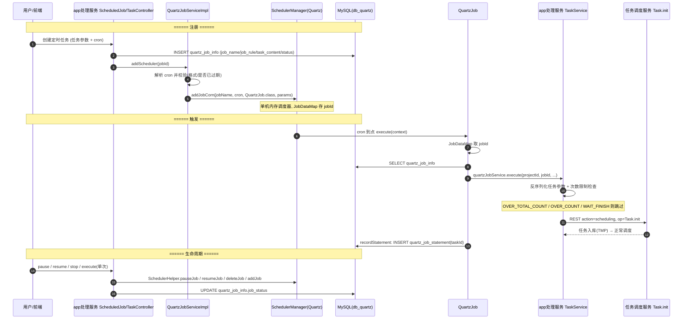

# 定时调度实现

## 概述

本文描述旧链路定时调度的主干：用户在 app处理服务 配置 cron 定时任务 → **Quartz 注册 → 到点触发 → 走 TaskService.taskAdd → `Task.init` 进任务调度服务** → 任务进入正常匹配下发（见 [任务匹配调度实现](任务匹配调度实现.md)）。定时任务的暂停/恢复/停止/重启恢复也在此体系内。

**先建立一个关键认知：Quartz 调度器的代码不在 real-scheduling 里**（本模块源码无 Quartz 依赖），它在 **app处理服务（real-test）** 进程内以单机内存调度器方式运行（`SchedulerManager` 单例）；任务调度服务只是定时触发产物的承接方（`Task.init`）。定时任务数据落 **db_quartz** 的 `quartz_job_info` / `quartz_job_statement` 两表（表结构见 [db_quartz 表索引](../../数据库管理/db_quartz/00-表索引.md)）。端到端细节（阶段拆解、通知链、状态恢复）见 [核心链路-定时任务](../04-复杂功能细节/核心链路-定时任务.md) 与 [核心链路-定时任务调度](../04-复杂功能细节/核心链路-定时任务调度.md)，本文只画主干并给出代码锚点。

## 主干流程

## 逻辑详解

### 1. 注册（addScheduler）

`QuartzJobServiceImpl.addScheduler`（`real-test/src/main/java/cn/testin/business/impl/QuartzJobServiceImpl.java`）：

1. 查 quartz_job_info，job_status 为 delete 直接拒绝；
2. **cron 解析与校验**：按 jobType 分两种来源——`CRON_EXPRESSION` 类型从 `newTaskContent`（TaskAddRequestDTO.quartzInfo.cronQuartz）取 cron，否则把 `job_rule` 反序列化为 `NewQuartzCronExpression`（高级设置用其 `corn` 字段）；**cron 格式非法抛 `CronIncorrectFormat`，`getNextValidTimeAfter(now)` 为空（永不再触发）抛 `ScheduledJobOverdue`**；
3. 先 `deleteScheduleJob` 删同 JobKey 的旧 job（保证重复注册/更新幂等）；
4. JobDataMap 塞 `jobId / jobRule / jobType / customJobRule`，`SchedulerManager.getInstance().addJobCorn(jobName, cron, QuartzJob.class, params)` 注册 CronTrigger；无 cron 的高级设置走 `addJob`；
5. **注册后若 DB 状态是 pause，立即 `SchedulerHelper.pauseJob` 保持暂停态**——这保证"暂停"语义只由 DB 状态驱动，重启恢复时也能还原。

### 2. 触发（QuartzJob.execute）

`QuartzJob.execute`（`real-test/src/main/java/cn/testin/quartz/QuartzJob.java`）：

1. 从 JobDataMap 取 jobId，查 quartz_job_info；
2. 调 `IQuartzJobService.execute(projectId, jobId, ...)`创建真实任务；返回值是特殊常量时跳过收尾：
   - `FINISH_OR_DELETE`：任务已结束/删除；
   - `OVER_TOTAL_COUNT`：总执行次数用完；
   - `OVER_COUNT`：当日次数用完；
   - `WAIT_FINISH`：上次任务未结束，防并发堆积；
3. 拿到 taskId 后 `recordStatement`：**向 quartz_job_statement 插一条流水（jobId + taskId）**——这就是定时任务与真实任务的追溯关系；
4. 真实任务创建走 app处理服务 `TaskService.taskAdd` 全链，最终 REST 调任务调度服务 `Task.init` 入库，后续匹配下发与手动任务完全一致（共享链路，无特殊处理）。

### 3. 暂停 / 恢复 / 停止 / 单次执行

对外入口是 app处理服务 的 ApiServlet service `app.ScheduledJob`（`real-test/src/main/java/cn/testin/service/app/ScheduledJob.java`），各 op 与 Quartz 操作对照：

| op | 方法 | Quartz 操作 | DB 更新 |
|---|---|---|---|
| pause | `ScheduledJob.pause` | `SchedulerHelper.pauseJob(scheduler, jobName)`（`real-test/src/main/java/cn/testin/quartz/SchedulerHelper.java`，按 jobName+`_job_group` 定位 JobKey） | quartz_job_info.job_status=pause |
| resume | `ScheduledJob.resume` | `SchedulerHelper.resumeJob`（`SchedulerHelper.java`）；**不存在则调 `addScheduler` 重建后保持运行** | job_status 恢复正常 |
| stop | `ScheduledJob.stop` | `QuartzJobServiceImpl.quartzJobStop`（`QuartzJobServiceImpl.java`）→ deleteJob | job_status=delete |
| execute（单次） | `ScheduledJob.execute` | 立即触发一次（不走 cron） | 记 quartz_job_statement 流水 |
| batch* | `batchPause/batchResume/batchStop/batchExecute` | 循环单条逻辑 | 同上 |
| maintain | `ScheduledJob.maintain` | 维护操作 | — |

**暂停/恢复的实现要点**：Quartz 的 pauseJob/resumeJob 只影响内存调度器的触发；job_status 落库才是事实来源——重启恢复、重新注册都以 DB 状态为准（见下）。

### 4. 服务重启恢复（QuartzListenerThread）

Quartz 调度器是纯内存态，**进程重启后所有 job/trigger 丢失**，靠 `QuartzListenerThread`（`real-test/src/main/java/cn/testin/quartz/QuartzListenerThread.java`，由 real-test StartRunner 启动）重建：

- 扫描 quartz_job_info 中待调度数据（`queryPendingData`，`QuartzJobServiceImpl.java`），逐条 `addScheduler` 重新注册；
- job_status 为 pause 的，注册后立即 `pauseJob` 还原暂停态（`QuartzListenerThread.java`）；
- **错过的 cron 触发点不会回补**——崩溃窗口内该触发的任务就丢了，需要人工评估是否补跑（见 [横切-服务异常影响与数据修复](../../跨模块链路/横切-服务异常影响与数据修复.md)）。

### 5. 与任务调度服务的衔接

定时触发产物与手动提测完全同链：`TaskService.taskAdd` → REST `action=scheduling, op=Task.init` → 任务调度服务入库 TMP → INIT 通知激活 → 设备心跳匹配下发。app处理服务 侧还会发 `TASK_BIND` 类通知把 jobId 与真实 taskId 绑定追溯（细节见 [核心链路-定时任务](../04-复杂功能细节/核心链路-定时任务.md)）。

**边界提醒**：新链路（任务管理服务 模板 Cron、平台基础功能服务 计划 Cron）不经本体系，四种定时形态对比见 [端到端-定时任务](../../跨模块链路/端到端-定时任务.md)。

## 关键代码位置表

| 环节 | 类 / 方法 | 位置（相对 real 仓根） |
|---|---|---|
| Job 注册 | QuartzJobServiceImpl.addScheduler | real-test/src/main/java/cn/testin/business/impl/QuartzJobServiceImpl.java |
| cron 校验 | 同上（格式/过期） | real-test/src/main/java/cn/testin/business/impl/QuartzJobServiceImpl.java |
| 注册进调度器 | SchedulerManager.addJobCorn | real-test/src/main/java/cn/testin/business/impl/QuartzJobServiceImpl.java |
| 触发执行 | QuartzJob.execute | real-test/src/main/java/cn/testin/quartz/QuartzJob.java |
| 流水记录 | QuartzJob.recordStatement | real-test/src/main/java/cn/testin/quartz/QuartzJob.java |
| 暂停 op | ScheduledJob.pause | real-test/src/main/java/cn/testin/service/app/ScheduledJob.java |
| 恢复 op | ScheduledJob.resume | real-test/src/main/java/cn/testin/service/app/ScheduledJob.java |
| 停止 op | ScheduledJob.stop / QuartzJobServiceImpl.quartzJobStop | real-test/src/main/java/cn/testin/service/app/ScheduledJob.java / real-test/src/main/java/cn/testin/business/impl/QuartzJobServiceImpl.java |
| pause/resume 原语 | SchedulerHelper.pauseJob / resumeJob | real-test/src/main/java/cn/testin/quartz/SchedulerHelper.java |
| 删除调度 job | QuartzJobServiceImpl.deleteScheduleJob | real-test/src/main/java/cn/testin/business/impl/QuartzJobServiceImpl.java |
| 重启恢复 | QuartzListenerThread | real-test/src/main/java/cn/testin/quartz/QuartzListenerThread.java |
| 定时任务管理入口 | app.ScheduledJob（ApiServlet service） | real-test/src/main/java/cn/testin/service/app/ScheduledJob.java |

## 涉及表

| 表 | 作用 |
|---|---|
| quartz_job_info | 定时任务主表：job_name、job_rule（cron 序列化）、task_content/new_task_content（完整任务参数 JSON）、job_status（正常/暂停/删除）、project_id、job_type |
| quartz_job_statement | 触发流水：每次触发插一行（job_id + task_id），用于追溯与执行计数 |
| QRTZ_* | Quartz 标准表（本部署主要用内存态 JobStore，QRTZ_CRON_TRIGGERS 等在启用 JDBC JobStore 时使用） |

## 注意事项与坑

1. **Quartz 在 app处理服务 进程内**，不是任务调度服务 的代码；但定时任务数据归 db_quartz、触发产物归 task_info，排障时三个模块要一起看。
2. **单机内存调度器**：没有集群竞争锁，app处理服务 多节点部署时同一 job 会在每个节点各触发一次——依赖上游保证单节点承载定时调度（或通过 job 数据隔离）。
3. **DB 状态是事实来源**：pause 只改内存会丢，所以注册/恢复后都按 job_status 重放一次 pauseJob（`QuartzJobServiceImpl.java`）。
4. **cron 永不过期校验**：`getNextValidTimeAfter(now)==null` 直接拒绝注册（`QuartzJobServiceImpl.java`），一次性定时任务过期后无法恢复，只能改 job_status。
5. **崩溃窗口的触发点丢失**：内存态调度器无 misfire 回补，见异常修复 runbook。

## 相关文档

- [核心链路-定时任务](../04-复杂功能细节/核心链路-定时任务.md) — 端到端序列图 + 通知链 + 阶段拆解
- [核心链路-定时任务调度](../04-复杂功能细节/核心链路-定时任务调度.md) — Quartz 注册/暂停/恢复细节专题
- [任务匹配调度实现](任务匹配调度实现.md) — 触发产物的后续调度链路
- [db_quartz 表索引](../../数据库管理/db_quartz/00-表索引.md)
- [端到端-定时任务](../../跨模块链路/端到端-定时任务.md) — 四种定时形态对比
