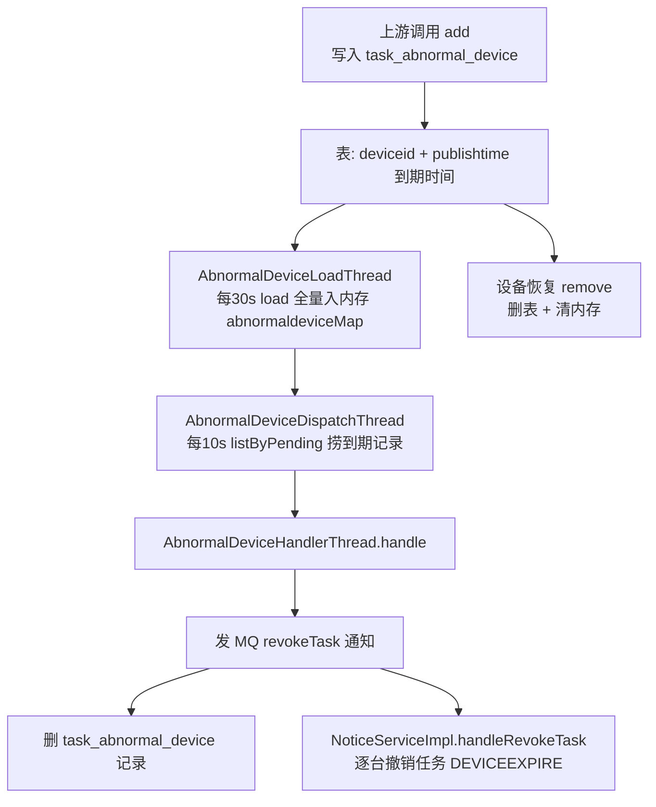

# 异常设备处理实现

## 概述

异常设备处理是"延迟撤销"机制：上游把某台设备标记为异常、并要求延迟一段时间后撤销它上面的任务时，本服务把设备写进 `task_abnormal_device` 表（带 `publishtime` 到期时间），到点后由后台线程触发撤销通知，逐个回收该设备上的任务。这套机制让"设备异常 → 任务撤销"不是立刻发生，而是给设备一个缓冲窗口。

关键点：`task_abnormal_device` 只是**等待队列**，真正的撤销动作复用 `revokeTask` 通知链（见 [通知处理与心跳实现](通知处理与心跳实现.md)）。

## 数据流转

## 逻辑详解

### 1. 写表 add

`AbnormalDeviceServiceImpl.add`（`real-scheduling/src/main/java/cn/testin/business/impl/AbnormalDeviceServiceImpl.java`）：

- 校验 deviceid 非空、`publishtime` 非空且晚于当前时间（即延迟到期时间）、vhost 非空；content 缺省 `{}`；
- 幂等：同 deviceid 已存在则直接返回 true，不重复插；
- 插入 `task_abnormal_device`。

### 2. 内存加载 load

`AbnormalDeviceLoadThread.run`（`real-scheduling/src/main/java/cn/testin/schedule/device/AbnormalDeviceLoadThread.java`，由 StartRunner 每 30s 调度）调 `AbnormalDeviceServiceImpl.load`：分页（pageSize=100）把 `task_abnormal_device` 全量读入静态 `abnormaldeviceMap`（`deviceid -> publishtime`），供 `remove` 快速判断设备是否在异常名单内。

### 3. 到期分发 handle

`AbnormalDeviceDispatchThread.run`（`real-scheduling/src/main/java/cn/testin/schedule/device/AbnormalDeviceDispatchThread.java`，线程池 1/10/500）死循环：`listByPending(vhost, 0, 200)` 捞到期记录，用 `processmap`（`deviceid -> 处理中过期时间`，30 分钟）去重后交 `AbnormalDeviceHandlerThread` 执行。

`AbnormalDeviceHandlerThread.run` → `AbnormalDeviceServiceImpl.handle`：

- 从表里再查一次该设备，不存在则直接返回 true；
- 构造 `revokeTask` 通知（content 带 deviceid + ucomid），`publishtime = now + delaytime`、`expiretime = now + validPeriod`；
- 同步调 `inoticeservice.add` 入库 mq_info_notice；成功后**删除 task_abnormal_device 记录并清内存**。

### 4. 设备恢复 remove

入口 `cn.testin.service.scheduling.AbnormalDevice#remove`（`real-scheduling/src/main/java/cn/testin/service/scheduling/AbnormalDevice.java`，ApiServlet `action=scheduling, op=AbnormalDevice.remove`）→ `AbnormalDeviceServiceImpl.remove`：仅当 `abnormaldeviceMap` 里有该 deviceid 时才 `delete` 表记录 + 清内存（防止设备恢复后仍被延迟撤销）。

### 5. 撤销动作复用 revokeTask 链

`NoticeServiceImpl.handleRevokeTask`（`real-scheduling/src/main/java/cn/testin/business/impl/NoticeServiceImpl.java`）按 `deviceid/ucomid/pcId` 定位设备（`ucomid==deviceid` 判定为 Web；否则 deviceid 为 APP、pcId 为 PC），对状态在 `IDLE/ING/PRE_FINISH/PENDING_SCHEDULING` 的任务分页（50/页）逐台调 `ITaskService.cancel(..., ResultCode.DEVICEEXPIRE, ...)`，把设备异常/过期的任务收尾。

## 涉及表

| 表 | 本链路操作 |
|---|---|
| task_abnormal_device | add INSERT（publishtime 到期时间）；remove/handle DELETE |
| mq_info_notice | handle 发 revokeTask 通知 |
| task_info / task_sub_info | handleRevokeTask 里 cancel 收尾 |

## 关键代码位置表

| 环节 | 类 / 方法 | 位置（相对 real 仓根） |
|---|---|---|
| 写异常设备 | AbnormalDeviceServiceImpl.add | real-scheduling/src/main/java/cn/testin/business/impl/AbnormalDeviceServiceImpl.java |
| 内存加载 | AbnormalDeviceServiceImpl.load | 同上 |
| 到期处理 | AbnormalDeviceServiceImpl.handle | 同上 |
| 恢复移除 | AbnormalDeviceServiceImpl.remove / scheduling.AbnormalDevice.remove | 同上 / real-scheduling/src/main/java/cn/testin/service/scheduling/AbnormalDevice.java |
| 加载线程 | AbnormalDeviceLoadThread | real-scheduling/src/main/java/cn/testin/schedule/device/AbnormalDeviceLoadThread.java |
| 分发线程 | AbnormalDeviceDispatchThread | real-scheduling/src/main/java/cn/testin/schedule/device/AbnormalDeviceDispatchThread.java |
| 处理线程 | AbnormalDeviceHandlerThread | real-scheduling/src/main/java/cn/testin/schedule/device/AbnormalDeviceHandlerThread.java |
| 撤销动作 | NoticeServiceImpl.handleRevokeTask | real-scheduling/src/main/java/cn/testin/business/impl/NoticeServiceImpl.java |

## 注意事项与坑

1. **remove 依赖内存 map**：`remove` 只在 `abnormaldeviceMap` 命中时才删表——若服务刚重启、`load`（30s 周期）还没跑，`abnormaldeviceMap` 为空，此时 remove 会"假成功"（返回 true 但不删表）。重启后 30s 内设备恢复移除可能失效。
2. **handle 幂等**：先 `get` 再处理，处理中再次被捞到（processmap 未命中时）不会重复发通知；发通知成功才删表，失败会留到下一轮重试。
3. **撤销是异步的**：`add` 只写表，真正撤销要等 `AbnormalDeviceDispatchThread` 10s 轮询 + MQ 通知消费，端到端有分钟级延迟。

## 相关文档

- [scheduling.AbnormalDevice 接口文档](../07-开放接口文档/任务调度/scheduling-AbnormalDevice.md)
- [通知处理与心跳实现](通知处理与心跳实现.md) — revokeTask 通知消费
- [异常恢复专题](../04-复杂功能细节/异常恢复.md) — 各类异常收尾全景
