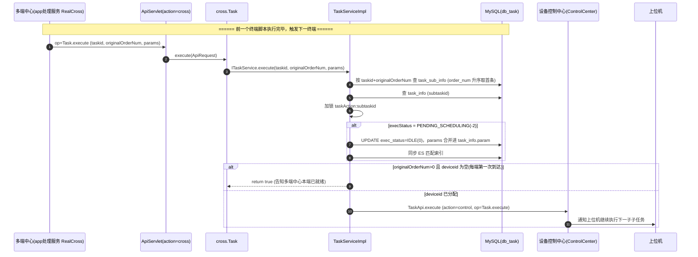

# 跨端任务实现

## 概述

跨端任务（多端任务）指一次提测跨越 APP / Web / PC 多个终端协同执行，各端子任务用 `crossTaskid` 关联，靠 `task_sub_info.originalOrderNum` 编排"先哪端、后哪端"。任务调度服务 提供两个方向的代码：**继续执行入口**（`cross.Task.execute`，前一个终端跑完触发下一个终端）与**结果回传**（`NoticeServiceImpl.handleCrossReport`，本端执行结果上报给多端中心）。

跨端任务的执行方式由 `task_info.execStandard` 区分（`TaskConfigEnum.ExecStandard`，`real-scheduling/src/main/java/cn/testin/pojo/task/TaskConfigEnum.java`）：`retention`（始终保持）、`replace`（可更换设备）。多端中心（app处理服务 侧，`RealCross` 前缀）负责编排与状态汇总，本服务只承担"激活下一端子任务 + 通知上位机继续执行"与"回传本端结果"。

## 主干流程

## 逻辑详解

### 1. 继续执行入口 cross.Task.execute

入口 `cn.testin.service.cross.Task#execute`（`real-scheduling/src/main/java/cn/testin/service/cross/Task.java`，extends GenericBaseService，走 ApiServlet `action=cross`），入参校验后转调 `ITaskService.execute(taskid, originalOrderNum, params)`：

- `taskid` 必填，为空返回 `paraInvalid`；
- `originalOrderNum` 必填，定位要激活的下一组子子任务；
- `params` 为前一个终端执行产出的全局参数，透传给下一终端。

### 2. 激活 + 继续执行 TaskServiceImpl.execute

`cn.testin.business.impl.TaskServiceImpl#execute`（`real-scheduling/src/main/java/cn/testin/business/impl/TaskServiceImpl.java`）：

1. 按 `taskid + originalOrderNum` 查 `task_sub_info`（`itasksubinfodao.list`，`order_num` 升序取首条）；查不到或 `task_info` 为空抛 `paraInvalid`。
2. 对 `taskAction:subtaskid` 加 `LockUtil` 锁（防并发重复激活）。
3. 若 `execStatus == PENDING_SCHEDULING(-2)`：置 `IDLE(0)`；若 `task_info.param` 为空且入参 `params` 非空，则把参数包成 `{"param": params}` 写入 `task_info.param`（这就是跨端参数合并点）；同步更新 ES 匹配索引（`iestaskinfodao.update`）与 MySQL（`itaskinfodao.update`）。
4. `originalOrderNum > 0` 时：
   - **`task_info.deviceid` 为空** → 直接返回 `true`。含义：每端第一次走到这里时设备还没分配，先告知多端中心"本端已就绪"，等上位机 `applyForExecution` 时再真正执行。
   - **`deviceid` 已分配** → 组装 deviceId（Web 端拼 `deviceid + "_" + browserType + "_" + browserVersion`，含 `@` 判定为 Web），调 `TaskApi.execute` 通知设备控制中心继续执行。
5. `TaskApi.execute`（`real-scheduling/src/main/java/cn/testin/api/controlcenter/control/TaskApi.java`）以 `action=control, op=Task.execute` 打到 `ControlCenter` 前缀（设备控制中心），由控制中心通知上位机执行指定子子任务；返回 `10210`（设备离线）视为成功。

### 3. 结果回传 handleCrossReport

本端某个脚本执行结束（或出错）后，通过 MQ `crossReport` 通知回传多端中心。`NoticeServiceImpl.handleCrossReport`（`real-scheduling/src/main/java/cn/testin/business/impl/NoticeServiceImpl.java`）解析 content（taskid/crossTaskid/subtaskid/subsubtaskid/continueOnError/originalOrderNum/errorCode/errorMsg/param/runInfo），按 `continueOnError` 分派：

- `continueOnError==0 && errorCode!=0`：上报错误结果（`NoticeReportApi.report(..., 1, errorMsg)`），并把对应 `task_sub_info.reportStatus` 置 `reported(1)`（`CrossReportStatus`）；
- `continueOnError==0 && errorCode==0`：上报成功结果（res=0，msg=param）；
- `continueOnError==1`：忽略错误继续上报（res=0）。

`NoticeReportApi.report`（`real-scheduling/src/main/java/cn/testin/api/cross/NoticeReportApi.java`）以 `action=task, op=TaskNotice.report` 打到 `RealCross` 前缀（app处理服务 多端中心）。

## 涉及表

| 表 | 本链路操作 |
|---|---|
| task_sub_info | SELECT（taskid+originalOrderNum）；UPDATE reportStatus（跨端结果上报） |
| task_info | SELECT（subtaskid）；UPDATE exec_status(-2→0) + param（跨端参数合并） |
| mq_info_notice | crossReport 通知载体 |

## 关键代码位置表

| 环节 | 类 / 方法 | 位置（相对 real 仓根） |
|---|---|---|
| 跨端继续执行入口 | cross.Task.execute | real-scheduling/src/main/java/cn/testin/service/cross/Task.java |
| 激活+继续执行 | TaskServiceImpl.execute | real-scheduling/src/main/java/cn/testin/business/impl/TaskServiceImpl.java |
| 通知上位机执行 | controlcenter.control.TaskApi.execute | real-scheduling/src/main/java/cn/testin/api/controlcenter/control/TaskApi.java |
| 跨端结果回传 | NoticeServiceImpl.handleCrossReport | real-scheduling/src/main/java/cn/testin/business/impl/NoticeServiceImpl.java |
| 上报多端中心 | cross.NoticeReportApi.report | real-scheduling/src/main/java/cn/testin/api/cross/NoticeReportApi.java |

## 注意事项与坑

1. **跨端参数合并不是写 `crossParams` 字段**：代码实际把参数合并进 `task_info.param`（`TaskServiceImpl.execute`），`task_sub_info` 上并无 crossParams 列，阅读旧文档时注意区分。
2. **"每端第一次返回 true"是幂等约定**：`deviceid` 为空时直接返回成功、不通知控制中心，真正执行延迟到上位机 `applyForExecution`——因此跨端任务的第二端不会在 `cross.Task.execute` 时立刻开跑。
3. **Web 端 deviceId 拼接规则**：`deviceid + "_" + browserType + "_" + browserVersion`（`TaskServiceImpl.execute`），排查跨端 Web 段"通知不到上位机"时先核对这串拼接值。

## 相关文档

- [cross.Task 接口文档](../07-开放接口文档/任务调度/cross-Task.md)
- [任务匹配调度实现](任务匹配调度实现.md) — 单端任务的 init/match 链路
- [通知处理与心跳实现](通知处理与心跳实现.md) — crossReport 通知的消费框架
