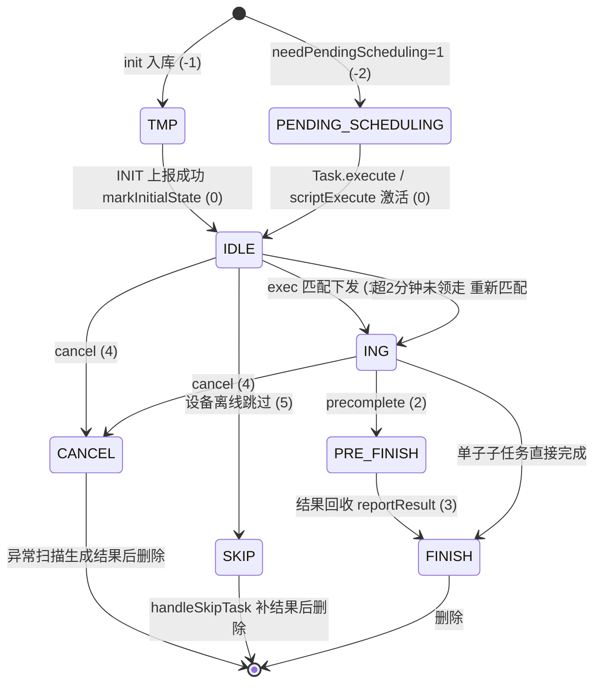

# 任务状态机

> `task_info.exec_status` 是任务调度服务的核心状态机，驱动"入库 → 激活 → 匹配 → 执行 → 完成"以及取消/跳过等旁路。枚举定义在 `TaskConfigEnum.TaskExecStatus`（`real-scheduling/src/main/java/cn/testin/pojo/task/TaskConfigEnum.java`）。

## 状态枚举

| 值 | 枚举 | 含义 | 进入点 | 退出点 |
|---|---|---|---|---|
| -2 | PENDING_SCHEDULING | 待调度执行 | init 时 `needPendingScheduling=1` | `Task.execute` 激活 |
| -1 | TMP | 入库临时数据 | init 批量入库初始值 | INIT 上报成功 `markInitialState` |
| 0 | IDLE | 待执行 | 激活(-2/-1→0) | `exec` 匹配下发 |
| 1 | ING | 执行中 | `exec` 下发 | 脚本预完成/完成 |
| 2 | PRE_FINISH | 预完成 | `precomplete` | 结果回收 |
| 3 | FINISH | 执行完成 | 全部子子任务回收 | 终态 |
| 4 | CANCEL | 取消 | `cancel` | 异常扫描收尾 |
| 5 | SKIP | 跳过执行 | 设备离线跳过 | 补结果收尾 |

## 状态迁移图

## 状态与结果码的对应

异常状态（CANCEL/过期/超限）由 `ResultServiceImpl.handleAbnormalTask`（`real-scheduling/src/main/java/cn/testin/business/impl/ResultServiceImpl.java`）收尾，`task_result.result_code` 用 `TaskConfigEnum.ResultCode`：

| 触发条件 | 结果码 | 值 |
|---|---|---|
| 用户取消（无 errorCode） | CANCEL | 888888 |
| 带 errorCode 的取消 | 对应 ResultCode（如 DEVICEEXPIRE） | — |
| 过期 expiretime < now | EXPIRE | 999999 |
| 匹配次数超限（APP） | EXECERROR | 666666 |
| 匹配次数超限（Web/PC） | WEBEXECERROR | 666667 |
| 匹配次数超限且设备有异常日志 | DEVICEEXCEPTION | 999997 |
| 设备离线跳过 | SKIP | 444444 |

## 状态机的几个关键事实

1. **TMP 无兜底**：`TaskDispatchThread` 只扫 CANCEL/过期/超限，不扫 TMP——init 入库后、INIT 通知发出前宕机，会留下永久卡住的 TMP（见 [异常恢复](异常恢复.md)）。
2. **PENDING_SCHEDULING 只在 initReport 上报、不激活**：要等上游 `Task.execute` → `scriptExecute` 通知才批量改 IDLE。
3. **ING 与 IDLE 都可被 ES 检索到**：ING + execDevice=本设备 是"断点续跑"的匹配条件。
4. **子任务状态驱动子子任务**：`handleAbnormalTask` 只处理未完成的子子任务（跳过 FINISH），防止覆盖已完成结果。

## 相关文档

- [任务匹配调度实现](../03-实现逻辑/任务匹配调度实现.md) — 状态迁移的代码位置
- [异常恢复](异常恢复.md) — CANCEL/SKIP/过期收尾
- [并发控制](并发控制.md) — 状态变更的加锁
