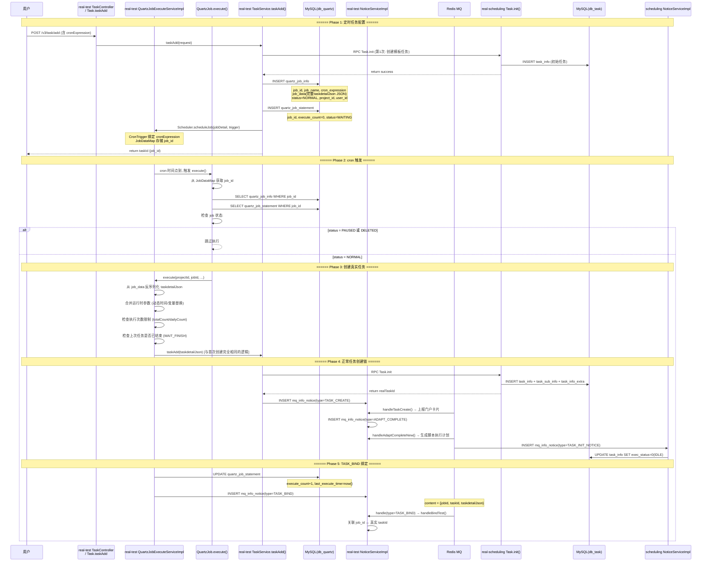

# 核心链路-定时任务

> 用户在 app处理服务 配置定时任务(cron 表达式) → Quartz Scheduler 到点触发 → QuartzJob.execute() → QuartzJobExecuteServiceImpl 组装任务参数 → TaskService.taskAdd() 创建真实任务 → scheduling Task.init 初始化 → NoticeServiceImpl 通知链 (TASK_CREATE → ADAPT_COMPLETE → TASK_BIND) → 定时任务-execute_count+1 → 任务进入正常调度

## 端到端序列图



## 阶段拆解

### Phase 1: 定时任务配置

```
POST /v3/task/add (taskdetailJson 含 cronExpression)
  → TaskController.taskAdd(TaskAddRequestDTO)
    → TaskService.taskAdd(request)
      → 若有 cronExpression (定时任务模式):
        1. 先创建模板任务:
           → scheduling Task.init → 入库初始模板
        2. 注册 Quartz Job:
           → QuartzJobServiceImpl.buildJobDetail()
             → JobDataMap 存储 taskdetailJson (序列化)
             → CronTrigger 绑定 cronExpression
           → Scheduler.scheduleJob(jobDetail, trigger)
        3. 记录 DB:
           → INSERT quartz_job_info:
               job_id, job_name, job_group
               cron_expression, job_data (完整JSON)
               status (NORMAL/PAUSED)
               project_id, user_id
           → INSERT quartz_job_statement:
               job_id, execute_count=0, status=WAITING
```

| 表 | 关键字段 | 说明 |
|------|------|------|
| quartz_job_info | job_data | 完整的 taskdetailJson, 触发时反序列化 |
| quartz_job_info | cron_expression | cron 表达式, 如 "0 0 9 * * ?" |
| quartz_job_info | status | NORMAL/PAUSED/DELETED |
| quartz_job_statement | execute_count | 累计执行次数 |
| quartz_job_statement | last_execute_time | 上次执行时间 |
| QRTZ_CRON_TRIGGERS | cron_expression | Quartz 标准表 |

### Phase 2-3: cron 触发与任务创建

```
Quartz Scheduler cron 到点 → QuartzJob.execute(JobExecutionContext)
  → 从 JobDataMap 获取 job_id
  → SELECT quartz_job_info WHERE job_id = xxx
  → SELECT quartz_job_statement WHERE job_id = xxx

  状态检查:
    PAUSED → 跳过 (return)
    DELETED → 跳过 (return)

  → QuartzJobExecuteServiceImpl.execute(projectId, jobId, ...)
    → 反序列化 job_data → taskdetailJson
    → 运行时参数处理:
        - 动态时间替换 (占位符 → now())
        - 变量值解析
    → 执行次数限制检查:
        - totalCount 超限 → return OVER_TOTAL_COUNT
        - dailyCount 超限 → return OVER_COUNT
        - 上次任务未结束 → return WAIT_FINISH
    → TaskService.taskAdd(taskdetailJson)
      → 与手动创建完全相同的链路!
```

### Phase 4: 正常任务创建链 (与手动创建共享)

```
TaskService.taskAdd(taskdetailJson)
  → scheduling Task.init → 入库三链
  → INSERT mq_info_notice(TASK_CREATE)
  → NoticeServiceImpl.handleTaskCreate()
  → INSERT mq_info_notice(ADAPT_COMPLETE)
  → NoticeServiceImpl.handleAdaptCompleteNew()
  → INSERT mq_info_notice(TASK_INIT_NOTICE)
  → scheduling NoticeServiceImpl.handleTaskInitNotice()
  → UPDATE task_info SET exec_status=0(IDLE)
```

### Phase 5: TASK_BIND 绑定

```
任务创建成功后:
  → UPDATE quartz_job_statement:
      execute_count = execute_count + 1
      last_execute_time = now()

  → INSERT mq_info_notice (type=TASK_BIND)
      content = { jobId, taskId, taskdetailJson }

  → NoticeServiceImpl.handleBindTest():
      关联 quartz_job_info ↔ 真实 taskId
      用于追溯: 这个真实任务是由哪个定时任务触发的
```

## NoticeServiceImpl 中的 TASK_BIND 处理

```
handleBindTest(MqInfoNotice):
  1. content → jobId, taskId
  2. SELECT quartz_job_info WHERE job_id = jobId
  3. SELECT preal_user_adapt WHERE taskid = taskId
  4. 更新 quartz_job_info 关联信息
  5. 建立定时任务-真实任务追溯链
  6. return RESULT_SUCCESS
```

## 定时任务生命周期管理

| op | Quartz 操作 | DB 更新 | 效果 |
|----|-------------|---------|------|
| add | scheduleJob | INSERT quartz_job_info + statement | 创建定时任务 |
| update | rescheduleJob | UPDATE cron_expression, job_data | 修改触发规则 |
| delete | deleteJob | UPDATE status=DELETED | 删除定时任务 |
| pause | pauseJob | UPDATE status=PAUSED | 暂停触发 |
| resume | resumeJob | UPDATE status=NORMAL | 恢复触发 |
| executeOnce | triggerJob | — | 立即手动触发一次 |
| stop | interrupt | — | 中断正在执行的任务 |
| list | — | SELECT 分页查询 | 查看定时任务列表 |

## 服务重启恢复

```
服务重启 → QuartzListenerThread (real-test StartRunner)
  → 扫描 quartz_job_info WHERE status IN (NORMAL, PAUSED)
  → 对比 QRTZ_TRIGGERS 表
  → 对每个 job:
      if Scheduler.checkExists(jobKey) → 跳过 (已注册)
      else → Scheduler.scheduleJob() 重新注册

  → 扫描 quartz_job_statement WHERE status=RUNNING
      → 恢复为 WAITING (服务重启导致执行中断)
```

## 通知链汇总

| 顺序 | 通知类型 | 触发点 | 消费者 | 作用 |
|------|----------|--------|--------|------|
| 1 | TASK_CREATE | taskAdd()/addNew() 末尾 | app处理服务 NoticeServiceImpl | 上报门户卡片(PortalApi.report) |
| 2 | ADAPT_COMPLETE | taskAdd()/addNew() 末尾 | app处理服务 NoticeServiceImpl | 生成脚本执行计划+插 TASKINIT |
| 3 | TASK_INIT_NOTICE | handleAdaptCompleteNew() | scheduling NoticeServiceImpl | 激活任务(-2→0) |
| 4 | **TASK_BIND** | QuartzJob.execute() | app处理服务 NoticeServiceImpl | 绑定定时任务↔真实任务 |

## 关键代码路径

| 步骤 | 文件 | 方法 |
|------|------|------|
| 定时任务创建 | `real-test/.../mvc/controller/TaskController.java` | `taskAdd()` |
| Job 注册 | `real-test/.../business/impl/QuartzJobServiceImpl.java` | `buildJobDetail()` |
| 定时触发 | `real-test/.../quartz/QuartzJob.java` | `execute(JobExecutionContext)` |
| 任务组装 | `real-test/.../business/impl/QuartzJobExecuteServiceImpl.java` | `execute()` |
| 真实任务创建 | `real-test/.../business/impl/TaskServiceImpl.java` | `addNew(JSONObject)` |
| 调度初始化 | `real-scheduling/.../service/scheduling/Task.java` | `init(ApiRequest)` |
| 定时任务管理 | `real-test/.../service/app/ScheduledJob.java` | `list/add/update/delete/pause/resume` |
| 服务恢复 | `real-test/.../quartz/QuartzListenerThread.java` | `run()` |
| TASK_BIND 处理 | `real-test/.../business/impl/NoticeServiceImpl.java` | `handleBindTest()` |

## 核心发现

- **与手动任务共享链路**：定时任务创建的真实任务与手动创建走完全相同的 `Task.init → handleTaskCreate → handleAdaptCompleteNew → scriptExecute` 链路，不做特殊处理
- **job_data 序列化存储**：`taskdetailJson` 完整存在 `quartz_job_info.job_data` 字段，触发时反序列化直接使用，确保参数一致性
- **TASK_BIND 追溯**：每次触发后发布 TASK_BIND 通知，将 job_id 与真实 taskId 绑定，可追溯"这个任务是由哪个定时任务产生的"
- **执行次数限制**：支持 totalCount(总次数)和 dailyCount(每日次数)两层限制，超限后自动跳过
- **WAIT_FINISH 防并发**：上次任务未完成时新触发会跳过，防止定时任务堆积
- **QuartzListenerThread**：服务重启时自动扫描并重新注册未注册的 Job，同时将 RUNNING 恢复为 WAITING

## 相关文档

- [核心链路-任务创建](../../app处理服务（real-test）/04-复杂功能细节/核心链路-任务创建.md) — 手动创建任务 (共享同一套链路)
- [核心链路-定时任务调度](核心链路-定时任务调度.md) — Quartz 调度技术细节
- [通知系统-NoticeServiceImpl详细流程](../../app处理服务（real-test）/04-复杂功能细节/通知系统-NoticeServiceImpl详细流程.md) — handleBindTest handler 详细流程图
- [核心链路-通知系统拓扑](../../app处理服务（real-test）/04-复杂功能细节/核心链路-通知系统拓扑.md) — 通知投递机制
- [基础设施-后台线程全景](../../app处理服务（real-test）/04-复杂功能细节/基础设施-后台线程全景.md) — QuartzListenerThread, Quartz Scheduler
- [基础设施-模块间通信](../../app处理服务（real-test）/04-复杂功能细节/基础设施-模块间通信.md) — Quartz 作为内置调度器
