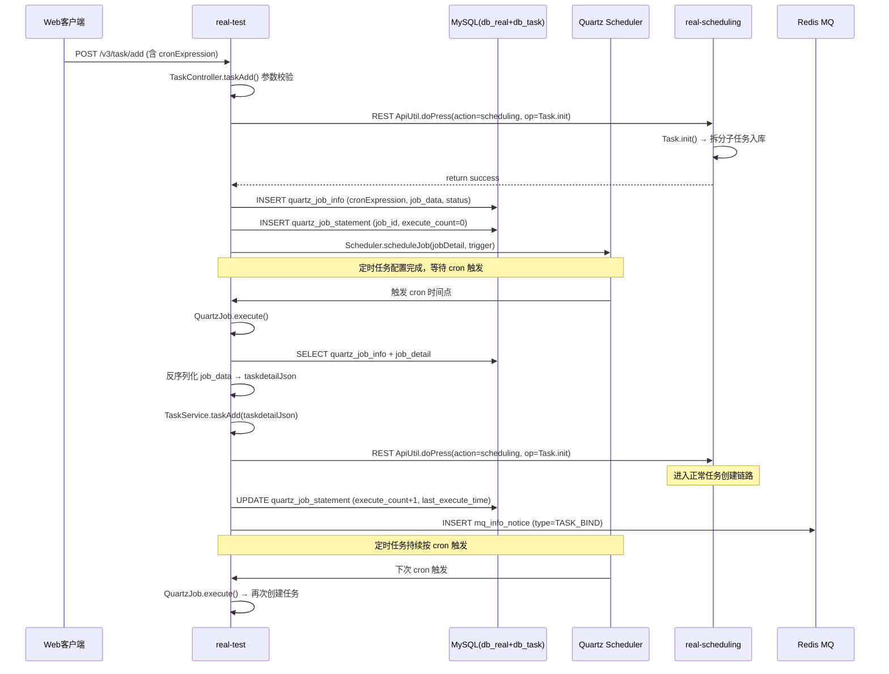

# 核心链路-定时任务调度

> 用户在 app处理服务 配置定时任务（cron 表达式） → Quartz Scheduler 到点触发 → app处理服务 QuartzJob.execute() 组装任务参数 → 调用 TaskService.taskAdd() 创建真实任务 → 任务进入正常调度流程（初始化→匹配→下发→执行→回收）。

## 完整流程图



## 阶段拆解

### 阶段1: 定时任务配置 (app处理服务)

```
POST /v3/task/add (taskdetailJson 含 cronExpression)
  → TaskController.taskAdd(TaskAddRequestDTO)
    → TaskServiceImpl.addNew(taskdetailJson)
      → scheduling Task.init → 任务初始化入库
      → 若含 cronExpression:
        → QuartzJobServiceImpl.buildJobDetail()
          → JobDataMap 存储 taskdetailJson (序列化)
          → CronTrigger 绑定 cronExpression
        → Scheduler.scheduleJob(jobDetail, trigger)
        → INSERT quartz_job_info:
            job_id, job_name, job_group, cron_expression
            job_data (完整任务参数 JSON)
            status (NORMAL/PAUSED)
            project_id, user_id
        → INSERT quartz_job_statement:
            job_id, execute_count=0, status=WAITING
```

| 表 | 操作 | 关键字段 |
|------|------|------|
| quartz_job_info | INSERT | job_id, cron_expression, job_data(JSON), status, project_id |
| quartz_job_statement | INSERT | job_id, execute_count=0, last_execute_time |
| QRTZ_CRON_TRIGGERS | INSERT | (Quartz 标准表) cron_expression |

### 阶段2: 定时触发与任务创建 (app处理服务 QuartzJob)

```
cron 到点 → Quartz Scheduler 触发
  → QuartzJob.execute(JobExecutionContext)
    → 从 JobDataMap 获取 job_id
    → SELECT quartz_job_info WHERE job_id = xxx
    → SELECT quartz_job_statement WHERE job_id = xxx
    → 检查 job 状态:
        PAUSED → 跳过
        DELETED → 跳过
    → 从 job_data 反序列化 taskdetailJson
    → 合并运行时参数 (动态时间、变量替换)
    → TaskServiceImpl.addNew(taskdetailJson)
      → scheduling Task.init → 创建真实任务
    → UPDATE quartz_job_statement:
        execute_count = execute_count + 1
        last_execute_time = now()
    → 发布 TASK_BIND 通知 (关联定时任务与真实 taskId)
```

### 阶段3: 定时任务生命周期管理 (app处理服务 ScheduledJob)

```
ScheduledJob (ApiServlet, action=app):
  op=list          → 分页查询 quartz_job_info + quartz_job_statement
  op=add           → 创建新定时任务 (与 TaskController.taskAdd 相同流程)
  op=update        → 修改 cronExpression / job_data → rescheduleJob
  op=delete        → Scheduler.deleteJob() + UPDATE quartz_job_info SET status=DELETED
  op=pause         → Scheduler.pauseJob() + UPDATE status=PAUSED
  op=resume        → Scheduler.resumeJob() + UPDATE status=NORMAL
  op=executeOnce   → Scheduler.triggerJob() 立即触发一次
  op=stop          → Scheduler.interrupt() 中断正在执行的任务
```

| op | Quartz 操作 | DB 更新 |
|----|-------------|---------|
| add | scheduleJob | INSERT quartz_job_info + quartz_job_statement |
| update | rescheduleJob | UPDATE cron_expression, job_data |
| delete | deleteJob | UPDATE status=DELETED |
| pause | pauseJob | UPDATE status=PAUSED |
| resume | resumeJob | UPDATE status=NORMAL |
| executeOnce | triggerJob | — |
| stop | interrupt | — |

## 定时任务恢复机制

```
服务重启 → QuartzListenerThread (real-test StartRunner)
  → 扫描 quartz_job_info WHERE status IN (NORMAL, PAUSED)
  → 对比 QRTZ_TRIGGERS 表
  → 对每个 job:
      if Scheduler.checkExists(jobKey) → 跳过 (已注册)
      else → Scheduler.scheduleJob() 重新注册
  → 扫描 quartz_job_statement WHERE status=RUNNING
      → 恢复为 WAITING (服务重启导致执行中断)
```

## 关键代码路径

| 步骤 | 文件 | 方法 |
|------|------|------|
| 定时任务创建 | `real-test/.../mvc/controller/TaskController.java` | `taskAdd()` |
| Quartz Job 注册 | `real-test/.../business/impl/QuartzJobServiceImpl.java` | `buildJobDetail()` |
| 定时触发执行 | `real-test/.../quartz/QuartzJob.java` | `execute(JobExecutionContext)` |
| 任务数据组装 | `real-test/.../business/impl/QuartzJobServiceImpl.java` | `buildTaskDetail()` |
| 真实任务创建 | `real-test/.../business/impl/TaskServiceImpl.java` | `addNew(JSONObject)` |
| 调度初始化 | `real-scheduling/.../service/scheduling/Task.java` | `init(ApiRequest)` |
| 定时任务管理 | `real-test/.../service/app/ScheduledJob.java` | `list/add/update/delete/pause/resume` |
| 服务恢复 | `real-test/.../quartz/QuartzListenerThread.java` | `run()` |
| 执行记录 | `real-test/.../dao/quartz/QuartzJobStatementDAO.java` | `updateStatement()` |

## 核心发现

- **与手动任务共享链路**：定时任务创建的真实任务与手动创建的任务走完全相同的 `Task.init` → `Task.match` → `Task.reportResult` 流程，不做特殊处理
- **job_data 序列化**：`taskdetailJson` 完整存储在 `quartz_job_info.job_data` 字段，触发时反序列化后调用 `TaskService.taskAdd()`
- **QuartzListenerThread**：服务重启时扫描未注册的 Job 并重新注册到 Scheduler，同时将 `RUNNING` 状态的 statement 恢复为 `WAITING`
- **执行计数**：`quartz_job_statement.execute_count` 记录总执行次数，用于监控定时任务健康状况
- **TASK_BIND 通知**：每次定时触发后发布，将定时任务 job_id 与真实 task_id 绑定，便于追溯
- **PAUSED 状态**：暂停的定时任务不会被 cron 触发，但 `executeOnce` 可以手动触发单次执行

## 相关文档

- [核心链路-任务初始化](../../app处理服务（real-test）/04-复杂功能细节/核心链路-任务初始化.md) — 定时触发后进入的正常任务创建流程
- [核心链路-设备匹配与下发](../../设备控制中心（real-controlcenter）/04-复杂功能细节/核心链路-设备匹配与下发.md) — 任务创建后的匹配与下发
- [核心链路-结果回收与报告](../../app处理服务（real-test）/04-复杂功能细节/核心链路-结果回收与报告.md) — 执行完成后的结果处理
- [核心链路-任务状态机](../../app处理服务（real-test）/04-复杂功能细节/核心链路-任务状态机.md) — 定时任务状态: WAITING → RUNNING → FINISH
- [基础设施-后台线程全景](../../app处理服务（real-test）/04-复杂功能细节/基础设施-后台线程全景.md) — QuartzListenerThread, Quartz Scheduler
- [基础设施-模块间通信](../../app处理服务（real-test）/04-复杂功能细节/基础设施-模块间通信.md) — Quartz 作为内置调度器的通信方式
- [通知系统-NoticeServiceImpl详细流程](../../app处理服务（real-test）/04-复杂功能细节/通知系统-NoticeServiceImpl详细流程.md) — TASK_BIND 通知: handleBindTest handler
