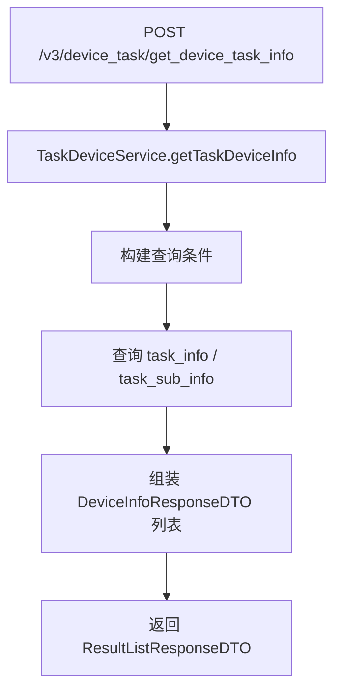

# DeviceTaskController

Spring MVC 控制器，提供设备运行任务信息查询接口，路径前缀 `/v3/device_task`。

## 接口列表

### getDeviceTaskInfo (`POST /v3/device_task/device_task/get_device_task_info`)

- **入口**：`cn.testin.mvc.DeviceTaskController#getDeviceTaskInfo(DeviceQueryRequestDTO)`
- **实现意图**：根据查询条件（设备 ID / 任务 ID / 项目 ID / 企业 ID 等）查询当前设备正在执行或待执行的任务信息，用于设备任务状态监控。
- **请求参数**（`DeviceQueryRequestDTO`）：

| 参数 | 类型 | 必填 | 说明 |
|------|------|------|------|
| deviceIds | JSONArray（List\<String\>） | 否 | 设备 ID 列表 |
| taskType | Integer | 否 | 任务类型（TaskTypeEnum） |
| eid | Integer | 否 | 企业 ID（私有云始终为 1） |
| projectId | Integer | 否 | 项目 ID |

- **返回参数**：

| 字段 | 类型 | 说明 |
|---|---|---|
| code | Integer | 0 成功 / -1 失败 |
| msg | String | 提示信息 |
| data | JSONObject | 业务数据（ResultListResponseDTO） |
| data.list | JSONArray | 设备任务信息列表（元素 DeviceInfoResponseDTO） |
| data.list[].deviceId | String | 设备 ID |
| data.list[].status | Integer | 状态（DeviceTaskStatuesEnum） |
| data.list[].errorMsg | String | 错误信息 |
| data.list[].executeTaskId | String | 执行任务 ID |
| data.list[].ip | String | IP 地址 |
- **处理流程**：

- **调用链**：`TaskDeviceService` -> [ITaskInfoDAO](real-scheduling/ITaskInfoDAO.md)
- **涉及表与 SQL**：[task_info](../../../数据库管理/db_task/task_info.md)、[task_sub_info](../../../数据库管理/db_task/task_sub_info.md)
- **异常与校验**：无特殊校验
- **关键代码摘录**：
```java
// cn.testin.mvc.DeviceTaskController
@PostMapping("/device_task/get_device_task_info")
public ResponseResult<ResultListResponseDTO<DeviceInfoResponseDTO>> getDeviceTaskInfo(
        @RequestBody DeviceQueryRequestDTO requestDTO) throws GeneralException {
    List<DeviceInfoResponseDTO> result = taskDeviceService.getTaskDeviceInfo(requestDTO);
    ResultListResponseDTO<DeviceInfoResponseDTO> responseDTO = new ResultListResponseDTO<>();
    responseDTO.setList(result);
    return ResponseResult.success(responseDTO);
}
```
