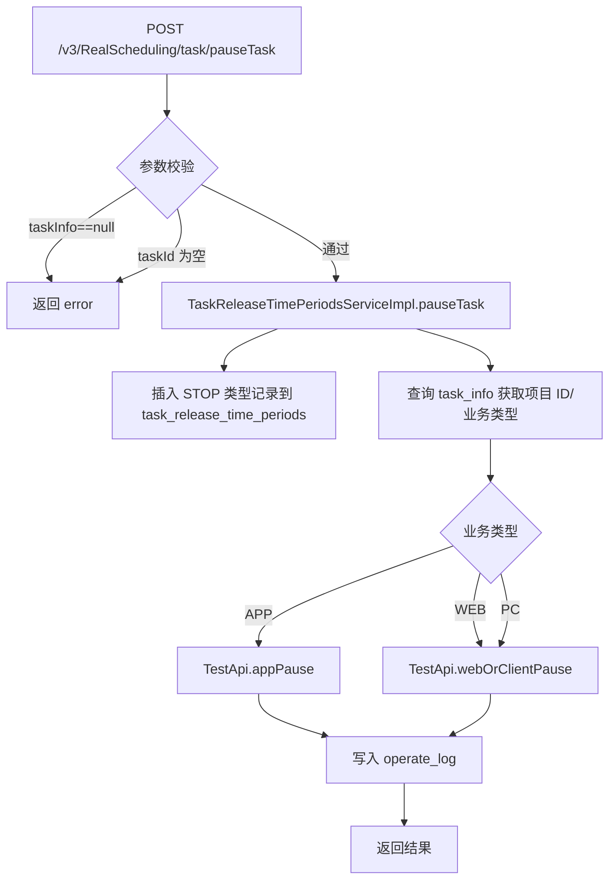
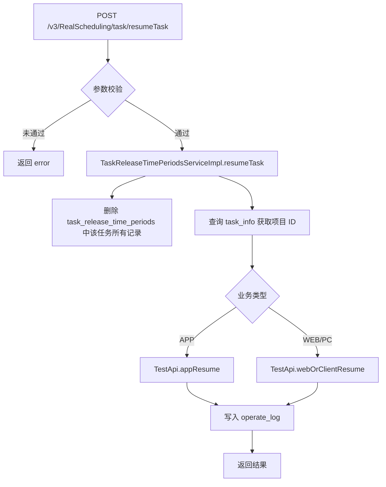
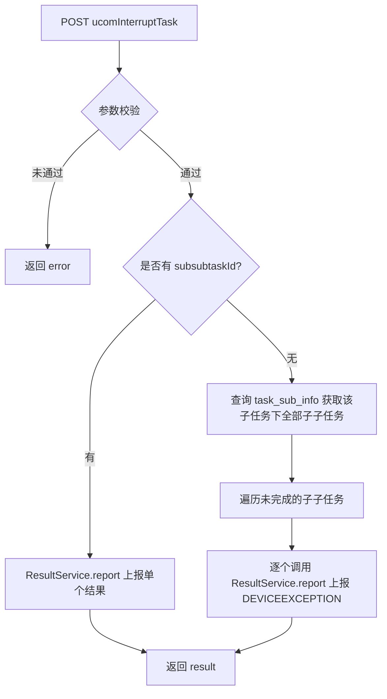

# TaskController

Spring MVC 控制器，提供任务暂停/恢复/上位机中断接口，路径前缀 `/v3/RealScheduling/task`。

## 接口列表

### pauseTask (`POST /v3/RealScheduling/task/pauseTask`)

- **入口**：`cn.testin.mvc.TaskController#pauseTask(TaskReleaseTimePeriods)`
- **实现意图**：用户主动暂停某个任务的下发，操作日志记录到 operate_log。
- **请求参数**：

| 参数 | 类型 | 必填 | 说明 |
|------|------|------|------|
| taskId | String | 是 | 任务 ID |
| startTime | Long | 否 | 开始时间 |
| endTime | Long | 否 | 结束时间 |
| type | Short | 否 | 类型（TaskReleaseTimePeriodsEnum） |
| userId | Integer | 否 | 操作用户 ID（用于日志） |
| userName | String | 否 | 操作用户名（用于日志） |

- **返回参数**：

| 字段 | 类型 | 说明 |
|---|---|---|
| code | Integer | 0 成功 / -1 失败 |
| msg | String | 提示信息（成功为「成功」，失败为「执行失败」） |
| data | Object | 无（成功时为 null/空） |
- **处理流程**：

- **调用链**：[RealTest](../../../app处理服务（real-test）/07-开放接口文档/00-模块索引.md)（appPause / webOrClientPause）
- **涉及表与 SQL**：[task_release_time_periods](../../../数据库管理/db_task/task_release_time_periods.md)（INSERT type=1）、[task_info](../../../数据库管理/db_task/task_info.md)（查询）、operate_log（插入操作日志）
- **异常与校验**：taskInfo/taskId 为空返回 error
- **关键代码摘录**：
```java
// cn.testin.mvc.TaskController
@PostMapping("/pauseTask")
public ResponseResult<Object> pauseTask(@RequestBody TaskReleaseTimePeriods taskInfo) throws GeneralException {
    if (taskInfo == null) return ResponseResult.error(Constants.SUCCESS_CODE, "taskInfo is null！");
    if (StringUtils.isBlank(taskInfo.getTaskId())) return ResponseResult.error(Constants.SUCCESS_CODE, "taskId is null！");
    if (taskReleaseTimePeriodsService.pauseTask(taskInfo))
        return ResponseResult.success(Constants.SUCCESS_CODE, Constants.SUCCESS_MSG);
    return ResponseResult.error(Constants.ERROR_CODE, "执行失败");
}
```

---

### resumeTask (`POST /v3/RealScheduling/task/resumeTask`)

- **入口**：`cn.testin.mvc.TaskController#resumeTask(TaskReleaseTimePeriods)`
- **实现意图**：恢复已暂停的任务下发，删除暂停记录，并调用 test 模块恢复任务。
- **请求参数**（`TaskReleaseTimePeriods`，同 pauseTask）：

| 参数 | 类型 | 必填 | 说明 |
|------|------|------|------|
| taskId | String | 是 | 任务 ID |
| startTime | Long | 否 | 开始时间 |
| endTime | Long | 否 | 结束时间 |
| type | Short | 否 | 类型（TaskReleaseTimePeriodsEnum） |
| userId | Integer | 否 | 操作用户 ID（用于日志） |
| userName | String | 否 | 操作用户名（用于日志） |

- **返回参数**：

| 字段 | 类型 | 说明 |
|---|---|---|
| code | Integer | 0 成功 / -1 失败 |
| msg | String | 提示信息（成功为「成功」，失败为「执行失败」） |
| data | Object | 无（成功时为 null/空） |
- **处理流程**：

- **调用链**：[RealTest](../../../app处理服务（real-test）/07-开放接口文档/00-模块索引.md)（appResume / webOrClientResume）
- **涉及表与 SQL**：[task_release_time_periods](../../../数据库管理/db_task/task_release_time_periods.md)（DELETE）、[task_info](../../../数据库管理/db_task/task_info.md)（查询）、operate_log
- **关键代码摘录**：
```java
// cn.testin.mvc.TaskController
@PostMapping("/resumeTask")
public ResponseResult<Object> resumeTask(@RequestBody TaskReleaseTimePeriods taskInfo) throws GeneralException {
    if (taskInfo == null) return ResponseResult.error(Constants.SUCCESS_CODE, "taskInfo is null！");
    if (StringUtils.isBlank(taskInfo.getTaskId())) return ResponseResult.error(Constants.SUCCESS_CODE, "taskId is null！");
    if (taskReleaseTimePeriodsService.resumeTask(taskInfo))
        return ResponseResult.success(Constants.SUCCESS_CODE, Constants.SUCCESS_MSG);
    return ResponseResult.error(Constants.ERROR_CODE, "执行失败");
}
```

---

### ucomInterruptTask (`POST /v3/RealScheduling/task/ucomInterruptTask`)

- **入口**：`cn.testin.mvc.TaskController#ucomInterruptTask(UcomInterruptTaskDTO)`
- **实现意图**：上位机/PC 端无法继续执行任务时，主动中断任务。若提供了 subsubtaskId 则只上报该子子任务；否则遍历子任务下所有未完成的子子任务逐个上报为设备异常结果。
- **请求参数**：

| 参数 | 类型 | 必填 | 说明 |
|------|------|------|------|
| taskId | String | 是 | 任务 ID |
| subtaskId | String | 是 | 子任务 ID（对应设备） |
| subsubtaskId | String | 否 | 子子任务 ID（对应脚本），不传则中断整个子任务 |
| deviceid | String | 否 | 设备 ID |
| ucomid | String | 否 | 上位机 ID（WEB/PC 使用） |
| errorMsg | String | 否 | 错误信息 |

- **返回参数**：

| 字段 | 类型 | 说明 |
|---|---|---|
| code | Integer | 0 成功 / -1 失败 |
| msg | String | 提示信息（成功为「成功」，失败为「执行失败」） |
| data | JSONObject | 业务数据 |
| data.result | Integer | 1 成功 |
- **处理流程**：

- **调用链**：`IResultService.report` -> RealAnalysis（结果解析）
- **涉及表与 SQL**：[task_sub_info](../../../数据库管理/db_task/task_sub_info.md)（查询子子任务列表）
- **异常与校验**：taskId/subtaskId 为空返回 error
- **关键代码摘录**：
```java
// cn.testin.mvc.TaskController
@PostMapping("/ucomInterruptTask")
public ResponseResult<Object> ucomInterruptTask(@RequestBody UcomInterruptTaskDTO ucomInterruptTaskDto) throws GeneralException {
    if (ucomInterruptTaskDto == null) return ResponseResult.error(...);
    if (StringUtils.isBlank(ucomInterruptTaskDto.getTaskId())) return ResponseResult.error(...);
    if (StringUtils.isBlank(ucomInterruptTaskDto.getSubtaskId())) return ResponseResult.error(...);
    if (taskReleaseTimePeriodsService.ucomInterruptTask(ucomInterruptTaskDto)) {
        Map<String, Object> result = new HashMap<>();
        result.put("result", 1);
        return ResponseResult.success(result);
    }
    return ResponseResult.error(Constants.ERROR_CODE, "执行失败");
}
```
