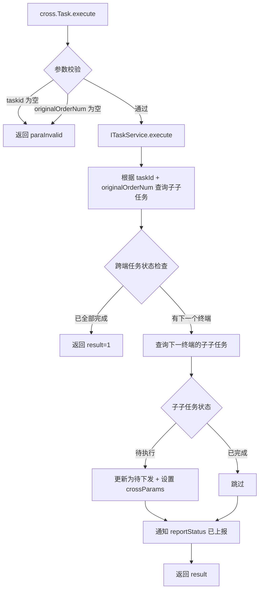

# cross.Task

`cn.testin.service.cross.Task`（extends GenericBaseService），处理跨端（多端）任务的继续执行。跨端任务指一个任务跨越 APP + Web 多个终端协同执行，前一个终端执行完毕后需要触发下一个终端上的子任务继续执行。

## 接口列表

### execute (`cross.Task.execute`)

- **入口**：`cn.testin.service.cross.Task#execute(ApiRequest)`
- **实现意图**：跨端任务中，前一个终端（如 APP）的某个脚本执行完毕后，触发下一个终端（如 Web）上对应 originalOrderNum 的子任务继续执行。入参中的 params 为前一个终端执行产出的全局参数，传递给下一个终端。
- **请求参数**：

| 参数 | 类型 | 必填 | 说明 |
|------|------|------|------|
| taskid | String | 是 | 跨端任务 ID |
| originalOrderNum | Integer | 是 | 原始编排顺序（定位要执行的下一组子子任务） |
| params | JSONArray | 否 | 前一个终端产出的全局参数（传递给下一终端） |

- **返回参数**：

| 字段 | 类型 | 说明 |
|---|---|---|
| action | String | 回显请求 action（`cross`） |
| op | String | 回显请求 op（`Task.execute`） |
| code | Integer | 状态码，0 成功 |
| msg | String | 提示信息 |
| data | JSONObject | 业务数据 |
| data.result | Integer | 1 成功 / 0 失败 |
- **处理流程**：

- **调用链**：`ITaskService.execute` -> `ITaskSubInfoDAO` -> `ITaskInfoDAO`
- **涉及表与 SQL**：[task_sub_info](../../../数据库管理/db_task/task_sub_info.md)（SELECT/UPDATE originalOrderNum/crossParams/reportStatus）、[task_info](../../../数据库管理/db_task/task_info.md)（UPDATE execStatus）
- **异常与校验**：taskid/originalOrderNum 为空返回 paraInvalid
- **关键代码摘录**：
```java
// cn.testin.service.cross.Task
public String execute(ApiRequest apirequest) throws Exception {
    String taskid = null;
    Integer originalOrderNum = null;
    JSONArray params = null;
    JSONObject reqJson = apirequest.getReqjson();
    if (!reqJson.isNull("taskid")) taskid = reqJson.getString("taskid");
    if (StringUtils.isBlank(taskid)) return ApiUtil.getResult(apirequest, CommonCode.paraInvalid.getValue(), ...);
    if (!reqJson.isNull("originalOrderNum")) originalOrderNum = reqJson.getInt("originalOrderNum");
    if (!reqJson.isNull("params")) params = reqJson.getJSONArray("params");
    if (originalOrderNum == null) return ApiUtil.getResult(apirequest, CommonCode.paraInvalid.getValue(), ...);
    boolean result = this.itaskservice.execute(taskid, originalOrderNum, params);
    // ...
}
```
