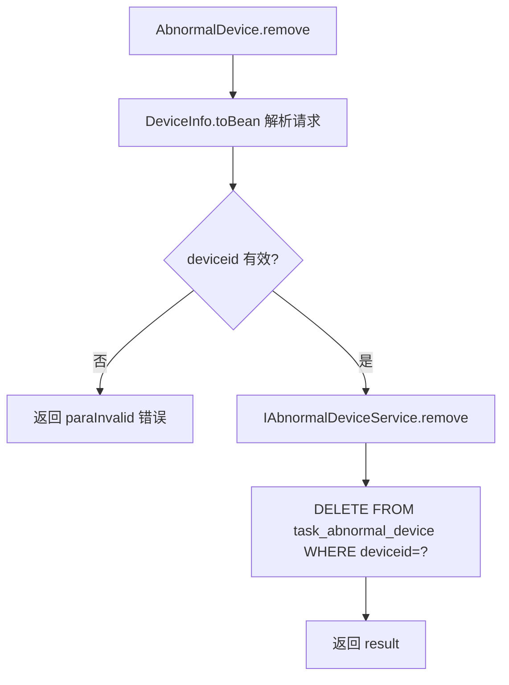

# scheduling.AbnormalDevice

`cn.testin.service.scheduling.AbnormalDevice`（extends GenericBaseService），处理异常设备相关操作，主要用于从异常设备表中移除已恢复的设备。

## 接口列表

### remove (`scheduling.AbnormalDevice.remove`)

- **入口**：`cn.testin.service.scheduling.AbnormalDevice#remove(ApiRequest)`
- **实现意图**：从 task_abnormal_device 表中移除已恢复的异常设备记录，使设备可以恢复正常任务匹配。
- **请求参数**（DeviceInfo JSON）：

| 参数 | 类型 | 必填 | 说明 |
|------|------|------|------|
| deviceid | String | 是 | 设备 ID |

- **返回参数**：

| 字段 | 类型 | 说明 |
|---|---|---|
| action | String | 回显请求 action（`scheduling`） |
| op | String | 回显请求 op（`AbnormalDevice.remove`） |
| code | Integer | 状态码，0 成功 |
| msg | String | 提示信息 |
| data | JSONObject | 业务数据 |
| data.result | Integer | 1 成功 / 0 失败 |
- **处理流程**：

- **调用链**：`IAbnormalDeviceService.remove` -> `ITaskAbnormalDeviceDAO`
- **涉及表与 SQL**：[task_abnormal_device](../../../数据库管理/db_task/task_abnormal_device.md)（DELETE）
- **异常与校验**：deviceid 为空时返回 `CommonCode.paraInvalid`
- **关键代码摘录**：
```java
// cn.testin.service.scheduling.AbnormalDevice
public String remove(ApiRequest apirequest) throws Exception {
    DeviceInfo deviceinfo = DeviceInfo.toBean(apirequest.getReqjson());
    if (deviceinfo == null || deviceinfo.getDeviceid() == null) {
        String msg = CommonCode.paraInvalid.getDescr() + "(deviceid is invalid!)";
        return ApiUtil.getResult(apirequest, CommonCode.paraInvalid.getValue(), msg);
    }
    boolean result = this.iabnormaldeviceservice.remove(deviceinfo.getDeviceid());
    // ...
}
```
