# scheduling.Task

`cn.testin.service.scheduling.Task`（extends GenericBaseService），是 任务调度服务 模块最核心的 API 类，涵盖任务初始化、设备匹配、任务下发、结果回收、取消、撤销、调度等全生命周期操作。每个 public String xxx(ApiRequest) 方法对应一个 `op`。

依赖注入（GenericBaseService）：`ITaskService`、`IWebTaskService`、`IClientTaskService`、`IResultService`、`INoticeService`、`IAbnormalDeviceService`、`IDeviceTaskCountDAO`

## 接口列表

### init (`scheduling.Task.init`)

- **入口**：`cn.testin.service.scheduling.Task#init(ApiRequest)`
- **实现意图**：任务初始化入库。将上层（app处理服务）传入的任务详情 JSON 解析后，创建 task_info_extra（扩展信息）、task_info（子任务，按设备拆分）、task_sub_info（子子任务，按脚本拆分）三条链数据，并发送 INIT 通知触发后续调度流程。支持防重（reqId+taskId 分布式锁）、补测合并、任务下发时间段、取消状态检查。
- **请求参数**：

| 参数 | 类型 | 必填 | 说明 |
|------|------|------|------|
| execStandard | String | 是 | 执行策略：fast/normal/simple/monkey/script/data |
| reqId | String | 是 | 请求唯一 ID，防重 |
| taskid | String | 是 | 任务 ID（tt 开头为 APP，其它为 Web/PC） |
| userid | Integer | 是 | 用户 ID（须 > 0） |
| testType | Integer | 是 | 测试类型：1功能/2安装/3卸载（须 >= 0） |
| level | Integer | 是 | 任务优先级 |
| content | String | 是 | 待初始化的设备/脚本 JSON 字符串 |
| content.devices | JSONArray | 是 | 设备列表（须非空，元素为设备信息对象） |
| content.scripts | JSONArray | 否 | 脚本列表（元素为脚本信息对象，可为空） |
| taskType | Integer | 否 | 任务类型：1=正常，2=补测（默认 1） |
| resourceType | String | 否 | 资源类型：app/web/pc |
| subtaskid | String | 否 | 脚本补测任务的子任务 ID |
| crossTaskid | String | 否 | 多端任务 ID |
| taskReleaseTimePeriodsList | JSONArray | 否 | 任务下发时间段配置列表（元素含 taskId/startTime/endTime/type） |

- **返回参数**：

| 字段 | 类型 | 说明 |
|---|---|---|
| action | String | 回显请求 action（`scheduling`） |
| op | String | 回显请求 op（`Task.init`） |
| code | Integer | 状态码，0 成功 |
| msg | String | 提示信息 |
| data | JSONObject | 业务数据 |
| data.result | Integer | 1 成功 / 0 失败 |
- **处理流程**：
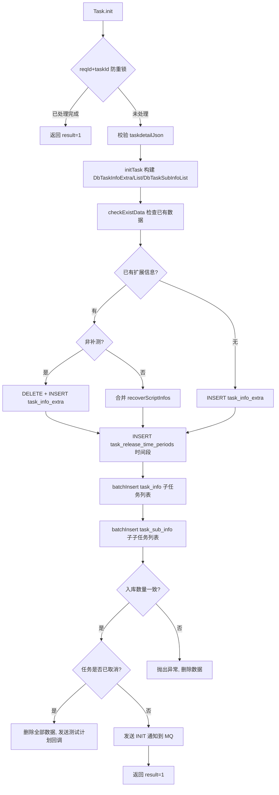
- **调用链**：[RealTest](../../../app处理服务（real-test）/07-开放接口文档/00-模块索引.md)（getTaskUserAdapt / getTaskWebPcTaskDetail / sendTaskPlanInfo / sendWebPcTaskPlanInfo）
- **涉及表与 SQL**：[task_info_extra](../../../数据库管理/db_task/task_info_extra.md)（INSERT/DELETE/UPDATE）、[task_info](../../../数据库管理/db_task/task_info.md)（batchInsert/deleteByTaskId/deleteByReqId）、[task_sub_info](../../../数据库管理/db_task/task_sub_info.md)（batchInsert/deleteByTaskId/deleteByReqId）、[task_release_time_periods](../../../数据库管理/db_task/task_release_time_periods.md)（addBatch）
- **异常与校验**：参数不合法抛出 GeneralException(paraInvalid)；reqId+taskId 正在执行中抛出 execFailed
- **关键代码摘录**：
```java
// cn.testin.service.scheduling.Task
public String init(ApiRequest apirequest) throws Exception {
    boolean result = this.itaskservice.init(apirequest.getReqjson());
    JSONObject jObj = ApiUtil.getJSONobj(apirequest, CommonCode.success.getValue(), CommonCode.success.getDescr());
    Map<String, Object> datamap = new HashMap<>();
    datamap.put(ApiResponse.RES_RESULT, result ? 1 : 0);
    jObj.put(ApiResponse.RES_DATA, datamap);
    return jObj.toString();
}
```

---

### match (`scheduling.Task.match`)

- **入口**：`cn.testin.service.scheduling.Task#match(ApiRequest)`
- **实现意图**：设备心跳上报时调用，设备匹配待执行任务。先调用 `ITaskService.receive` 尝试领取已预匹配的任务；如果领取不到，再调用 `ITaskService.match` 进行普通匹配。匹配到任务后做变量验证（matchtask）和"最后任务信息"记录。匹配成功回调梆梆创建接口。
- **请求参数**（DeviceInfo JSON）：

| 参数 | 类型 | 必填 | 说明 |
|------|------|------|------|
| deviceid | String | 否 | 设备 ID |
| ucomid | String | 否 | 上位机 ID |
| syspfName | String | 否 | 系统平台：android/ios |
| network | Integer | 否 | 网络：0 无网 / 1 有网 |
| networkType | Integer | 否 | 网络类型：0 无网 / 1 wifi / 2 mobile |
| sdkVer | Integer | 否 | SDK 版本 |
| modelid | Integer | 否 | 匹配机型 ID |
| deviceModelId | Integer | 否 | 设备机型 ID |
| serialNumber | String | 否 | SN（可人工调整） |
| projectGroups / enterpriseConfigs | JSONArray | 否 | 项目组信息（元素含 eid、projectid、type） |

- **返回参数**：

| 字段 | 类型 | 说明 |
|---|---|---|
| op | String | 回显请求 op（`Task.match`） |
| code | Integer | 状态码，0 成功 |
| data | JSONObject | 业务数据（未匹配到任务时为空对象 `{}`） |
| data.objInfo | JSONObject | 匹配到的任务信息（`DbTaskInfo.toJson`，字段见下） |
| data.objInfo.taskid | String | 任务 ID |
| data.objInfo.userid | Integer | 用户 ID |
| data.objInfo.testType | Integer | 测试类型 |
| data.objInfo.subtaskid | String | 子任务 ID |
| data.objInfo.deviceid | String | 设备 ID |
| data.objInfo.appid | Integer | 应用 ID |
| data.objInfo.appUrl | String | 应用包下载地址 |
| data.objInfo.packageName | String | 应用包名 |
| data.objInfo.startPath | String | 启动路径 |
| data.objInfo.appMd5 | String | 应用包 MD5 |
| data.objInfo.eid | Integer | 企业 ID |
| data.objInfo.projectid | Integer | 项目 ID |
| data.objInfo.taskDescr | String | 任务描述 |
| data.objInfo.createtime | Long | 创建时间 |
| data.objInfo.taskType | Integer | 任务类型 |
| data.objInfo.params | JSONObject | 全局参数 |
| data.objInfo.accountId | String | 账号 ID |
| data.objInfo.accountPwd | String | 账号密码 |
| data.objInfo.accountExtension | String | 账号扩展信息 |
| data.objInfo.certificate | JSONObject | 证书信息 |
| data.objInfo.standard | JSONObject | 任务规则信息（coverInstall/cleanData 等） |
| data.objInfo.sid | String | 浏览器 session ID |
| data.objInfo.dependScripts | JSONObject | 附加脚本信息（scriptid/scriptNo/scriptUrl/scriptMd5/scriptType） |
| data.objInfo.captureRules | JSONArray | 网络报文抓取规则 |
| data.objInfo.networkConfig | JSONObject | 模拟器网络上下行参数（uplink/downlink） |
| data.objInfo.type | String | 浏览器类型（browserType） |
| data.objInfo.version | String | 浏览器版本（browserVersion） |
| data.objInfo.ucomid | String | 上位机 ID |
| data.objInfo.bizCode | Integer | 业务编码 |
| data.objInfo.sources | String | 设备云信息 |
| data.objInfo.osName | String | 系统名称 |
| data.objInfo.suiteId | Integer | 跨平台应用 ID |
| data.objInfo.env | JSONObject | 环境配置参数 |
| data.objInfo.crossTaskid | String | 多端任务 ID |
| data.objInfo.resourceType | String | 执行终端类型（web/app/pc） |
| data.objInfo.appDesc | String | 版本备注 |
- **处理流程**：
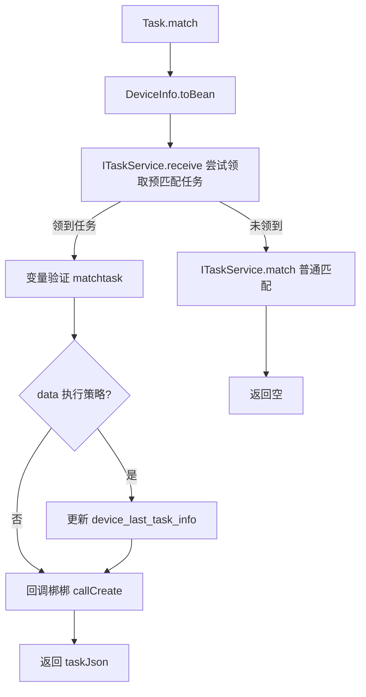
- **调用链**：`ITaskService` -> [RealCfg](../../../平台配置（real-cfg）/07-开放接口文档/00-模块索引.md)（DeviceV3Api 查询设备信息） -> [RealControlCenter](../../../设备控制中心（real-controlcenter）/07-开放接口文档/00-模块索引.md)（设备心跳匹配）
- **涉及表与 SQL**：[task_info](../../../数据库管理/db_task/task_info.md)（查询/更新）、[task_exec_relation](../../../数据库管理/db_task/task_exec_relation.md)（查询/插入）、[device_last_task_info](../../../数据库管理/db_task/device_last_task_info.md)（更新/插入）、ES task_info 索引
- **关键代码摘录**：
```java
DbTaskInfo taskInfo = this.itaskservice.receive(deviceinfo);
if (taskInfo != null) {
    JSONObject taskJson = taskInfo.toJson();
    itaskservice.matchtask(taskJson);
    if (TaskConfigEnum.ExecStandard.DATA.getValue().equals(taskInfo.getExecStandard()))
        deviceLastTaskInfoService.updateDeviceLastTaskInfo(taskJson);
    datamap.put(ApiResponse.RES_OBJECT, taskJson);
    itaskservice.callCreate(taskInfo, deviceinfo);
} else {
    boolean matchresult = this.itaskservice.match(deviceinfo);
}
```

---

### webMatch (`scheduling.Task.webMatch`)

- **入口**：`cn.testin.service.scheduling.Task#webMatch(ApiRequest)`
- **实现意图**：与 match 对称的 WEB/浏览器端任务匹配接口。PcInfo.toBean 解析请求，走 IWebTaskService.webReceive/webMatch 流程。
- **请求参数**（PcInfo JSON）：

| 参数 | 类型 | 必填 | 说明 |
|------|------|------|------|
| ucomid | String | 否 | 上位机 ID |
| browserList | JSONArray | 否 | 浏览器列表（元素含 browserid、type、version） |
| network | Integer | 否 | 网络：0 无网 / 1 有网 |
| networkType | Integer | 否 | 网络类型：0 无网 / 1 wifi / 2 mobile |
| sources | JSONArray | 否 | 设备云信息（元素为 String） |
| osName | String | 否 | 系统名称 |
| osVersion | String | 否 | 系统版本 |
| location | String | 否 | 位置 |
| ip | String | 否 | IP 地址 |
| marks | String | 否 | 设备标签 |

- **返回参数**：

| 字段 | 类型 | 说明 |
|---|---|---|
| op | String | 回显请求 op（`Task.webMatch`） |
| code | Integer | 状态码，0 成功 |
| data | JSONObject | 业务数据（未匹配到任务时为空对象 `{}`） |
| data.objInfo | JSONObject | 匹配到的任务信息（`DbTaskInfo.toJson`，字段同 match） |
| data.objInfo.taskid | String | 任务 ID |
| data.objInfo.subtaskid | String | 子任务 ID |
| data.objInfo.deviceid | String | 设备 ID |
| data.objInfo.userid | Integer | 用户 ID |
| data.objInfo.testType | Integer | 测试类型 |
| data.objInfo.taskType | Integer | 任务类型 |
| data.objInfo.eid | Integer | 企业 ID |
| data.objInfo.projectid | Integer | 项目 ID |
| data.objInfo.taskDescr | String | 任务描述 |
| data.objInfo.params | JSONObject | 全局参数 |
| data.objInfo.accountId / accountPwd / accountExtension | String | 账号信息 |
| data.objInfo.certificate | JSONObject | 证书信息 |
| data.objInfo.standard | JSONObject | 任务规则信息 |
| data.objInfo.sid | String | 浏览器 session ID |
| data.objInfo.dependScripts | JSONObject | 附加脚本信息 |
| data.objInfo.captureRules | JSONArray | 网络报文抓取规则 |
| data.objInfo.networkConfig | JSONObject | 模拟器网络上下行参数（uplink/downlink） |
| data.objInfo.type | String | 浏览器类型 |
| data.objInfo.version | String | 浏览器版本 |
| data.objInfo.ucomid | String | 上位机 ID |
| data.objInfo.bizCode | Integer | 业务编码 |
| data.objInfo.sources | String | 设备云信息 |
| data.objInfo.osName | String | 系统名称 |
| data.objInfo.env | JSONObject | 环境配置参数 |
| data.objInfo.crossTaskid | String | 多端任务 ID |
| data.objInfo.resourceType | String | 执行终端类型 |
| data.objInfo.appDesc | String | 版本备注 |

- **处理流程**：同 match，走 IWebTaskService 体系
- **调用链**：`IWebTaskService` -> [RealCfg](../../../平台配置（real-cfg）/07-开放接口文档/00-模块索引.md) -> [RealControlCenter](../../../设备控制中心（real-controlcenter）/07-开放接口文档/00-模块索引.md)
- **涉及表与 SQL**：[task_info](../../../数据库管理/db_task/task_info.md)、[task_exec_relation](../../../数据库管理/db_task/task_exec_relation.md)

---

### clientMatch (`scheduling.Task.clientMatch`)

- **入口**：`cn.testin.service.scheduling.Task#clientMatch(ApiRequest)`
- **实现意图**：与 match 对称的 PC 客户端任务匹配接口。ClientInfoPojo.toBean 解析，走 IClientTaskService.clientReceive/clientMatch 流程。
- **请求参数**（ClientInfoPojo JSON）：

| 参数 | 类型 | 必填 | 说明 |
|------|------|------|------|
| ucomid | String | 否 | 上位机 ID |
| ip | String | 否 | IP 地址 |
| location | String | 否 | 位置 |
| systemType | String | 否 | 系统类型 |
| systemVersion | String | 否 | 系统版本 |
| systemName | String | 否 | 系统名称 |
| pcId | String | 否 | PC ID |
| systemBitness | String | 否 | 系统位数（X86/X64） |
| cpuName | String | 否 | CPU 名称 |
| cpuArch | String | 否 | CPU 架构 |
| ram | String | 否 | 运行内存大小 |
| brandName | String | 否 | 品牌 |
| action | Integer | 否 | 动作：0 空闲 / 1 测试 / 2 真机调试 / 3 online / 4 第三方 |
| status | Integer | 否 | 状态 |
| debugOwner | String | 否 | 真机占用人 |
| refreshtime | Long | 否 | 刷新时间 |
| sources | JSONArray | 否 | 设备云信息（元素为 String） |
| sourceRule | String | 否 | 设备云依据 |
| marks | String | 否 | 设备标签 |

- **返回参数**：

| 字段 | 类型 | 说明 |
|---|---|---|
| op | String | 回显请求 op（`Task.clientMatch`） |
| code | Integer | 状态码，0 成功 |
| data | JSONObject | 业务数据（未匹配到任务时为空对象 `{}`） |
| data.objInfo | JSONObject | 匹配到的任务信息（`DbTaskInfo.toJson`，字段同 match） |
| data.objInfo.taskid | String | 任务 ID |
| data.objInfo.subtaskid | String | 子任务 ID |
| data.objInfo.deviceid | String | 设备 ID |
| data.objInfo.userid | Integer | 用户 ID |
| data.objInfo.testType | Integer | 测试类型 |
| data.objInfo.taskType | Integer | 任务类型 |
| data.objInfo.eid | Integer | 企业 ID |
| data.objInfo.projectid | Integer | 项目 ID |
| data.objInfo.taskDescr | String | 任务描述 |
| data.objInfo.params | JSONObject | 全局参数 |
| data.objInfo.accountId / accountPwd / accountExtension | String | 账号信息 |
| data.objInfo.certificate | JSONObject | 证书信息 |
| data.objInfo.standard | JSONObject | 任务规则信息 |
| data.objInfo.sid | String | 浏览器 session ID |
| data.objInfo.dependScripts | JSONObject | 附加脚本信息 |
| data.objInfo.captureRules | JSONArray | 网络报文抓取规则 |
| data.objInfo.networkConfig | JSONObject | 模拟器网络上下行参数（uplink/downlink） |
| data.objInfo.type | String | 浏览器类型 |
| data.objInfo.version | String | 浏览器版本 |
| data.objInfo.ucomid | String | 上位机 ID |
| data.objInfo.bizCode | Integer | 业务编码 |
| data.objInfo.sources | String | 设备云信息 |
| data.objInfo.osName | String | 系统名称 |
| data.objInfo.env | JSONObject | 环境配置参数 |
| data.objInfo.crossTaskid | String | 多端任务 ID |
| data.objInfo.resourceType | String | 执行终端类型 |
| data.objInfo.appDesc | String | 版本备注 |

- **处理流程**：同 match，走 IClientTaskService 体系
- **调用链**：`IClientTaskService` -> [RealControlCenter](../../../设备控制中心（real-controlcenter）/07-开放接口文档/00-模块索引.md)

---

### matchTask (`scheduling.Task.matchTask`)

- **入口**：`cn.testin.service.scheduling.Task#matchTask(ApiRequest)`
- **实现意图**：恒生定制接口。使用指定 taskId 和 deviceType/device 直接匹配任务，跳过预匹配流程。deviceType 区分 APP(1)/WEB(2)/CLIENT(3)。
- **请求参数**：

| 参数 | 类型 | 必填 | 说明 |
|------|------|------|------|
| taskid | String | 是 | 任务 ID |
| deviceType | Integer | 是 | 设备类型：1=APP、2=WEB、3=CLIENT |
| device | JSONObject | 是 | 设备信息（deviceType=1 为 DeviceInfo，2 为 PcInfo，3 为 ClientInfoPojo，字段见 match/webMatch/clientMatch） |

- **返回参数**：

| 字段 | 类型 | 说明 |
|---|---|---|
| op | String | 回显请求 op（`Task.matchTask`） |
| code | Integer | 状态码，0 成功 |
| data | JSONObject | 业务数据（未匹配到任务时为空对象 `{}`） |
| data.objInfo | JSONObject | 匹配到的任务信息（`DbTaskInfo.toJson`，字段同 match：taskid/subtaskid/deviceid/userid/testType/taskType/eid/projectid/taskDescr/params/accountId/accountPwd/accountExtension/certificate/standard/sid/dependScripts/captureRules/networkConfig/type/version/ucomid/bizCode/sources/osName/suiteId/env/crossTaskid/resourceType/appDesc 等） |
- **处理流程**：
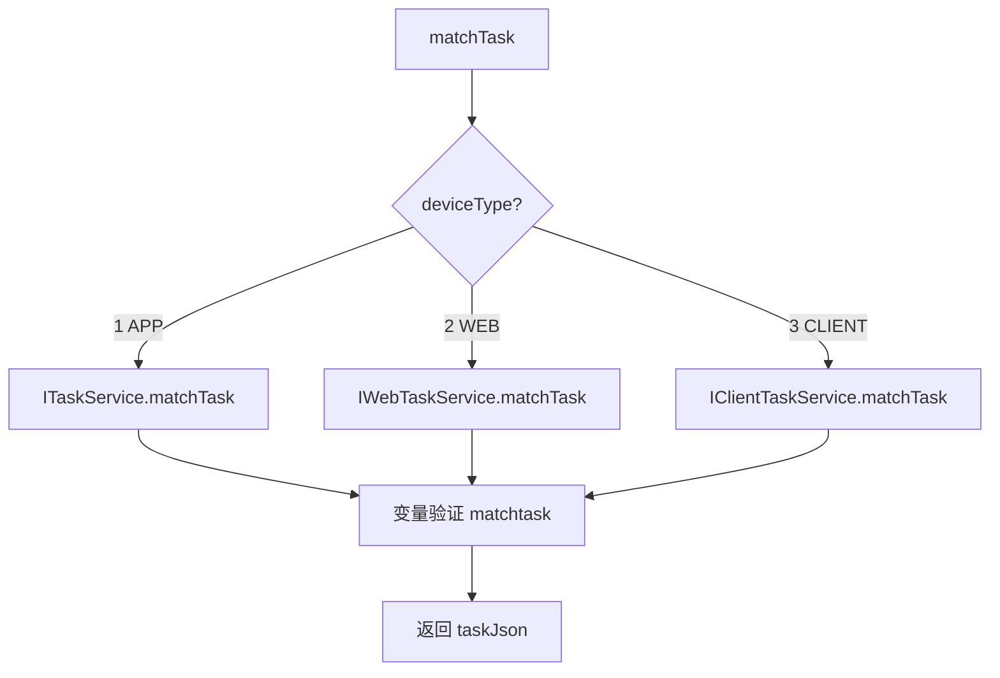

---

### precomplete (`scheduling.Task.precomplete`)

- **入口**：`cn.testin.service.scheduling.Task#precomplete(ApiRequest)`
- **实现意图**：设备执行完某个脚本后，上报预完成。更新子子任务状态为"预完成"并记录输入/输出变量，如果有账号信息则释放账号。支持 delayperiod 推迟执行。
- **请求参数**：

| 参数 | 类型 | 必填 | 说明 |
|------|------|------|------|
| subtaskid | String | 否 | 子任务 ID |
| subsubtaskid | String | 否 | 子子任务 ID |
| deviceid | String | 否 | 设备 ID（含 @ 时视为 ucomid，Web 测试） |
| ucomid | String | 否 | 上位机 ID（WEB 端使用） |
| delayperiod | Long | 否 | 延迟时间（ms） |
| runinfo | JSONObject | 否 | 多端任务运行时信息 |
| inputParams | JSONArray | 否 | 输入变量（脚本运行前） |
| outputParams/param | JSONArray | 否 | 输出变量（脚本运行后） |

- **返回参数**：

| 字段 | 类型 | 说明 |
|---|---|---|
| action | String | 回显请求 action（`scheduling`） |
| op | String | 回显请求 op（`Task.precomplete`） |
| code | Integer | 状态码，0 成功 |
| msg | String | 提示信息 |
| data | JSONObject | 业务数据 |
| data.result | Integer | 1 成功 / 0 失败 |
- **处理流程**：
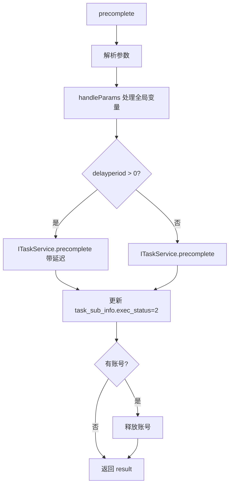
- **调用链**：`ITaskService.precomplete` -> [RealTest](../../../app处理服务（real-test）/07-开放接口文档/00-模块索引.md)（AccountApi 释放账号）
- **涉及表与 SQL**：[task_sub_info](../../../数据库管理/db_task/task_sub_info.md)（UPDATE exec_status=2 预完成）、[task_info](../../../数据库管理/db_task/task_info.md)（UPDATE）

---

### reportResult (`scheduling.Task.reportResult`)

- **入口**：`cn.testin.service.scheduling.Task#reportResult(ApiRequest)`
- **实现意图**：设备上报脚本执行结果（原始结果文件 URL），创建 task_result 记录并触发结果解析流程。
- **请求参数**：

| 参数 | 类型 | 必填 | 说明 |
|------|------|------|------|
| subtaskid | String | 否 | 子任务 ID |
| subsubtaskid | String | 否 | 子子任务 ID |
| deviceid | String | 否 | 设备 ID（含 @ 时视为 ucomid） |
| ucomid | String | 否 | 上位机 ID |
| retryNum | Integer | 否 | 重试次数 |
| resultUrl | String | 否 | 结果文件 URL |
| standard | JSONObject | 否 | 浏览器执行标准（含 sid） |
| sid | String | 否 | 浏览器 session ID |

- **返回参数**：

| 字段 | 类型 | 说明 |
|---|---|---|
| action | String | 回显请求 action（`scheduling`） |
| op | String | 回显请求 op（`Task.reportResult`） |
| code | Integer | 状态码，0 成功 |
| msg | String | 提示信息 |
| data | JSONObject | 业务数据 |
| data.result | Long | 结果记录 ID（`IResultService.report` 返回值） |
- **处理流程**：
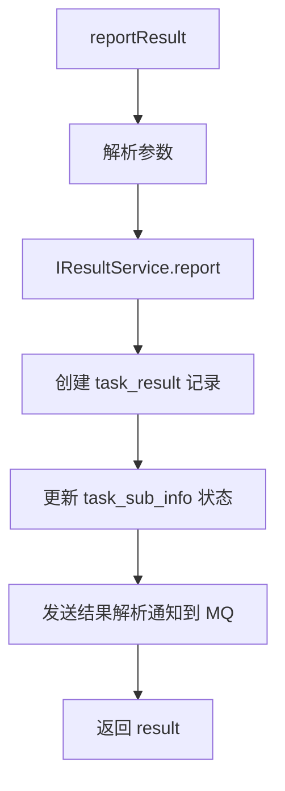
- **调用链**：`IResultService` -> RealAnalysis（结果解析） -> [RealLogfile](../../../平台基础功能服务/00-首页.md)（日志文件）
- **涉及表与 SQL**：[task_result](../../../数据库管理/db_task/task_result.md)（INSERT）、[task_sub_info](../../../数据库管理/db_task/task_sub_info.md)（UPDATE）

---

### processReport (`scheduling.Task.processReport`)

- **入口**：`cn.testin.service.scheduling.Task#processReport(ApiRequest)`
- **实现意图**：设备上报当前正在执行的任务信息（taskid/subtaskid/subsubtaskid），用于实时监控设备执行进度。
- **请求参数**：

| 参数 | 类型 | 必填 | 说明 |
|------|------|------|------|
| taskid | String | 否 | 任务 ID |
| subtaskid | String | 否 | 子任务 ID |
| subsubtaskid | String | 否 | 子子任务 ID |
| deviceid | String | 否 | 设备 ID（含 @ 时视为 ucomid） |
| ucomid | String | 否 | 上位机 ID |

- **返回参数**：

| 字段 | 类型 | 说明 |
|---|---|---|
| action | String | 回显请求 action（`scheduling`） |
| op | String | 回显请求 op（`Task.processReport`） |
| code | Integer | 状态码，0 成功 |
| msg | String | 提示信息 |
| data | JSONObject | 业务数据 |
| data.result | Integer | 1 成功 / 0 失败 |

- **涉及表与 SQL**：[task_info](../../../数据库管理/db_task/task_info.md)（查询更新）、[task_sub_info](../../../数据库管理/db_task/task_sub_info.md)
- **调用链**：`ITaskService.processReport`

---

### recover (`scheduling.Task.recover`)

- **入口**：`cn.testin.service.scheduling.Task#recover(ApiRequest)`
- **实现意图**：设备异常/断开时回收任务。将设备当前执行中的子任务状态恢复为"待执行"，以便其他设备可重新领取。通过 MQ 发送 recoveTask 通知异步处理。
- **请求参数**：

| 参数 | 类型 | 必填 | 说明 |
|------|------|------|------|
| deviceid | String | 否 | 设备 ID（与 pcId 至少一个非空，否则返回参数错误） |
| pcId | String | 否 | PC ID（与 deviceid 至少一个非空） |
| subtaskid | String | 否 | 指定回收的子任务 ID |

- **返回参数**：

| 字段 | 类型 | 说明 |
|---|---|---|
| action | String | 回显请求 action（`scheduling`） |
| op | String | 回显请求 op（`Task.recover`） |
| code | Integer | 状态码，0 成功 |
| msg | String | 提示信息 |
| data | JSONObject | 业务数据 |
| data.result | Integer | 1 成功 / 0 失败 |
- **处理流程**：
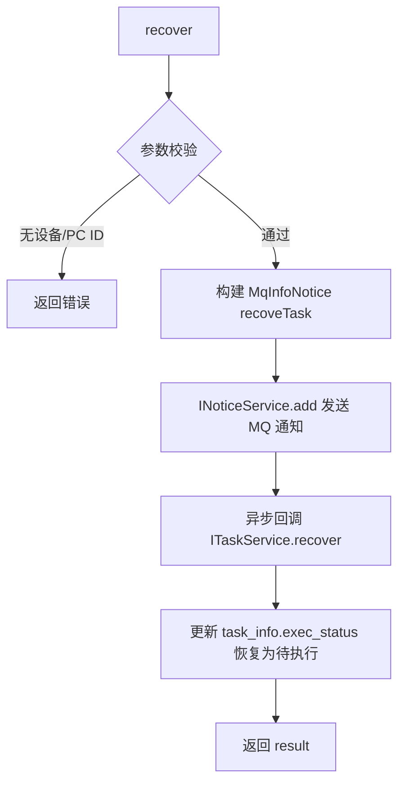
- **调用链**：`INoticeService` (MQ) -> `ITaskService.recover`
- **涉及表与 SQL**：[task_info](../../../数据库管理/db_task/task_info.md)（UPDATE exec_status）、[task_exec_relation](../../../数据库管理/db_task/task_exec_relation.md)（UPDATE/DELETE）

---

### cancel (`scheduling.Task.cancel`)

- **入口**：`cn.testin.service.scheduling.Task#cancel(ApiRequest)`
- **实现意图**：用户主动取消任务（或支付平台取消任务）。通过 MQ 发送 cancelTask 通知，异步执行取消逻辑：停止未开始的子任务、回收执行中的子任务、释放账号。
- **请求参数**：

| 参数 | 类型 | 必填 | 说明 |
|------|------|------|------|
| taskid | String | 否 | 任务 ID（本方法未显式校验，业务上需传） |
| subtaskid | String | 否 | 指定取消的子任务 ID |
| crossTaskid | String | 否 | 多端任务 ID |
| taskGroup | JSONObject | 否 | 任务组信息 |

- **返回参数**：

| 字段 | 类型 | 说明 |
|---|---|---|
| action | String | 回显请求 action（`scheduling`） |
| op | String | 回显请求 op（`Task.cancel`） |
| code | Integer | 状态码，0 成功 |
| msg | String | 提示信息 |
| data | JSONObject | 业务数据 |
| data.result | Integer | 1 成功 / 0 失败 |
- **处理流程**：
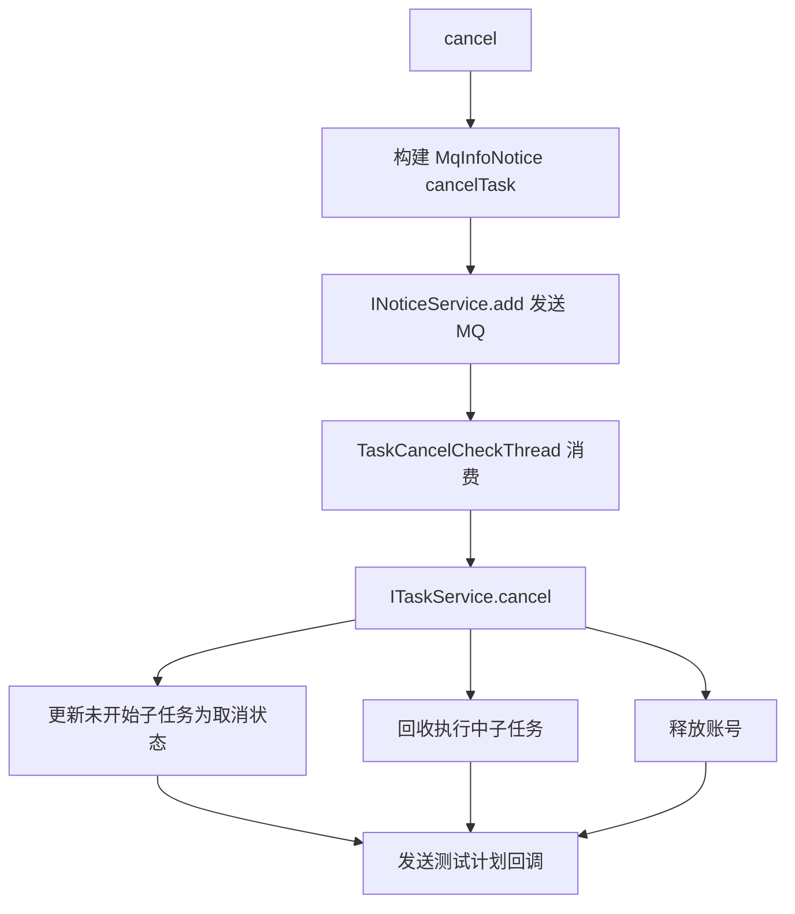
- **调用链**：[RealTest](../../../app处理服务（real-test）/07-开放接口文档/00-模块索引.md)（sendTaskPlanInfo / AccountApi）

---

### revoke (`scheduling.Task.revoke`)

- **入口**：`cn.testin.service.scheduling.Task#revoke(ApiRequest)`
- **实现意图**：撤销设备上的任务。支持两种模式：1) 带 expirePeriod 则延迟撤销（写入 task_abnormal_device 表，由 AbnormalDeviceHandlerThread 定时处理）；2) 即时撤销（通过 MQ revokeTask 通知）。
- **请求参数**：

| 参数 | 类型 | 必填 | 说明 |
|------|------|------|------|
| deviceid | String | 否 | 设备 ID（ucomid/deviceid/pcId 至少一个非空，否则抛参数异常） |
| ucomid | String | 否 | 上位机 ID |
| pcId | String | 否 | PC ID |
| expirePeriod | Long | 否 | 延迟撤销时间（ms，>0 写 task_abnormal_device；不传立即撤销） |

- **返回参数**：

| 字段 | 类型 | 说明 |
|---|---|---|
| action | String | 回显请求 action（`scheduling`） |
| op | String | 回显请求 op（`Task.revoke`） |
| code | Integer | 状态码，0 成功 |
| msg | String | 提示信息 |
| data | JSONObject | 业务数据 |
| data.result | Integer | 1 成功 / 0 失败 |
- **处理流程**：
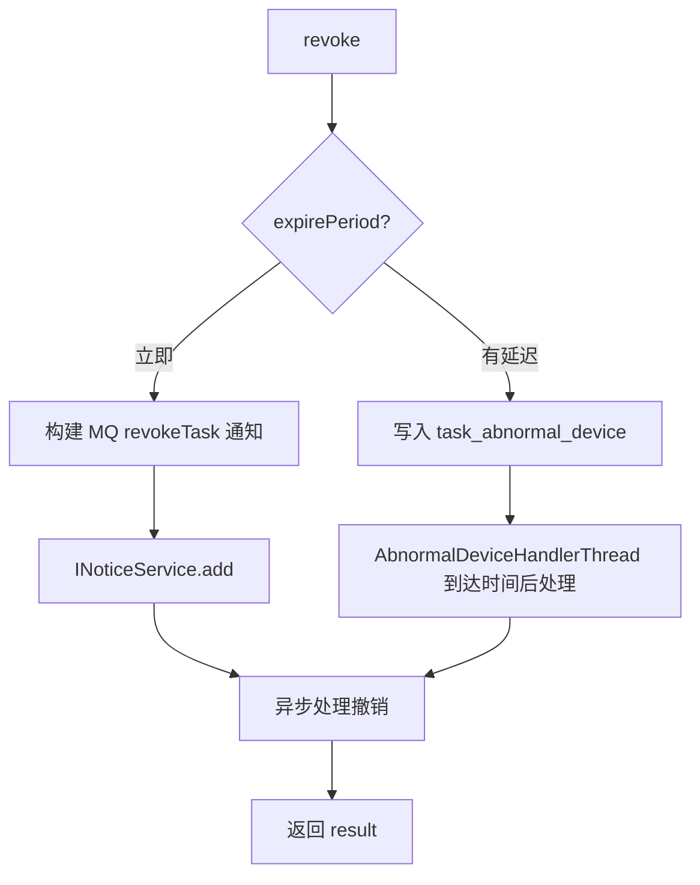
- **调用链**：`IAbnormalDeviceService.add` / `INoticeService`
- **涉及表与 SQL**：[task_abnormal_device](../../../数据库管理/db_task/task_abnormal_device.md)（INSERT）

---

### list (`scheduling.Task.list`)

- **入口**：`cn.testin.service.scheduling.Task#list(ApiRequest)`
- **实现意图**：分页查询任务列表，支持按设备 ID、执行状态、上位机 ID、浏览器类型/版本、任务 ID、子任务 ID 等多维度过滤。
- **请求参数**：

| 参数 | 类型 | 必填 | 说明 |
|------|------|------|------|
| deviceid | String | 否 | 设备 ID |
| execStatus | Integer | 否 | 执行状态 |
| allowDeviceid | String | 否 | 可执行设备 ID |
| allowDeviceids | String | 否 | 可执行设备 ID（含快速执行） |
| ucomid | String | 否 | 上位机 ID |
| osName | String | 否 | 系统名称 |
| browserType | String | 否 | 浏览器类型 |
| browserVersion | String | 否 | 浏览器版本 |
| taskid | String | 否 | 任务 ID |
| subtaskid | String | 否 | 子任务 ID |
| exeStatusList | JSONArray | 否 | 执行状态列表（多选） |
| page | Integer | 否 | 页码 |
| pageSize | Integer | 否 | 每页数量 |

- **返回参数**：

| 字段 | 类型 | 说明 |
|---|---|---|
| action | String | 回显请求 action（`scheduling`） |
| op | String | 回显请求 op（`Task.list`） |
| code | Integer | 状态码，0 成功 |
| msg | String | 提示信息 |
| data | JSONObject | 业务数据 |
| data.list | JSONArray | 任务信息对象数组（元素为 DbTaskInfo，Gson 序列化） |
| data.list[].taskid | String | 任务 ID |
| data.list[].subtaskid | String | 子任务 ID |
| data.list[].deviceid | String | 设备 ID |
| data.list[].userid | Integer | 用户 ID |
| data.list[].testType | Integer | 测试类型 |
| data.list[].taskType | Integer | 任务类型 |
| data.list[].execStatus | Integer | 执行状态 |
| data.list[].level | Integer | 优先级 |
| data.list[].execNum | Integer | 执行次数 |
| data.list[].eid | Integer | 企业 ID |
| data.list[].projectid | Integer | 项目 ID |
| data.list[].taskDescr | String | 任务描述 |
| data.list[].resourceType | String | 执行终端类型 |
| data.list[].osName | String | 系统名称 |
| data.list[].browserType | String | 浏览器类型 |
| data.list[].browserVersion | String | 浏览器版本 |
| data.list[].ucomid | String | 上位机 ID |
| data.list[].createtime | Long | 创建时间 |
| data.page | Integer | 当前页 |
| data.pageSize | Integer | 每页大小 |
| data.totalRow | Integer | 总行数 |
| data.totalPage | Integer | 总页数 |
- **处理流程**：
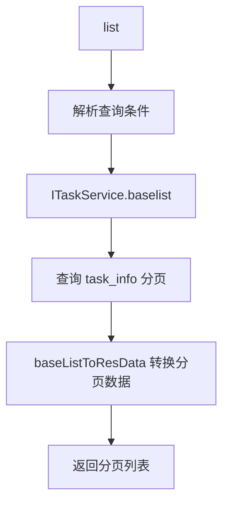
- **涉及表与 SQL**：[task_info](../../../数据库管理/db_task/task_info.md)（SELECT 分页）
- **调用链**：`ITaskService.baselist` -> `ITaskInfoDAO`

---

### applyForExecution (`scheduling.Task.applyForExecution`)

- **入口**：`cn.testin.service.scheduling.Task#applyForExecution(ApiRequest)`
- **实现意图**：设备在执行脚本前，向调度中心请求执行许可。调度中心检查任务状态、设备状态和并发限制，返回确认执行（result=1）或等待（result=0）。
- **请求参数**：

| 参数 | 类型 | 必填 | 说明 |
|------|------|------|------|
| taskid | String | 否 | 任务 ID |
| subtaskid | String | 否 | 子任务 ID |
| subsubtaskid | String | 否 | 子子任务 ID |
| deviceid | String | 否 | 设备 ID（含 @ 时视为 ucomid） |
| ucomid | String | 否 | 上位机 ID |

- **返回参数**：

| 字段 | 类型 | 说明 |
|---|---|---|
| action | String | 回显请求 action（`scheduling`） |
| op | String | 回显请求 op（`Task.applyForExecution`） |
| code | Integer | 状态码，0 成功 |
| msg | String | 提示信息 |
| data | JSONObject | 业务数据 |
| data.result | Integer | 1 确认执行 / 0 等待 |
- **处理流程**：
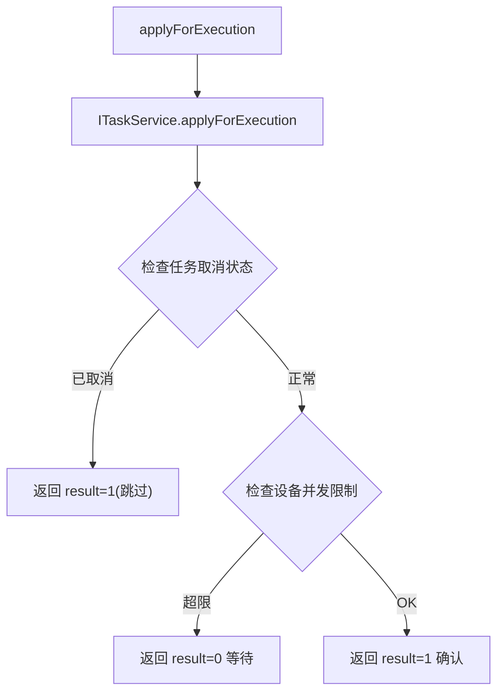
- **调用链**：`ITaskService.applyForExecution`
- **涉及表与 SQL**：[task_info](../../../数据库管理/db_task/task_info.md)、[task_sub_info](../../../数据库管理/db_task/task_sub_info.md)

---

### queueDetails (`scheduling.Task.queueDetails`)

- **入口**：`cn.testin.service.scheduling.Task#queueDetails(ApiRequest)`
- **实现意图**：查询各设备上的待执行任务数量（device_task_count 表），用于队列监控。
- **请求参数**：

| 参数 | 类型 | 必填 | 说明 |
|------|------|------|------|
| type | String | 否 | 资源类型（app/web/pc） |
| deviceids | JSONArray | 否 | 设备 ID 列表 |

- **返回参数**：

| 字段 | 类型 | 说明 |
|---|---|---|
| action | String | 回显请求 action（`scheduling`） |
| op | String | 回显请求 op（`Task.queueDetails`） |
| code | Integer | 状态码，0 成功 |
| msg | String | 提示信息 |
| data | JSONObject | 业务数据 |
| data.list | JSONArray | 设备任务数列表（元素 DeviceTaskCount） |
| data.list[].deviceid | String | 设备 ID |
| data.list[].taskNum | Integer | 子子任务数（等待执行脚本数） |
| data.list[].type | String | 任务资源端 |
- **涉及表与 SQL**：[device_task_count](../../../数据库管理/db_task/device_task_count.md)
- **调用链**：`IDeviceTaskCountDAO.deviceTaskList`

---

### modifyLevel (`scheduling.Task.modifyLevel`)

- **入口**：`cn.testin.service.scheduling.Task#modifyLevel(ApiRequest)`
- **实现意图**：批量修改任务的优先级（level）。
- **请求参数**：

| 参数 | 类型 | 必填 | 说明 |
|------|------|------|------|
| taskid | JSONArray | 是 | 任务 ID 数组 |
| level | Integer | 是 | 新优先级 |

- **返回参数**：

| 字段 | 类型 | 说明 |
|---|---|---|
| action | String | 回显请求 action（`scheduling`） |
| op | String | 回显请求 op（`Task.modifyLevel`） |
| code | Integer | 状态码，0 成功 |
| msg | String | 提示信息 |
| data | JSONObject | 业务数据 |
| data.result | Integer | 1 成功 / 0 失败 |
- **处理流程**：循环调用 `ITaskService.updateLevel(taskid, level)` 更新每个子任务的优先级
- **涉及表与 SQL**：[task_info](../../../数据库管理/db_task/task_info.md)（UPDATE level）、ES task_info 索引同步

---

### levelTaskList (`scheduling.Task.levelTaskList`)

- **入口**：`cn.testin.service.scheduling.Task#levelTaskList(ApiRequest)`
- **实现意图**：按优先级维度查询任务列表（levelList），主要用于管理后台查看各优先级下的任务排队情况。
- **请求参数**：

| 参数 | 类型 | 必填 | 说明 |
|------|------|------|------|
| projectid | Integer | 否 | 项目 ID |
| eid | Integer | 否 | 企业 ID |
| page | Integer | 否 | 页码 |
| pageSize | Integer | 否 | 每页数量 |
| deviceid | String | 否 | 设备 ID |
| allowDeviceid | String | 否 | 可执行设备 ID |
| allowDeviceids | String | 否 | 可执行设备 ID（含快速执行） |
| ucomid | String | 否 | 上位机 ID |
| osName | String | 否 | 系统名称 |
| browserType | String | 否 | 浏览器类型 |
| browserVersion | String | 否 | 浏览器版本 |
| taskDescr | String | 否 | 任务描述 |
| resourceType | String | 否 | 资源类型 |
| level | Integer | 否 | 优先级（内部取反后匹配） |
| sortKey | JSONArray | 否 | 排序字段（元素含 key、sortType：1 倒序 / 0 升序） |

- **返回参数**：

| 字段 | 类型 | 说明 |
|---|---|---|
| action | String | 回显请求 action（`scheduling`） |
| op | String | 回显请求 op（`Task.levelTaskList`） |
| code | Integer | 状态码，0 成功 |
| msg | String | 提示信息 |
| data | JSONObject | 业务数据 |
| data.list | JSONArray | 任务信息对象数组（元素为 DbTaskInfo，Gson 序列化） |
| data.list[].taskid | String | 任务 ID |
| data.list[].subtaskid | String | 子任务 ID |
| data.list[].deviceid | String | 设备 ID |
| data.list[].userid | Integer | 用户 ID |
| data.list[].testType | Integer | 测试类型 |
| data.list[].taskType | Integer | 任务类型 |
| data.list[].execStatus | Integer | 执行状态 |
| data.list[].level | Integer | 优先级 |
| data.list[].execNum | Integer | 执行次数 |
| data.list[].eid | Integer | 企业 ID |
| data.list[].projectid | Integer | 项目 ID |
| data.list[].taskDescr | String | 任务描述 |
| data.list[].resourceType | String | 执行终端类型 |
| data.list[].osName | String | 系统名称 |
| data.list[].browserType | String | 浏览器类型 |
| data.list[].browserVersion | String | 浏览器版本 |
| data.list[].ucomid | String | 上位机 ID |
| data.list[].createtime | Long | 创建时间 |
| data.page | Integer | 当前页 |
| data.pageSize | Integer | 每页大小 |
| data.totalRow | Integer | 总行数 |
| data.totalPage | Integer | 总页数 |
- **处理流程**：
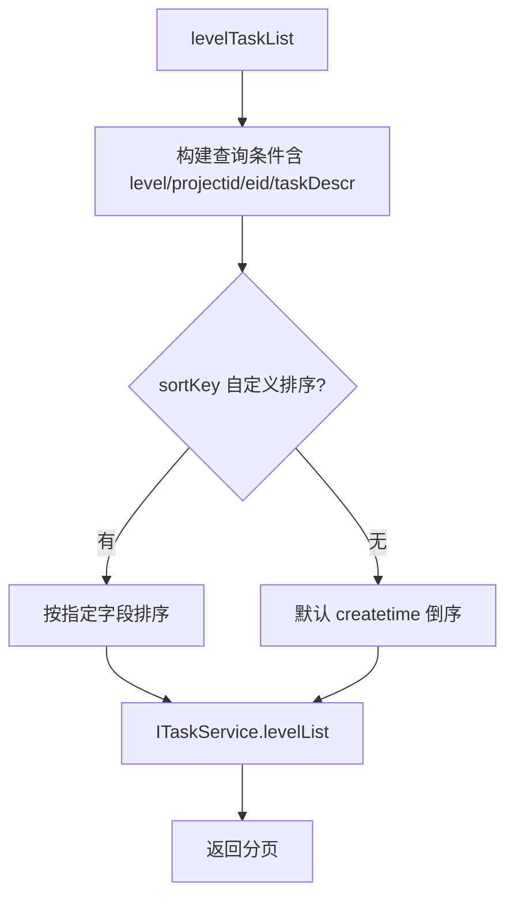
- **涉及表与 SQL**：[task_info](../../../数据库管理/db_task/task_info.md)（SELECT 多条件分页）

---

### execute (`scheduling.Task.execute`)

- **入口**：`cn.testin.service.scheduling.Task#execute(ApiRequest)`
- **实现意图**：将"待调度"状态的任务改为"待下发"状态，使任务进入匹配下发队列。通过 MQ 发送 scriptExecute 通知。
- **请求参数**：

| 参数 | 类型 | 必填 | 说明 |
|------|------|------|------|
| taskid | String | 是 | 任务 ID |
| projectid | Integer | 是 | 项目 ID |

- **返回参数**：

| 字段 | 类型 | 说明 |
|---|---|---|
| action | String | 回显请求 action（`scheduling`） |
| op | String | 回显请求 op（`Task.execute`） |
| code | Integer | 状态码，0 成功 |
| msg | String | 提示信息 |
| data | JSONObject | 业务数据 |
| data.result | Integer | 1 成功 / 0 失败 |
- **处理流程**：
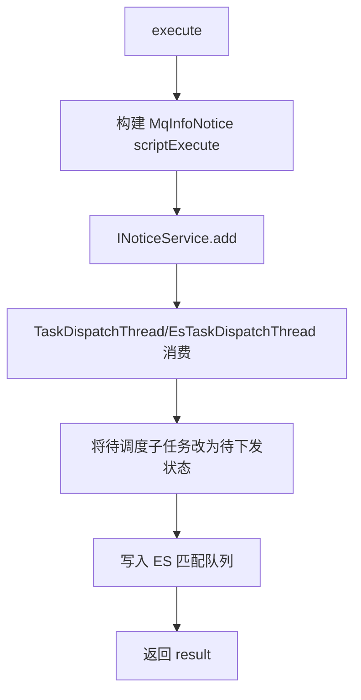
- **调用链**：`INoticeService` (MQ) -> `EsTaskDispatchThread` -> `ITaskService`
- **涉及表与 SQL**：[task_info](../../../数据库管理/db_task/task_info.md)（UPDATE exec_status -2->0）、ES task_info 索引
