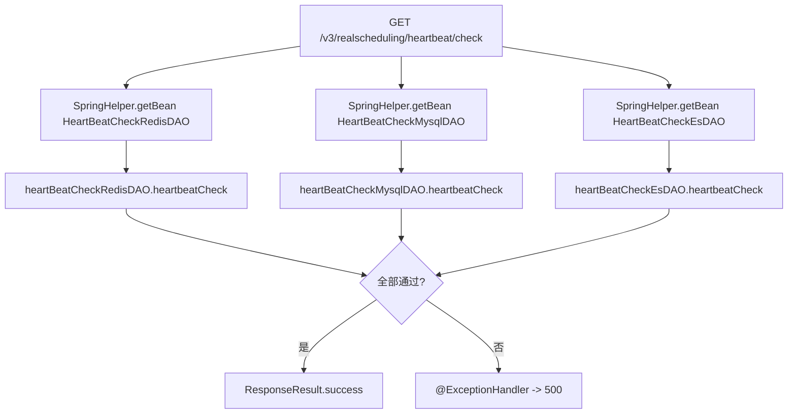

# HeartBeatController

任务调度服务 模块健康检查控制器，提供 MySQL / Redis / ES 三存储的健康探测。

## 接口列表

### check (`GET /v3/realscheduling/heartbeat/check`)

- **入口**：`cn.testin.controller.HeartBeatController#check()`
- **实现意图**：对 MySQL（db_task）、Redis、Elasticsearch 三个存储执行轻量探活，全部通过则返回 success，任一失败抛出 `HealthyCheckGenericException` 被 `@ExceptionHandler` 捕获返回 500。
- **请求参数**：无
- **返回参数**：

| 字段 | 类型 | 说明 |
|---|---|---|
| code | Integer | 0 成功；任一存储异常返回错误码并带 HTTP 500 |
| msg | String | 提示信息（成功为「成功」，异常为错误信息） |
| data | JSONObject | 空对象 `{}` |
- **处理流程**：

- **调用链**：内部 DAO 自检
- **涉及表与 SQL**：Redis PING / MySQL 查询（db_task 库） / ES cluster health
- **异常与校验**：`HealthyCheckGenericException` 被 `@ExceptionHandler` 捕获，返回 500 + error 信息
- **关键代码摘录**：
```java
// cn.testin.controller.HeartBeatController
@RequestMapping(value = "/heartbeat/check", method = RequestMethod.GET)
@ResponseBody
public ResponseResult check() {
    HeartBeatCheckRedisDAOImpl heartBeatCheckRedisDAO = (HeartBeatCheckRedisDAOImpl) SpringHelper.getBean("IHeartBeatCheckRedisDAO");
    HeartBeatCheckMysqlDAOImpl heartBeatCheckMysqlDAO = (HeartBeatCheckMysqlDAOImpl) SpringHelper.getBean("IHeartBeatCheckMysqlDAO");
    HeartBeatCheckEsDAOImpl heartBeatCheckEsDAO = (HeartBeatCheckEsDAOImpl) SpringHelper.getBean("IHeartBeatCheckEsDAO");
    heartBeatCheckRedisDAO.heartbeatCheck();
    heartBeatCheckMysqlDAO.heartbeatCheck();
    heartBeatCheckEsDAO.heartbeatCheck();
    return ResponseResult.success(new HashMap<>());
}
```
