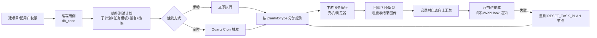

# 产品概述

> **Git 仓库**：`git@git.testin.cn:stock/backend/testin-core.git`　**分支**：`syy.release.z7.8.1.0`

## 这是什么

平台基础功能服务（代码工程 testin-core）是 Testin 云真机平台的**编排层与基础数据中心**。它自己一台设备都不碰、一条脚本都不跑，负责的是：

1. **基础数据**：用户、企业、项目、角色权限、SSO/LDAP 登录（db_user）。
2. **用例资产**：测试用例的目录、步骤、标签、评论、版本（db_case）。
3. **测试计划编排**：把任务模板按子计划组织成可执行的测试计划，负责触发执行、跟踪进度、汇总结果、发送通知（db_plan）。
4. **通知中枢**：邮件/短信/HTTP/钉钉/飞书/企业微信等 9 渠道的通知配置与发送（db_notice）。

真正的任务执行由下游服务完成：平台基础功能服务只"提测"（创建任务、触发执行），然后等下游回调结果，再做汇总与通知。

## 在平台中的角色

| 职责 | 平台基础功能服务 | 任务管理服务 | app处理服务 | web/pc处理服务 | 任务调度服务 | 设备控制中心 |
|---|---|---|---|---|---|---|
| 用户/项目/权限/登录 | **核心** | — | — | — | — | — |
| 用例管理 / 测试计划编排 | **核心** | — | — | — | — | — |
| 执行记录跟踪 / 回调汇总 / 通知 | **核心** | 回调生产方 | 回调生产方 | 回调生产方 | — | — |
| 用例（CASE）任务执行 | 提交请求 | **核心** | — | — | — | 下发 |
| APP / Web / 桌面任务执行 | 提交请求 | — | **核心** | **核心** | 匹配调度 | 下发 |
| 设备匹配与真机控制 | — | 锁设备 | — | — | 心跳匹配 | **核心** |

关键点：**一次测试计划执行按 `planInfoType` 分三条出口**（分流代码：`src/main/java/cn/testin/business/impl/plan/ExecuteRecordTaskServiceImpl.java`）：

- `CASE(1000)` 用例计划 → `RealTaskV3Api.executeTask` → **任务管理服务**（不经任务调度服务）；
- `APP(1)` → `RealTestV3Api.taskAdd` 或 V1 RPC `APP_ACTION/taskAdd` → **app处理服务**（经任务调度服务）；
- `WEB(2/3) / DESKTOP(5)` → V1 RPC `TASK_ACTION/taskCreate` → **web/pc处理服务**（经任务调度服务）。

## 用户与使用场景

| 角色 | 典型场景 |
|---|---|
| 测试工程师 | 建项目 → 写用例 → 组测试计划 → 手动/定时执行 → 看执行记录与报告 |
| 测试负责人 | 按迭代组织计划、跟踪计划进度、配置执行周期与通知 |
| 运维/管理员 | 企业管理、角色权限、SSO/LDAP 配置、磁盘监控、运维告警 |
| CI/CD 流水线 | 通过开放接口触发计划执行、挂回调 URL 接完成通知 |
| 其他平台服务 | 调用户/项目/权限接口取基础数据；调计划回调接口回传执行结果 |

## 核心概念

- **项目（Project）**：数据隔离的最大单位，用户-项目-角色三元组决定权限。见 `DbProjectInfo` / `DbUserProjectRoleInfo`。
- **用例（Case）**：db_case 中的测试用例资产，带目录树、步骤、标签、版本。见 `CaseInfo` / `CaseStep`。
- **测试计划（PlanInfo）**：编排单位 = 若干**子计划（SubPlanInfo）**，子计划下挂**任务模板（PlanTask，关联 real 侧任务模板）**，可加前置/后置任务与策略（PlanTaskStrategy）。计划可分四种类型（`TaskTypeEnum`）：APP(1)、WEB(2/3)、DESKTOP(5)、CASE(1000)。
- **执行记录（ExecuteRecord）**：一次计划执行的快照。执行时把计划模板树**深拷贝**成执行记录树：`execute_record`（一次执行）→ `execute_record_task`（树节点，含子计划/任务/重测节点）→ `execute_record_task_case/script/device`（明细）。节点类型见 `RecordTaskTypeEnum`：SUB_PLAN(1)/TASK_PLAN(2)/RESET_TASK_PLAN(3)/聚合节点(4)。
- **回调（Callback）**：下游执行服务按 7 种回调类型回传进度与结果，平台基础功能服务策略化消费后自底向上汇总。见 `TaskCallbackTypeEnum`。

## 功能地图

```
平台基础功能服务
├── 基础数据（db_user / db_admin）
│   ├── 用户与认证   → 注册/登录（密码/LDAP/SSO）、在线状态、活动记录
│   ├── 企业/项目    → 企业信息、项目 CRUD、用户-项目-角色
│   └── 系统配置     → 系统参数、管理员、审计
├── 用例资产（db_case）
│   └── 用例管理     → 目录/用例/步骤/标签/评论/版本/统计
├── 测试计划（db_plan）—— 本服务核心
│   ├── 计划编排     → 计划/子计划/任务模板/策略/设备/执行周期
│   ├── 触发执行     → 手动执行 + Quartz 定时执行
│   ├── 提测调度     → 预提测线程 + 30s 轮询执行线程 + 三段分流
│   ├── 执行记录     → 记录树查询/停止/取消/重测/分享
│   └── 回调汇总     → 7 种回调策略消费 → taskFinishAfterDeal 汇总 → 邮件/回调通知
├── 任务管理（db_portal）
│   └── Portal 任务  → 跨服务任务提交入口（taskType=1 发 app处理服务，其他发 web/pc处理服务）
├── 通知（db_notice）
│   ├── 业务通知     → 计划完成邮件、WebHook 回调
│   ├── 渠道与事件   → 渠道配置/事件配置/发送记录
│   └── 运维告警     → ops 告警事件与通知
└── 基础设施（db_common / db_bi / db_cross / db_portal）
    ├── 目录管理     → 通用目录树
    ├── Quartz 管理  → 计划定时执行的 Job 登记
    ├── 磁盘监控 / 操作日志 / BI 统计
```

## 典型使用动线



## 延伸阅读

- [功能总览](功能总览.md) — 逐模块功能清单、数据模型要点与操作约束
- [测试计划执行链路实现](../03-实现逻辑/测试计划执行链路实现.md) — 代码级主链路
- [端到端-测试计划执行](../../跨模块链路/端到端-测试计划执行.md) — 跨服务全景
- [存储总览](../02-技术架构/00-存储总览.md) — 9 个数据源与表分布
- [开放接口文档索引](../07-开放接口文档/00-模块索引.md)
