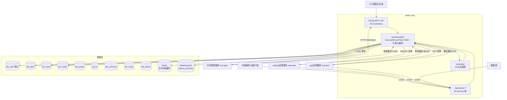

# 总体架构

## 平台定位

平台基础功能服务（testin-core）是 Testin 云真机平台的**编排大脑**，负责测试计划编排、用例管理、用户认证、通知分发和定时调度。它不直接执行测试，而是作为总调度中心：组装计划模板 → 快照建执行树 → 按 `planInfoType` 分流到三条执行管道（CASE → 任务管理服务、APP → app处理服务、Web/PC → web/pc处理服务）→ 回收结果汇总通知。

## 系统上下文

## 核心架构决策

### 1. 双入口架构：ApiServlet 兜底 + Spring MVC 新接口

`/*` → `ApiServlet`：action/op 参数反射调用 `cn.testin.service.{action}` 包下类；`/v3/*` → `DispatcherServlet`：标准 `@RestController`。旧功能走 V1 反射，新功能（计划/用例/通知）全部走 V3。详见 [横切-双入口路由机制](横切-双入口路由机制.md)。

### 2. 多数据源 dynamic-datasource + @DS 注解

9 个 MySQL 库通过 `@DS` 注解切换，默认 `db_user`。Druid 连接池（初始 10，最大 40）。ES 通过 `RestHighLevelClient` XML 注入、禁用 Spring Boot 自动装配。多数据源隔离使一个 SQL 错误不至于波及全库。

### 3. 通知系统 Dispatcher + Worker 模式

9 渠道（邮件/SMS/HTTP/钉钉/飞书/企业微信/Teams/JoyChat/FAW）各有一个 Dispatcher 线程从 Redis 队列消费，分发给 Worker 线程池执行发送。所有线程在 `SpringStartRunner` 启动，支持失败重试与 MQ 持久化。详见 [横切-通知系统](横切-通知系统.md)。

### 4. 测试计划执行三出口 + 报告概述分流

`executePlanInfo()` 快照建树 → `ExecuteTaskThread` 30s 轮询提测 → 按 `planInfoType` 分流：
- CASE（用例类）→ 任务管理服务 `executeTask`
- APP（脚本类）→ app处理服务 `taskAdd`
- Web/Desktop → web/pc处理服务 `taskCreate`

**报告概述回调**按同样规则反向回流：APP 任务结果由 app处理服务汇总后回调 `executeRecordTaskCallback`，非 APP（Web/PC/CASE）任务结果由 web/pc处理服务或任务管理服务回调。Portal 任务提交同样遵循此分流：`taskType=1`（APP）→ app处理服务，其余 → web/pc处理服务。

详见 [核心链路-测试计划执行](../04-复杂功能细节/核心链路-测试计划执行.md)、[核心链路-回调处理](核心链路-回调处理.md)、[跨模块链路索引](../../跨模块链路/00-索引.md)。

### 5. 13 个 AsyncConfig 线程池 + Quartz 定时调度

按 CPU 核数 × 2 设置 corePoolSize，覆盖执行、通知、统计等场景。Quartz 使用 RAMJobStore（单节点），无 JDBC 持久化——重启后定时任务不丢失（由 DB 状态驱动重建）。

## 代码工程一览

| 工程 | 技术栈 | 产物 | 说明 |
|---|---|---|---|
| `testin-core` | Java 1.8 / Spring Boot 2.3.7 / Undertow / MyBatis Plus / Druid / ES | jar | 单模块 Maven 工程，`Boot.main()` 双 Servlet 注册 |
| `real-common` | Java 1.8 | jar（依赖） | ApiServlet 基类、ApiUtil、通用 DAO，被多个 real-* 服务依赖 |

## 端口与地址速查

| 项       | 值                        | 说明                  |
| ------- | ------------------------ | ------------------- |
| 服务 HTTP | 8080（默认）                 | Undertow 容器         |
| 域名      | core.pro.testin.cn       | V3 管理台主入口           |
| ES 集群   | es.pro.testin.cn:9200    | RestHighLevelClient |
| Redis   | redis.pro.testin.cn:6379 | Jedis 直连            |
|         |                          |                     |

## 延伸阅读

- [存储总览](00-存储总览.md) — 9 个 MySQL 库 + Redis key 全景
- [核心链路-测试计划执行](../04-复杂功能细节/核心链路-测试计划执行.md) / [核心链路-定时执行](../04-复杂功能细节/核心链路-定时执行.md) / [核心链路-回调处理](核心链路-回调处理.md)
- [横切-任务状态机](横切-任务状态机.md) / [横切-通知系统](横切-通知系统.md) / [横切-后台线程全景](横切-后台线程全景.md)
- [跨模块：测试计划执行](../../跨模块链路/端到端-测试计划执行.md)
