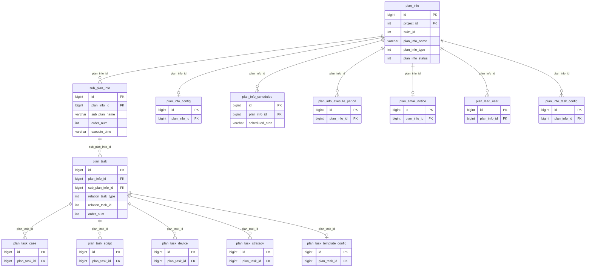
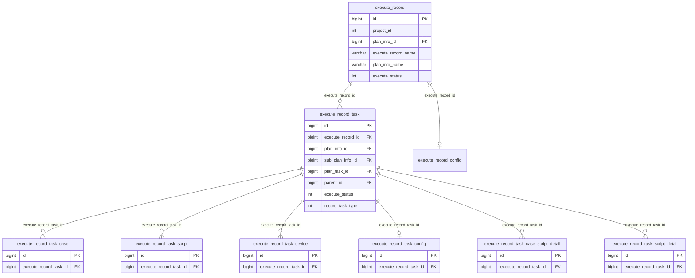
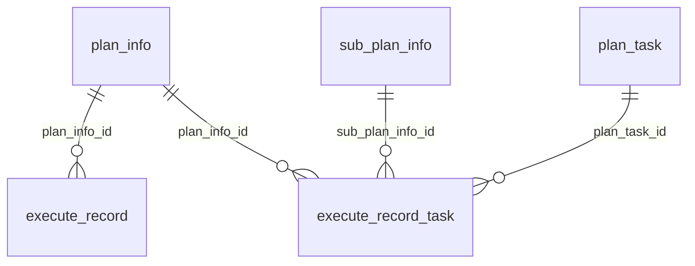
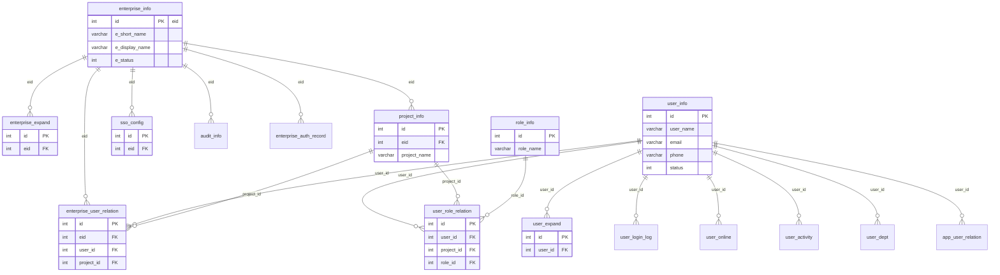
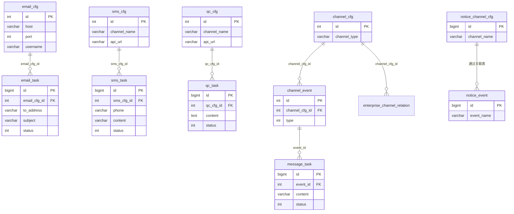
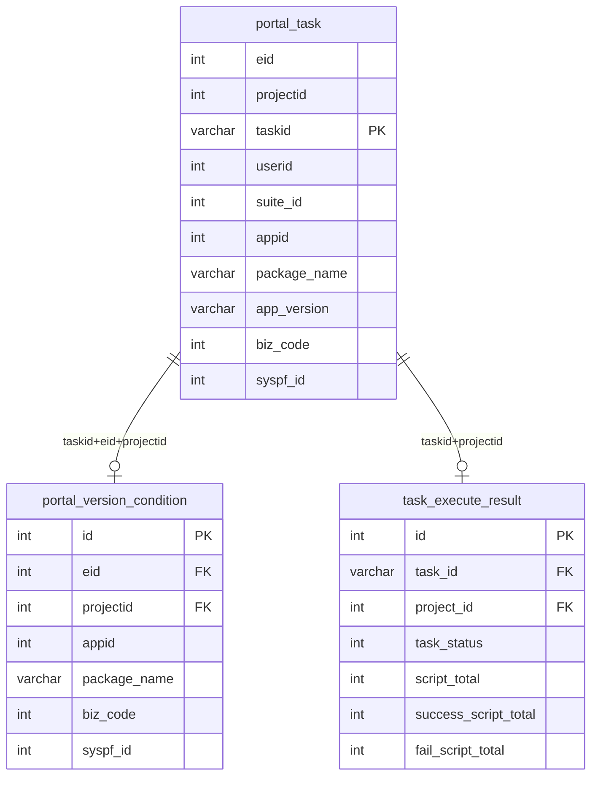
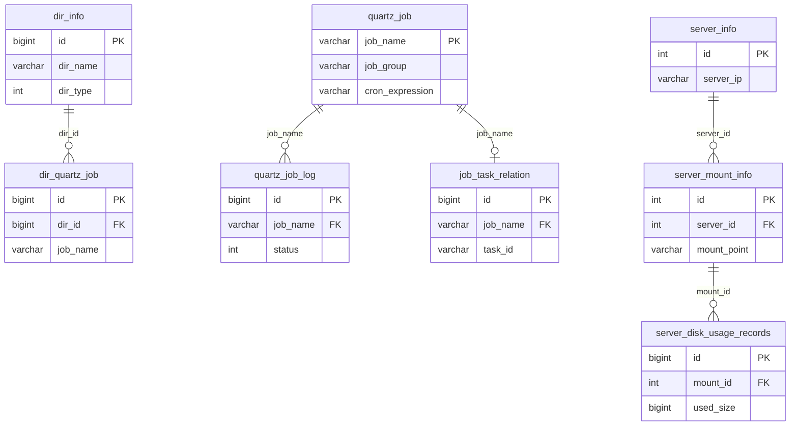
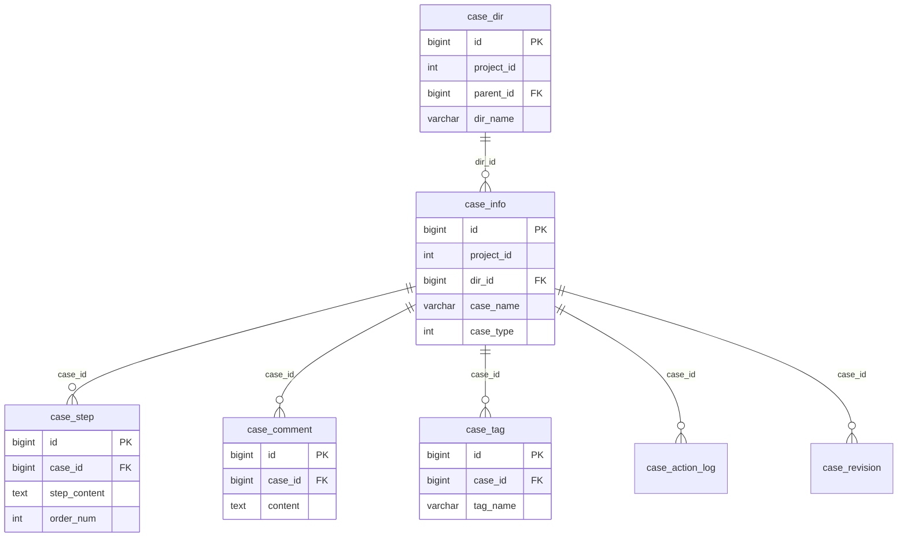
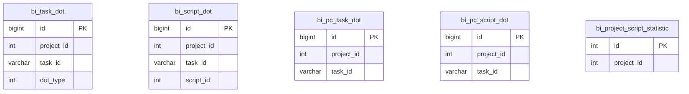
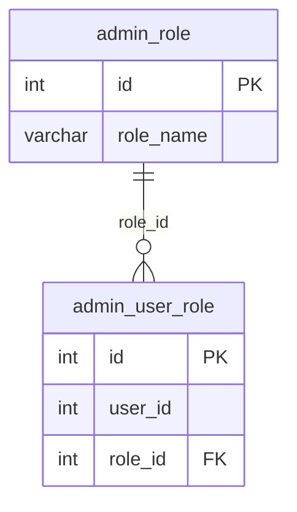

# SQL 表关系总览

> 平台基础功能服务 9 个 MySQL 库的核心表关系（ER），按业务域分组。字段名含 `_id` 后缀的为外键关联字段。

## 一、db_plan — 测试计划与执行记录

### 1.1 计划模板树（plan_info → sub_plan_info → plan_task）

**关系说明**：

| 父表 (1) | 子表 (N) | 关联字段 | 含义 |
|-----------|---------|---------|------|
| `plan_info` | `sub_plan_info` | `plan_info_id` | 一个计划包含多个子计划 |
| `plan_info` | `plan_info_config` | `plan_info_id` | 计划配置（1:1） |
| `plan_info` | `plan_info_scheduled` | `plan_info_id` | 计划定时执行配置（可多个 cron） |
| `plan_info` | `plan_info_execute_period` | `plan_info_id` | 计划可执行时间段 |
| `plan_info` | `plan_email_notice` | `plan_info_id` | 计划邮件通知（1:1） |
| `plan_info` | `plan_lead_user` | `plan_info_id` | 计划负责人（多人） |
| `plan_info` | `plan_info_task_config` | `plan_info_id` | 计划级别的任务配置 |
| `sub_plan_info` | `plan_task` | `sub_plan_info_id` | 子计划下的任务列表 |
| `plan_task` | `plan_task_case` | `plan_task_id` | 任务关联的用例 |
| `plan_task` | `plan_task_script` | `plan_task_id` | 任务关联的脚本 |
| `plan_task` | `plan_task_device` | `plan_task_id` | 任务关联的设备 |
| `plan_task` | `plan_task_strategy` | `plan_task_id` | 任务执行策略 |
| `plan_task` | `plan_task_template_config` | `plan_task_id` | 任务模板配置（1:1） |

### 1.2 执行记录树（execute_record → execute_record_task）

**关系说明**：

| 父表 (1) | 子表 (N) | 关联字段 | 含义 |
|-----------|---------|---------|------|
| `execute_record` | `execute_record_task` | `execute_record_id` | 一次执行对应多个任务 |
| `execute_record` | `execute_record_config` | `execute_record_id` | 执行配置（1:1） |
| `execute_record_task` | `execute_record_task_case` | `execute_record_task_id` | 任务关联的用例 |
| `execute_record_task` | `execute_record_task_script` | `execute_record_task_id` | 任务关联的脚本 |
| `execute_record_task` | `execute_record_task_device` | `execute_record_task_id` | 任务关联的设备 |
| `execute_record_task` | `execute_record_task_config` | `execute_record_task_id` | 任务配置（1:1） |

**execute_record_task 的 parent_id 自引用**：任务节点形成树，`parent_id` 指向父任务节点。根节点 `parent_id = 0`。

### 1.3 模板 ↔ 执行快照的关联

执行时 `executePlanInfo()` 将模板数据快照到执行表：
- `execute_record.plan_info_id` → `plan_info.id`
- `execute_record_task.plan_info_id` → `plan_info.id`
- `execute_record_task.sub_plan_info_id` → `sub_plan_info.id`
- `execute_record_task.plan_task_id` → `plan_task.id`

### 1.4 其他辅助表

| 表 | 说明 |
|----|------|
| `plan_device` | 计划级别的设备配置（独立于 plan_task_device） |
| `script_statistic` | 脚本执行统计 |
| `plan_info_task_template_status_sync` | 任务模板同步状态跟踪 |

---

## 二、db_user — 用户与企业

**核心关系**：

| 关系 | 关联表 | 说明 |
|------|--------|------|
| 企业 → 用户 | `enterprise_user_relation` | 多对多：用户在企业的项目中的角色 |
| 企业 → 项目 | `project_info.eid` | 一对多：企业下有多个项目 |
| 用户 → 角色 | `user_role_relation` | 用户在特定项目下拥有特定角色 |
| 用户 → 部门 | `user_dept` | 用户部门信息 |
| 用户 → 设备绑定 | `app_user_relation` | 用户与应用设备关联 |

---

## 三、db_notice — 通知与消息

**关系说明**：

| 父表 | 子表 | 关联字段 | 说明 |
|------|------|---------|------|
| `email_cfg` | `email_task` | `email_cfg_id` | 邮件配置 → 待发送邮件任务 |
| `sms_cfg` | `sms_task` | `sms_cfg_id` | 短信配置 → 待发送短信任务 |
| `qc_cfg` | `qc_task` | `qc_cfg_id` | QC 配置 → QC 缺陷任务 |
| `channel_cfg` | `channel_event` | `channel_cfg_id` | 渠道 → 事件绑定 |
| `channel_cfg` | `enterprise_channel_relation` | `channel_cfg_id` | 渠道的企业级关联 |
| `channel_event` | `message_task` | `event_id` | 事件触发 → 消息任务 |
| `notice_event` | `ops_notice_event_channel_relation` | — | 运维告警事件 ↔ 渠道多对多 |

### 其他表

| 表 | 说明 |
|----|------|
| `email_templet` | 邮件模板定义 |
| `email_templet_config` | 邮件模板项目级配置（project_id） |
| `templet_cfg` | 模板配置 |
| `sms_templet` | 短信模板 |
| `http_task` | HTTP 回调待发送任务 |
| `msg_task` | IM 消息任务（钉钉/飞书/企微/Teams/JoyChat/FAW） |
| `notice_log` | 通知发送日志 |

---

## 四、db_portal — 真机门户

**说明**：
- `portal_task` 按 eid 分表（`portal_task_00` ~ `portal_task_99`）
- `portal_task` → `portal_version_condition`：通过 `addTask` MQ 通知异步写入，存储版本检索条件
- `portal_task` → `task_execute_result`：任务完成时 `dealTaskExecuteResult()` 写入执行统计

---

## 五、db_common — 公共数据

**其他独立表**：`action_log`（活动日志）、`operate_log`（操作日志）

---

## 六、db_case — 用例管理

**关系说明**：

| 父表 | 子表 | 关联字段 | 说明 |
|------|------|---------|------|
| `case_dir` | `case_info` | `dir_id` | 目录下的用例 |
| `case_dir` | `case_dir` | `parent_id` | 目录树自引用 |
| `case_info` | `case_step` | `case_id` | 用例的步骤 |
| `case_info` | `case_comment` | `case_id` | 用例的评论 |
| `case_info` | `case_tag` | `case_id` | 用例的标签 |

**独立表**：`case_statistic`（用例统计）、`case_script_no_sync`（脚本未同步追踪）

---

## 七、db_bi — BI 统计打点

全部为独立打点表，无外键关联，按 `project_id` + `task_id` 查询。

---

## 八、db_admin — 管理后台

---

## 九、db_cross — 跨模块关联

当前库表未文档化（待补充）。

---

## 跨库引用模式

平台基础功能服务 中常见跨库引用方式：

| 模式 | 示例 | 说明 |
|------|------|------|
| `{db}.project_id` 软引用 | `db_plan.plan_info.project_id` → `db_user.project_info.id` | 无 FK 约束，仅值相等 |
| `{db}.eid` 软引用 | `db_portal.portal_task.eid` → `db_user.enterprise_info.id` | 企业隔离键 |
| `{db}.user_id` 软引用 | `db_plan.execute_record.create_user_id` → `db_user.user_info.id` | 创建人/操作人 |

> 注意：这些跨库引用在 MySQL 中没有物理外键约束，依赖应用层代码保证一致性。
