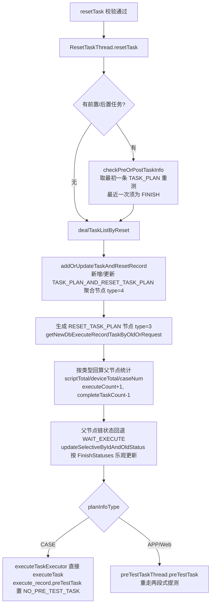

# 提测调度与重测实现

## 概述

本文讲平台基础功能服务的两块"后台驱动"逻辑：

1. **提测调度**：计划触发后，靠一组线程/定时任务把执行记录树上的任务节点逐个推给下游执行——`PreTestTaskThread` 预提测、`ExecuteTaskThread` 轮询触发、若干重启/取消兜底线程；
2. **回调策略**：下游按 7 种回调类型回传，本服务用枚举+策略模式消费（`CallbackTypeStrategyEnum`）；
3. **重测编排**：对已完成任务生成 `RESET_TASK_PLAN` 节点完整重跑，含单任务重测与批量重测两条入口。

主链路的逐步讲解见 [测试计划执行链路实现](测试计划执行链路实现.md)，跨服务段见 [端到端-重测](../../跨模块链路/端到端-重测.md)。

## 提测调度线程全景

`src/main/java/cn/testin/schedule/plan/` 下的线程分工：

| 线程 | 触发方式 | 职责 | 关键位置 |
|---|---|---|---|
| `PreTestTaskThread` | `@Async("preTestTaskExecutor")`，由 executePlanInfo / ResetTaskThread / 重启线程调用 | 扫描执行记录下 WAIT_EXECUTE 的任务节点，逐个 `preTestSingleTask` 预提测建任务拿 taskId；首个任务提测完立即触发一次 executeTask | schedule/plan/PreTestTaskThread.java |
| `ExecuteTaskThread` | `@Scheduled(cron="0/30 * * * * ?")` | 30s 轮询近 30 天未完成执行记录，Redis 全局锁 `EXECUTE_TASK`（120s），CompletableFuture 并发触发 executeTask | schedule/plan/ExecuteTaskThread.java |
| `PreTestTaskRestartThread` | `@Scheduled(cron="45 0/5 * * * ?")` + 启动即跑一次 | 兜底：扫描 `preTestTask=NO_PRE_TEST_TASK` 的记录重新丢给 PreTestTaskThread——防止服务重启/异常导致预提测丢失 | schedule/plan/PreTestTaskRestartThread.java |
| `CancelTaskThread` | 由停止接口 / 前置失败策略 / 取消检查线程调用 | 真正下发取消：CASE 走 HTTP `{realTask}/v3/real_task/cancel`，APP/Web 走 V1 RPC `TASK_CANCEL` | schedule/plan/CancelTaskThread.java |
| `CancelTaskCheckThread` | `@Scheduled(cron="20 4/5 * * * ?")` | 5 分钟扫描"取消中"任务，对长时间没收到取消回调的做兜底处理 | schedule/plan/CancelTaskCheckThread.java |
| `QuartzPlanInfoExecuteJob` | Quartz Cron（计划上配置的定时） | 定时执行入口，直接调 `planInfoService.executePlanInfo(planInfoId, null)` | schedule/plan/QuartzPlanInfoExecuteJob.java |
| `ResetTaskThread` | 由 resetTask/batchReset 调用 | 生成重测节点并重新触发提测，详见下文 | schedule/plan/ResetTaskThread.java |

### PreTestTaskThread 的并发控制细节

`preTestTask`（`PreTestTaskThread.java`）值得注意的几点：

- **单记录单线程**：`ExecuteTaskThreadCache.getExecuteRecordIdThread()` 内存 Map 记录哪个 executeRecordId 正在被预提测，重复进入直接 return；同时 `RecordTaskIdWithExecuteTaskId` Map 保存 taskId 对应关系供取消时使用；
- **取消竞态**：预提测前查 `ExecuteTaskThreadCache.cancelRecordTask`，发现任务正被并行取消则跳过；代码注释明确说"正常应该加锁，但冲突非常少，只做简单 Map 处理"；
- **异常即抛出**：注释"提测存在问题直接抛出。不抛出会导致状态没有更新，循环一直存在"——preTestSingleTask 失败会把节点置回 WAIT_EXECUTE 并记 taskFailMsg，抛出后由重启线程 5 分钟后捡起；
- **首任务立即触发**：第一个任务预提测完不等 30s 轮询，直接 `executeTaskExecutor.execute(() -> executeTask(...))`——有 executePeriod 的先判断当前是否处于执行时间段；
- 全部完成后把 `execute_record.preTestTask` 置为 PRE_TEST_TASK（已预提测），重启线程靠这个标记筛出没完成的记录。

## 回调：7 种类型与策略模式

### 类型定义

`TaskCallbackTypeEnum`（`src/main/java/cn/testin/common/enums/TaskCallbackTypeEnum.java`）：

| type | 枚举 | 含义 |
|---|---|---|
| 1 | INIT_TASK_CALLBACK | 任务初始化子任务/子子任务成功，回调执行脚本总数 |
| 2 | SCRIPT_CALLBACK | 单脚本执行完成，回传脚本结果数据 |
| 3 | TASK_CALLBACK | 任务完成，回传任务结果用于更新状态（前置任务有特殊处理） |
| 4 | SEND_SUB_TASK_CALLBACK | 子任务下发通知，回传执行中的脚本数据 |
| 5 | UPDATE_SCRIPT_STATUS_CALLBACK | 手动更新脚本状态 |
| 6 | UPDATE_ERROR_CAUSE_TYPE_CALLBACK | 更新错误原因类型 |
| 7 | CASE_CALLBACK | 用例执行完成，回传用例结果数据 |

### 策略装配与消费

- **枚举持有 Spring bean**：`CallbackTypeStrategyEnum`（`src/main/java/cn/testin/business/strategy/plan/CallbackTypeStrategyEnum.java`）每个枚举值持有抽象 `RecordTaskCallbackStrategy service`；
- **启动装配**：`InitCallBackStrategy.init()`（`@PostConstruct`，`src/main/java/cn/testin/business/strategy/plan/InitCallBackStrategy.java`）把 7 个 `@Service` 实现注入对应枚举，再 `initMap()` 建 type→枚举的静态 Map；
- **消费**：`ExecuteRecordTaskServiceImpl.executeRecordTaskCallback`（`src/main/java/cn/testin/business/impl/plan/ExecuteRecordTaskServiceImpl.java`）查节点 → `getStrategyByType` → `strategyEnum.getService().dealCallBackInfo(...)`；任一环节失败只打日志返回 0（不重试）；
- 策略实现同目录：`InitTaskCallbackStrategyService` / `ScriptCallbackStrategyService` / `TaskCallbackStrategyService` / `SendSubTaskCallbackStrategyService` / `UpdateScriptStatusCallbackStrategy` / `UpdateErrorCauseTypeStrategyService` / `CaseCallbackStrategyService`；
- **TASK_CALLBACK 是汇总枢纽**：`TaskCallbackStrategyService` 最终调 `taskFinishAfterDeal`做父节点汇总，见 [测试计划执行链路实现](测试计划执行链路实现.md) 第 5 节与 [核心链路-回调处理](../04-复杂功能细节/核心链路-回调处理.md)。

> 注意这是**枚举+setter 注入**的非典型写法：策略 Map 是静态的、bean 由 `@PostConstruct` 塞入。新增回调类型要同时加 `TaskCallbackTypeEnum`、`CallbackTypeStrategyEnum` 枚举值、策略实现类、`InitCallBackStrategy` 装配行，以及下游生产方——两端必须同版本发布。

## 重测实现（RESET_TASK_PLAN）

### 入口与校验

- **单任务重测**：`POST /v3/test_plan/execute_record_tasks/reset_task`（`src/main/java/cn/testin/controller/plan/ExecuteRecordTaskController.java`）→ `ExecuteRecordServiceImpl.resetTask`（`src/main/java/cn/testin/business/impl/plan/ExecuteRecordServiceImpl.java`）：**取消中/执行中的任务禁止重测**；
- **批量重测**：`POST /v3/test_plan/execute_record_tasks/batch_reset`（ExecuteRecordTaskController.java）→ `ExecuteRecordServiceImpl.batchReset`（ExecuteRecordServiceImpl.java），按 scriptStatus 筛选（executePlanInfo 的 resetFlag 入口默认 FAIL/TIME_OUT/CANCEL/SKIP 四种）；
- Web 侧脚本重测存在"绕回"环路：web/pc处理服务 的 `TaskServiceImpl.create` 检测到 `executeRecordTaskId` 会回调本服务 resetTask，再经 `preTestSingleTask` 发回 web/pc处理服务 建独立任务（见 [端到端-重测](../../跨模块链路/端到端-重测.md)）。

### ResetTaskThread 编排

`ResetTaskThread.resetTask`（`src/main/java/cn/testin/schedule/plan/ResetTaskThread.java`）的核心动作：

要点：

1. **不覆盖首测**：新增 RESET_TASK_PLAN 节点挂在聚合节点（type=4）下，首测 TASK_PLAN 节点与结果原样保留，统计累计到聚合节点（`addOrUpdateTaskAndResetRecord`）；
2. **父节点计数回算**：`updateTaskTotalAndCountByOldTask`（ResetTaskThread.java）对子计划/根子计划重算 scriptTotal/deviceTotal/caseNum 并 `addExecuteCount(+1)`；注释明确"批量重测有并发问题，不能通过旧值更新，只能让数据库自己算"——全部走 `addXxxCount` 的 `col = col + ?` SQL 原子更新；
3. **只跑失败**：`onlyRetest=1` + `retestTaskReportCaseIds`（CASE）、`resetInfo(oldTaskId, subSubTaskIds)`（APP/Web）随 relationTaskContent 透传到下游；
4. **换设备**：`retestUpdateDevice=1` 时预提测不套用计划级设备，沿用重测请求里用户选的设备（preTestSingleTask 中 `useRetestDevice` 分支）；
5. **触发**：CASE 直接 executeTask；APP/Web 先把 `execute_record.preTestTask` 打回 NO_PRE_TEST_TASK 再走 PreTestTaskThread——重测完全复用首测的两段式提测与三出口分流。

### 重测 vs 首测速查

| 维度 | 首测 | 重测 |
|---|---|---|
| 记录树节点 | TASK_PLAN(2) | 新增 RESET_TASK_PLAN(3) + 聚合节点(4) |
| 设备 | 计划/模板配置 | `retestUpdateDevice=1` 用重测请求设备 |
| 范围 | 全部用例/脚本 | 可 `onlyRetest` 只跑失败 |
| 结果 | 新建记录树 | 首测保留，聚合节点累计 |
| 提测路径 | 两段式（CASE 无预提测） | 完全复用首测路径 |

## 关键代码位置表

| 环节 | 类 / 方法 | 位置 |
|---|---|---|
| 预提测线程 | PreTestTaskThread.preTestTask | src/main/java/cn/testin/schedule/plan/PreTestTaskThread.java |
| 预提测重启兜底 | PreTestTaskRestartThread.preTestTaskRestart | src/main/java/cn/testin/schedule/plan/PreTestTaskRestartThread.java |
| 执行轮询 | ExecuteTaskThread.executeTask | src/main/java/cn/testin/schedule/plan/ExecuteTaskThread.java |
| 取消下发 | CancelTaskThread（CASE:208 / APP/Web:198-201） | src/main/java/cn/testin/schedule/plan/CancelTaskThread.java |
| 取消检查 | CancelTaskCheckThread.cancelTaskCheck | src/main/java/cn/testin/schedule/plan/CancelTaskCheckThread.java |
| 回调策略装配 | InitCallBackStrategy.init | src/main/java/cn/testin/business/strategy/plan/InitCallBackStrategy.java |
| 回调策略路由 | CallbackTypeStrategyEnum | src/main/java/cn/testin/business/strategy/plan/CallbackTypeStrategyEnum.java |
| 单任务重测入口 | ExecuteRecordServiceImpl.resetTask | src/main/java/cn/testin/business/impl/plan/ExecuteRecordServiceImpl.java |
| 批量重测入口 | ExecuteRecordServiceImpl.batchReset | src/main/java/cn/testin/business/impl/plan/ExecuteRecordServiceImpl.java |
| 重测编排 | ResetTaskThread.resetTask | src/main/java/cn/testin/schedule/plan/ResetTaskThread.java |
| 重测父节点回算 | ResetTaskThread.updateTaskTotalAndCountByOldTask | src/main/java/cn/testin/schedule/plan/ResetTaskThread.java |

## 注意事项与坑

1. **预提测防重是内存 Map**：`ExecuteTaskThreadCache` 只在单 JVM 内有效，多实例部署时同一 executeRecordId 可能被两个实例同时预提测——靠 `updateSelectiveByIdAndOldStatus` 乐观更新 + 删除多余下游任务兜底，不是强一致。
2. **重启兜底周期 5 分钟**：PreTestTaskRestartThread 每 5 分钟扫一次 `preTestTask=NO_PRE_TEST_TASK`，服务重启后预提测最长延迟 5 分钟恢复，排查"计划卡住不动"先看 `execute_record.preTestTask` 与节点 `taskFailMsg`。
3. **回调消费无重试**：`executeRecordTaskCallback` 任何异常返回 0 且只打日志；下游若不做重推，该回调即丢失，任务状态可能停在 EXECUTE_WAITE_CALL_BACK——此时靠 CancelTaskCheckThread 或人工 flush 处理。
4. **重测状态回退是乐观更新**：ResetTaskThread 末尾三处 `updateSelectiveByIdAndOldStatus(... FinishStatuses, WAIT_EXECUTE)`，父节点恰好被并发改成非终态时更新会落空，注释自承"可能存在多点击同时请求问题，后续根据情况是否加锁"。
5. **checkPreOrPostTaskInfo 选取的是最后一条记录**：存在多条记录（含重测）时，取最后一条（最近一次）记录检查状态，确认列表中存在 TASK_PLAN 首测节点后以该 `last` 作为重测目标——而非字面意义的"最开始"数据；改动这段逻辑前务必读透上下文。

## 延伸阅读

- [测试计划执行链路实现](测试计划执行链路实现.md)
- [端到端-重测](../../跨模块链路/端到端-重测.md) / [端到端-补测](../../跨模块链路/端到端-补测.md)（补测是执行侧概念，勿混淆）
- [核心链路-任务重测](../04-复杂功能细节/核心链路-任务重测.md) / [核心链路-定时执行](../04-复杂功能细节/核心链路-定时执行.md) / [横切-后台线程全景](../04-复杂功能细节/横切-后台线程全景.md)
