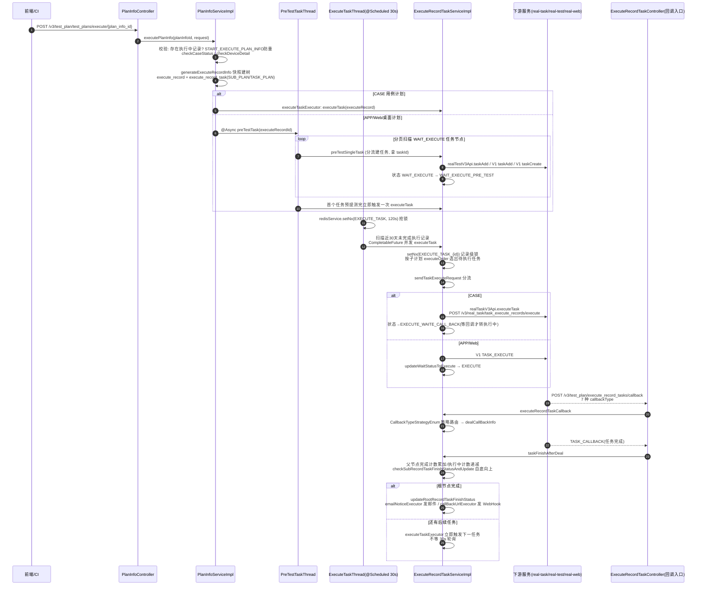
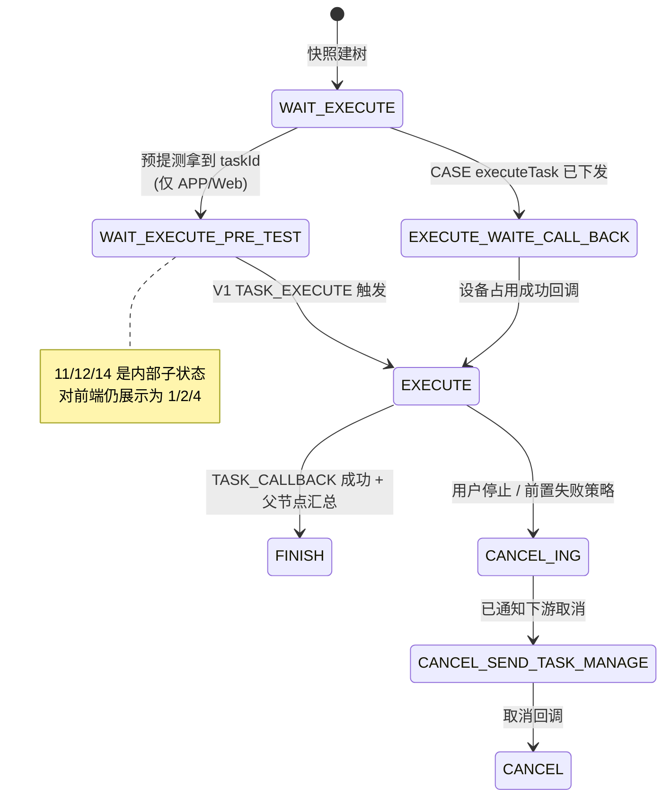

# 测试计划执行链路实现

## 概述

本文描述平台基础功能服务最核心的一条链路：从用户点击"执行计划"到三出口分流提测、再到回调汇总出通知的完整过程。**本服务只做编排**，真机执行在下游（任务管理服务 / app处理服务 / web/pc处理服务），跨服务段见 [端到端-测试计划执行](../../跨模块链路/端到端-测试计划执行.md)，本文聚焦 testin-core 内部代码。

链路概括 6 步：

1. `PlanInfoController` 接收执行请求，`PlanInfoServiceImpl.executePlanInfo` 校验并**快照建树**（execute_record + execute_record_task 三级树）；
2. 按 `planInfoType` 分叉：CASE 直接进执行线程；APP/Web/桌面先走 `PreTestTaskThread` **预提测**（向下游建任务拿 taskId）；
3. `ExecuteTaskThread`（@Scheduled 30s + Redis 锁）扫描未完成的执行记录，调 `ExecuteRecordTaskServiceImpl.executeTask` 按子计划/策略触发任务执行；
4. `sendTaskExecuteRequest`（`ExecuteRecordTaskServiceImpl.java`）按计划类型分流：CASE 走 `realTaskV3Api.executeTask`，APP/Web 走 V1 RPC `TASK_EXECUTE`；
5. 下游执行过程中按 7 种回调类型回传，`executeRecordTaskCallback`策略化消费；
6. 任务完成回调触发 `taskFinishAfterDeal`自底向上汇总，根节点完成后 `updateRootRecordTaskFinishStatus`发邮件/WebHook。

## 两个关键分流点

| 分流点 | 位置 | 作用 |
|---|---|---|
| `preTestSingleTask` | `src/main/java/cn/testin/business/impl/plan/ExecuteRecordTaskServiceImpl.java` | **预提测建任务**：APP 且 content 含 `executeType` → `realTestV3Api.taskAdd`（新接口）；APP 无 executeType → V1 RPC `APP_ACTION/taskAdd`（旧接口）；Web/桌面 → V1 RPC `TASK_ACTION/taskCreate`。CASE **不经过此方法** |
| `sendTaskExecuteRequest` | 同上  | **触发执行**：CASE → `realTaskV3Api.executeTask`（新链路，直接携带完整请求体，提测与执行合一）；APP → V1 `APP_ACTION/TASK_EXECUTE`；Web/桌面 → V1 `TASK_ACTION/TASK_EXECUTE` |

CASE 计划与 APP/Web 计划的整体形态因此不同：

- **CASE**：无预提测，`executePlanInfo` 建完快照直接 `executeTaskExecutor.execute(() -> executeTask(...))`（`PlanInfoServiceImpl.java`），每次触发都携带完整请求（设备、时间段、执行标准等在 testin-core 侧组装）。
- **APP/Web/桌面**：两段式——`preTestTaskThread.preTestTask(executeRecordId)`（`PlanInfoServiceImpl.java`）先批量预建任务（状态 WAIT_EXECUTE→WAIT_EXECUTE_PRE_TEST），再由 ExecuteTaskThread 轮询触发。

## 全链路时序图

## 逻辑详解

### 1. 执行入口与快照建树

`PlanInfoServiceImpl.executePlanInfo`（`src/main/java/cn/testin/business/impl/plan/PlanInfoServiceImpl.java`，`@DS(db_plan)` + 事务）：

- **防重**：已存在执行中记录 → `existExecutePlanInfo` 拒绝；`START_EXECUTE_PLAN_INFO` 静态集合防并发重复提交，finally 中移除；
- **校验**：执行名 ≤100 字符；`checkDevice=1` 校验设备；CASE 计划 `checkCaseStatus` 校验关联任务模板有效；
- **重测快捷入口**：`request.resetFlag==1` 时不走新建，直接转 `executeRecordService.batchReset`——按 scriptStatus（默认 FAIL/TIME_OUT/CANCEL/SKIP）批量重测；
- **快照建树**：`generateExecuteRecordInfo`查全部子计划，区分"立即执行"与"有触发时间"两类，写 `execute_record` 主记录，再按子计划树生成 `execute_record_task` 节点（根子计划 SUB_PLAN + orderNum=0），任务模板深拷贝为 TASK_PLAN 节点与 case/script/device 明细。CASE 计划直接把 `preTestTask` 标记置为已预提测（因为 CASE 不需要预提测）。

### 2. ExecuteTaskThread 轮询触发

`ExecuteTaskThread.executeTask`（`src/main/java/cn/testin/schedule/plan/ExecuteTaskThread.java`）：

- cron `0/30 * * * * ?`，先 `redisService.setNx(EXECUTE_TASK, 120s)` 抢全局锁（多实例只一个跑）；
- 扫描**近 30 天**（`Constants.MOUTH_DAY`）状态在未完成集合（`PlanExecuteStatusEnum.getNoFinishStatuses`）的执行记录，每页 100 条；
- 配了执行周期（`executePeriod`）的记录先过 `checkCurTimeNeedExecuteTask`，不在时间段内跳过（取消中的记录仍要处理）；
- 每条记录丢进 `executeTaskExecutor` 线程池 `CompletableFuture` 并发，页内 join 后再翻页。

`ExecuteRecordTaskServiceImpl.executeTask(DbExecuteRecord)`再加一道**记录级** Redis 锁 `EXECUTE_TASK_{executeRecordId}`（120s），然后按子计划 executeOrder 选出该执行的任务节点，走 `sendTaskExecuteRequest` 分流。

### 3. CASE 出口的请求组装

`sendTaskExecuteRequest` 的 CASE 分支在 testin-core 侧组装完整 `TaskExecuteRecordExecuteRequestDTO`：

- **设备**：计划启用计划级设备（`planDeviceStatus=VALID`）且请求未自带设备、非重测换设备时，从 `plan_device` 表取有效设备列表；为空直接抛"测试计划中未设置设备"；
- **执行时间段**：`executePeriod` JSON 里的 `startTime/endTime` 去掉冒号转 Long 放入 `timePeriods`；
- **重测参数**：`retestTaskReportCaseIds`（只跑失败用例）、`onlyRetest`、`retestTaskId`、`enableRetestSummary` 从节点 `relationTaskContent` 透传；
- **设备离线配置**：重测自带 `execStandard.deviceOfflineConfig` 时以重测为准，否则取 `execute_record_task_config` 的最新值；
- 调 `realTaskV3Api.executeTask`拿到 executeTaskId 后，把节点更新为 `EXECUTE_WAITE_CALL_BACK`（**故意不直接置执行中**，等设备占用成功回调再转）；更新失败（并发）说明此次提测多余，调 `realTaskV3Api.deleteRecord` 删除；
- 异常时状态回退 `WAIT_EXECUTE_PRE_TEST` 并记录 `taskFailMsg`，等下轮重试。

### 4. APP/Web 出口的触发

非 CASE 时任务已在预提测阶段建好（有 `executeTaskId`），这里只发"立即执行"指令：APP → V1 RPC `APP_ACTION/TASK_EXECUTE`（realTest 前缀），Web/桌面 → `TASK_ACTION/TASK_EXECUTE`（realWeb 前缀），然后 `updateWaitStatusToExecute` 置 EXECUTE 并记 `executeStartTime`。

### 5. 回调消费与汇总

- 入口：`ExecuteRecordTaskController.executeRecordTaskCallback`（`src/main/java/cn/testin/controller/plan/ExecuteRecordTaskController.java`，POST `/v3/test_plan/execute_record_tasks/callback`）；
- `ExecuteRecordTaskServiceImpl.executeRecordTaskCallback`：CASE 按 `executeRecordTaskId` 直查节点，非 CASE 按 `executeTaskId` 反查；`CallbackTypeStrategyEnum.getStrategyByType` 路由到 7 个策略实现（`src/main/java/cn/testin/business/strategy/plan/`）；
- 任务完成（TASK_CALLBACK）→ `taskFinishAfterDeal`（`@DS(db_plan)` + 事务）：
  - 任务列表型节点：沿 parentId 链向上，父节点 `completeTaskCount +1`、`executingScript/CaseCount` 递减；途中记录最近的 SUB_PLAN 节点与重测聚合节点；
  - 前置任务失败：按 `afterFailOperate` 策略把后续任务（含/不含后置）置 CANCEL_ING（`stopOtherTaskByFailPreTask`），随后 `cancelTaskThread.cancelTask` 真取消；
  - `checkSubRecordTaskFinishStatusAndUpdate` 更新子计划状态；若当前是最后一个未完成子计划 → `updateRootRecordTaskFinishStatus`；
  - **未全部完成时立即触发下一任务**，不等 30s 轮询——这是吞吐关键路径；
- 根节点完成 `updateRootRecordTaskFinishStatus`：根节点置 FINISH/CANCEL → `emailNoticeExecutor` 异步发邮件（`planEmailNoticeService.sendEmail`）、配了 `callBackUrl` 则 `callBackUrlExecutor` 发 WebHook，两处都先睡 0.5s 等事务提交。

### 6. 任务状态机（编排层）

详见 [横切-任务状态机](../04-复杂功能细节/横切-任务状态机.md)。

## 关键代码位置表

| 环节 | 类 / 方法 | 位置 |
|---|---|---|
| 执行入口 | PlanInfoController.executePlanInfo | src/main/java/cn/testin/controller/plan/PlanInfoController.java |
| 编排主方法 | PlanInfoServiceImpl.executePlanInfo | src/main/java/cn/testin/business/impl/plan/PlanInfoServiceImpl.java |
| 快照建树 | PlanInfoServiceImpl.generateExecuteRecordInfo | src/main/java/cn/testin/business/impl/plan/PlanInfoServiceImpl.java |
| Quartz 定时触发 | QuartzPlanInfoExecuteJob.executeInternal | src/main/java/cn/testin/schedule/plan/QuartzPlanInfoExecuteJob.java |
| 预提测线程 | PreTestTaskThread.preTestTask | src/main/java/cn/testin/schedule/plan/PreTestTaskThread.java |
| 预提测分流 | ExecuteRecordTaskServiceImpl.preTestSingleTask | src/main/java/cn/testin/business/impl/plan/ExecuteRecordTaskServiceImpl.java |
| 30s 轮询 | ExecuteTaskThread.executeTask | src/main/java/cn/testin/schedule/plan/ExecuteTaskThread.java |
| 记录级执行 | ExecuteRecordTaskServiceImpl.executeTask | src/main/java/cn/testin/business/impl/plan/ExecuteRecordTaskServiceImpl.java |
| 触发出口分流 | ExecuteRecordTaskServiceImpl.sendTaskExecuteRequest | src/main/java/cn/testin/business/impl/plan/ExecuteRecordTaskServiceImpl.java |
| CASE 出口 | RealTaskV3Api.executeTask | src/main/java/cn/testin/api/realtask/RealTaskV3Api.java |
| APP 新接口出口 | RealTestV3Api.taskAdd | src/main/java/cn/testin/api/realtest/RealTestV3Api.java |
| 回调入口 | ExecuteRecordTaskController.executeRecordTaskCallback | src/main/java/cn/testin/controller/plan/ExecuteRecordTaskController.java |
| 回调策略路由 | ExecuteRecordTaskServiceImpl.executeRecordTaskCallback | src/main/java/cn/testin/business/impl/plan/ExecuteRecordTaskServiceImpl.java |
| 完成汇总 | ExecuteRecordTaskServiceImpl.taskFinishAfterDeal | src/main/java/cn/testin/business/impl/plan/ExecuteRecordTaskServiceImpl.java |
| 根节点通知 | ExecuteRecordTaskServiceImpl.updateRootRecordTaskFinishStatus | src/main/java/cn/testin/business/impl/plan/ExecuteRecordTaskServiceImpl.java |

## 涉及表（均 db_plan）

`execute_record`、`execute_record_task`、`execute_record_task_case`、`execute_record_task_script(_detail)`、`execute_record_task_device`、`execute_record_task_config`、`plan_info`、`sub_plan_info`、`plan_task`、`plan_task_case/script/device`、`plan_device`、`plan_task_strategy`、`plan_info_config`、`plan_info_execute_period`、`plan_email_notice`。

## 注意事项与坑

1. **CASE 出口"提测即执行"**：CASE 没有预提测阶段，`executeTask` 失败会把状态回退到 `WAIT_EXECUTE_PRE_TEST` 并记 `taskFailMsg`，等 30s 轮询重试——排障时先看该字段。
2. **两级 Redis 锁**：全局锁 `EXECUTE_TASK`（ExecuteTaskThread，120s）+ 记录级锁 `EXECUTE_TASK_{id}`。锁 TTL 只有 120s，单次执行逻辑超时被锁释放后可能出现并发触发；好在 `sendTaskExecuteRequest` 内部用 `updateSelectiveByIdAndOldStatus` 乐观状态更新兜底，多余提测会被删除。
3. **executePeriod 时间格式**：时间段 JSON 里 `startTime/endTime` 是 `"HH:mm"` 字符串，CASE 出口在  去冒号转 Long，APP 新接口在 preTestSingleTask  同样处理——两处格式转换是重复代码，改一处别忘了另一处。
4. **预提测状态更新失败要删下游任务**：`preTestSingleTask` 尾部若状态更新失败（并发取消等），会**睡 1.5s** 再 `deleteTaskIdInPreTest` 删除下游任务——注释明确说睡 1.5s 是因为"提测完立即删除对应表可能没数据"。
5. **完成即触发下一任务**：`taskFinishAfterDeal` 在非终态时直接 `executeTaskExecutor.execute(() -> executeTask(...))`，不靠 30s 轮询——串行子计划的实际节奏由回调驱动，轮询只是兜底。
6. **通知前睡 0.5s**：邮件/WebHook 发送前 `Thread.sleep(500)` 等事务提交，这是已知脆弱点，事务大或库抖动时仍可能拿到旧数据。
7. **回调找不到节点静默返回 0**：`executeRecordTaskCallback` 查不到节点或不认识 callbackType 直接 return 0，只打 debug 日志——下游重推机制缺失时该消息即丢失。

## 延伸阅读

- [提测调度与重测实现](提测调度与重测实现.md)
- [端到端-测试计划执行](../../跨模块链路/端到端-测试计划执行.md)（跨服务段）
- [核心链路-测试计划执行](../04-复杂功能细节/核心链路-测试计划执行.md) / [核心链路-回调处理](../04-复杂功能细节/核心链路-回调处理.md)
