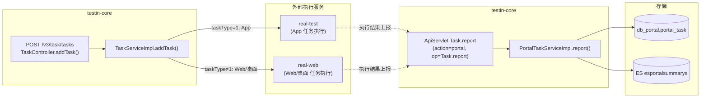
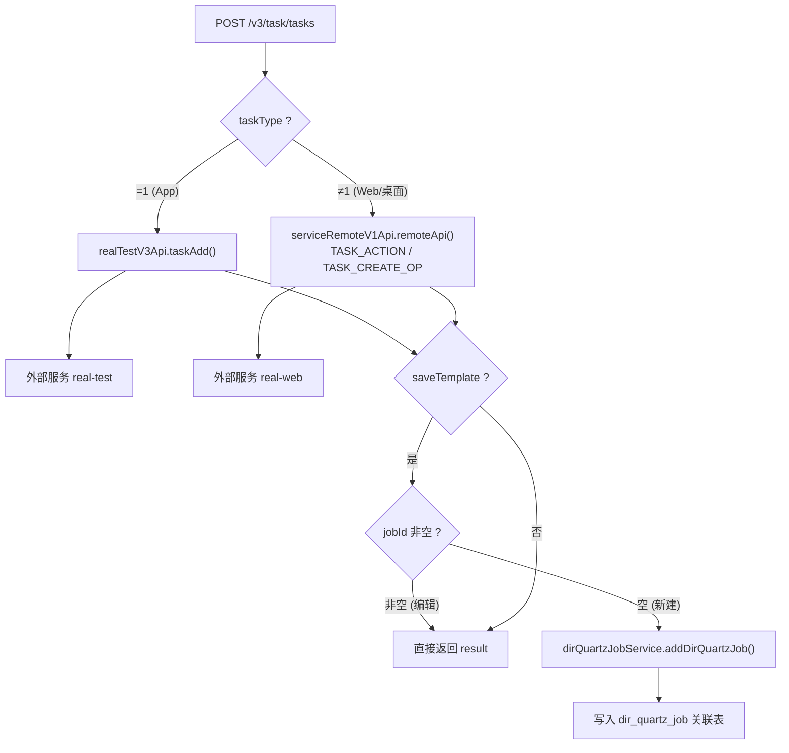
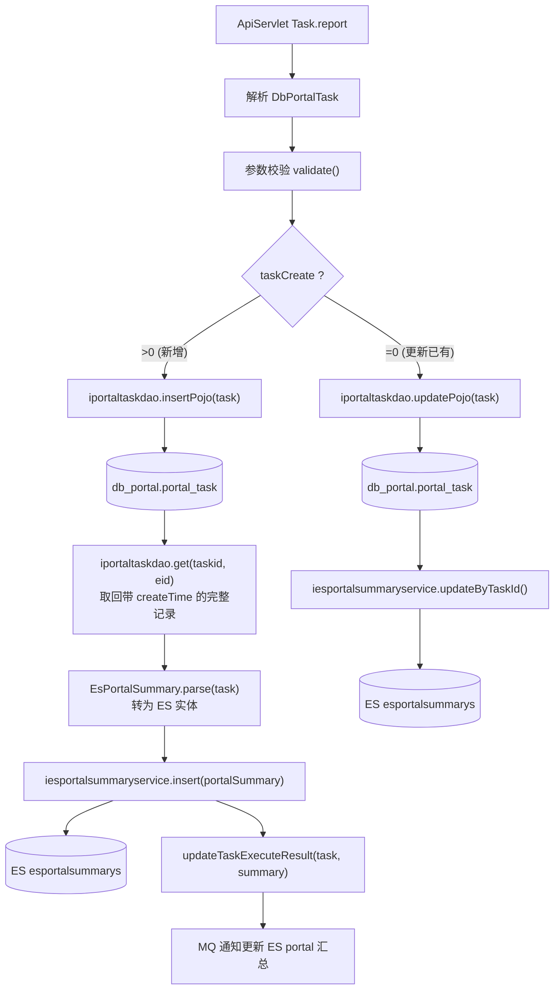

# 核心链路-任务提交与结果回传

> 基于 平台基础功能服务 syy.release.z7.8.1.0 代码分析。任务提交流程包含**两条独立的链路**：一条是 core 向外部执行服务发起任务，另一条是外部执行服务完成后再把结果上报回 core。原文档中 `/v3/task/tasks` 与 `Task.report` 并非同一流程的两个入口，而是**往返两个方向**。

## 总览：两条链路的关系



> **关键区分**：`POST /v3/task/tasks` 是 core **发出**任务到外部执行服务；`Task.report` 是外部执行服务**回传**结果到 core。两者方向相反，不是等价入口。

---

## 链路A: 任务提交（core → 外部）

### 入口

```
POST /v3/task/tasks → TaskController.addTask()
  → TaskServiceImpl.addTask(TaskAddRequestDTO)                     TaskServiceImpl.java
```

### 请求参数 (TaskAddRequestDTO)

| 字段 | 类型 | 说明 |
|------|------|------|
| taskType | Integer | 1=App(发 app处理服务), 其他=Web/桌面(发 web/pc处理服务) |
| saveTemplate | String | 是否保存为模板 |
| jobId | Integer | 非空=编辑已有模板，空=创建新模板 |
| dirId | Integer | 模板目录ID，空则取根目录 |
| projectId | Integer | 项目ID |

### 流程



### 写入操作

| 条件 | 操作 | 说明 |
|------|------|------|
| 始终 | 调外部服务 | taskType=1 → app处理服务（外部服务，文档占位）；≠1 → web/pc处理服务（外部服务，文档占位） |
| saveTemplate=是 | `dirQuartzJobService.addDirQuartzJob()` | 创建模板与目录关联，写入 `db_plan` 相关表 |

### 关键代码

```java
// TaskServiceImpl.java
if (taskAddRequest.getTaskType() == 1) {
    // App 任务 → real-test
    TaskAddResponseDTO response = realTestV3Api.taskAdd(taskAddRequest);
    result = response.getResult();
} else {
    // Web/桌面任务 → real-web
    result = serviceRemoteV1Api.remoteApi(TASK_ACTION, TASK_CREATE_OP,
        AbstractApi.realWebPrefixName, taskWebOrDesktopAddDTO, String.class);
}
```

---

## 链路B: 任务结果回传（外部 → core）

### 入口

```
ApiServlet: action=portal, op=Task.report
  → Task.report(ApiRequest)                                        Task.java
    → PortalTaskServiceImpl.report(DbPortalTask)                   PortalTaskServiceImpl.java
```

请求格式：
```json
{
  "op": "Task.report",
  "action": "portal",
  "data": {
    "taskid": "tt_xxx",
    "eid": 1,
    "taskCreate": 1,
    "content": "{...}",
    ...
  }
}
```

### 触发方

执行完成后，由 **app处理服务** 或 **web/pc处理服务** 回调此接口上报结果（与测试计划执行链路的 `callback` 接口不同——那是针对 `execute_record_task` 的，这是针对 `portal_task` 的）。

### 流程



### 写入操作

| 条件 | 表 | 操作 | 说明 |
|------|-----|------|------|
| taskCreate>0 | `db_portal.portal_task` | insert | 新增 portal 任务记录 |
| taskCreate>0 | `esportalsummarys` | insert | 同步写入 ES |
| taskCreate=0 | `db_portal.portal_task` | update | 更新已有 portal 任务 |
| taskCreate=0 | `esportalsummarys` | update | 更新 ES 记录 |
| 始终 | `updateTaskExecuteResult` | MQ 通知 | 更新 ES portal 汇总统计 |

---

## 链路C: 测试计划执行链路的 callback（仅限 plan 任务）

> 注意区分：此链路仅用于测试计划执行（execute_record_task），与上面的 portal 任务回传是两条独立体系。

```
POST /v3/test_plan/execute_record_tasks/callback
  → ExecuteRecordTaskController.executeRecordTaskCallback()
    → ExecuteRecordTaskServiceImpl.executeRecordTaskCallback()
      → CallbackTypeStrategyEnum 策略路由 → 7种回调类型处理
```

详见 [核心链路-回调处理](核心链路-回调处理.md)。

---

## 三条链路对比

| 维度 | 链路A: 任务提交 | 链路B: portal 回传 | 链路C: plan 回调 |
|------|----------------|-------------------|-----------------|
| 方向 | core → 外部 | 外部 → core | 外部 → core |
| 入口 | `POST /v3/task/tasks` | `Task.report` (ApiServlet) | `POST /v3/test_plan/execute_record_tasks/callback` |
| 调用方 | 前端/用户 | app处理服务 / web/pc处理服务 | app处理服务 |
| 写入表 | 外部服务 | `portal_task` + ES `esportalsummarys` | `execute_record_task` |
| 业务域 | 任务管理 (portal) | 任务管理 (portal) | 测试计划执行 |
| 是否创建模板 | 可选 (saveTemplate) | 否 | 否 |

## 关键代码位置

| 文件 | 行号 | 作用 |
|------|------|------|
| `TaskController.java` |  | MVC 任务提交入口 |
| `TaskServiceImpl.java` |  | addTask: App→app处理服务, Web→web/pc处理服务 |
| `Task.java` |  | ApiServlet Task.report 入口 |
| `PortalTaskServiceImpl.java` |  | report: 写 portal_task + ES |
| `EsPortalSummaryDAO.java` |  | ES insert |
| `ExecuteRecordTaskController.java` |  | plan callback 入口 |

## 与其它文档的关系

- [核心链路-回调处理](核心链路-回调处理.md) — 测试计划执行链路的 7 种 callback 类型详解
- [核心链路-定时执行](核心链路-定时执行.md) — Quartz Cron → 快照 → 轮询 → plan callback 全链路
- [核心链路-后台定时任务数据流](核心链路-后台定时任务数据流.md) — 所有定时任务的数据流向
- [TaskController](../07-开放接口文档/任务管理/TaskController.md) — POST /v3/task/tasks 提测接口
- [portal-Task](../07-开放接口文档/任务管理/portal-Task.md) — ApiServlet Task.report 上报接口
