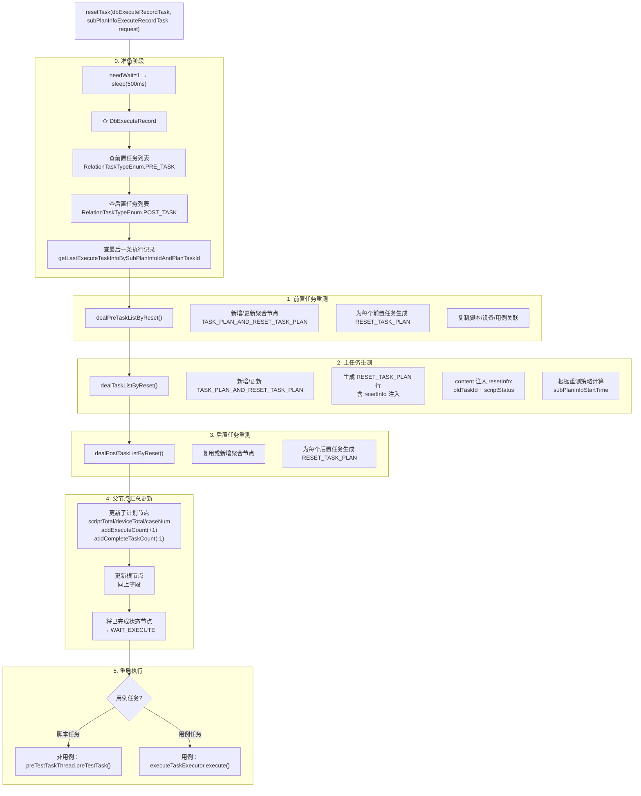

# 核心链路：任务重测（ResetTaskThread）

> 当执行记录中的某个任务需要重新测试时，由 `ResetTaskThread.resetTask()` 驱动的完整重测编排链路。支持脚本任务和用例任务，覆盖前置/主任务/后置三个阶段的重新生成。

## 入口

```
ExecuteRecordTaskController.resetTask / batchReset
  │
  └── ResetTaskThread.resetTask(dbExecuteRecordTask, subPlanInfoExecuteRecordTask, request)
        @Async("resetTaskExecutor")
        @DS(Constants.DB_PLAN)
        @Transactional(rollbackFor = Exception.class)
```

**文件**：`src/main/java/cn/testin/schedule/plan/ResetTaskThread.java`（~670 行）

## 流程总览



## 一、节点类型说明

重测过程中产生两种特殊的 `recordTaskType`：

| recordTaskType | 含义 | 说明 |
|---------------|------|------|
| `TASK_PLAN_AND_RESET_TASK_PLAN` (type=2) | 重测聚合节点 | 承上启下：挂载到子计划节点下，作为多轮重测数据的父容器 |
| `RESET_TASK_PLAN` (type=3) | 单次重测记录 | 实际的执行任务节点，指向 `TASK_PLAN_AND_RESET_TASK_PLAN` |

**节点层级**：

```
SubPlanInfoExecuteRecordTask (子计划节点)
  └── TASK_PLAN_AND_RESET_TASK_PLAN (重测聚合节点)
        ├── RESET_TASK_PLAN (第1次重测)
        ├── RESET_TASK_PLAN (第2次重测)
        └── ...
```

`TASK_PLAN_AND_RESET_TASK_PLAN` 节点不记录 `content`，仅作为统计容器：它继承旧任务的所有累计统计数据（`successScriptCount`、`failScriptCount` 等），后续新重测数据在此基础上增量。

## 二、三阶段重测详解

### 2.1 dealPreTaskListByReset — 前置任务重测

```
dealPreTaskListByReset(request, subPlanInfoExecuteRecordTask, curTime, preTaskList)
  │
  ├── 1. addOrUpdateTaskAndResetRecord()
  │      ├── 首次重测（parentId == subRecordTaskId）
  │      │     → 新建 TASK_PLAN_AND_RESET_TASK_PLAN 聚合节点
  │      │     → updateAllOldDataToTaskAndRestRecordId()
  │      │        将原有任务数据（脚本/设备/用例）的 parentId 迁移到新聚合节点
  │      └── 已有聚合节点
  │            → 更新聚合节点的 executeCount+1, taskTotal+1
  │
  ├── 2. 遍历每个前置任务
  │      ├── getNewDbExecuteRecordTaskByOldOrRequest()
  │      │     → 生成 RESET_TASK_PLAN 节点（状态=WAIT_EXECUTE）
  │      ├── 可选：calculateNextSubPlanInfoStartTime() 调整执行时间
  │      └── insertScriptAndDeviceAndCaseByOldData()
  │            从旧数据复制脚本/设备/用例关联到新节点
  └── 3. 更新聚合节点的 scriptTotal/deviceTotal/caseNum
```

### 2.2 dealTaskListByReset — 主任务重测

```
dealTaskListByReset(request, dbExecuteRecordTask, subPlanInfoExecuteRecordTask, ...)
  │
  ├── 1. addOrUpdateTaskAndResetRecord() → 同上
  │
  ├── 2. 生成 RESET_TASK_PLAN 节点
  │      └── getNewDbExecuteRecordTaskByOldOrRequest(recordTaskType=RESET_TASK_PLAN, taskTotal=1)
  │            │
  │            ├── resetInfo 注入（核心）:
  │            │     JSONObject resetInfo = {
  │            │       "oldTaskId": oldExecuteTask.getExecuteTaskId(),
  │            │       "scriptStatus": [成功, 失败, 取消, 超时, 跳过]  ← real-test 据此只重跑有结果的脚本
  │            │     }
  │            │     content.put("resetInfo", resetInfo)
  │            │
  │            ├── 可选：根据 suiteInfo.latestPackage 获取最新 App 包
  │            │
  │            └── 用例类型：content 中设置 onlyRetest=1, enableRetestSummary=1
  │
  ├── 3. insert (插入新节点)
  ├── 4. batchInsertScriptNos / batchInsertCaseIds (关联脚本或用例)
  ├── 5. batchInsertDeviceIds (关联设备)
  └── 6. 更新聚合节点的脚本/用例/设备总数
```

**resetInfo 的作用**：下发到 app处理服务 后，app处理服务 根据 `oldTaskId` 找到原始任务，只对 `scriptStatus` 中列出的已完成脚本进行重跑，未执行的脚本照常执行。

### 2.3 dealPostTaskListByReset — 后置任务重测

与前置任务处理逻辑相同，遍历 `postTaskList` 逐个生成 `RESET_TASK_PLAN` 节点并复制关联数据。

### 2.4 checkPreOrPostTaskInfo — 前后置任务校验

```java
// ResetTaskThread.java
private List<DbExecuteRecordTask> checkPreOrPostTaskInfo(List<DbExecuteRecordTask> taskList) {
    if (taskList.size() > 1) {
        // 存在多轮重测记录
        DbExecuteRecordTask last = taskList.get(taskList.size() - 1);
        if (PlanExecuteStatusEnum.isFinish(last.getExecuteStatus())) {
            // 最后一轮已完成 → 取第一轮 TASK_PLAN 数据重新跑
            for (DbExecuteRecordTask curTask : taskList) {
                if (RecordTaskTypeEnum.TASK_PLAN.getType().equals(curTask.getRecordTaskType())) {
                    taskList = new ArrayList<>();
                    taskList.add(last);
                    break;
                }
            }
        } else {
            // 最后一轮未完成 → 清空列表（不重复重测）
            taskList = new ArrayList<>();
        }
    }
    return taskList;
}
```

**逻辑**：前后置任务是多轮共享的，若已有重测数据且最后一轮已完成 → 取最新一轮的 `TASK_PLAN` 数据重测；若未完成 → 跳过（防止重复）。

## 三、父节点汇总更新

重测完成后，向上更新子计划和根节点的统计数据：

### updateTaskTotalAndCountByOldTask

```
updateTaskTotalAndCountByOldTask(node, curTime, scriptTotal, deviceTotal, caseNum, needUpdateCompleteTaskCount)
  │
  ├── 直接覆盖: scriptTotal, deviceTotal, caseNum（从明细表重算的最新值）
  ├── addExecuteCount(+1)         ← SQL: execute_count = execute_count + 1
  └── addCompleteTaskCount(-1)    ← 仅当上一轮有实际执行量时才 -1
       因为取消中的任务不计入已完成，不用减
```

### 状态回退

```java
// 将已完成状态节点回退到等待执行
DbExecuteRecordTask updateRecordTask = DbExecuteRecordTask.builder()
    .executeStatus(PlanExecuteStatusEnum.WAIT_EXECUTE.getStatus()).build();
executeRecordTaskService.updateSelectiveByIdAndOldStatus(parentId, getFinishStatuses(), updateRecordTask);
executeRecordTaskService.updateSelectiveByIdAndOldStatus(subPlanInfoId, getFinishStatuses(), updateRecordTask);
executeRecordTaskService.updateSelectiveByIdAndOldStatus(rootId, getFinishStatuses(), updateRecordTask);
```

## 四、重启执行

```
非用例任务:
  ├── 清除 preTestTask 标志
  └── preTestTaskThread.preTestTask(executeRecordId)
        → 通过 ExecuteTaskThread 30s 轮询重新提测

用例任务:
  └── executeTaskExecutor.execute(() -> executeRecordTaskService.executeTask(dbExecuteRecord))
        → 异步提交用例任务到 real-task
```

## 五、重测策略时间计算

```java
// ResetTaskThread.java
private void calculateNextSubPlanInfoStartTime(DbExecuteRecordTask subPlanInfoExecuteRecordTask, 
        DbExecuteRecordTask taskAndResetRecordTask) {
    Long subPlanInfoStartTime = subPlanInfoExecuteRecordTask.getSubPlanInfoStartTime();
    if (subPlanInfoStartTime != null && !subPlanInfoStartTime.equals(0L)) {
        long curTimestamp = new Date().getTime();
        while (subPlanInfoStartTime <= curTimestamp) {
            subPlanInfoStartTime += 24 * 60 * 60 * 1000;  // 每次 +24h，直到落在未来
        }
    }
    taskAndResetRecordTask.setSubPlanInfoStartTime(subPlanInfoStartTime);
}
```

**逻辑**：原计划的 `subPlanInfoStartTime` 已经是过去的时间，重测时按天递推（每次 +24h）直到落在当前时间之后，确保重测任务能被 `ExecuteTaskThread` 的 30s 轮询正确拾取。

## 六、线程池与事务

| 属性 | 值 |
|------|---|
| 线程池 | `@Async("resetTaskExecutor")` — AsyncConfig 第 6 个池（core=cpuNum*2, max=cpuNum*2+1, queue=100） |
| 数据源 | `@DS(Constants.DB_PLAN)` — db_plan 库 |
| 事务 | `@Transactional(rollbackFor = Exception.class)` — 全部写操作在一个事务中，异常全回滚 |
| 入队方式 | Controller → `resetTaskExecutor.execute()` 或隐式 `@Async` 代理 |

## 相关文档

- [核心链路-测试计划执行](核心链路-测试计划执行.md) — 正常执行链路（与重测共享 executeTask/preTestTask 结尾）
- [核心链路-回调处理](核心链路-回调处理.md) — 重测后新产生的回调会走同样的 7 种 callbackType 路由
- [横切-任务状态机](横切-任务状态机.md) — PlanExecuteStatusEnum 状态流转（WAIT_EXECUTE / 完成态等）
- [横切-后台线程全景](横切-后台线程全景.md) — resetTaskExecutor 线程池 + ExecuteTaskThread 30s 轮询
- [ExecuteRecordTaskController](../07-开放接口文档/测试计划/ExecuteRecordTaskController.md) — reset_task / batch_reset 接口入口
