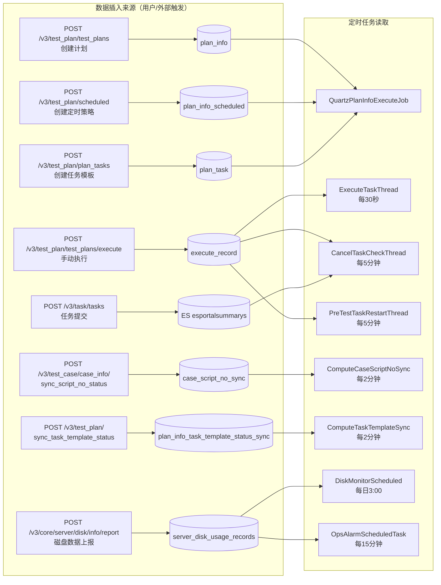

# 核心链路：后台定时任务数据流

> 基于 平台基础功能服务 syy.release.z7.8.1.0 代码分析。梳理所有自动触发任务的触发机制、读取的数据库表、以及完整的方法调用链。

## 总览

```mermaid
flowchart TB
    subgraph Quartz["Quartz Cron 触发"]
        Q1["QuartzPlanInfoExecuteJob"]
        Q1 -->|planInfoId| Q2["PlanInfoServiceImpl.executePlanInfo"]
        Q2 -->|读| QDB[(db_plan.plan_info<br/>db_plan.sub_plan_info<br/>db_plan.plan_task<br/>db_plan.plan_task_script/case)]
        Q2 -->|写| QDB2[(db_plan.execute_record<br/>db_plan.execute_record_task)]
    end

    subgraph Scheduled30s["@Scheduled 每30秒"]
        S1["ExecuteTaskThread.executeTask"]
        S1 -->|Redis锁| S2["查 execute_record 未完成"]
        S2 -->|读| SDB[(db_plan.execute_record<br/>db_plan.execute_record_task)]
        S2 -->|调| S3["IRealTaskV3Api → real-test"]
    end

    subgraph Scheduled5min["@Scheduled 每5分钟"]
        C1["CancelTaskCheckThread"]
        C2["CancelTaskRestartThread"]
        C3["PreTestTaskRestartThread"]
    end

    subgraph Scheduled2min["@Scheduled 每2分钟"]
        T1["ComputeTaskTemplateSyncStatusThread"]
        T2["ComputeCaseScriptNoSyncStatusThread"]
    end

    subgraph ScheduledDaily["@Scheduled 每日/周/15分钟"]
        D1["DiskMonitorScheduled 每日3:00"]
        D2["CaseStatisticSchedule 周一3:00"]
        D3["OpsAlarmScheduledTask 每15分钟"]
    end

    subgraph Startup["SpringStartRunner 启动时拉起"]
        SP1["new Thread: Email/Sms/Http/Notice Dispatch"]
        SP2["ScheduledExecutorService: Oem/Sso/Ding/WeCom/... 配置刷新"]
        SP3["extends Thread: ActionRedis/ActionPersistence"]
    end
```



---

## 一、Quartz Cron 定时执行链

### 触发机制

| 项目 | 说明 |
|------|------|
| 触发方式 | Quartz CronTrigger，cron 表达式由用户配置 |
| 注册入口 | `POST /v3/test_plan/scheduled` → `PlanInfoScheduledServiceImpl` 写入 `plan_info_scheduled` + 注册 Job |
| Job 类 | `QuartzPlanInfoExecuteJob extends QuartzJobBean` |
| 入参来源 | `JobDataMap.getLong("planInfoId")`（注册时写入） |

### 方法调用链与数据读取

```
Quartz CronTrigger 到期
  → QuartzPlanInfoExecuteJob.executeInternal()                    QuartzPlanInfoExecuteJob.java
    → JobDataMap.getLong("planInfoId")                            读取 JobDataMap（内存）
    → planInfoService.executePlanInfo(planInfoId, null)           PlanInfoServiceImpl.java
      → ① planInfoDAO.selectById(planInfoId)                     【读 db_plan.plan_info】
      → ② subPlanInfoDAO.selectByPlanInfoId(planInfoId)          【读 db_plan.sub_plan_info】
      → ③ planTaskDAO.selectBySubPlanIds(subPlanIds)             【读 db_plan.plan_task】
      → ④ planTaskScriptDAO / planTaskCaseDAO                    【读 db_plan.plan_task_script / plan_task_case】
      → ⑤ executeRecordDAO.insert(executeRecord)                 【写 db_plan.execute_record】1条
      → ⑥ executeRecordTaskDAO.insertBatch(taskTree)             【写 db_plan.execute_record_task】三级树 N+M+叶子条
```

### 可观测数据源

| 阶段 | 读取表 | 写入表 | 关键方法 |
|------|--------|--------|----------|
| 获取计划 | `db_plan.plan_info` | — | `PlanInfoServiceImpl.getPlanInfoById` |
| 获取子计划 | `db_plan.sub_plan_info` | — | `SubPlanInfoDAO.selectByPlanInfoId` |
| 获取任务模板 | `db_plan.plan_task` | — | `PlanTaskDAO.selectBySubPlanIds` |
| 获取脚本/用例 | `db_plan.plan_task_script` / `plan_task_case` | — | 对应 DAO |
| 快照执行记录 | — | `db_plan.execute_record` | `ExecuteRecordDAO.insert` |
| 快照任务树 | — | `db_plan.execute_record_task` | `ExecuteRecordTaskDAO.insertBatch` |

---

## 二、ExecuteTaskThread — 每30秒轮询提测

### 触发机制

| 项目 | 说明 |
|------|------|
| 类 | `cn.testin.schedule.plan.ExecuteTaskThread` |
| cron | `0/30 * * * * ?`（每30秒） |
| 分布式锁 | Redis `setNx("EXECUTE_TASK", "EXECUTE_TASK", 120)` TTL=120s |
| 线程池 | `executeTaskExecutor`（core=cpuNum*2, queue=200） |

### 方法调用链与数据读取

```
@Scheduled(cron = "0/30 * * * * ?")
  → ExecuteTaskThread.executeTask()                              ExecuteTaskThread.java
    → redisService.setNx("EXECUTE_TASK", "EXECUTE_TASK", 120)    【Redis 分布式锁】
    → executeRecordService.selectExecuteRecordByCondition()      【读 db_plan.execute_record】
      条件: createTime >= 30天前 AND executeStatus IN (未完成状态集)
      分页: 100条/页
    → 遍历每条 ExecuteRecordExt:
      → 有 executePeriod → executeRecordTaskService.checkCurTimeNeedExecuteTask(period)
        → 不在时段 → continue 跳过
      → CompletableFuture.supplyAsync(..., executeTaskExecutor)
        → executeRecordTaskService.executeTask(executeRecordExt) 【读 db_plan.execute_record_task】
          → 构建提测请求体（含脚本/设备配置）
          → IRealTaskV3Api 发往 [real-test](../../app处理服务（real-test）/07-开放接口文档/00-模块索引.md)
```

### 可观测数据源

| 数据 | 来源 | 说明 |
|------|------|------|
| 执行记录列表 | `db_plan.execute_record` | WHERE createTime >= 30天前 AND executeStatus IN (未完成) |
| 执行时段 | `execute_record.execute_period` 字段 | JSON 数组格式时段配置 |
| 任务树 | `db_plan.execute_record_task` | 按 executeRecordId 查三级树 |
| 内存缓存 | `ExecuteTaskThreadCache` | 防同记录重复提交 |
| 分布式锁 | Redis key=`EXECUTE_TASK` | 120s TTL |

---

## 三、CancelTaskCheckThread — 每5分钟取消状态检查

### 触发机制

| 项目 | 说明 |
|------|------|
| 类 | `cn.testin.schedule.plan.CancelTaskCheckThread` |
| cron | `20 4/5 * * * ?`（每小时第4,9,14...分钟的第20秒） |
| 分布式锁 | Redis `setNx("EXECUTE_TASK_CANCEL_CHECK", ..., 120)` |
| 线程池 | `executeTaskCancelCheckExecutor`（queue=200） |

### 方法调用链与数据读取

```
@Scheduled(cron = "20 4/5 * * * ?")
  → CancelTaskCheckThread.cancelTaskCheck()                      CancelTaskCheckThread.java
    → executeRecordService.selectExecuteRecordByCondition()      【读 db_plan.execute_record】
      条件: createTime >= 30天前 AND executeStatus IN (未完成)
    → executeRecordTaskService.selectByCondition()               【读 db_plan.execute_record_task】
      条件: executeRecordIds + CANCEL_ING/CANCEL_SEND_TASK_MANAGE 状态
    → 遍历取消中任务:
      → updateTime < 3分钟 → continue 跳过（未超时）
      → executeTaskId 为空（未提测）:
        → cancelTaskThread.updateSelectiveByIdAndOldStatus()     【写 db_plan.execute_record_task】CANCEL
        → cancelTaskThread.checkParentNeedUpdate()               【写 db_plan.execute_record_task】父节点汇总
      → executeTaskId 非空（已提测）:
        → cancelTaskThread.sendCancelRequest()                   【调 外部服务 取消】
        → updateSelectiveByIdAndOldStatus()                      【写 db_plan.execute_record_task】CANCEL_SEND_TASK_MANAGE
      → 已发取消但仍卡住:
        → 用例任务 >10分钟 → 直接标 CANCEL
        → 非用例 → 查 ES: iesportalsummaryservice.baseList()     【读 ES esportalsummarys】
          → 外部已取消但无回调 → 直接标 CANCEL
          → 外部仍在执行 >10分钟 → 直接标 CANCEL
          → 外部仍在执行 <10分钟 → 再次 sendCancelRequest
```

### 可观测数据源

| 数据 | 来源 | 说明 |
|------|------|------|
| 执行记录 | `db_plan.execute_record` | 近30天未完成 |
| 取消中任务 | `db_plan.execute_record_task` | executeStatus = CANCEL_ING / CANCEL_SEND_TASK_MANAGE |
| 外部任务状态 | ES `esportalsummarys` | 非用例任务查 portal task 状态 |
| 取消命令 | 调 [app处理服务](../../app处理服务（real-test）/07-开放接口文档/00-模块索引.md) | `sendCancelRequest` 远程取消 |

---

## 四、CancelTaskRestartThread — 每5分钟取消重试

### 触发机制

| 项目 | 说明 |
|------|------|
| 类 | `cn.testin.schedule.plan.CancelTaskRestartThread` |
| cron | `15 3/5 * * * ?` |
| 分布式锁 | Redis `setNx("CANCEL_TASK_RESTART", ..., 120)` |
| 启动时立即执行 | `InitializingBean.afterPropertiesSet()` → `new Thread(this::cancelTaskRestart).start()` |

### 方法调用链与数据读取

```
@Scheduled(cron = "15 3/5 * * * ?")
  → CancelTaskRestartThread.cancelTaskRestart()                  CancelTaskRestartThread.java
    → executeRecordService.selectByCondition()                   【读 db_plan.execute_record】
      条件: createTime >= 30天前 AND syncCancel = NO_SYNC_CANCEL
    → 遍历每条:
      → cancelTaskThread.cancelTask(executeRecord.getId(), ...)  CancelTaskThread.java
        → 查 execute_record_task 取消中任务                       【读 db_plan.execute_record_task】
        → sendCancelRequest → [real-test](../../app处理服务（real-test）/07-开放接口文档/00-模块索引.md)
        → updateSelectiveByIdAndOldStatus()                      【写 db_plan.execute_record_task】
```

### 可观测数据源

| 数据 | 来源 | 说明 |
|------|------|------|
| 待同步取消记录 | `db_plan.execute_record` | syncCancel = NO_SYNC_CANCEL（取消未同步到外部） |
| 取消中任务 | `db_plan.execute_record_task` | 关联的取消中节点 |

---

## 五、PreTestTaskRestartThread + PreTestTaskThread — 预提测重试

### 触发机制

| 项目 | 说明 |
|------|------|
| 调度类 | `cn.testin.schedule.plan.PreTestTaskRestartThread` |
| 执行类 | `cn.testin.schedule.plan.PreTestTaskThread` |
| cron | `45 0/5 * * * ?`（每5分钟第45秒） |
| 分布式锁 | Redis `setNx("PRE_REST_TASK_RESTART", ..., 120)` |
| 启动时立即执行 | `InitializingBean.afterPropertiesSet()` → `new Thread(this::preTestTaskRestart).start()` |
| 线程池 | `preTestTaskExecutor` (core=cpuNum*2, queue=100) |

### 方法调用链与数据读取

```
@Scheduled(cron = "45 0/5 * * * ?")
  → PreTestTaskRestartThread.preTestTaskRestart()                PreTestTaskRestartThread.java
    → executeRecordService.selectByCondition()                   【读 db_plan.execute_record】
      条件: createTime >= 30天前 AND preTestTask = NO_PRE_TEST_TASK
    → 遍历每条:
      → preTestTaskThread.preTestTask(executeRecordId)           PreTestTaskThread.java (@Async)
        → executeRecordDAO.selectById(executeRecordId)           【读 db_plan.execute_record】
        → executeRecordTaskService.selectByCondition()           【读 db_plan.execute_record_task】
          条件: executeRecordId + WAIT_EXECUTE 状态
        → 遍历待执行任务:
          → executeRecordTaskService.preTestSingleTask()         构建提测请求
            → ServiceRemoteV3Api / ServiceRemoteV1Api            调 [real-test](../../app处理服务（real-test）/07-开放接口文档/00-模块索引.md)
          → 第一个任务提测成功后 → executeTaskExecutor 异步触发:
            → executeRecordTaskService.executeTask()             开始执行
        → executeRecordDAO.updateByPrimaryKeySelective()         【写 db_plan.execute_record】preTestTask = PRE_TEST_TASK
```

### 可观测数据源

| 数据 | 来源 | 说明 |
|------|------|------|
| 未预提测记录 | `db_plan.execute_record` | preTestTask = NO_PRE_TEST_TASK |
| 执行记录详情 | `db_plan.execute_record` | selectById |
| 待执行任务 | `db_plan.execute_record_task` | executeStatus = WAIT_EXECUTE |
| 内存缓存 | `ExecuteTaskThreadCache` | 防重、取消检查 |

---

## 六、暂停/恢复（本分支未实现）

> **`syy.release.z7.8.1.0` 无暂停状态**：`PlanExecuteStatusEnum` 未定义 `PAUSE_ING`/`PAUSE`；工作区中的 `PauseTaskCheckThread.java` 为未提交草稿，其引用的 `PAUSE_ING(8)`/`PAUSE(9)` 枚举值仅存在于 `temp0623` 分支。本分支不存在暂停相关的定时任务数据流。

---

## 七、ComputeTaskTemplateSyncStatusThread — 模板同步状态计算

### 触发机制

| 项目 | 说明 |
|------|------|
| 类 | `cn.testin.schedule.plan.ComputeTaskTemplateSyncStatusThread` |
| cron | `40 0/2 * * * ?`（每2分钟第40秒） |
| 线程池 | `planInfoTaskTemplateCheckExecutor`（queue=200） |

### 方法调用链与数据读取

```
@Scheduled(cron = "40 0/2 * * * ?")
  → ComputeTaskTemplateSyncStatusThread.cancelTaskRestart()      ComputeTaskTemplateSyncStatusThread.java
    → iPlanInfoTaskTemplateStatusSyncDAO.selectList()            【读 db_plan.plan_info_task_template_status_sync】
      条件: id > lastId, 分页50条
    → 并发处理每条:
      → iPlanInfoTaskTemplateSyncService.computePlanInfoTaskTemplateSync()
        → 计算模板同步状态                                   【写 db_plan.plan_info_task_template_status_sync】
```

### 可观测数据源

| 数据 | 来源 | 说明 |
|------|------|------|
| 待同步模板 | `db_plan.plan_info_task_template_status_sync` | 全表扫描，按 id 游标分页 |

---

## 八、ComputeCaseScriptNoSyncStatusThread — 用例脚本同步状态计算

### 触发机制

| 项目 | 说明 |
|------|------|
| 类 | `cn.testin.schedule.plan.ComputeCaseScriptNoSyncStatusThread` |
| cron | `5 0/2 * * * ?`（每2分钟第5秒） |
| 线程池 | `caseScriptNoCheckExecutor`（queue=200） |

### 方法调用链与数据读取

```
@Scheduled(cron = "5 0/2 * * * ?")
  → ComputeCaseScriptNoSyncStatusThread.cancelTaskRestart()      ComputeCaseScriptNoSyncStatusThread.java
    → caseScriptNoSyncDAO.selectList()                           【读 db_case.case_script_no_sync】
      条件: id > lastId, 分页50条
    → 并发处理每条:
      → iCaseScriptNoSyncService.computeCaseScriptNoSync()
        → 计算脚本同步状态                                      【写 db_case.case_script_no_sync】
```

### 可观测数据源

| 数据 | 来源 | 说明 |
|------|------|------|
| 待同步脚本 | `db_case.case_script_no_sync` | 全表扫描，按 id 游标分页 |

---

## 九、DiskMonitorScheduled — 磁盘监控

### 触发机制

| 项目 | 说明 |
|------|------|
| 类 | `cn.testin.business.impl.common.DiskMonitorScheduled` |
| cron | `0 0 3 * * ?`（每天凌晨3:00） |

### 方法调用链与数据读取

```
@Scheduled(cron = "0 0 3 * * ?")
  → DiskMonitorScheduled.maintenanceServerDiskJob()              DiskMonitorScheduled.java
    → diskMonitorService.maintenanceServerDiskJob()
      → 维护服务器磁盘数据（清理7天前垃圾、更新服务器信息）         【读写 db_common 相关磁盘表】
```

---

## 十、CaseStatisticSchedule — 用例统计周报

### 触发机制

| 项目 | 说明 |
|------|------|
| 类 | `cn.testin.schedule.statistic.CaseStatisticSchedule` |
| cron | `0 0 3 ? * MON`（每周一凌晨3:00） |

### 方法调用链与数据读取

```
@Scheduled(cron = "0 0 3 ? * MON")
  → CaseStatisticSchedule.caseStatisticSchedule()                CaseStatisticSchedule.java
    → caseStatisticService.caseStatistic()
      → 统计用例数据                                               【读 db_case 相关表】
```

---

## 十一、OpsAlarmScheduledTask — 运维告警

### 触发机制

| 项目 | 说明 |
|------|------|
| 类 | `cn.testin.business.impl.notice.ops.alarm.OpsAlarmScheduledTask` |
| cron | `0 */15 * * * ?`（每15分钟） |

### 方法调用链与数据读取

```
@Scheduled(cron = "0 */15 * * * ?")
  → OpsAlarmScheduledTask.scheduledAlarmCheck()                  OpsAlarmScheduledTask.java
    → diskMonitorService.getLatestDiskAlarmRecords()             【读 db_common 磁盘监控表】
    → alarmTriggerService.executeDiskAlarmCheck(records)
      → 检查磁盘阈值 → 触发告警通知                                【通知渠道】
```

### 可观测数据源

| 数据 | 来源 | 说明 |
|------|------|------|
| 磁盘最新记录 | `db_common` 磁盘监控表 | 获取最新上报的磁盘数据 |
| 告警规则 | 内存/配置 | 阈值比较 |

---

## 十二、SpringStartRunner 启动线程

### 触发机制

`CommandLineRunner.run()` 在 Spring Boot 启动完成后执行。

### 12.1 new Thread() 启动（常驻线程）

| 线程 | 读取数据 | 说明 |
|------|----------|------|
| `EmailCfgThread` | `db_common` 邮件配置表 | 加载 SMTP/SendCloud 配置到内存 |
| `SmsCfgThread` | `db_common` 短信配置表 | 加载多厂商短信通道配置 |
| `EmailDispatchThread` | 内部 `BlockingQueue` | 消费邮件任务队列 → 调邮件服务发送 |
| `SmsTaskDispatchThread` | 内部 `BlockingQueue` | 消费短信任务队列 → 调短信服务发送 |
| `HttpTaskDispatchThread` | 内部 `BlockingQueue` | 消费 HTTP 通知队列 → HTTP POST 回调 |
| `NoticeDispatchThread` | `INoticeService.jobqueue("portal")` | 消费 MQ 通知队列 → 分发到各 Worker |

### 12.2 ScheduledExecutorService（corePoolSize=16）

| 线程 | 周期 | 读取数据 | 说明 |
|------|------|----------|------|
| `OemStartThread` | 每5分钟 | `db_user` OEM 配置表 | 加载 OEM 定制配置到内存 |
| `SsoConfigThread` | 每5分钟 | `db_user` SSO 配置表 | 加载 SSO 配置 |
| `DingWebHookTaskDispatchThread` | 每10秒 | 内部 `BlockingQueue` | 消费钉钉 Webhook 任务 |
| `JoyChatTaskDispatchThread` | 每10秒 | 内部 `BlockingQueue` | 消费 JoyChat 消息任务 |
| `WeComWebHookTaskDispatchThread` | 每10秒 | 内部 `BlockingQueue` | 消费企业微信 Webhook |
| `TeamsTaskDispatchThread` | 每10秒 | 内部 `BlockingQueue` | 消费 Teams 消息 |
| `FawTaskDispatchTread` | 每10秒 | 内部 `BlockingQueue` | 消费一汽消息 |
| `FeiShuWebHookTaskDispatchThread` | 每10秒 | 内部 `BlockingQueue` | 消费飞书 Webhook |
| `MqNoticeDataThread` | 每3秒 | `db_notice` MQ 通知表 | 拉取待通知数据放入队列 |

### 12.3 extends Thread 启动

| 线程 | 读取数据 | 说明 |
|------|----------|------|
| `ActionRedisConsumerThread` | Redis `BRPOP` 阻塞读 | 消费活动记录队列 |
| `ActionPersistenceThread` | 内部 `BlockingQueue` | 活动记录持久化写 DB |

---

## 十三、数据插入来源追溯

> 每张被定时任务读取的表，其数据最初是从哪个接口/方法 INSERT 进来的。

### 13.1 plan_info（计划主表）

```
POST /v3/test_plan/test_plans → PlanInfoController.addPlanInfo()
  → PlanInfoServiceImpl.insertPlanInfoRequest()
    → planInfoDao.insert(dbPlanInfo)                              PlanInfoServiceImpl.java

POST /v3/test_plan/test_plans/copy → PlanInfoController.copyPlanInfo()
  → PlanInfoServiceImpl.copyPlanInfo()
    → planInfoDao.insert(newDbPlanInfo)                           深拷贝创建
```

### 13.2 plan_info_scheduled（定时策略）

```
POST /v3/test_plan/scheduled → PlanInfoScheduledController.addPlanInfoScheduled()
  → PlanInfoScheduledServiceImpl.addPlanInfoScheduled()
    → planInfoScheduledDAO.insert(dbPlanInfoScheduled)            PlanInfoScheduledServiceImpl.java

POST /v3/test_plan/test_plans/copy → 深拷贝时同步复制定时策略
  → PlanInfoServiceImpl.copyPlanInfo()
    → planInfoScheduledService.insert(newDbPlanScheduled)         PlanInfoServiceImpl.java
```

### 13.3 sub_plan_info（子计划）

```
POST /v3/test_plan/test_plans → 创建计划时级联创建子计划
  → PlanInfoServiceImpl.insertPlanInfoRequest()
    → subPlanInfoService.insert(...)

POST /v3/test_plan/sub_plan_infos → SubPlanInfoController.addSubPlanInfo()

POST /v3/test_plan/test_plans/copy → 深拷贝
  → PlanInfoServiceImpl.copyPlanInfo()
    → subPlanInfoService.insert(newDbSubPlanInfo)                 PlanInfoServiceImpl.java
```

### 13.4 plan_task / plan_task_script / plan_task_case（任务模板）

```
POST /v3/test_plan/plan_tasks → PlanTaskController.addPlanTaskList()
  → PlanTaskServiceImpl.addPlanTaskList()
    → planTaskDao.insert(dbPlanTask)                              PlanTaskServiceImpl.java
    → planTaskScriptService.insertBatch(...)
    → planTaskCaseService.insertBatch(...)

POST /v3/test_plan/test_plans/copy → 深拷贝
  → PlanInfoServiceImpl.copyPlanInfo()
    → planTaskService.insert(newDbPlanTask)                       PlanInfoServiceImpl.java
    → planTaskScriptService.insertBatch(...)                      PlanInfoServiceImpl.java
    → planTaskCaseService.insertBatch(...)                        PlanInfoServiceImpl.java
```

### 13.5 execute_record（执行记录快照）

```
由定时/手动触发执行时创建（非用户直接 INSERT）：

Quartz Cron 触发 或 POST /v3/test_plan/test_plans/execute/{id}
  → PlanInfoServiceImpl.executePlanInfo()
    → insertExecuteRecord()
      → executeRecordService.insert(executeRecord)                PlanInfoServiceImpl.java/1633
```

### 13.6 execute_record_task（执行任务树）

```
由 executePlanInfo 快照建树时批量创建（非用户直接 INSERT）：

PlanInfoServiceImpl.executePlanInfo()
  → executeRecordTaskService.insert(recordTaskRootInfo)           插入根节点   PlanInfoServiceImpl.java
  → executeRecordTaskService.insertBatch(subExecuteRecordTaskList) 插入子计划节点 PlanInfoServiceImpl.java
  → executeRecordTaskService.insertBatch(executeRecordTaskList)    插入叶子节点   PlanInfoServiceImpl.java
```

### 13.7 plan_info_task_template_status_sync（模板同步状态）

```
POST /v3/test_plan/sync_task_template_status → PlanInfoController.syncTaskTemplateStatus()
  → PlanInfoServiceImpl.syncTaskTemplateStatus()
    → 记录不存在时:
      → iPlanInfoTaskTemplateStatusSyncDAO.insert(...)            PlanInfoServiceImpl.java
    → 记录存在时:
      → iPlanInfoTaskTemplateStatusSyncDAO.updateById(...)        更新状态触发重算
```

### 13.8 case_script_no_sync（用例脚本同步状态）

```
POST /v3/test_case/case_info/sync_script_no_status → CaseInfoController.syncScriptNoStatus()
  → CaseInfoServiceImpl.syncScriptNoStatus()
    → 记录不存在时:
      → iCaseScriptNoSyncDAO.insert(scriptNoSync)                 CaseInfoServiceImpl.java
    → 记录存在时:
      → iCaseScriptNoSyncDAO.updateById(...)                      更新状态触发重算
```

### 13.9 磁盘监控表（server_info / server_mount_info / server_disk_usage_records）

```
POST /v3/core/server/disk/info/report → DiskMonitorController.handleReport()
  → DiskMonitorServiceImpl.processReport(reportData)
    → serverInfoMapper.insert(server)                             新节点注册
    → serverMountInfoMapper.insert(mountInfo)                     挂载点信息
    → serverDiskUsageRecordsMapper.insert(record)                 磁盘使用量记录
```

> 数据上报方为各服务器节点上的 agent/采集脚本，定时 POST 到本接口。

### 13.10 ES esportalsummarys（Portal 任务汇总）

```
POST /v3/task/tasks 或 ApiServlet Task.report → TaskController / TaskService
  → PortalTaskServiceImpl.TaskReport()
    → iportaltaskdao.insertPojo(task)                             写入 db_portal.portal_task
    → iesportalsummaryservice.insert(portalSummary)               写入 ES esportalsummarys
      → EsPortalSummaryDAO.insert(parseSummary)                   EsPortalSummaryDAO.java
```

### 13.11 通知队列数据

```
各通知 API (邮件/短信/HTTP/钉钉/飞书/企微/Teams/JoyChat/FAW)
  → 对应的 Notice Service
    → 写入 db_notice 对应的通知队列表
    → NoticeDispatchThread / MqNoticeDataThread 消费
```

### 13.12 插入来源对照总表

| 定时任务读取的表 | INSERT 来源接口 | INSERT 方法 |
|-----------------|----------------|-------------|
| `db_plan.plan_info` | `POST /v3/test_plan/test_plans` | `PlanInfoServiceImpl.insertPlanInfoRequest` |
| `db_plan.plan_info_scheduled` | `POST /v3/test_plan/scheduled` | `PlanInfoScheduledServiceImpl.insert` |
| `db_plan.sub_plan_info` | `POST /v3/test_plan/sub_plan_infos` | `SubPlanInfoServiceImpl.insert` |
| `db_plan.plan_task` | `POST /v3/test_plan/plan_tasks` | `PlanTaskServiceImpl.insert` |
| `db_plan.plan_task_script` | `POST /v3/test_plan/plan_tasks` | `PlanTaskScriptServiceImpl.insertBatch` |
| `db_plan.plan_task_case` | `POST /v3/test_plan/plan_tasks` | `PlanTaskCaseServiceImpl.insertBatch` |
| `db_plan.execute_record` | Quartz/手动执行 `executePlanInfo` | `ExecuteRecordServiceImpl.insert` |
| `db_plan.execute_record_task` | Quartz/手动执行 `executePlanInfo` | `ExecuteRecordTaskServiceImpl.insert/insertBatch` |
| `db_plan.plan_info_task_template_status_sync` | `POST /v3/test_plan/sync_task_template_status` | `PlanInfoServiceImpl.syncTaskTemplateStatus` |
| `db_case.case_script_no_sync` | `POST /v3/test_case/case_info/sync_script_no_status` | `CaseInfoServiceImpl.syncScriptNoStatus` |
| `db_common.server_*` 磁盘表 | `POST /v3/core/server/disk/info/report` | `DiskMonitorController.handleReport` |
| ES `esportalsummarys` | `POST /v3/task/tasks` / `Task.report` | `EsPortalSummaryDAO.insert` |
| `db_notice.*` 通知表 | 各通知 API | 各 Notice Service |
| `db_user.*` 配置表 | OEM/SSO 管理接口 | `OemStartThread` / `SsoConfigThread` |
| Redis 活动队列 | 各业务操作 | `ActionRedisConsumerThread` |

---

## 完整数据来源汇总



## 关键代码位置

| 文件 | 行号 | 作用 |
|------|------|------|
| `QuartzPlanInfoExecuteJob.java` |  | Quartz Cron Job 触发入口 |
| `PlanInfoServiceImpl.java` | ~ | executePlanInfo 快照建树主逻辑 |
| `ExecuteTaskThread.java` |  | 30秒轮询，Redis锁，分页查 execute_record，并发提测 |
| `CancelTaskCheckThread.java` |  | 取消状态检查，3分钟超时兜底 |
| `CancelTaskRestartThread.java` |  | 取消重试，syncCancel 标记 |
| `PreTestTaskRestartThread.java` |  | 预提测重试扫描 |
| `PreTestTaskThread.java` |  | 预提测主逻辑，逐任务提测+首个触发执行 |
| `ComputeTaskTemplateSyncStatusThread.java` |  | 模板同步状态，每2分钟 |
| `ComputeCaseScriptNoSyncStatusThread.java` |  | 脚本同步状态，每2分钟 |
| `DiskMonitorScheduled.java` |  | 磁盘监控，每日3:00 |
| `CaseStatisticSchedule.java` |  | 用例统计，每周一3:00 |
| `OpsAlarmScheduledTask.java` |  | 运维告警，每15分钟 |
| `SpringStartRunner.java` |  | 启动时拉起所有后台线程 |

## 与其他文档的关系

- [核心链路-定时执行](核心链路-定时执行.md) — Quartz Cron → 快照 → 轮询 → 回调 五阶段完整数据流
- [横切-后台线程全景](横切-后台线程全景.md) — 所有线程的启动入口、线程池参数全景
- [核心链路-回调处理](核心链路-回调处理.md) — callback 回收链路的完整展开
- [核心链路-测试计划执行](核心链路-测试计划执行.md) — executePlanInfo 快照建树的细化
