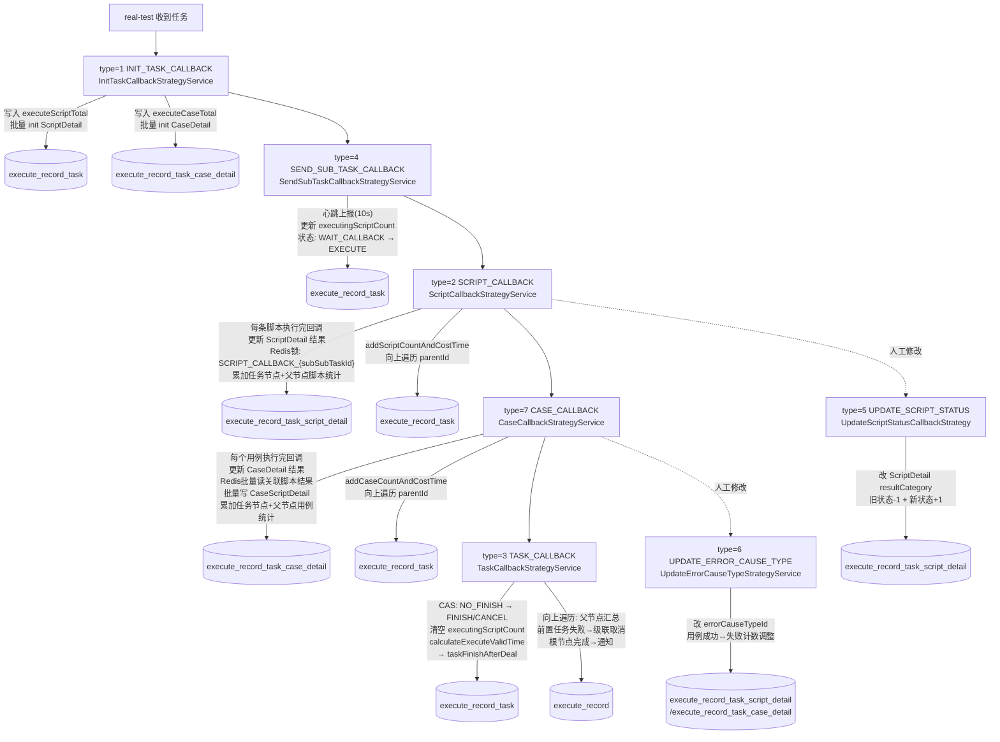

# 核心链路-回调处理

> 基于 平台基础功能服务 syy.release.z7.8.1.0 代码分析。完整展开 `POST /v3/test_plan/execute_record_tasks/callback` 的 7 种回调类型、策略路由、状态更新与父节点汇总链。

## 回调类型速查

| type | 枚举 | 策略类 | 触发时机 | 核心写入 |
|------|------|--------|----------|----------|
| 1 | INIT_TASK_CALLBACK | InitTaskCallbackStrategyService | app处理服务 拆分完子任务/脚本后 | 写 executeScriptTotal + 批量 init ScriptDetail/CaseDetail |
| 2 | SCRIPT_CALLBACK | ScriptCallbackStrategyService | 单个脚本执行完成 | 更新 ScriptDetail 结果 + 累加父节点脚本统计 |
| 3 | TASK_CALLBACK | TaskCallbackStrategyService | 整个任务执行完成 | CAS 更新任务状态 → taskFinishAfterDeal 汇总 |
| 4 | SEND_SUB_TASK_CALLBACK | SendSubTaskCallbackStrategyService | 子任务下发心跳(约10s) | 更新 executingScriptCount/executingCaseCount |
| 5 | UPDATE_SCRIPT_STATUS_CALLBACK | UpdateScriptStatusCallbackStrategy | 人工修改脚本状态 | 改 ScriptDetail 的 resultCategory + 重算统计 |
| 6 | UPDATE_ERROR_CAUSE_TYPE_CALLBACK | UpdateErrorCauseTypeStrategyService | 人工修改错误原因 | 改 errorCauseTypeId + 用例成功/失败计数调整 |
| 7 | CASE_CALLBACK | CaseCallbackStrategyService | 单个用例执行完成 | 更新 CaseDetail + 批量写 CaseScriptDetail + 累加父节点 |

## 回调生命周期（按时间线）



## 入口方法

```
POST /v3/test_plan/execute_record_tasks/callback
  → ExecuteRecordTaskController.executeRecordTaskCallback()          ExecuteRecordTaskController.java
    → ExecuteRecordTaskServiceImpl.executeRecordTaskCallback()       ExecuteRecordTaskServiceImpl.java
```

```java
// ExecuteRecordTaskServiceImpl.java
if (TaskTypeEnum.isCase(request.getTaskType())) {
    dbExecuteRecordTask = selectById(request.getExecuteRecordTaskId(), false);
} else {
    dbExecuteRecordTask = getRecordTaskInfoByExecuteTaskId(request.getExecuteTaskId());
}
if (dbExecuteRecordTask == null) { return 0; }  // 幂等早退

CallbackTypeStrategyEnum strategyEnum = CallbackTypeStrategyEnum.getStrategyByType(request.getCallbackType());
if (strategyEnum == null) { return 0; }

strategyEnum.getService().dealCallBackInfo(dbExecuteRecordTask, request);
// dealCallBackInfo = preDealCallBackInfo → dealCallBackInfoDetail → postDealCallBackInfo
```

## 策略注册

`InitCallBackStrategy.init()` (@PostConstruct) 将 7 个策略实例注入枚举常量并初始化 Map：

```java
CallbackTypeStrategyEnum.INIT_TASK_CALLBACK_STRATEGY.setService(initTaskCallbackStrategyService);
CallbackTypeStrategyEnum.SCRIPT_CALLBACK_STRATEGY.setService(scriptCallbackStrategyService);
CallbackTypeStrategyEnum.TASK_CALLBACK_STRATEGY.setService(taskCallbackStrategyService);
CallbackTypeStrategyEnum.SEND_SUB_TASK_CALLBACK_STRATEGY.setService(sendSubTaskCallbackStrategyService);
CallbackTypeStrategyEnum.UPDATE_SCRIPT_STATUS_CALLBACK_STRATEGY.setService(updateScriptStatusCallbackStrategy);
CallbackTypeStrategyEnum.UPDATE_ERROR_CAUSE_TYPE_CALLBACK_STRATEGY.setService(updateErrorCauseTypeStrategyService);
CallbackTypeStrategyEnum.CASE_CALLBACK.setService(caseCallbackStrategyService);
CallbackTypeStrategyEnum.initMap();  // 构建 type → enum 的 HashMap
```

---

## 各类型详解

### type=1: INIT_TASK_CALLBACK — 任务初始化

**触发时机**：app处理服务 收到任务后，拆分子任务/脚本，将初始化信息回传。

**实现意图**：将 app处理服务 拆分后的子任务/脚本信息批量写入本侧 DB——这是后续所有脚本级回调的基础数据。

**流程**：

```
InitTaskCallbackStrategyService.dealCallBackInfoDetail()
  → 防重: executeScriptTotal > 0 → return
  → addScriptTotal(id, total, oldTotal)              CAS 写入脚本总数
  → 从 Redis scriptInitRedisKey 批量读 ScriptInitInfo
    → 每批100条 → getTaskScriptDetailByScriptInitInfo()
      → 查 executeRecordTaskScript 获取 taskScriptId
      → 构建 DbExecuteRecordTaskScriptDetail
        (subSubTaskId, scriptDataDetailUuid, rowId,
         executeResult=NO_EXECUTE, resultCategory=WAIT_ING)
    → insertBatch ScriptDetail
  → 向上遍历 parentId: addScriptTotal 累加父节点
```

**写操作**：

| 表 | 字段 | 操作 |
|----|------|------|
| `execute_record_task` | `execute_script_total` | CAS 从 0 更新为 total |
| `execute_record_task_script_detail` | 全字段 | insertBatch（批量写子任务明细） |
| `execute_record_task` (父节点) | `execute_script_total` | 累加 |

---

### type=2: SCRIPT_CALLBACK — 脚本执行结果回调

**触发时机**：app处理服务 上每个脚本执行完毕时回调（最频繁的回调类型）。

**实现意图**：接收单条脚本的执行结果，更新对应的 ScriptDetail 记录，并从该脚本节点向上累加统计到所有父节点。

**流程**：

```
ScriptCallbackStrategyService.dealCallBackInfoDetail()
  → 参数校验: subSubTaskId, scriptNo, result 不为空
  → Redis锁: SCRIPT_CALLBACK_{subSubTaskId} (60s TTL)
  → resultCategory < 0 (未执行/执行中) → 跳过
  → generateTaskScriptCountAndCostTimeDTO()
    → ignore: 查 ScriptDetail → 标记 IGNORE → positive = -1
    → cancelIgnore: 还原为原始 executeResult → positive = 0
    → 正常: 查 ScriptDetail 防重 → 转 DTO → updateByPrimaryKeySelective
  → addScriptCountAndCostTime(taskId, count)
  → while (parentId != null): addScriptCountAndCostTime(parentId, count)
    → 遇到前置/后置任务非 TASK_PLAN_AND_RESET_TASK_PLAN 类型 → break
  → 若 self 已 FINISH 且非 ignore: calculateExecuteValidTime + 向上更新已完成节点
```

**写操作**：

| 表 | 字段 | 操作 |
|----|------|------|
| `execute_record_task_script_detail` | `execute_result`, `result_category`, `execute_cost_time` 等 | updateByPrimaryKeySelective |
| `execute_record_task` (自身) | `success/fail/timeout/cancel/skip_script_count`, `executing_script_count` | addScriptCountAndCostTime |
| `execute_record_task` (所有父节点) | 同上 | 向上遍历累加 |

---

### type=3: TASK_CALLBACK — 任务完成回调

**触发时机**：app处理服务 上整个任务（所有脚本/用例）执行完毕。

**实现意图**：将任务节点标记为完成（FINISH 或 CANCEL），清零执行中计数，计算有效执行时间，触发 `taskFinishAfterDeal` 启动父节点汇总链和通知。

**流程**：

```
TaskCallbackStrategyService.dealCallBackInfoDetail()
  → 防重: 已 FINISH → return
  → 内存 Set 防并发: dealingTaskId.add(executeTaskId)
  → taskStatus → PlanExecuteStatusEnum(FINISH / CANCEL)
  → 用例任务:
    → CAS: NO_FINISH → FINISH/CANCEL + 清零 executingCaseCount
    → 失败 → 重算 calculateExecuteValidTime(已完成的父节点)
    → updateByPrimaryKeySelective: effectiveExecuteTime, taskFailMsg
    → taskFinishAfterDeal(dbExecuteRecordTask)
  → 非用例任务:
    → CAS: NO_FINISH → FINISH/CANCEL + 清零 executingScriptCount
    → 失败 → 重算 calculateExecuteValidTime
    → taskFinishAfterDeal(dbExecuteRecordTask)
```

**taskFinishAfterDeal 后续链**（ExecuteRecordTaskServiceImpl.java）：

```
taskFinishAfterDeal()
  → 向上遍历 parentId:
    → addCompleteTaskCount(parentId)              累加完成数
    → 前置任务 FAIL → stopOtherTask 级联取消后续
  → checkSubRecordTaskFinishStatus()              子计划是否全部完成
  → 根节点完成:
    → updateRootRecordStatus(FINISH)
    → emailNoticeExecutor.execute(sendEmail)      异步邮件通知
    → callBackUrlExecutor.execute(callbackUrl)    异步 HTTP 回调
```

**写操作**：

| 表 | 字段 | 操作 |
|----|------|------|
| `execute_record_task` (自身) | `execute_status` → FINISH/CANCEL, `executing_script_count` → 0, `execute_end_time` | CAS update |
| `execute_record_task` (父节点) | `complete_task_count` 累加 | taskFinishAfterDeal |
| `execute_record` (根) | `execute_status` → FINISH | updateRootRecordStatus |

---

### type=4: SEND_SUB_TASK_CALLBACK — 子任务下发进度

**触发时机**：app处理服务 下发子任务时心跳上报（约10秒一次）。

**实现意图**：更新节点的"执行中"计数（executingScriptCount/executingCaseCount），将节点状态从 `EXECUTE_WAITE_CALL_BACK` 推至 `EXECUTE`。

**流程**：

```
SendSubTaskCallbackStrategyService.dealCallBackInfoDetail()
  → 已 FINISH 或 executingCount 为空 → 跳过
  → Redis锁: SEND_SUB_TASK_CALLBACK_{executeSubTaskId} (8s TTL, 防10s心跳重叠)
  → 用例:
    → addCaseCountAndCostTime: executingCaseCount = request.getExecutingCount()
    → CAS: EXECUTE_WAITE_CALL_BACK → EXECUTE
    → 向上遍历累加 executingCaseCount 差值
  → 非用例:
    → addScriptCountAndCostTime: executingScriptCount ±1 (由 sendSubTaskType 决定)
    → 向上遍历累加
```

**写操作**：

| 表 | 字段 | 操作 |
|----|------|------|
| `execute_record_task` (自身) | `executing_script_count` / `executing_case_count` | addScriptCountAndCostTime |
| `execute_record_task` (自身) | `execute_status`: WAIT_CALLBACK → EXECUTE | CAS |
| `execute_record_task` (父节点) | 同上计数 | 向上遍历累加 |

---

### type=5: UPDATE_SCRIPT_STATUS_CALLBACK — 手动修改脚本状态

**触发时机**：用户在 app处理服务 侧手动修改某条脚本的执行结果（如从失败改为成功）。

**实现意图**：修改 ScriptDetail 的状态和分类，并重新计算该节点和父节点的统计数（旧状态-1，新状态+1）。

**流程**：

```
UpdateScriptStatusCallbackStrategy.dealCallBackInfoDetail()
  → 查 ScriptDetail by subSubTaskId
  → resultCategory 没变 → return
  → errorType: setErrorCauseTypeId
  → ignore 状态: 只更新 resultCategory → return
  → 旧状态-1 计数 + 新状态+1 计数
  → updateByPrimaryKeySelective(ScriptDetail)
  → addScriptCountAndCostTime(taskId, count)
  → while (parentId != null): addScriptCountAndCostTime(parentId, count)
```

---

### type=6: UPDATE_ERROR_CAUSE_TYPE_CALLBACK — 更新错误原因

**触发时机**：用户修改脚本/用例的错误原因分类。

**实现意图**：更新 ScriptDetail 或 CaseDetail 的 errorCauseTypeId；对于用例，还会调整成功/失败计数（因错误原因变更可能导致用例状态翻转）。

**流程**：

```
UpdateErrorCauseTypeStrategyService.dealCallBackInfoDetail()
  → 用例:
    → 查 CaseDetail → 更新 errorCauseTypeId, executeResult, executeResultSummary
    → executeResult 变了: 失败+1成功-1 或 成功+1失败-1
    → addCaseCountAndCostTime(taskId, count)
    → 向上遍历父节点累加
  → 脚本:
    → 查 ScriptDetail → 更新 errorCauseTypeId
  → 更新 execute_record.updateTime (触发报告重新生成)
```

---

### type=7: CASE_CALLBACK — 用例执行结果回调

**触发时机**：app处理服务 上每个用例执行完毕。

**实现意图**：更新用例的 CaseDetail 执行结果，从 Redis 批量读取该用例关联的所有脚本执行结果写入 CaseScriptDetail，然后向上累加统计。

**流程**：

```
CaseCallbackStrategyService.dealCallBackInfoDetail()
  → Redis锁: SCRIPT_CALLBACK_{reportCaseId} (60s TTL)
  → resultCategory < 0 → 跳过
  → generateTaskCaseCountAndCostTimeDTO()
    → 查 CaseDetail by reportCaseId 防重
    → insert/update CaseDetail
  → 从 Redis scriptExecuteResultKey 批量读脚本结果:
    → 每批100条 lRange
    → 解析 TaskScriptCallbackDTO
    → 构建 DbExecuteRecordTaskCaseScriptDetail
    → insertBatch CaseScriptDetail (每100条一批)
  → addCaseCountAndCostTime(taskId, count)
  → while (parentId != null): addCaseCountAndCostTime(parentId, count)
```

**写操作**：

| 表 | 字段 | 操作 |
|----|------|------|
| `execute_record_task_case_detail` | `execute_result`, `result_category`, `execute_cost_time` 等 | insert / updateByPrimaryKeySelective |
| `execute_record_task_case_script_detail` | 全字段 | insertBatch（批量） |
| `execute_record_task` (自身+父节点) | `success/fail/timeout/cancel/skip_case_count` | addCaseCountAndCostTime |

---

## 策略模板方法

所有策略继承 `RecordTaskCallbackStrategy`，统一模板：

```java
public void dealCallBackInfo(DbExecuteRecordTask task, TaskExecuteCallbackRequestDTO request) {
    preDealCallBackInfo(task, request);    // 参数校验（可选覆盖）
    dealCallBackInfoDetail(task, request); // 核心逻辑（子类必须实现）
    postDealCallBackInfo(task, request);   // 后置处理（可选覆盖）
}
```

## 注意事项

1. **callback 返回值 1 ≠ 数据已落库**：type=2 的 Redis 锁命中、幂等早退、策略内部异常吞掉均返回 0，但返回 1 也存在幂等早退分支（详见 vault memory: 项目_callback_result_semantics）
2. **type=2 最频繁**：每条脚本执行完成都会回调，是调用量最大的类型
3. **type=4 是心跳**：app处理服务 约10s一次，通过 8s TTL Redis锁防重叠
4. **type=3 是关键节点**：触发 taskFinishAfterDeal 父节点汇总链，可能级联取消（前置任务失败时）

## 关键代码位置

| 文件 | 行号 | 作用 |
|------|------|------|
| `ExecuteRecordTaskController.java` |  | callback 接口入口 |
| `ExecuteRecordTaskServiceImpl.java` |  | executeRecordTaskCallback 路由分发 |
| `ExecuteRecordTaskServiceImpl.java` |  | taskFinishAfterDeal 父节点汇总 |
| `CallbackTypeStrategyEnum.java` |  | 7 种回调类型枚举 |
| `InitCallBackStrategy.java` |  | @PostConstruct 策略注册 |
| `RecordTaskCallbackStrategy.java` |  | 模板方法 dealCallBackInfo |
| `InitTaskCallbackStrategyService.java` |  | type=1 初始化 |
| `ScriptCallbackStrategyService.java` |  | type=2 脚本结果 |
| `TaskCallbackStrategyService.java` |  | type=3 任务完成 |
| `SendSubTaskCallbackStrategyService.java` |  | type=4 下发进度 |
| `UpdateScriptStatusCallbackStrategy.java` |  | type=5 手动改状态 |
| `UpdateErrorCauseTypeStrategyService.java` |  | type=6 错误原因 |
| `CaseCallbackStrategyService.java` |  | type=7 用例结果 |

## 与其它文档的关系

- [核心链路-定时执行](核心链路-定时执行.md) — 阶段5 callback 回收在此完整展开
- [核心链路-测试计划执行](核心链路-测试计划执行.md) — 手动执行到 callback 回收全链路
- [核心链路-后台定时任务数据流](核心链路-后台定时任务数据流.md) — 所有定时任务数据流全景
- [横切-任务状态机](横切-任务状态机.md) — 7 种 callback 驱动的状态迁移（12→2, 2→3/5）
- [ExecuteRecordTaskController](../07-开放接口文档/测试计划/ExecuteRecordTaskController.md) — callback 接口入口
