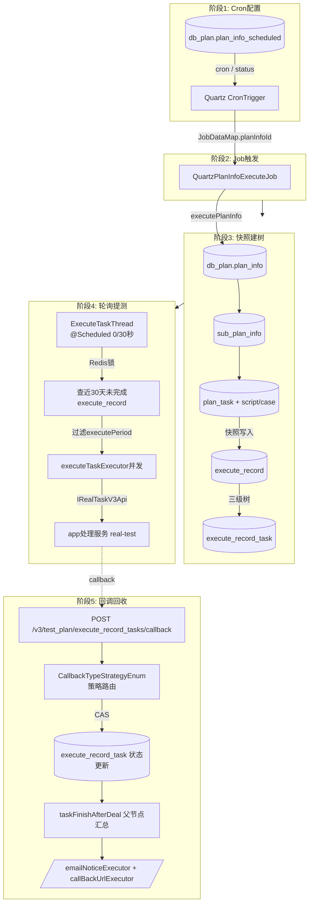
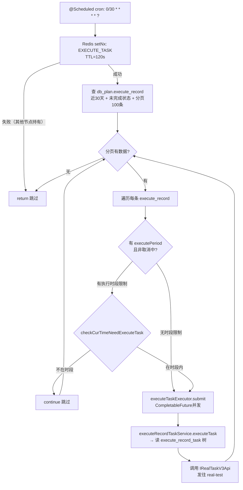

# 核心链路：定时执行（Cron → 快照 → 轮询提交 → 回调回收）

> 基于 平台基础功能服务 syy.release.z7.8.1.0 代码分析。完整串联从 Quartz Cron 触发到执行结果回收的五阶段数据流向。

## 总览：五阶段数据流



---

## 阶段1: Cron 配置的数据来源

**配置入口**：`POST /v3/test_plan/scheduled` → `PlanInfoScheduledController.addPlanInfoScheduled`
→ `PlanInfoScheduledServiceImpl` 写入 `db_plan.plan_info_scheduled` + 注册 Quartz Job

| 数据 | 来源 | 说明 |
|------|------|------|
| cron 表达式 | 用户输入（请求 JSON） | 写入 `scheduled_cron` 字段 |
| 开关状态 | 用户输入 | CLOSE_SCHEDULED(0) / OPEN_SCHEDULED(1) |
| 关联计划ID | 用户输入 | `plan_info_id`，一条计划仅允许一个定时策略 |
| Quartz Job 名 | 程序生成 | `{planInfoId}_{scheduledId}` |
| Quartz 组名 | 常量 | `PLAN_INFO_EXECUTE_GROUP` |

**关键代码**：`PlanInfoScheduledServiceImpl` 新增时以 `planInfoId` 构建 JobDataMap 并注册 `QuartzPlanInfoExecuteJob`。

---

## 阶段2: Quartz 触发 → 执行入口

```
CronTrigger 到期
  → Quartz Scheduler 调度
    → QuartzPlanInfoExecuteJob.executeInternal()  (QuartzPlanInfoExecuteJob.java)
      → JobDataMap.getLong("planInfoId")
        → SpringBootContext.getBean("planInfoService").executePlanInfo(planInfoId, null)
```

- **数据来源**：JobDataMap 中的 `planInfoId`（阶段1 注册时写入）
- **关键类**：`QuartzPlanInfoExecuteJob extends QuartzJobBean`，非 Spring Bean，通过 `SpringBootContext.getContext()` 静态获取 ApplicationContext
- **异常处理**：catch Exception 仅日志记录，Quartz 视为正常完成（不阻塞下一次触发）

---

## 阶段3: 快照建树（executePlanInfo 数据流）

`PlanInfoServiceImpl.executePlanInfo(planInfoId, null)` (`cn.testin.business.impl.plan.PlanInfoServiceImpl`)

| 步骤 | 读取数据 | 写入/创建 | 数据量 |
|------|----------|----------|--------|
| ① 获取计划 | `db_plan.plan_info`（按 planInfoId） | — | 1 条 |
| ② 获取子计划 | `db_plan.sub_plan_info`（按 planInfoId） | — | N 条 |
| ③ 获取任务模板 | `db_plan.plan_task`（按 subPlanIds） | — | M 条 |
| ④ 获取脚本/用例 | `db_plan.plan_task_script` / `plan_task_case` | — | 每条 planTask 若干 |
| ⑤ 限流检查 | 企业配置参数 | — | — |
| ⑥ 防重 | `START_EXECUTE_PLAN_INFO` 内存 Set | — | — |
| ⑦ 建执行记录 | — | `db_plan.execute_record`（1 条） | 1 insert |
| ⑧ 建任务树 | — | `db_plan.execute_record_task`（N+M+叶子） | insertBatch |
| ⑨ 设备兼容性 | `db_plan.plan_device` | — | 只读校验 |

**关键点**：步骤⑦⑧ 是"快照"操作——把此刻的 plan_task/script/case/device 配置冻结为 execute_record_task 执行树，后续回调只改状态不改结构。

---

## 阶段4: 轮询提测（ExecuteTaskThread 30秒循环）

`cn.testin.schedule.plan.ExecuteTaskThread.executeTask()` (`ExecuteTaskThread.java`)



| 数据项     | 来源                                 | 说明                                                     |
| ------- | ---------------------------------- | ------------------------------------------------------ |
| 执行记录列表  | `db_plan.execute_record`           | WHERE createTime >= 30天前 AND executeStatus IN (未完成状态集) |
| 执行时段过滤  | `execute_record.execute_period` 字段 | 存储 JSON 数组格式的时段配置                                      |
| 任务树     | `db_plan.execute_record_task`      | 按 executeRecordId 查三级树                                 |
| 脚本/设备配置 | execute_record_task 关联表            | 提测请求体构建                                                |
| 并发控制    | `ExecuteTaskThreadCache`           | 内存 Map 防同记录重复提交                                        |
| 分布式锁    | Redis key=`EXECUTE_TASK`           | 多节点互斥，120s TTL                                         |

**线程池**：`executeTaskExecutor`（AsyncConfig 配置，corePool=cpuNum*2, queue=200）

---

## 阶段5: 回调回收（callback → 状态更新 → 通知）

详见 [核心链路-回调处理](核心链路-回调处理.md)，此处仅标注与定时执行串联的关键路径：

| 步骤 | 数据写入 | 作用 |
|------|----------|------|
| CAS 更新 | `execute_record_task.execute_status`、统计字段 | 执行结果落库 |
| 父节点汇总 | `execute_record_task.complete_task_count` | 自底向上累加 |
| 子计划判定 | `execute_record_task.execute_status` → FINISH | 子计划状态 CAS |
| 根节点完成 | `execute_record.execute_status` → FINISH | 执行记录闭环 |
| 邮件通知 | 调邮件服务 | 通知关注人 |
| 回调 URL | HTTP POST | 通知外部系统 |
| 下一批触发 | 读 `execute_record_task` 待执行 | —（见阶段4 轮询会捡到） |

---

## 完整数据流向总结

```
┌──────────────┐    ┌──────────────────┐    ┌──────────────────┐
│ plan_info_    │    │ execute_record   │    │ execute_record_  │
│ scheduled     │    │ (快照根节点)      │    │ task (执行树)     │
│ (cron配置)    │    │                  │    │                  │
└──────┬───────┘    └───────▲──────────┘    └────────▲─────────┘
       │                    │                        │
       │ Quartz触发          │ 创建快照                │ 创建快照
       ▼                    │                        │
┌──────────────┐    ┌───────┴──────────┐    ┌────────┴─────────┐
│ QuartzJobBean │───▶│ executePlanInfo  │───▶│ 三级树构建        │
│ (JobDataMap)  │    │ (读plan/sub/     │    │ (根→子计划→任务   │
│               │    │  task→写快照)    │    │   →脚本/用例)     │
└──────────────┘    └──────────────────┘    └─────────────────┘
                                                    │
                            ExecuteTaskThread        │ 30秒轮询
                            (查未完成+时段过滤)        │
                                                    ▼
                            ┌──────────────────────────────────┐
                            │ executeTaskExecutor 并发提测       │
                            │ → IRealTaskV3Api → real-test      │
                            └──────────────┬───────────────────┘
                                           │
                                           │ callback
                                           ▼
                            ┌──────────────────────────────────┐
                            │ 策略路由 → CAS更新 → 父节点汇总     │
                            │ → 通知(email/callbackUrl)         │
                            └──────────────────────────────────┘
```

## 关键代码位置

| 文件 | 行号 | 作用 |
|------|------|------|
| `QuartzPlanInfoExecuteJob.java` |  | Quartz Job 触发入口，取 JobDataMap.planInfoId |
| `PlanInfoServiceImpl.java` | ~ | executePlanInfo 快照建树主逻辑 |
| `ExecuteTaskThread.java` |  | 30秒轮询，Redis锁，分页查 execute_record，并发提测 |
| `ExecuteTaskThreadCache.java` | — | 内存缓存：正在执行的 recordId、cancel 集合 |
| `PreTestTaskThread.java` | ~ | 前置任务线程，防重 logic |
| `ExecuteRecordTaskServiceImpl.java` |  | callback 入口，策略路由 |

## 与其它核心链路的关系

- 本链路完整覆盖了「启动 → 提测 → 回收」的跨组件循环
- [核心链路-测试计划执行](核心链路-测试计划执行.md) 是阶段3 `executePlanInfo` 的细化展开
- [核心链路-回调处理](核心链路-回调处理.md) 是阶段5 callback 链路的完整展开
- [核心链路-任务提交](核心链路-任务提交.md) 是 `POST /v3/task/tasks` 单次提测的详细展开
- [横切-后台线程全景](横切-后台线程全景.md) 列出了所有 @Scheduled 线程的完整列表
- [PlanInfoScheduledController](../07-开放接口文档/测试计划/PlanInfoScheduledController.md) — Cron 配置接口
- [ExecuteRecordTaskController](../07-开放接口文档/测试计划/ExecuteRecordTaskController.md) — 执行记录任务查询接口
- [QuartzController](../07-开放接口文档/基础设施与统计/QuartzController.md) — Quartz Job 管理接口
