# 核心链路-测试计划执行

> 基于 平台基础功能服务 syy.release.z7.8.1.0 代码分析。完整覆盖手动执行入口 → 快照建树 → 定时轮询提测 → 回调回收的全链路。

## 完整流程图

```mermaid
flowchart TD
    A["POST /v3/test_plan/test_plans/execute/{id}"]
    A --> B["1. 获取 PlanInfo (plan_info 表)"]
    B --> C["2. 获取 SubPlanInfo (sub_plan_info 表)"]
    C --> D["3. 获取 PlanTask 模板 (plan_task 表)"]
    D --> E["4. 获取脚本/用例配置 (plan_task_script / plan_task_case)"]
    E --> F{"5. 企业限流检查"}
    F -->|超限| F1["拒绝执行"]
    F -->|通过| G{"6. 内存 Set 防重<br/>START_EXECUTE_PLAN_INFO"}
    G -->|已在执行| G1["跳过"]
    G -->|未执行| H["7. insert execute_record 快照"]
    H --> I["8. 遍历 SubPlan 创建三级任务树"]

    I --> J["根节点 (execute_record)"]
    J --> J1["子计划节点 (sub_plan_info × N)"]
    J1 --> J2["任务节点 (plan_task × M)"]
    J2 --> J3["叶子节点 (script / case)"]
    J3 --> K["9. insertBatch execute_record_task"]

    K --> L["10. 前置任务处理 (relationTaskType=1)"]
    L --> M["11. 主任务处理 (relationTaskType=2)"]
    M --> N["12. 设备兼容检查 DeviceV3Api"]
    N --> N1["外部服务 device-manager"]

    M --> O["13. 返回 executeRecordId"]
    O --> P["=== 接口返回，后续异步 ==="]

    P --> Q["ExecuteTaskThread @Scheduled 0/30秒"]
    Q --> R{"Redis 分布式锁<br/>setNx EXECUTE_TASK"}
    R -->|未获取| R1["跳过"]
    R -->|获取| S["查 execute_record 未完成列表<br/>近30天 + 分页100条"]
    S --> T{"该记录有 executePeriod ?"}
    T -->|有| U{"checkCurTimeNeedExecuteTask"}
    U -->|不在时段| U1["continue 跳过"]
    U -->|在时段内| V
    T -->|无| V["executeTaskExecutor.submit<br/>CompletableFuture 并发"]
    V --> W["读 execute_record_task 树<br/>构建提测请求体"]
    W --> X["IRealTaskV3Api 发往 real-test"]
    X --> X1["外部服务 real-test 执行"]

    X1 -.->|执行完成 callback| Y["POST /v3/test_plan/<br/>execute_record_tasks/callback"]
    Y --> Z["CallbackTypeStrategyEnum 策略路由"]
    Z --> AA["CAS 更新 execute_record_task 状态"]
    AA --> AB["taskFinishAfterDeal<br/>自底向上父节点汇总"]
    AB --> AC{"前置任务失败?"}
    AC -->|是| AD["stopOtherTask 级联取消"]
    AD --> AE["cancelTaskThread 取消执行中任务"]
    AC -->|否| AF{"根节点全部完成?"}
    AF -->|是| AG["邮件通知 + 回调URL"]
    AF -->|否| AH["等待下一批 callback"]
    AE --> AH
    AG --> AH

    N -.-> N1
    X -.-> X1
```



## 阶段拆解

### 阶段1: 手动执行入口 (PlanInfoController)

```
POST /v3/test_plan/test_plans/execute/{id}
  → PlanInfoController.execute(Long id, PlanInfoExecuteRequestDTO request)
    → PlanInfoServiceImpl.executePlanInfo(planInfoId, request)
```

| 数据 | 来源 | 说明 |
|------|------|------|
| planInfoId | URL 路径参数 `{id}` | 要执行的测试计划 ID |
| userId | BaseRequestDTO | 操作人 |
| 执行设备范围 | PlanInfoExecuteRequestDTO | 指定设备类型/范围 |

### 阶段2: 快照建树 (PlanInfoServiceImpl.executePlanInfo)

详见 [核心链路-定时执行](核心链路-定时执行.md#阶段3: 快照建树（executePlanInfo 数据流）)

| 步骤 | 读取表 | 写入表 | 说明 |
|------|--------|--------|------|
| 获取计划 | `plan_info` | — | 按 planInfoId 查 1 条 |
| 获取子计划 | `sub_plan_info` | — | 按 planInfoId 查 N 条 |
| 获取任务模板 | `plan_task` | — | 按 subPlanIds 查 M 条 |
| 获取脚本/用例 | `plan_task_script` / `plan_task_case` | — | 每条 task 若干 |
| 限流检查 | 企业配置 | — | 防止并发过高 |
| 防重 | 内存 Set | — | `START_EXECUTE_PLAN_INFO` |
| 建执行记录 | — | `execute_record` | 1 条 insert |
| 建任务树 | — | `execute_record_task` | 三级树 insertBatch |

### 阶段3: 定时轮询提测 (ExecuteTaskThread)

手动执行和 Cron 定时执行**共用同一套轮询提测机制**——`executePlanInfo` 只是创建快照，真正把任务发往 app处理服务 靠的是 `ExecuteTaskThread`：

```
@Scheduled(cron = "0/30 * * * * ?")
  → ExecuteTaskThread.executeTask()
    → Redis setNx("EXECUTE_TASK") 分布式锁
    → 分页查 execute_record (近30天 + 未完成状态)
    → 过滤 executePeriod 执行时段
    → CompletableFuture 并发提交到 executeTaskExecutor
      → executeRecordTaskService.executeTask(record)
        → 读 execute_record_task 树
        → IRealTaskV3Api 发往 real-test
```

### 阶段4: 回调回收

详见 [核心链路-回调处理](核心链路-回调处理.md)

### 与 Cron 定时的区别

| 对比维度 | 手动执行 | Cron 定时执行 |
|---------|---------|--------------|
| 触发入口 | `POST .../execute/{id}` | Quartz CronTrigger |
| 触发后调用 | `executePlanInfo(planInfoId, request)` | 同一个 `executePlanInfo(planInfoId, null)` |
| 后续轮询 | ExecuteTaskThread 30s | 同一个 ExecuteTaskThread |
| 区别 | request 可带设备范围参数 | request = null |

## 关键代码位置

| 文件 | 行号 | 作用 |
|------|------|------|
| `PlanInfoController.java` | execute 端点 | 手动执行入口 |
| `PlanInfoServiceImpl.java` | ~ | executePlanInfo 快照建树主逻辑 |
| `ExecuteTaskThread.java` |  | 30秒轮询，Redis锁，并发提测 |
| `ExecuteRecordTaskServiceImpl.java` |  | callback 回调入口，策略路由 |
| `QuartzPlanInfoExecuteJob.java` |  | Cron 定时触发入口（与手动执行殊途同归） |

## 与其他核心链路的关系

- [核心链路-定时执行](核心链路-定时执行.md) — Cron 触发到回收的五阶段完整数据流
- [核心链路-回调处理](核心链路-回调处理.md) — callback 策略路由与 taskFinishAfterDeal 详细展开
- [核心链路-后台定时任务数据流](核心链路-后台定时任务数据流.md) — 所有定时任务的数据读取来源与插入来源追溯
- [横切-后台线程全景](横切-后台线程全景.md) — @Scheduled 线程与线程池参数
- [PlanInfoController](../07-开放接口文档/测试计划/PlanInfoController.md) — execute 接口入口
- [ExecuteRecordTaskController](../07-开放接口文档/测试计划/ExecuteRecordTaskController.md) — 执行任务查询与回调接口
