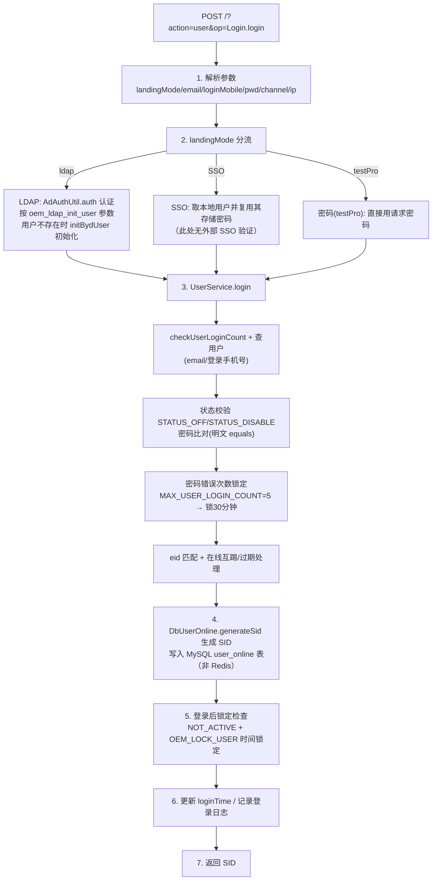

# 核心链路-用户登录

> 基于 平台基础功能服务 syy.release.z7.8.1.0 代码分析

## 关键代码位置

- `ApiServlet.java` — 统一入口，`action=user&op=Login.login` 反射路由
- `cn.testin.service.user.Login` — 登录入口：landingMode 分流（ldap/SSO/testPro）、`initBydUser` LDAP 初始化、登录后锁定检查（`NOT_ACTIVE` / `OEM_LOCK_USER` 时间锁定）、更新 loginTime 与登录日志
- `cn.testin.business.impl.user.UserService.login` — 登录核心：`checkUserLoginCount`、按 email/登录手机号查用户、状态校验（`STATUS_OFF`/`STATUS_DISABLE`）、密码比对、错误次数锁定（`MAX_USER_LOGIN_COUNT=5` → 锁 30 分钟）、eid 匹配、在线互踢/过期处理、`DbUserOnline.generateSid` 生成 SID 并写入 `user_online` 表
- `cn.testin.util.ldap.AdAuthUtil` — LDAP/AD 认证（JNDI）
- `cn.testin.dao.user.IUserOnlineDAO` / `db_user.user_online` 表 — SID 在线会话持久化（MySQL，非 Redis）
- `IUserLoginLogService.insertUserLoginLog` — 登录日志记录

## 专题关联

- [专题-索引](专题-索引.md) — 返回专题索引
- [00-首页](../00-首页.md) — 平台基础功能服务 总览（含用户与认证业务域）
- [横切-模块间通信](横切-模块间通信.md) — LDAP 认证（AdAuthUtil JNDI）技术细节
- [横切-双入口路由机制](横切-双入口路由机制.md) — ApiServlet action/op 反射路由说明
- [service-Login](../07-开放接口文档/用户与认证/service-Login.md) — ApiServlet 登录接口文档
- [service-User](../07-开放接口文档/用户与认证/service-User.md) — ApiServlet 用户接口文档
- [UserController](../07-开放接口文档/用户与认证/UserController.md) — Spring MVC 用户接口文档
