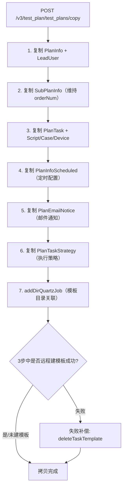
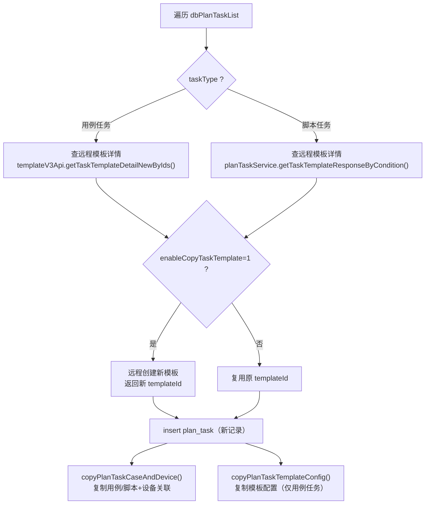

# 核心链路-计划深拷贝

> 基于 平台基础功能服务 syy.release.z7.8.1.0 代码分析。`PlanInfoServiceImpl.copyTestPlan()` 按固定顺序复制测试计划及其全部关联数据。

## 流程图

> **说明**：步骤 3（copyPlanTaskInfo）内部根据 `taskType` 分为用例任务和脚本任务两个分支，各自处理 Script/Case/Device 的复制和远程模板创建。步骤 7 失败不抛异常，只记录日志后继续。

## 实际代码顺序

`PlanInfoServiceImpl.copyTestPlan()` (line 2382) 中的执行顺序：

| 步骤 | 方法调用 | 行号 | 写入表 |
|------|---------|------|--------|
| 1 | `insert(copyDbPlanInfo)` + `insertPlanLeadUserIds()` |  | `plan_info`, `plan_lead_user` |
| 2 | `copySubPlanInfo()` |  | `sub_plan_info` |
| 3 | `copyPlanTaskInfo()` |  | `plan_task` + 远程建模板（可选） |
| 4 | `copyPlanInfoScheduled()` |  | `plan_info_scheduled` |
| 5 | `copyPlanEmailNotice()` |  | `plan_email_notice` |
| 6 | `copyPlanTaskStrategy()` |  | `plan_task_strategy` |
| 7 | `dirQuartzJobService.addDirQuartzJob()` |  | `dir_quartz_job` |

**异常处理**：catch 块中若已远程创建了模板（`newTaskTemplateId` 非空），调用 `deleteTaskTemplate()` 回滚远程模板。

## 步骤3内部详情（copyPlanTaskInfo）

## 关键代码位置

| 文件 | 行号 | 作用 |
|------|------|------|
| `PlanInfoController.java` | — | copy 接口入口 `POST /v3/test_plan/test_plans/copy` |
| `PlanInfoServiceImpl.java` |  | `copyTestPlan()` 深拷贝主逻辑 |
| `PlanInfoServiceImpl.java` |  | `copySubPlanInfo()` 复制子计划 |
| `PlanInfoServiceImpl.java` |  | `copyPlanTaskInfo()` 复制任务（含远程模板创建） |
| `PlanInfoServiceImpl.java` |  | `insertPlanLeadUserIds()` 复制负责人 |
| `DirQuartzJobService.java` | — | `addDirQuartzJob()` / `deleteTaskTemplate()` |

## 专题关联

- [专题-索引](专题-索引.md) — 返回专题索引
- [PlanInfoController](../07-开放接口文档/测试计划/PlanInfoController.md) — copy 接口入口
- [SubPlanInfoController](../07-开放接口文档/测试计划/SubPlanInfoController.md) — 步骤2：子计划复制
- [PlanTaskController](../07-开放接口文档/测试计划/PlanTaskController.md) — 步骤3：计划任务复制
- [PlanInfoScheduledController](../07-开放接口文档/测试计划/PlanInfoScheduledController.md) — 步骤4：定时配置复制
- [EmailNoticeController](../07-开放接口文档/测试计划/EmailNoticeController.md) — 步骤5：邮件通知复制
- [PlanTaskStrategyController](../07-开放接口文档/测试计划/PlanTaskStrategyController.md) — 步骤6：执行策略复制
