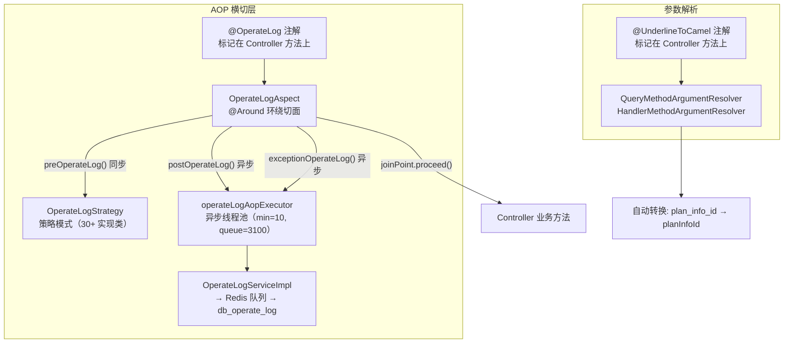

# AOP与横切关注点

> 平台基础功能服务 的 AOP 横切层：操作日志自动记录（`@OperateLog` 注解 + Spring AOP 环绕切面）和下划线转驼峰参数自动绑定（`@UnderlineToCamel` + 自定义 `HandlerMethodArgumentResolver`）。

## 概览



## 一、操作日志 AOP（@OperateLog）

### 1.1 注解定义

**文件**：`src/main/java/cn/testin/aop/OperateLog.java`

```java
@Target({ElementType.METHOD})
@Retention(RetentionPolicy.RUNTIME)
public @interface OperateLog {
    OperateLogEnum operateLog();
}
```

只有一个必填属性 `operateLog`，指定操作日志的枚举类型。标注在 Controller 方法上即可自动记录操作日志。

### 1.2 切面实现

**文件**：`src/main/java/cn/testin/aop/OperateLogAspect.java`

```java
@Around(value = "logPointcut() && @annotation(operateLog)")
public Object onLogPointcutAround(ProceedingJoinPoint joinPoint, OperateLog operateLog) throws Throwable {
    Object[] args = joinPoint.getArgs();
    Date operateTime = new Date();
    Long threadId = Thread.currentThread().getId();
    OperateLogEnum operateLogEnum = operateLog.operateLog();
    OperateLogStrategy service = OperateLogStrategyEnum.getStrategyByType(operateLogEnum).getService();
    // 1. 前置操作（同步，获取操作前数据）
    service.preOperateLog(args, threadId);
    // 2. 执行业务方法
    Object result = joinPoint.proceed(args);
    // 3. 后置操作（异步，记录操作日志）
    executeTaskExecutor.execute(() -> service.postOperateLog(args, threadId, operateTime, result));
    return result;
}
```

**执行流程**：

```
@OperateLog 标记的方法被调用
  │
  ├── 1. preOperateLog(args, threadId)     ← 同步执行，获取操作前状态（如编辑前的数据快照）
  │      └── 存储到 PRE_OPERATE_OBJECT ConcurrentHashMap（key=threadId）
  │
  ├── 2. joinPoint.proceed(args)           ← 执行 Controller 方法
  │
  ├── 3. postOperateLog(args, threadId,    ← operateLogAopExecutor 异步执行
  │         operateTime, result)              组装 DbOperateLog → insertOperateLog()
  │      └── 最后调用 cleanOperateLog(threadId) 清理前置数据
  │
  └── 异常:
       └── exceptionOperateLog(args, threadId, operateTime, e)  ← 异步记录异常日志
            └── 记录完重新 throw 原始异常
```

### 1.3 关键设计细节

| 设计点 | 说明 |
|--------|------|
| **前置同步** | `preOperateLog` 必须同步执行，因为业务方法可能很快完成，异步会导致查到的数据不正确 |
| **后置异步** | `postOperateLog` 使用 `operateLogAopExecutor` 线程池异步执行，防止日志操作阻塞主流程 |
| **线程隔离** | 前置数据存储使用 `threadId` 作为 key 的 `ConcurrentHashMap`，不同请求间互不干扰 |
| **异常不吞** | 异常日志记录后 `throw e` 重新抛出，AOP 不改变业务异常的传播 |
| **线程池分离** | AOP 用 `operateLogAopExecutor`（min=10），日志队列消费用 `operateLogExecutor`，两套线程池隔离 |

### 1.4 策略模式（OperateLogStrategy）

**文件**：`src/main/java/cn/testin/business/strategy/log/OperateLogStrategy.java`

每种 `OperateLogEnum` 对应一个 `OperateLogStrategyEnum` + 一个 `OperateLogStrategy` 实现类（共 30+ 个）：

```
OperateLogEnum → OperateLogStrategyEnum.getStrategyByType() → OperateLogStrategy
```

**Strategy 抽象基类关键方法**：

| 方法 | 说明 |
|------|------|
| `preOperateLog(args, threadId)` | 前置操作（默认空实现），子类按需重写。如编辑操作需先查 DB 获取旧值 |
| `postOperateLog(args, threadId, operateTime, result)` | 后置操作（抽象，必须实现），组装日志内容并插入 |
| `exceptionOperateLog(args, threadId, operateTime, throwable)` | 异常操作（抽象，必须实现），记录异常信息 |
| `cleanOperateLog(threadId)` | 清理前置缓存数据 |
| `insertOperateLog(...)` | 通用插入方法：组装 `DbOperateLog` → `operateLogService.insert(entity)` |
| `getUserNameByUserId(userId)` | 通过 userId 查用户名 |

**insertOperateLog 幂等机制**：

```java
// OperateLogStrategy.java
String requestId = String.format("%d_%s",
    entity.getCreateTime().getTime(),
    new MD5().getMD5ofStr(jsonUtils.toJsonString(entity)));
entity.setRequestId(requestId);
operateLogService.insert(entity);
```

通过 `requestId = createTime + MD5(日志内容)` 实现幂等：同 `requestId` 已存在则只删 Redis 队列消息，不重复写库。

### 1.5 日志写入链路

```
OperateLogStrategy.insertOperateLog()
  → IOperateLogService.insert(entity)
    → 写入 Redis 队列（OPERATE_LOG_QUEUE）
      → OperateLogThread（后台线程）批量消费
        → db_common.db_operate_log
```

> **注意**：日志先写 Redis 队列再异步入库，`OperateLogController` 只负责查询。写入链路见 [横切-后台线程全景](横切-后台线程全景.md) 的 OperateLogThread。

### 1.6 策略实现类清单（30+ 个）

**文件目录**：`src/main/java/cn/testin/business/strategy/log/`

| 策略类 | 对应枚举 | 说明 |
|--------|---------|------|
| `TestPlanDeleteStrategyService` | `TEST_PLAN_DELETE` | 测试计划模板删除 |
| `ExecuteRecordDeleteStrategyService` | `EXECUTE_RECORD_DELETE` | 执行记录删除 |
| `TaskDeleteStrategyService` | `TASK_DELETE` | 任务管理执行记录删除 |
| `PlanInfoCopyStrategyService` | `PLAN_INFO_COPY` | 复制测试计划模板 |
| `PlanInfoUpdateStrategyService` | `PLAN_INFO_UPDATE` | 编辑测试计划 |
| `SubPlanInfoAddStrategyService` | `SUB_PLAN_INFO_ADD` | 添加子计划 |
| `SubPlanInfoUpdateStrategyService` | `SUB_PLAN_INFO_UPDATE` | 修改子计划触发执行时间 |
| `SubPlanInfoRemoveStrategyService` | `SUB_PLAN_INFO_REMOVE` | 移除子计划 |
| `RelationTaskPlanStrategyService` | `RELATION_PLAN_TASK` | 子计划关联任务模板 |
| `PlanTaskRemoveStrategyService` | `PLAN_TASK_REMOVE` | 移除已关联任务 |
| `PlanCronUpdateStrategyService` | `PLAN_CRON_UPDATE` | 定时触发计划执行 |
| `EmailNoticeExecuteStrategyService` | `EMAIL_NOTICE_EXECUTE_UPDATE` | 邮件通知执行结果 |
| `PlanExecutePeriodUpdateStrategyService` | `PLAN_EXECUTE_PERIOD_UPDATE` | 任务执行周期更新 |
| `ExecuteRecordStopStrategyService` | `EXECUTE_RECORD_STOP` | 执行记录终止 |
| `ExecuteRecordTaskStopStrategyService` | `EXECUTE_RECORD_TASK_STOP` | 执行任务终止 |
| `TaskStopStrategyService` | `TASK_STOP` | 任务批量终止 |
| `LoginStrategyService` | `LOGIN` | 用户登录 |
| `LoginOutStrategyService` | `LOGIN_OUT` | 用户登出 |
| `AddUserStrategyService` | `ADD_USER` | 新增账号 |
| `CaseInfoAddStrategyService` | `CASE_ADD` | 新增用例 |
| `CaseInfoUpdateStrategyService` | `CASE_UPDATE` | 编辑用例 |
| `CaseInfoDeleteStrategyService` | `CASE_DELETE` | 删除用例 |
| `CaseStepAddStrategyService` | `CASE_STEP_ADD` | 新增用例步骤 |
| `CaseStepUpdateStrategyService` | `CASE_STEP_UPDATE` | 编辑用例步骤 |
| `CaseStepDeleteStrategyService` | `CASE_STEP_DELETE` | 删除用例步骤 |
| `CaseStepMoveStrategyService` | `CASE_STEP_MOVE` | 移动用例步骤 |
| `CaseStepUpdateOnlineStrategyService` | `CASE_STEP_UPDATE_ONLINE` | online 界面保存步骤 |
| `CaseDirDeleteStrategyService` | `CASE_DIR_DELETE` | 用例目录删除 |
| `CaseInfoRelationCaseSourceStrategyService` | `CASE_RELATION_DATA_SOURCE` | 用例关联数据源 |
| `CaseInfoRemoveRelationCaseSourceStrategyService` | `CASE_REMOVE_DATA_SOURCE` | 用例解除关联数据源 |

**策略注册机制**（`InitOperateLogStrategy.java`）：

应用启动时通过 `@PostConstruct` 执行 `OperateLogStrategyEnum.initMap()`，为每个枚举绑定对应的 Spring Bean（通过 `SpringUtil.getBean(serviceClass)` 获取），建立 `OperateLogEnum → OperateLogStrategy` 的映射。

### 1.7 全部操作日志枚举（OperateLogEnum）

**文件**：`src/main/java/cn/testin/common/enums/OperateLogEnum.java`

按操作对象分类：

**测试计划（operateObject=TEST_PLAN）**：

| 枚举值 | 操作类型 | 说明 |
|--------|---------|------|
| `TEST_PLAN_DELETE` | DELETE | 删除测试计划模板 |
| `EXECUTE_RECORD_DELETE` | DELETE | 删除执行记录 |
| `PLAN_INFO_COPY` | COPY | 复制测试计划 |
| `PLAN_INFO_UPDATE` | UPDATE | 编辑测试计划 |
| `SUB_PLAN_INFO_ADD` | UPDATE | 添加子计划 |
| `SUB_PLAN_INFO_UPDATE` | UPDATE | 修改子计划执行时间 |
| `SUB_PLAN_INFO_REMOVE` | UPDATE | 移除子计划 |
| `RELATION_PLAN_TASK` | UPDATE | 关联任务模板 |
| `PLAN_TASK_REMOVE` | UPDATE | 移除已关联任务 |
| `PLAN_CRON_UPDATE` | UPDATE | 定时配置更新 |
| `EMAIL_NOTICE_EXECUTE_UPDATE` | UPDATE | 邮件通知配置更新 |
| `PLAN_EXECUTE_PERIOD_UPDATE` | UPDATE | 执行周期更新 |
| `TEMPLATE_UPDATE_DEVICE` | UPDATE | 批量更新模板设备 |
| `EXECUTE_RECORD_STOP` | STOP | 终止执行记录 |
| `EXECUTE_RECORD_TASK_STOP` | STOP | 终止执行任务 |

**任务管理（operateObject=TASK_MANAGE）**：

| 枚举值 | 操作类型 | 说明 |
|--------|---------|------|
| `TASK_DELETE` | DELETE | 删除任务 |
| `TASK_STOP` | STOP | 批量终止任务 |
| `TASK_PAUSE` | EXECUTE | 任务暂停下发 |
| `TASK_RESUME` | EXECUTE | 任务恢复下发 |

**用户操作（operateObject=USER_OPERATE）**：

| 枚举值 | 操作类型 | 说明 |
|--------|---------|------|
| `LOGIN` | LOGIN | 用户登录 |
| `LOGIN_OUT` | LOGIN_OUT | 用户登出 |
| `ADD_USER` | ADD_USER | 新增账号 |

**用例管理（operateObject=CASE_MANAGE）**：

| 枚举值 | 操作类型 | 说明 |
|--------|---------|------|
| `CASE_ADD` | ADD | 新增用例 |
| `CASE_UPDATE` | UPDATE | 编辑用例 |
| `CASE_DELETE` | DELETE | 删除用例 |
| `CASE_DIR_DELETE` | DELETE | 删除用例目录 |
| `CASE_RELATION_DATA_SOURCE` | RELATION_DATA_SOURCE | 关联数据源 |
| `CASE_REMOVE_DATA_SOURCE` | REMOVE_DATA_SOURCE | 解除数据源关联 |

**用例步骤（operateObject=CASE_STEP_MANAGE）**：

| 枚举值 | 操作类型 | 说明 |
|--------|---------|------|
| `CASE_STEP_ADD` | ADD | 新增步骤 |
| `CASE_STEP_UPDATE` | UPDATE | 编辑步骤 |
| `CASE_STEP_DELETE` | DELETE | 删除步骤 |
| `CASE_STEP_MOVE` | MOVE | 移动步骤 |
| `CASE_STEP_UPDATE_ONLINE` | UPDATE | online 保存步骤 |

**全局变量（operateObject=PROJECT_GLOBAL_VARIABLES）**：

| 枚举值 | 操作类型 | 说明 |
|--------|---------|------|
| `PROJECT_GLOBAL_VARIABLES_ADD` | ADD | 新增全局变量 |
| `PROJECT_GLOBAL_VARIABLES_UPDATE` | UPDATE | 编辑全局变量 |
| `PROJECT_GLOBAL_VARIABLES_DELETE` | DELETE | 删除全局变量 |

---

## 二、参数自动转换（@UnderlineToCamel）

### 2.1 注解定义

**文件**：`src/main/java/cn/testin/common/annotation/UnderlineToCamel.java`

```java
@Target({ElementType.METHOD})
@Retention(RetentionPolicy.RUNTIME)
public @interface UnderlineToCamel {
}
```

标记在 Controller 方法上，自动将 HTTP 请求参数从 `under_score` 格式转为 `camelCase` 格式，并绑定到方法参数对象的属性上。

### 2.2 解析器实现

**文件**：`src/main/java/cn/testin/startup/interceptor/QueryMethodArgumentResolver.java`

实现 Spring `HandlerMethodArgumentResolver` 接口：

```
supportsParameter(methodParameter)
  → 检查方法是否有 @UnderlineToCamel 注解

resolveArgument(methodParameter, ...)
  → handleParameterNames()    ← 遍历请求参数名，下划线 → 驼峰转换
  → valid()                   ← 执行 @Valid / @Validated 校验
```

**转换逻辑**（`QueryMethodArgumentResolver.java`）：

```java
private String underLineToCamel(String snakeCase) {
    StringBuilder result = new StringBuilder();
    boolean capitalizeNext = false;
    for (int i = 0; i < snakeCase.length(); i++) {
        char currentChar = snakeCase.charAt(i);
        if (currentChar == '_') {
            capitalizeNext = true;
        } else {
            if (capitalizeNext) {
                result.append(Character.toUpperCase(currentChar));
                capitalizeNext = false;
            } else {
                result.append(Character.toLowerCase(currentChar));
            }
        }
    }
    return result.toString();
}
```

**转换示例**：

| 请求参数（下划线） | 转换后（驼峰） |
|-------------------|---------------|
| `plan_info_id` | `planInfoId` |
| `sub_plan_info_id` | `subPlanInfoId` |
| `execute_record_id` | `executeRecordId` |
| `plan_task_id` | `planTaskId` |

### 2.3 使用方式

```java
// Controller 方法上标注 @UnderlineToCamel
@GetMapping("/test_plan/test_plans")
@UnderlineToCamel
public ResponseResult<?> getPlanList(@Valid PlanInfoRequestDTO request) {
    // request.planInfoId 已自动从请求参数 plan_info_id 完成绑定
}
```

涉及该注解的 Controller（17 个）：`PlanInfoController`、`PlanTaskController`、`PlanDeviceController`、`ExecuteRecordController`、`CaseInfoController`、`CaseStatisticController`、`CaseStepController`、`TaskController`、`ProjectController`、`DirInfoController`、`DirQuartzJobController`、`QuartzController`、`OperateLogController`、`ScriptStatisticController`、`UserActivityController`、`NoticeEventController` 等。

> **注册方式**：在 `Boot.java` 的 `WebMvcConfigurer.addArgumentResolvers()` 中注册，与 Spring MVC 生命周期集成。

---

## 三、相关文件索引

| 文件 | 说明 |
|------|------|
| `src/main/java/cn/testin/aop/OperateLog.java` | `@OperateLog` 注解定义 |
| `src/main/java/cn/testin/aop/OperateLogAspect.java` | AOP 环绕切面（pre/post/exception） |
| `src/main/java/cn/testin/common/enums/OperateLogEnum.java` | 30+ 操作日志枚举 |
| `src/main/java/cn/testin/business/strategy/log/OperateLogStrategy.java` | 策略抽象基类 |
| `src/main/java/cn/testin/business/strategy/log/OperateLogStrategyEnum.java` | 策略枚举映射（OperateLogEnum → Strategy） |
| `src/main/java/cn/testin/business/strategy/log/InitOperateLogStrategy.java` | 启动时策略 Bean 注册 |
| `src/main/java/cn/testin/common/annotation/UnderlineToCamel.java` | `@UnderlineToCamel` 注解定义 |
| `src/main/java/cn/testin/startup/interceptor/QueryMethodArgumentResolver.java` | 参数解析器（下划线→驼峰 + @Valid 校验） |
| `src/main/java/cn/testin/config/AsyncConfig.java` | operateLogAopExecutor / operateLogExecutor 线程池定义 |

## 专题关联

- [专题-索引](专题-索引.md) — 返回专题索引
- [横切-后台线程全景](横切-后台线程全景.md) — operateLogAopExecutor 线程池详情
- [横切-模块间通信](横切-模块间通信.md) — Redis 操作日志队列（OPERATE_LOG_QUEUE）通信机制
- [OperateLogController](../07-开放接口文档/基础设施与统计/OperateLogController.md) — 操作日志查询接口
