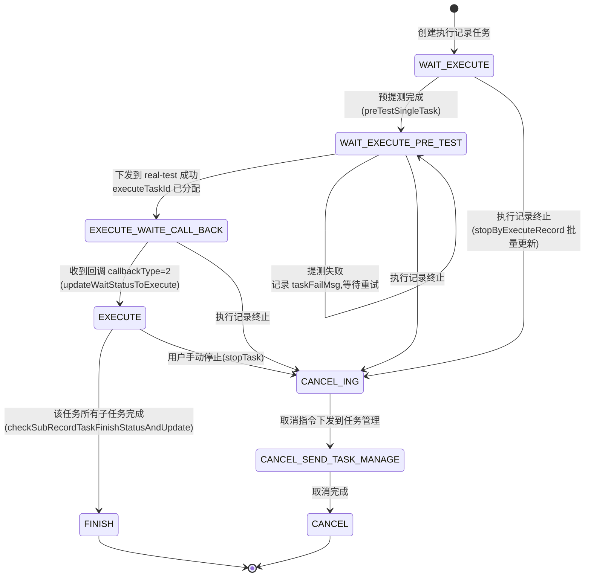

# 任务状态机

> 基于 `PlanExecuteStatusEnum` 和 `ExecuteRecordTaskServiceImpl` 的 ExecuteRecordTask 状态流转模型。

## 状态枚举定义

**文件**：`src/main/java/cn/testin/common/enums/PlanExecuteStatusEnum.java`

| 枚举常量 | 状态码 | 中文含义 |
|----------|--------|----------|
| `WAIT_EXECUTE` | 1 | 等待执行，未开始 |
| `WAIT_EXECUTE_PRE_TEST` | 11 | 预提测完成，等待执行（子状态，前端仍显示 1） |
| `EXECUTE` | 2 | 执行中 |
| `EXECUTE_WAITE_CALL_BACK` | 12 | 已下发执行，等待回调 |
| `FINISH` | 3 | 已完成 |
| `CANCEL_ING` | 4 | 取消中 |
| `CANCEL_SEND_TASK_MANAGE` | 14 | 取消已下发到任务管理（子状态，前端仍显示 4） |
| `CANCEL` | 5 | 已取消 |

### 状态分组（静态列表，定义于 PlanExecuteStatusEnum:28-51）

| 分组方法 | 包含状态码 | 用途 |
|----------|-----------|------|
| `getNoFinishStatuses()` | 1, 11, 2, 12, 4, 14 | 查询"未完成"的任务 |
| `getNoFinishNoCancelStatuses()` | 1, 11, 2, 12 | 不含取消中，用于"可被终止"的范围 |
| `getExecuteIngStatuses()` | 2, 12, 4, 14 | 执行中状态，包括回调等待和取消中 |
| `getFinishStatuses()` | 3, 5 | 终态集合 |
| `getWaiteExecuteStatuses()` | 1, 11 | 等待执行状态 |

### 辅助判断方法

- `isFinish(status)` -- status 为 3(FINISH) 或 5(CANCEL)
- `isNotFinish(status)` -- 在 NO_FINISH_STATUSES 中
- `isCancelIng(status)` -- status == 4
- `isCancel(status)` -- status == 5
- `isWaitExecuting(status)` -- status == 1
- `isExecute(status)` -- status == 2

## 状态流转图



## 关键跃迁与代码位置

### 1. 创建到预提测：`1 -> 11`

创建时任务状态为 `WAIT_EXECUTE(1)`。`PreTestTaskThread`（`@Scheduled cron="45 0/5 * * * ?"`，每 5 分钟）扫描等待中的任务，调用 `preTestSingleTask()` 提交到 app处理服务。

提测成功 → 状态更新为 `WAIT_EXECUTE_PRE_TEST(11)`。
提测失败 → taskFailMsg 记录错误，等待重试。

**文件**：`src/main/java/cn/testin/business/impl/plan/ExecuteRecordTaskServiceImpl.java`

### 2. 预提测到执行下发：`11 -> 12`

`ExecuteTaskThread`（`@Scheduled cron="0/30 * * * * ?"`，每 30 秒）调用 `executeTask()` 遍历等待执行的任务。经过 `executeParallelTasks()` 后，`sendTaskExecuteRequest()` 下发时调用 `realTaskV3Api.executeTask(request)`，成功后状态更新为 `EXECUTE_WAITE_CALL_BACK(12)`。

**文件**：
- `src/main/java/cn/testin/schedule/plan/ExecuteTaskThread.java`
- `src/main/java/cn/testin/business/impl/plan/ExecuteRecordTaskServiceImpl.java`

### 3. 回调收到后进入执行：`12 -> 2`

`executeRecordTaskCallback()` 接收回调，`CallbackTypeStrategyEnum` 策略匹配 `callbackType=2`（任务开始执行回调），调用 `updateWaitStatusToExecute()` 将状态从等待状态（1, 11）更新为 `EXECUTE(2)`。

**文件**：`src/main/java/cn/testin/business/impl/plan/ExecuteRecordTaskServiceImpl.java`

### 4. 任务完成：`2 -> 3`

`taskFinishAfterDeal()` 中，子计划下所有任务完成后，通过 `checkSubRecordTaskFinishStatusAndUpdate()` 向上冒泡更新状态：
- 当前是 EXECUTE → FINISH(3)
- 当前是 CANCEL_ING → CANCEL(5)

并判断是否为根节点：若是则调用 `updateRootRecordTaskFinishStatus()` 完结整个执行记录。

**文件**：`src/main/java/cn/testin/business/impl/plan/ExecuteRecordTaskServiceImpl.java`

### 5. 用户终止：`{1,11,2,12} -> 4`

`stopTask(executeRecordTaskId)` 将 `NO_FINISH_NO_CANCEL_STATUSES`（1,11,2,12）集合内的任务批量置为 `CANCEL_ING(4)`，然后触发 `cancelTaskThread.cancelTask()` 向 app处理服务 下发取消。

`stopByExecuteRecord(executeRecord, userId)` 则按执行记录维度批量终止所有未完成非取消状态的任务。

**文件**：`src/main/java/cn/testin/business/impl/plan/ExecuteRecordTaskServiceImpl.java`

### 6. 取消完成：`4/14 -> 5`

`CancelTaskThread` 和 `CancelTaskCheckThread` 负责：
- `CancelTaskThread`：主动调用 app处理服务 取消接口
- `CancelTaskCheckThread`（`@Scheduled cron="20 4/5 * * * ?"`，每 5 分钟）：检查取消状态推进

取消完成时更新为 `CANCEL(5)`。

**文件**：
- `src/main/java/cn/testin/schedule/plan/CancelTaskThread.java`
- `src/main/java/cn/testin/schedule/plan/CancelTaskCheckThread.java`

### 7. 前置任务失败终止

`taskFinishAfterDeal()` 中检测前置任务（`RelationTaskTypeEnum.isPreTaskType`）失败时：
- 根据 `AfterFailOperateTypeEnum.isDirectlyEnd` 策略将同子计划的后置任务批量置为 `CANCEL_ING`
- 调用 `cancelTaskThread.cancelTask()` 下发取消

**文件**：`src/main/java/cn/testin/business/impl/plan/ExecuteRecordTaskServiceImpl.java`

## CAS 并发控制

状态更新统一使用 `updateSelectiveByIdAndOldStatus()`，SQL 条件带 `oldExecuteStatuses` 过滤：

```java
// ExecuteRecordTaskServiceImpl.java
int updateSelectiveByIdAndOldStatus(Long executeRecordTaskId,
    List<Integer> oldStatuses, DbExecuteRecordTask needUpdateExt) {
    ExecuteRecordTaskUpdateConditionDTO condition = ...oldExecuteStatuses(oldStatuses).id(executeRecordTaskId)...
    return executeRecordTaskDAO.updateSelectiveByCondition(needUpdateExt, condition);
}
```

这保证了"只在旧状态匹配时才更新"，是多线程环境下的乐观锁机制。同时 `executeTask()` 入口使用 `redisService.setNx(key, val, 120)` 做分布式锁，防止多实例并发。

## 相关文件索引

| 文件 | 说明 |
|------|------|
| `src/main/java/cn/testin/common/enums/PlanExecuteStatusEnum.java` | 状态枚举定义与分组 |
| `src/main/java/cn/testin/business/impl/plan/ExecuteRecordTaskServiceImpl.java` | 核心状态流转逻辑 |
| `src/main/java/cn/testin/schedule/plan/ExecuteTaskThread.java` | 定时触发任务执行 |
| `src/main/java/cn/testin/schedule/plan/PreTestTaskThread.java` | 预提测线程 |
| `src/main/java/cn/testin/schedule/plan/CancelTaskThread.java` | 取消任务下发 |
| `src/main/java/cn/testin/schedule/plan/CancelTaskCheckThread.java` | 取消状态检查 |
| `src/main/java/cn/testin/schedule/plan/CancelTaskRestartThread.java` | 取消重试 |
| `src/main/java/cn/testin/schedule/plan/ResetTaskThread.java` | 重测任务处理 |

## 专题关联

- [专题-索引](专题-索引.md) — 返回专题索引
- [核心链路-回调处理](核心链路-回调处理.md) — 回调处理中的状态迁移（callbackType=2: 12→2, callbackType=3: →3/5）
- [横切-后台线程全景](横切-后台线程全景.md) — 驱动状态流转的后台线程（ExecuteTaskThread/CancelTaskThread/PreTestTaskThread）
- [核心链路-定时执行](核心链路-定时执行.md) — ExecuteTaskThread 30s 轮询触发 11→12 下发
- [ExecuteRecordTaskController](../07-开放接口文档/测试计划/ExecuteRecordTaskController.md) — 执行记录任务接口
