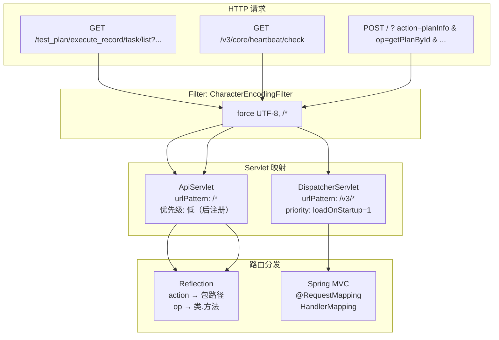
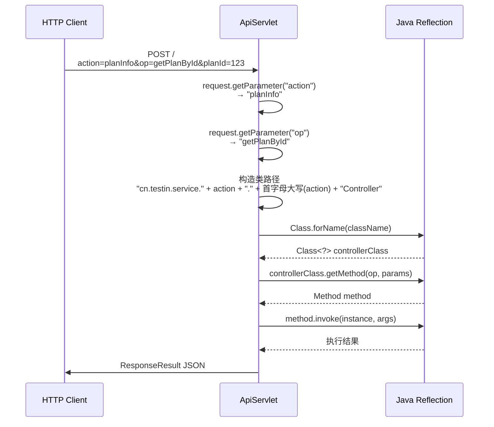

# 双入口路由机制

> 平台基础功能服务 同时暴露两套 HTTP 入口：传统的 `ApiServlet` action/op 反射路由（`/*`）和标准的 Spring MVC `DispatcherServlet`（`/v3/*`）。双入口在同一进程内并存，但路由规则完全不同。

## 总览



## 入口一：ApiServlet（/* 反射路由）

### 注册方式

**文件**：`src/main/java/cn/testin/startup/Boot.java`

```java
@Bean("cxfServletRegistration")
public ServletRegistrationBean dispatcherServlet() {
    return new ServletRegistrationBean(new ApiServlet(), "/*");
}
```

`ApiServlet` 来自公共包 `cn.testin.common.service.ApiServlet`（不在 平台基础功能服务 源码中，属于 testin-common 依赖），通过 `ServletRegistrationBean` 注册，拦截所有 `/*` 路径。

### 路由原理

`ApiServlet` 按以下机制定位业务处理器：



### 参数约定

| 参数 | 含义 | 示例 |
|------|------|------|
| `action` | 业务模块标识，映射到包名 | `action=planInfo` → 包 `cn.testin.service.planInfo` |
| `op` | 方法名，映射到具体操作 | `op=getPlanById` → 方法 `PlanInfoController.getPlanById()` |
| 其他参数 | 业务参数，按方法签名传递 | `planId=123`, `projectId=456` |

### 关键特征

1. **类路径规则**：`cn.testin.service.{action}.{Action}Controller`
   - action 为 `planInfo` 时，全限定类名为 `cn.testin.service.planInfo.PlanInfoController`
   - action 为 `user` 时，全限定类名为 `cn.testin.service.user.UserController`

2. **反射查找方法**：根据 `op` 参数值（如 `getPlanById`），用 `getMethod()` 反射查找对应方法并调用

3. **参数绑定**：HTTP 请求参数以 Map 或特定 DTO 形式传给目标方法

4. **返回格式**：统一 `ResponseResult` JSON 包装（含 code、msg、data）

5. **优先级**：由于注册顺序，当请求路径同时匹配 `/v3/` 前缀时，`DispatcherServlet` 优先处理（`loadOnStartup=1` 且路径更精确匹配）

## 入口二：DispatcherServlet（/v3/* Spring MVC）

### 注册方式

**文件**：`src/main/java/cn/testin/startup/Boot.java`

```java
@Bean
public ServletRegistrationBean<DispatcherServlet> dispatcherMvcServlet(
        DispatcherServlet dispatcherServlet) {
    ServletRegistrationBean<DispatcherServlet> servletRegistrationBean =
        new ServletRegistrationBean<>(dispatcherServlet, "/v3/*");
    servletRegistrationBean.setLoadOnStartup(1);
    return servletRegistrationBean;
}
```

Spring Boot 标准的 `DispatcherServlet`，拦截所有 `/v3/*` 路径。`loadOnStartup=1` 确保先于 `ApiServlet` 初始化。

### Controller 清单

Spring MVC 通过 `@RestController` + `@RequestMapping` 注解路由，所有 Controller 在包扫描 `scanBasePackages = {"cn.testin"}` 范围内。

| Controller | 请求路径前缀 | 说明 |
|-----------|-------------|------|
| `HeartBeatController` | `/core` | 健康检查（MySQL + Redis） |
| `DiskMonitorController` | `/core/server` | 磁盘监控 |
| `PlanDeviceController` | `/test_plan` | 计划设备查询 |
| `PlanInfoController` | `/test_plan` | 测试计划 CRUD |
| `PlanInfoConfigController` | `/test_plan` | 计划配置 |
| `PlanInfoScheduledController` | `/test_plan` | 计划定时配置 |
| `PlanInfoExecutePeriodController` | `/test_plan` | 执行周期配置 |
| `PlanInfoTaskConfigController` | `/test_plan` | 计划任务配置 |
| `ExecuteRecordController` | `/test_plan` | 执行记录 |
| `ExecuteRecordTaskController` | `/test_plan` | 执行记录任务详情 |
| `PlanTaskController` | `/test_plan` | 计划任务 |
| `PlanTaskStrategyController` | `/test_plan` | 计划任务策略 |
| `SubPlanInfoController` | `/test_plan` | 子计划信息 |
| `EmailNoticeController` | `/test_plan` | 邮件通知模板 |
| `ScriptStatisticController` | `/test_plan` | 脚本统计 |
| `TaskController` | `/task` | 任务管理 |
| `ProjectController` | `/project` | 项目管理 |
| `UserController` | `/user` | 用户管理 |
| `UserActivityController` | `/user_activity` | 用户活动 |
| `EnterpriseController` | `/enterprise` | 企业管理 |
| `ReportController` | `/report` | 报告 |
| `CaseInfoController` | `/test_case` | 用例信息 |
| `CaseDirController` | `/test_case` | 用例目录 |
| `CaseStepController` | `/test_case` | 用例步骤 |
| `CaseCommentController` | `/test_case` | 用例评论 |
| `CaseStatisticController` | `/test_case` | 用例统计 |
| `CaseActionLogController` | `/test_case` | 用例操作日志 |
| `DirInfoController` | `/dir` | 目录管理 |
| `DirQuartzJobController` | `/dir` | 目录定时 Job |
| `QuartzController` | `/quartz` | Quartz 管理 |
| `NoticeChannelCfgController` | `/notice` | 通知渠道配置 |
| `NoticeEventController` | `/notice` | 通知事件 |
| `NoticeLogController` | `/notice` | 通知日志 |
| `OpsNoticeChannelController` | `/ops_notice` | Ops 通知渠道 |
| `OpsNoticeEventController` | `/ops_notice` | Ops 通知事件 |
| `OpsNoticeRecordController` | `/ops_notice` | Ops 通知记录 |
| `OperateLogController` | `/operate_log` | 操作日志 |
| `BiStatisticController` | `/bi` | BI 统计 |
| `EmailTemplateCfgController` | `/template` | 邮件模板配置 |

### 统一异常处理

**文件**：`src/main/java/cn/testin/controller/exception/GlobalExceptionHandler.java`

`@RestControllerAdvice` 捕获所有 `@RestController` 抛出的异常，统一返回 `ResponseResult` JSON。共 4 个 `@ExceptionHandler`，按异常类型精确匹配（Spring 优先匹配最具体的 handler）：

| 序号 | 异常类型 | 返回 code | 返回 msg | 说明 |
|------|---------|-----------|---------|------|
| 1 | `GeneralException` | `exception.getCode()` | `exception.getMsg()` | 业务异常，使用异常自带错误码和消息 |
| 2 | `MethodArgumentNotValidException` | `CommonCode.paraInvalid` | 字段校验错误信息 | `@Valid` 校验失败，取第一个 FieldError 的 defaultMessage |
| 3 | `Exception`（兜底） | `CommonCode.unknown` | "发生未知错误，请联系管理员!" | 通用异常兜底；内含 `instanceof` 二次判断：`HttpMessageNotReadableException` → `paraInvalid` + "存在参数格式错误"，`MissingServletRequestParameterException` → `paraInvalid` + "是否缺少参数" |
| 4 | `Throwable`（最终兜底） | `CommonCode.unknown` | "发生未知错误，请联系管理员!" | 捕获 `Error` 类（如 `NoClassDefFoundError`），防止异常穿透到 Servlet 容器 |

**异常匹配优先级**：Spring 按异常继承树精确匹配 → 泛化匹配的顺序选择 handler。`GeneralException` 和 `MethodArgumentNotValidException` 会被各自专属 handler 拦截；其余 `RuntimeException`/`IOException` 等走 `Exception` handler（其中两个子类被二次判断改写）；`Error` 类走 `Throwable` handler。

**响应格式**：所有 handler 统一构造 `new ResponseResult<>(code, msg)` 并设置空 `data` Map，保证前端始终可解析 JSON 响应体。

## 两套入口对比

| 维度 | ApiServlet (/*) | DispatcherServlet (/v3/*) |
|------|----------------|--------------------------|
| **技术栈** | 原始 Servlet + 反射 | Spring MVC |
| **路由方式** | `action`+`op` 参数决定包.类.方法 | `@RequestMapping` 注解 |
| **URL 格式** | `/?action=xxx&op=xxx&...` 或任意路径 + 参数 | `/v3/{prefix}/{path}` |
| **参数绑定** | 手动从 request 取参 | `@RequestParam`、`@RequestBody`、`@Valid` |
| **拦截器** | 无标准 AOP | Spring Interceptor / `@Aspect` |
| **异常处理** | 反射调用 return 错误码 | `@ControllerAdvice` 全局处理器 |
| **优先级** | 低（后注册，匹配宽泛） | 高（`loadOnStartup=1`，路径更精确） |
| **典型场景** | 旧版页面/AJAX 调用、老接口兼容 | 新版 REST API、对外暴露的 V3 接口 |
| **路由冲突时的行为** | Servlet 容器按最长匹配优先，`/v3/*` 优先于 `/*` |

## 路由优先级

Servlet 容器匹配规则：**路径最精确匹配优先**。

```
请求: GET /v3/core/heartbeat/check
→ /v3/* 精确匹配 DispatcherServlet → Spring MVC 处理

请求: POST /test_plan/execute_record/task/list
→ 无 /v3/* 匹配 → 回退到 /* → ApiServlet 处理
→ ApiServlet 解析 action/test_plan..., op 参数

请求: POST /?action=planInfo&op=getPlanById
→ 无 /v3/* 路径 → ApiServlet 处理
```

## 实际请求示例

### ApiServlet 方式
```
POST / HTTP/1.1
Content-Type: application/x-www-form-urlencoded

action=planInfo&op=getPlanById&planId=12345&projectId=100
```

### Spring MVC 方式
```
GET /v3/test_plan/execute_record/task/list?executeRecordId=12345&page=1&pageSize=20 HTTP/1.1
```

对应 Controller：
```java
// ExecuteRecordTaskController.java
@RestController
@RequestMapping("/test_plan")
public class ExecuteRecordTaskController {
    @GetMapping("/execute_record/task/list")
    public ResponseResult list(ExecuteRecordTaskRequestDTO request) { ... }
}
```

> 实际访问路径：`/v3/test_plan/execute_record/task/list`（DispatcherServlet 剥离 `/v3` 前缀后交给 Spring MVC 路由 `/test_plan/execute_record/task/list`）。

## Filter 层

两个入口共享同一个 `CharacterEncodingFilter`：

```java
// Boot.java
@Bean
public FilterRegistrationBean filterRegistrationBean() {
    FilterRegistrationBean registrationBean = new FilterRegistrationBean();
    CharacterEncodingFilter characterEncodingFilter = new CharacterEncodingFilter();
    characterEncodingFilter.setForceEncoding(true);
    characterEncodingFilter.setEncoding("UTF-8");
    registrationBean.setFilter(characterEncodingFilter);
    registrationBean.addUrlPatterns("/*");
    registrationBean.setOrder(Integer.MAX_VALUE);
    return registrationBean;
}
```

## 相关文件索引

| 文件 | 说明 |
|------|------|
| `src/main/java/cn/testin/startup/Boot.java` | Servlet 注册入口（双 Servlet）|
| `src/main/java/cn/testin/controller/HeartBeatController.java` | Spring MVC 示例：`/core/*` |
| `src/main/java/cn/testin/controller/plan/ExecuteRecordTaskController.java` | Spring MVC 示例：`/test_plan/*` |
| `src/main/java/cn/testin/controller/exception/GlobalExceptionHandler.java` | 统一异常处理 |
| `cn.testin.common.service.ApiServlet` | ApiServlet 源码（在 testin-common 公共包中，非本模块） |

## 专题关联

- [专题-索引](专题-索引.md) — 返回专题索引
- [00-首页](../00-首页.md) — 平台基础功能服务 总览（含双入口架构摘要）
- [00-分支索引](../00-分支索引.md) — 当前分支全部 64 个接口文档索引
